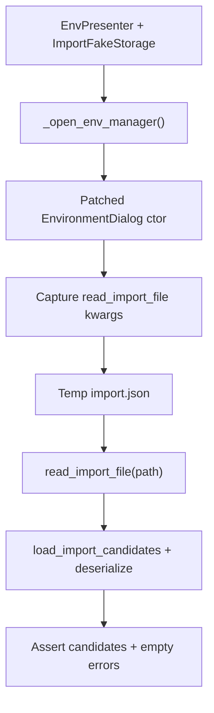

# PYPOST-1000: Architecture — EnvPresenter read_import_file wiring test

## Research

### Source debt framing

[PYPOST-986](https://pypost.atlassian.net/browse/PYPOST-986) follow-up 2
([PYPOST-1000](https://pypost.atlassian.net/browse/PYPOST-1000)) asks for an
`EnvPresenter`-level lock that `_open_env_manager` passes a **working**
`read_import_file` callable into `EnvironmentDialog`, bound to the
presenter’s storage via `load_import_candidates(path, self._storage)`.

Pure `environment_import` helpers and `EnvironmentListWidget.import_environments`
are already covered. The single seam that connects core import to a concrete
`StorageInterface` for the Environments manager is the presenter wiring, and
it is currently unverified except by manual/E2E use.

### Current coverage (confirmed)

| Area | What exists | Gap |
| --- | --- | --- |
| Core load | `tests/test_environment_import.py` — `load_import_candidates` | No presenter |
| Widget import | `tests/test_environment_list_widget.py::TestImportEnvironments` | Injects its own callable; skips presenter |
| Presenter export wiring | `tests/test_env_presenter.py::test_open_env_manager_passes_storage_serializer_directly` | Asserts `serialize_export_records` identity only |
| Presenter import wiring | — | **Missing** — no assert that `read_import_file` is passed and works |

### Production shape (unchanged intent)

`EnvPresenter._open_env_manager` constructs:

```text
EnvironmentDialog(
    ...,
    read_import_file=lambda path: load_import_candidates(path, self._storage),
    serialize_export_records=self._storage.serialize_environment_records,
)
```

`EnvironmentDialog` forwards `read_import_file` to `EnvironmentListWidget`.
`FakeStorageManager.deserialize_environment_records` in
`tests/helpers/__init__.py` currently returns `([], ())` — fine for most
collection tests, but insufficient to prove a **working** import reader. The
new test should use a thin subclass (or local override) that deserializes
plaintext records via `Environment.model_validate`, keeping the shared fake
as the base type named in the debt item.

### Industry notes (wiring / DI tests)

Constructor dependency injection remains the preferred testability pattern;
when a collaborator is constructed inside a method, patch the name **where
it is used** and assert constructor kwargs
([SO: mock object instantiated in constructor](https://stackoverflow.com/questions/57859599/how-can-i-mock-an-object-instantiated-in-the-constructor);
[path-to-mock rule](https://narcismiclaus.com/programming/python/20-mocks-parametrize-conftest/)).
PyPost already follows this for export serializer wiring; import reader
coverage should mirror that style and then **invoke** the captured callable
against a fake storage — not only assert `is not None`.

### Language / test rules

- Python per `.cursor/lsr/do-python.md`.
- New/edited tests must declare `pytestmark = pytest.mark.timeout(...)` (or
  equivalent) per `.cursor/lsr/do-testing.md` — `tests/test_env_presenter.py`
  already has module-level `timeout(60)`.
- Prefer `make test` / targeted `PYTEST_ARGS`.

## Implementation Plan

**Primary deliverable: test-only.** No production API or behavior change unless
Step 3’s assertions fail against current code.

1. Add
   `test_open_env_manager_passes_working_read_import_file` to
   `tests/test_env_presenter.py`, next to the existing
   `test_open_env_manager_passes_storage_serializer_directly`.
2. Build `EnvPresenter` with a `FakeStorageManager` subclass that implements
   `deserialize_environment_records` for plaintext dict records (return
   environments + empty failures tuple).
3. `@patch("pypost.ui.presenters.env_presenter.EnvironmentDialog")`; set
   `return_value.environments = []`; call `_open_env_manager()`.
4. Capture `read_import_file` from `mock_dialog.call_args.kwargs`.
5. Write a temp JSON list with one environment record; call the captured
   callable; assert non-empty candidates, matching name, empty parse errors.
6. Optionally assert the callable is not `None` and that invoking it exercises
   storage deserialize (implicit via successful candidates from the subclass).
7. Run targeted pytest, then confirm suite still green as needed.
8. Step 8: brief note in `doc/dev/environments_dialog.md` Tests bullet that
   presenter wiring for `read_import_file` is locked in `test_env_presenter.py`.

### Mandatory — Failing Repro (next Step 3)

| Item | Plan |
| --- | --- |
| **What it asserts** | After `_open_env_manager`, `EnvironmentDialog` received a `read_import_file` that, given a valid JSON path and FakeStorageManager-backed deserialize, returns candidate environments with no parse errors. |
| **Where** | `tests/test_env_presenter.py::TestEnvPresenter.test_open_env_manager_passes_working_read_import_file` |
| **How to force without live deps** | Patch `EnvironmentDialog`; temp JSON file; FakeStorageManager subclass — no UI exec, network, or encryption. |
| **Initial red vs green** | Verification debt: against current production, the test is **expected to pass (green)** once written. Step 3 still adds the locking test as the missing repro of the coverage gap. If it fails, that is a real defect → Step 4 fixes production. Do **not** mark Step 3 N/A. |
| **Sequencing** | Research → Step 3 write/run test → Step 4 only if red (or green confirmation) → cleanup / observability / review / docs. |



## Architecture

No new modules, interfaces, or on-disk format changes. The test observes the
existing DI seam.


| Module | Responsibility in this task |
| --- | --- |
| `EnvPresenter._open_env_manager` | Supplies `read_import_file` bound to storage (unchanged) |
| `load_import_candidates` | Pure file parse + storage deserialize (unchanged) |
| `FakeStorageManager` (+ subclass) | Test double; subclass adds working deserialize |
| New test | Patches dialog, invokes callable, asserts candidates |

**Patterns:** dependency inversion (callable injection, already in product);
patch-where-used for construction; fake storage for hermetic deserialize.

## Q&A

| Question | Answer |
| --- | --- |
| Why not only `assertIsNotNone(read_import_file)`? | Debt asks for a **working** callable end-to-end; presence alone would miss a broken lambda body. |
| Why subclass FakeStorageManager instead of real StorageManager? | Debt names FakeStorageManager; keeps the test fast and free of encryption/tmp data-dir setup. |
| Why patch EnvironmentDialog? | Same pattern as export serializer wiring; avoids modal `exec()` and full Qt dialog construction. |
| Production change expected? | No, unless assertions fail. |
