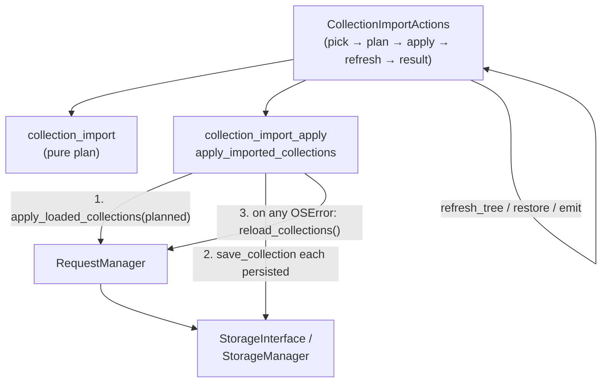

# PYPOST-1004: Atomic multi-collection import or recovery on mid-write save failure

## Research

### Current behavior (confirmed in code)

- `CollectionImportActions.import_collections`
  (`pypost/ui/presenters/collection_import_actions.py`) plans via pure
  `plan_collection_import`, then calls `apply_imported_collections`, then always
  refreshes the tree and shows a result dialog. Success is
  `bool(added or updated or renamed) and not save_errors` — so save failures
  already surface as unsuccessful.
- `apply_imported_collections`
  (`pypost/core/collection_import_apply.py`) does:
  1. `manager.apply_loaded_collections(collections)` — swaps the full planned
     list into memory and rebuilds `_request_index`;
  2. for each `col` in `persisted`, `manager.storage.save_collection(col)`;
  3. on `OSError`, logs `collection_import_save_failed` at ERROR, appends a
     user-facing line, and **continues** the loop.
- There is **no** rollback of the in-memory swap and **no** reload after
  failures. The tree refresh therefore shows the planned set even when some
  writes never landed.
- `RequestManager.reload_collections()` already exists and is the correct
  primitive to re-sync memory from durable storage
  (`self.collections = self.storage.load_collections()` + `_rebuild_index()`).
- `StorageManager.save_collection` is a plain `open(..., "w")` write (not
  temp+`os.replace`). Making a single collection file write atomic is a
  separate, pre-existing storage concern (noted in PYPOST-987 tech debt) and is
  **out of scope** for this task. Environments already use temp+replace for
  their single-document save; collections are one file per id.

### Source debt framing

PYPOST-987 follow-up #2
([PYPOST-1004](https://pypost.atlassian.net/browse/PYPOST-1004)) asks to choose
between:

1. staged write-then-swap in `StorageManager` (filesystem-oriented atomicity), or
2. explicit “reload from disk” recovery in the failure dialog.

Requirements (`10-requirements.md`) accept either a **consistent finish**
(memory and disk aligned when the import action ends) or an **explicit recovery**
path the user can complete. They do not mandate true multi-file FS transactions.

### Industry notes (multi-file durability)

- Ordinary filesystems do not provide atomic multi-file updates; true
  all-or-nothing across N files needs a journal/manifest and recovery on
  restart (SQLite-style WAL/journal patterns, or app-level staging + commit
  markers).
- Temp-file + rename is atomic for **one** path on the same volume; it does not
  by itself make “N collection files” a single transaction. A mid-commit failure
  after some renames still needs rollback or reconciliation.
- For this product gap, the user-visible contract is **sidebar ↔ durable set
  agreement after the import finishes**, not crash-proof multi-file commit
  across process death. That points away from inventing a new storage
  transaction layer for one import call site.

### Approach comparison

| Option | What it does | Pros | Cons |
| --- | --- | --- | --- |
| **A. Staged write-then-swap in StorageManager** | Stage all import writes, commit only if every write succeeds; leave memory untouched until commit | Closest to “FS atomic import” | Touches shared storage API; still incomplete without journal if commit renames partially fail; happy-path cost/complexity; outsized vs the stated UX gap |
| **B. Explicit recovery dialog** | Keep today’s apply-then-save; on failure offer “Reload from disk”; user must accept | Matches debt wording literally; preserves partial durable writes | Extra UX + decline path; brief inconsistency until the user acts; more dialog/test surface for the same end state as auto-reload |
| **C. Automatic reconciliation (chosen)** | Keep apply-then-save and per-collection continue-on-error; **if any save failed, call `reload_collections()` before tree refresh / result** | Memory and disk agree when the import action ends; happy path unchanged; reuses existing API; honest partial durable success kept; no decline/inconsistent-silent path | Not multi-file FS atomicity; result dialog keeps **plan** counts (option B) while tree shows durable set |

### Decision

**Choose C — automatic in-memory reconciliation from durable storage on mid-write
save failure** (requirements path: consistent finish / aligned visible and
durable sets when the import action completes).

**Post-reconcile result dialog (separate from approach A/B/C above):**
**dialog option B** — plan counts + unsuccessful + failure lines. Not dialog
option A (durable-aligned recount). See *Main interfaces*.

Rationale:

1. **Meets DoD without user choreography.** After import (success or failure),
   the visible set and durable set agree for collections involved. No decline
   path that leaves unexplained divergence.
2. **Preserves honest partial durability.** Writes that already succeeded stay
   on disk and remain visible after reload; failed ones disappear from the
   sidebar (or revert to the previous on-disk version on overwrite). That is
   allowed by requirements when memory and disk agree.
3. **Minimal, localized change.** Logic lives in
   `apply_imported_collections` (or immediately after it in the same apply
   boundary). No `StorageInterface` change, no new transaction API, no new
   dialog type.
4. **Happy path unchanged.** Zero extra I/O when every write succeeds — satisfies
   the NFR that successful imports must not become perceptibly slower.
5. **Rejects A for this ticket.** Staged multi-file commit is a storage-layer
   project; single-file atomicity of `save_collection` remains separate debt.
6. **Rejects B as primary UX.** Explicit reload is the same end state as C but
   adds mandatory user action and a decline/inconsistency branch the
   requirements only need if recovery is the chosen approach. Prefer automatic
   alignment.

Documented prior-consistent / post-failure durable state:

- **All writes fail:** reload restores the pre-import durable set; planned
  imports are not visible.
- **Some writes succeed, some fail:** reload shows exactly what
  `load_collections()` returns — successful imports/overwrites kept, failed
  ones absent or still the previous file.
- **All writes succeed:** no reload; planned list already matches disk.

## Implementation Plan

1. **Harden `apply_imported_collections` (primary change).** After the persist
   loop, if `failures` is non-empty, call `manager.reload_collections()` so
   in-memory collections and `_request_index` match durable storage before
   returning. Keep ERROR logging and failure message list unchanged in intent.
2. **Leave the happy path alone.** When `failures` is empty, do not reload;
   keep today’s apply-then-save behavior and performance.
3. **UI orchestration (result-dialog contract locked — option B).** After apply
   returns with failures and memory has been reconciled,
   `CollectionImportActions` still formats the result from the **plan**
   (`added` / `updated` / `skipped` / `renamed` / `request_count`), appends
   save-failure lines into the error list, sets `success=False` when
   `save_errors` is non-empty, refreshes the tree (now durable-aligned), and
   shows the unsuccessful dialog. **Do not** recompute or filter plan counts to
   the post-reload durable set in this task. No recovery button.
4. **Single-collection failure.** Same code path; must not regress (tree must
   not show a collection that never saved).
5. **Tests (Step 3 red → Step 4 green).** See failing-repro plan below; add a
   successful multi-collection regression alongside the mid-write case. Step 3
   asserts memory ↔ durable agreement after apply; it need not assert rewritten
   dialog counts (contract B).
6. **Dev docs (Step 8).** Update `doc/dev/collection_import.md` — replace the
   troubleshooting line that says in-memory state stays ahead of disk until the
   next save with reconcile-on-failure, and note that the result dialog still
   reports plan counts plus unsuccessful + save-failure lines.
7. **Out of scope.** Environment import; making `save_collection` itself
   temp+rename; conflict/parse UX; async parse (PYPOST-1005); rewriting result
   counts to match post-reconcile durable membership (option A — deferred).

**Mandatory — Failing Repro (next Step 3):**

- **What it asserts (desired behavior):** After a multi-collection import apply
  where at least one `save_collection` raises `OSError` mid-loop (earlier write
  may succeed), `RequestManager.get_collections()` matches the durable set
  (`storage.load_collections()` / equivalent recording of successful writes) —
  **not** the full planned list that was passed to apply. Failed collection ids
  must not remain only-in-memory. Save-failure messages must still be returned.
- **Where it lives:** Prefer
  `tests/test_collection_import_apply.py` (module already has
  `pytestmark = pytest.mark.timeout(30)`). Add a focused unit test (e.g.
  `test_mid_write_save_failure_reconciles_memory_to_durable_storage`). Optionally
  mirror at UI level in `tests/test_collections_import_ui.py` later in Step 4 if
  needed; Step 3 needs one clear red automated test.
- **How to force failure without live external deps:** Inject a fake/recording
  storage (or `MagicMock` / `FakeRequestManager`) where `save_collection`
  succeeds for collection A, raises `OSError("disk full")` for collection B, and
  `load_collections` returns only what was successfully written. No real disk-full
  condition; no network. Do **not** rely on the current
  `FakeRequestManager` default of `load_collections.return_value = self.collections`
  after apply — that would hide the bug; configure load to reflect durable state
  independently of the swapped in-memory list.
- **Sequencing:** research (done in this step) → write the red test and confirm
  it fails on current `apply_imported_collections` (today memory keeps the
  planned list after partial save failure) → implement reload-on-failure until
  green → keep/extend happy-path multi-collection regression so success still
  applies, persists, and leaves memory matching disk without an extra reload
  requirement beyond today’s behavior.

## Architecture

### Module diagram



### Module responsibilities

| Module | Responsibility for this task |
| --- | --- |
| `collection_import_apply` | Own mid-write consistency: after partial/complete save failure, reconcile memory via `reload_collections`. Continue returning failure strings. |
| `RequestManager` | Unchanged API: `apply_loaded_collections`, `reload_collections`. |
| `StorageManager` / `StorageInterface` | Unchanged; still one write per collection. |
| `CollectionImportActions` | Unchanged control flow shape; refresh after apply paints durable-aligned tree. Result dialog uses plan counts + save errors (contract B). |
| Dialogs / messages | No recovery button. Unsuccessful + plan summary + per-collection save failure lines (contract B). |
| Tests | Red mid-write consistency test; happy-path multi-collection regression. |
| `doc/dev/collection_import.md` | Document reconcile-on-failure + dialog contract B (Step 8). |

### Patterns

- **Plan-then-apply (existing):** keep pure planning; mutate only in apply.
- **Reconcile-to-durable on failure (new):** treat durable storage as source of
  truth when persistence does not fully succeed — same idea as startup load,
  scoped to the import failure path.
- **Continue-past-individual-write-errors (existing):** still attempt remaining
  saves so one failure does not strand siblings; reconciliation runs once after
  the loop.
- **Attempt-accounting result dialog (locked B):** on save failure, dialog
  shows plan counts + unsuccessful + failure lines; tree shows durable set.
- **Not chosen:** storage transaction / staged commit; explicit recovery command
  dialog; durable-aligned result recount (option A).

### Main interfaces

No new public protocols. Behavioral contract change only on apply; UI keeps
today’s plan→format wiring with an explicit post-reconcile dialog rule.

```text
apply_imported_collections(manager, collections, persisted) -> list[str]

Pre:  manager holds prior in-memory set; persisted is the subset to write.
Post (success, failures == []):
      memory == planned collections; each persisted written.
Post (any save OSError):
      failures non-empty (messages for failed names);
      memory == storage.load_collections()  # durable-aligned
      (successful writes from this attempt remain on disk and thus in memory)
Return value: save-failure message strings only — not durable membership,
      not filtered added/updated/renamed counts.
```

#### UI ↔ apply result-dialog contract (locked — option B)

After partial save failure + reload, the truthful dialog contract is:

| Channel | Source of truth | Meaning |
| --- | --- | --- |
| Collections tree (after refresh) | Post-reconcile `manager` / disk | What is durable and visible now |
| Result counts / rename lines | Pre-apply **plan** (`CollectionImportPlanResult`) | What the import **attempted** |
| Success flag | `bool(added or updated or renamed) and not save_errors` | Unsuccessful whenever any save failed |
| Error lines | `save_errors` (plus any parse errors) | Which collections could not be saved |

**Chosen: B** — keep plan counts + unsuccessful + failure lines. Do **not**
adjust presented counts to the durable-aligned set (that would be option A).

Rationale for B over A:

1. Apply stays a thin persist+reconcile boundary (`list[str]` failures only);
   option A needs success/failure membership or post-hoc recount vs disk.
2. Requirements demand a truthful **failure** outcome (unsuccessful + which
   saves failed) and sidebar↔disk agreement — not that summary counts equal
   post-reload membership.
3. Dual channels are intentional: tree = durable now; dialog = attempt +
   failures. Unsuccessful status prevents reading plan counts as “fully saved.”
4. Matches current `CollectionImportActions` sequencing; keeps Step 4 scope on
   reconcile, not recount logic.

Rejected for this ticket — **A** (recount to durable-aligned set): nicer copy
when some writes succeed, but extra apply/UI API and test surface without
changing the consistency DoD. Defer unless copy confusion becomes debt.

```text
CollectionImportActions.import_collections (failure path):

  plan = plan_collection_import(...)
  save_errors = apply_imported_collections(manager, plan.collections, plan.persisted)
  # apply has already reloaded memory if save_errors non-empty
  plan.parse_errors.extend(save_errors)
  refresh_tree() / restore_tree_state() / collections_changed()
  # tree now matches durable set
  success = bool(plan.added or plan.updated or plan.renamed) and not save_errors
  show_collection_import_result(
      format_collection_import_result(plan),  # plan counts + error lines
      success=success,  # False when save_errors
  )
```

### Interaction scheme (failure path)

```text
plan → apply_loaded_collections(planned)
     → save A OK
     → save B OSError (log + message)
     → save C OK (loop continues)
     → failures non-empty → reload_collections()
     → return failures
→ refresh_tree / restore_tree_state / collections_changed
→ show unsuccessful result:
     plan counts (attempted A+B+C outcomes) + failure line for B
```

Visible set after refresh matches disk (A and C if new/updated files exist; B
absent or previous version). Dialog counts may still list B under added/updated/
renamed as attempted; unsuccessful + B’s failure line make that honest.

## Q&A

- **Q: Is this “atomic import”?**
  A: It is **atomic consistency of the user-visible outcome** relative to
  durable storage when the import action finishes — not multi-file filesystem
  transactions. Requirements explicitly allow that outcome.

- **Q: Why not the explicit recovery dialog from the tech-debt note?**
  A: Auto-reload reaches the same consistent end state without a decline path
  that leaves memory ahead of disk. Explicit recovery remains a valid
  alternative; it is heavier for no durability gain here.

- **Q: What if `load_collections` itself fails during reconcile?**
  A: Pre-existing load behavior (per-file skip + warning) applies. Do not invent
  a second recovery protocol in this task; surface save failures as today. If
  reload raises unexpectedly, that is an exceptional storage failure — same class
  as today outside import.

- **Q: Does overwrite-then-failed-sibling leave a half-imported world?**
  A: Successful overwrites/new files remain on disk by design; reload makes the
  sidebar match that honest partial durable state. The dialog still reports which
  collections could not be saved.

- **Q: Single-collection import save failure?**
  A: Covered by the same reconcile: memory must not retain an unsaved collection
  after the apply returns with failures.

- **Q: After reconcile, should the result dialog recount Added/Updated/Renamed
  to match disk (option A) or keep plan counts (option B)?**
  A: **Locked to B.** Plan counts describe the attempted import; unsuccessful +
  save-failure lines are the honesty contract for mid-write failure; the tree
  is the durable-aligned channel. Option A (durable-aligned counts) is out of
  scope for this task.

- **Q: Links**
  - Requirements: `ai-tasks/PYPOST-1004/10-requirements.md`
  - Parent debt: `ai-tasks/PYPOST-987/60-tech-debt.md` item 2
  - Jira: [PYPOST-1004](https://pypost.atlassian.net/browse/PYPOST-1004)
  - Multi-file atomicity background:
    [Atomic write to multiple files (Stack Overflow)](https://stackoverflow.com/questions/12022676/atomic-write-to-multiple-files),
    [SQLite atomic commit](https://www.sqlite.org/atomiccommit.html)
