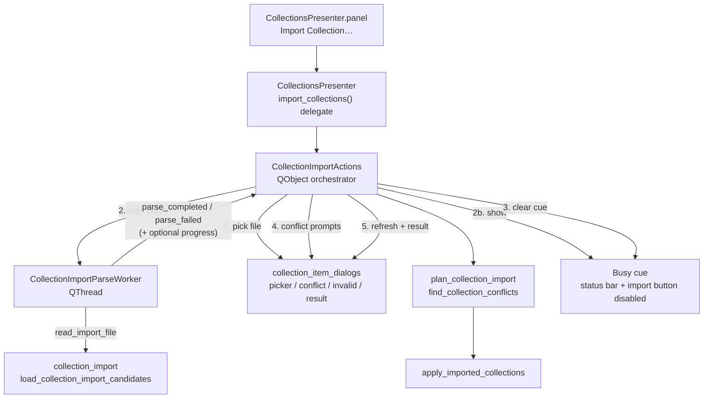

# PYPOST-1005: Responsive collection import with progress

## Research

### Source debt and approved requirements

- Debt origin: [PYPOST-987](https://pypost.atlassian.net/browse/PYPOST-987)
  `60-tech-debt.md` #3 → [PYPOST-1005](https://pypost.atlassian.net/browse/PYPOST-1005).
- Approved goals (`10-requirements.md`): keep the main window usable while a
  large import file is **prepared**, show progress feedback in the same class of
  experience as startup collection loading, and preserve PYPOST-987 import
  outcomes (conflicts, summary, invalid-file errors, tree refresh).
- Out of scope: format/conflict/id policy changes, PYPOST-1004 transactional
  multi-file import, PYPOST-1003 rename-summary undercount, environment import.

### Current import path (synchronous parse on the UI thread)

Confirmed in `pypost/ui/presenters/collection_import_actions.py`:

```text
Import Collection… click
  → prompt_import_collection_file (UI)
  → CollectionImportActions._load(path)          ← BLOCKS UI THREAD
       → read_import_file(path)                  ← default: load_collection_import_candidates
  → find_collection_conflicts + modal prompts    ← UI (must stay on GUI thread)
  → plan_collection_import (pure, sync)
  → apply_imported_collections (sync I/O)
  → refresh_tree / restore / collections_changed
  → show_collection_import_result
```

`_load` calls the injected `read_import_file` (default
`load_collection_import_candidates` in `pypost/core/collection_import.py`)
inline. That function:

1. Reads the whole file and runs `json.loads` (`_read_records`).
2. Walks every record with shape checks + `Collection(**record)` (Pydantic).

For a multi-megabyte bundle or hundreds of collections / thousands of requests,
steps 1–2 monopolize the Qt event loop. Conflict prompts and the result dialog
never appear until parse finishes, and the window looks hung — exactly the debt
item.

Pure planning and apply stay on the UI thread today. Debt and requirements
target **import preparation / parsing**, not a full async rewrite of plan/apply.
Plan and apply remain synchronous after parse completes (unchanged semantics).

### Startup reference: `CollectionsAsyncLoader`

`pypost/ui/presenters/collections_async_loader.py` +
`pypost/core/qt/collection_storage_gateway.py` +
`CollectionStorageWorker` (`QThread`):

```text
CollectionsAsyncLoader.load_async()
  → CollectionStorageGateway.load_async()
  → CollectionStorageWorker.run(): storage.load_collections()
  → load_completed / load_failed (queued to GUI thread)
  → RequestManager.apply_loaded_collections + refresh_tree
  → collections_loaded
```

Traits to reuse:

| Trait | Startup loader | Import (this task) |
| --- | --- | --- |
| Heavy work off GUI thread | Yes (`QThread`) | Yes (parse only) |
| Results via Qt signals | Yes | Yes |
| `is_busy` / skip re-entry | Yes | Yes (second Import click ignored while parse runs) |
| Worker finish hygiene | `deleteLater` + short `wait` | Same pattern as storage gateways / paste worker |
| Visible percent bar | No | Not required; see progress UX below |
| Modal dialogs during work | N/A | Conflicts/result stay **after** parse, on GUI thread |

Startup does **not** show a `QProgressDialog` or status-bar percent. The user
experience is: the window keeps pumping events while load runs. Requirements
ask for progress “consistent in spirit” with that — not a new product metaphor.
For a user-*initiated* import, a silent background parse would still feel like
nothing happened until conflict/result dialogs appear. Therefore this task adds
a lightweight busy cue (status message + import control disabled) while keeping
the window non-modal and interactive — same class as startup responsiveness,
plus an understandable “work is underway” signal.

### Sibling async patterns in the repo

- **`PasteJsonFormatWorker`** (`QThread`, emit result): one-shot parse/format off
  the UI thread; closest shape for a single-file import parse.
- **`EncryptionMigrationWorker`**: one-shot bulk work; UI disables action buttons
  while `migration_worker is not None`.
- **Env/collection storage gateways**: pending-queue + finish-slot hygiene
  (PYPOST-829). Import parse does **not** need a pending queue (one user pick →
  one parse); still copy finish teardown (`deleteLater` + bounded `wait`).

### Industry notes (PySide6 / Qt)

- Widgets must be touched only on the GUI thread; workers emit signals, slots
  update UI ([Qt for Python `QThread`](https://doc.qt.io/qtforpython-6/PySide6/QtCore/QThread.html);
  common PySide6 guidance: worker computes, main thread paints).
- Cross-thread signal connections default to queued delivery — correct for
  progress/result updates (avoid forcing `DirectConnection` onto widgets).
- Prefer emitting progress/results from the worker; never call dialog helpers
  from the worker thread.
- Repo precedent subclasses `QThread` and overrides `run` (storage workers,
  paste worker, encryption worker). Stay consistent rather than introducing a
  new `moveToThread` style for one consumer.

### Testing precedents

- Responsiveness: `tests/test_env_storage_responsiveness.py` proves the event
  loop can fire a `QTimer` while async load runs (`process_until` helper).
- Import UI: `tests/test_collections_import_ui.py` calls
  `presenter.import_collections()` synchronously and asserts immediate outcomes
  via the `read_import_file` DI seam. After this task, semantic tests must wait
  until parse completion (or inject an already-completed path); the
  responsiveness red test must prove the loop runs *during* parse.

### Issues found during research

1. **`CollectionImportActions` is a plain class, not a `QObject`.** Async
   completion needs signals or an explicit callback bridge; simplest fit is to
   make the actions collaborator a `QObject` (parented like
   `CollectionsAsyncLoader`) or add a small parse bridge owned by the
   presenter. Prefer owning the worker on `CollectionImportActions` as a
   `QObject` so the presenter stays a thin delegate.
2. **Existing UI tests assume synchronous completion.** Step 4 must update
   waiters; Step 3’s red test should target responsiveness, not rewrite every
   semantic case yet.
3. **JSON decode is one opaque chunk.** Percent progress is only meaningful
   after `_read_records` returns; until then the cue is indeterminate
   (“Preparing…”). That is acceptable and matches startup’s non-percent cue.
4. **Plan/apply remain sync.** A pathological plan over tens of thousands of
   collections could still hitch briefly; out of scope unless Step 4 profiling
   shows parse was not the freeze. Do not expand scope preemptively.
5. **No production progress UI exists for collection startup.** Do not invent a
   modal progress dialog that blocks the window — that would violate the
   “window stays usable” DoD.

## Implementation Plan

1. **Add a parse worker** (`CollectionImportParseWorker`, `QThread`) under
   `pypost/core/qt/` that runs the injected `read_import_file(path)` (default
   `load_collection_import_candidates`) and emits success
   `(list[Collection], list[str])` or failure (`CollectionImportFileError` /
   unexpected exception message). Optional: emit `progress(done, total)` while
   iterating records if the pure loader gains an optional `on_progress`
   callback (Qt-free).
2. **Split import orchestration into async parse + sync finish.**
   `CollectionImportActions.import_collections`:
   - Pick file (unchanged).
   - If already busy, log and return (mirror
     `CollectionsAsyncLoader.try_load_async` skip).
   - Start worker; show busy/progress cue; disable Import button.
   - On success: clear cue; run today’s `_resolve_conflicts` → plan → apply →
     refresh → result on the GUI thread.
   - On file-level failure / empty candidates: clear cue; show the same invalid-
     file dialogs as `_load` today; touch no app state.
3. **Progress feedback (chosen UX).** Non-modal, startup-aligned:
   - Status bar message while preparing (e.g. “Preparing collection import…”,
     cleared on completion/failure), using the same `statusBar().showMessage`
     channel already used elsewhere.
   - Disable the Import Collection control for the busy window (re-entry guard
     matching `is_busy`).
   - Do **not** use a modal `QProgressDialog` that freezes interaction.
   - Determinate `done/total` in the status message is optional if
     `on_progress` is added; indeterminate busy text alone satisfies the
     “visible progress” spirit when paired with a responsive window.
4. **Preserve DI seam.** Keep `read_import_file` injection on the presenter →
   actions path so unit/UI tests can stub parse without disk. The worker calls
   that callable on the worker thread; stubs used in responsiveness tests must
   be thread-safe.
5. **Leave pure plan/apply, conflict policy, and apply reconcile (PYPOST-1004)
   unchanged.** No format or storage API changes.
6. **User docs (Step 8 if needed).** If `doc/user/collections.md` omits that
   large imports stay responsive with a preparing cue, add one short note.
7. **Dev docs (Step 8).** Update `doc/dev/collection_import.md` architecture
   diagram for async parse.

**Mandatory — Failing Repro (next Step 3):**

- **What it asserts (desired behavior):** While a large/slow collection import
  **parse** is in flight after the user picked a file, the Qt event loop still
  processes events (e.g. a zero-interval `QTimer` fires) **before** parse
  returns, and a busy/progress cue is observable (import control disabled and/or
  preparing status message / equivalent busy flag). After parse finishes,
  existing conflict → plan → apply → result sequencing still runs (smoke assert
  that a successful stubbed import still lands collections — can be a second
  assertion in the same module or deferred to Step 4 if the red test stays
  focused on responsiveness).
- **Where it lives:** New focused module preferred:
  `tests/test_collection_import_responsiveness.py`, modeled on
  `tests/test_env_storage_responsiveness.py`, with
  `pytestmark = pytest.mark.timeout(...)` per `.cursor/lsr/do-testing.md`
  (GUI/responsiveness tier — align with the env responsiveness module’s 120s
  unless a tighter bound is enough). Alternatively extend
  `tests/test_collections_import_ui.py` if a single red test fits cleanly; keep
  the red case isolated and named for responsiveness.
- **How to force failure without live external deps:**
  1. Inject a thread-safe `read_import_file` that blocks for a short wall-clock
     duration (e.g. `threading.Event` wait ~200–500 ms, or `time.sleep`) and
     then returns a tiny valid candidate list — **or** write a large synthetic
     JSON under `tmp_path` (hundreds of minimal collections) and use the real
     `load_collection_import_candidates` if that alone is slow enough offscreen.
  2. Patch the file picker to return that path.
  3. Start `presenter.import_collections()` (or the actions entry point).
  4. Assert a `QTimer` scheduled at the start of the import fires **during** the
     parse window (same idea as
     `test_event_loop_stays_responsive_during_encrypted_load`).
  5. Assert busy/progress feedback was shown (button disabled / status /
     `is_busy()`).
  6. Wait with `process_until` until import finishes; assert collections updated
     (or invalid path left untouched for a separate case).
  - On **current** code the injected reader runs on the GUI thread, so the timer
    does not fire until after the sleep → assertion fails (**red**). No network,
    no real multi-megabyte fixture required if the blocking stub is used.
- **Sequencing:** research (this step) → write the red responsiveness test and
  confirm it fails on synchronous `_load` → implement worker + busy cue until
  green → then update existing synchronous UI tests to wait for async
  completion (Step 4) so the suite stays green.

## Architecture

### Module diagram



```text
Before (UI thread):
  pick → PARSE (blocks) → conflicts → plan → apply → result

After:
  pick → PARSE worker (background) + busy cue
       → conflicts → plan → apply → result   (GUI thread, unchanged)
```

### Module responsibilities

| Module | Responsibility |
| --- | --- |
| `CollectionImportParseWorker` (new) | Run `read_import_file(path)` off the GUI thread; emit completed/failed (+ optional progress); no widget access. |
| `CollectionImportActions` | Own worker lifecycle and busy state; sequence pick → async parse → sync conflict/plan/apply/result; show/clear busy cue; skip if busy. |
| `CollectionsPresenter` | Keep one-line `import_collections` delegate; pass `read_import_file` and any status-bar / button hooks needed for the cue. |
| `collection_import` (pure) | Unchanged semantics; optional Qt-free `on_progress(done, total)` only if determinate progress is implemented. |
| `collection_import_apply` / conflict dialogs | Unchanged. |
| `CollectionsAsyncLoader` / storage gateway | Reference pattern only; not reused for import parse (different I/O: user file vs data-dir load). |
| Tests | Red responsiveness test (Step 3); update UI waits (Step 4); keep pure unit tests on `collection_import` sync. |

### Patterns and justification

- **Worker + signals (existing PyPost pattern):** Matches
  `CollectionStorageWorker` / `PasteJsonFormatWorker` / encryption migration —
  proven under this codebase’s Qt threading rules.
- **Busy / re-entry guard:** Matches `CollectionsAsyncLoader.is_busy` so a
  double-click cannot start overlapping parses or interleave conflict dialogs.
- **Thin Qt shell over pure core:** Parse implementation stays in
  `collection_import.py`; the worker is a transport, not a second parser.
- **Non-modal progress cue:** Satisfies “window stays usable” + “visible
  progress” without inventing a modal workflow that startup does not use.
- **Plan-then-apply unchanged:** Responsiveness must not change import
  outcomes; keep PYPOST-987/1004 apply behavior.

### Main interfaces

```python
# New worker (sketch)
class CollectionImportParseWorker(QThread):
    parse_completed = Signal(object, object)  # collections, parse_errors
    parse_failed = Signal(object)             # CollectionImportFileError or Exception
    progress = Signal(int, int)               # optional: done, total

    def __init__(self, path: Path, read_import_file: ReadImportFile) -> None: ...
    def run(self) -> None: ...


# CollectionImportActions (extended)
class CollectionImportActions(QObject):
    def is_busy(self) -> bool: ...
    def import_collections(self) -> None:
        """Pick file; dispatch async parse; finish on GUI thread when ready."""
    # Internal slots:
    # _on_parse_completed(collections, parse_errors)
    # _on_parse_failed(error)
    # _set_preparing(active: bool, done: int | None = None, total: int | None = None)
```

Busy-cue dependency injection (keep actions testable without a real
`QMainWindow`):

- Prefer callables injected at construction, e.g.
  `set_preparing: Callable[[bool], None]` and/or
  `show_status: Callable[[str], None]` / `clear_status: Callable[[], None]`,
  plus access to disable the import button on the panel — same DI style as
  `refresh_tree` / `emit_collections_changed` today.

Public presenter API stays `import_collections()`; callers and the button wire-up
do not change.

### Dependencies

```text
CollectionsPresenter
  → CollectionImportActions
       → CollectionImportParseWorker → read_import_file / collection_import
       → collection_item_dialogs (GUI thread only)
       → plan_collection_import / apply_imported_collections
  → CollectionsAsyncLoader (unchanged; parallel pattern, separate lifecycle)
```

No new third-party dependency. No `StorageInterface` change. Optional status-bar
access is via injected callables from the presenter/main window, not a hard
import cycle into `MainWindow` from core.

### Risks and mitigations

| Risk | Mitigation |
| --- | --- |
| UI tests race before parse finishes | Step 4: `process_until` / signal spy on completion; keep fast stub readers |
| Worker still alive at teardown | `deleteLater` + short `wait` (gateway hygiene); parent worker to actions/`QObject` |
| Stub `read_import_file` not thread-safe | Document; responsiveness stub uses only threading primitives + return data |
| Modal progress dialog blocks DoD | Explicitly rejected; status + disable only |
| Scope creep into async apply | Architecture locks parse-only off-thread |

## Q&A

**Q:** Why not reuse `CollectionStorageGateway` itself?

**A:** That gateway loads the app data directory via `StorageInterface`. Import
parses a user-chosen file through `load_collection_import_candidates`. Same
threading *pattern*, different I/O and result type — a dedicated parse worker
avoids overloading the storage gateway.

**Q:** Does “matching CollectionsAsyncLoader” require a percent progress bar?

**A:** No. Startup has no percent UI. Matching means off-thread work, busy
re-entry protection, signal-delivered completion, and a responsive window. The
import-specific busy status/disable cue makes the in-progress state visible for
a user-started action.

**Q:** Do conflict dialogs run on the worker?

**A:** No. They stay on the GUI thread after `parse_completed`, preserving
today’s modal Overwrite / Keep Both / Skip (and apply-to-all) behavior.

**Q:** Is a large real fixture mandatory for the red test?

**A:** No. A blocking injected reader that freezes today’s synchronous `_load`
is enough to prove the event-loop assertion. A synthetic large JSON under
`tmp_path` is a useful Step 4 regression if parse CPU time is the concern, but
Step 3 can go red with the stub alone.

**Q:** Approval for this step?

**A:** Sprint-task-runner autonomy: treat Step 2 as ready for orchestrator
review; leave roadmap STEP 2 as `[/]` until review marks PASS.
