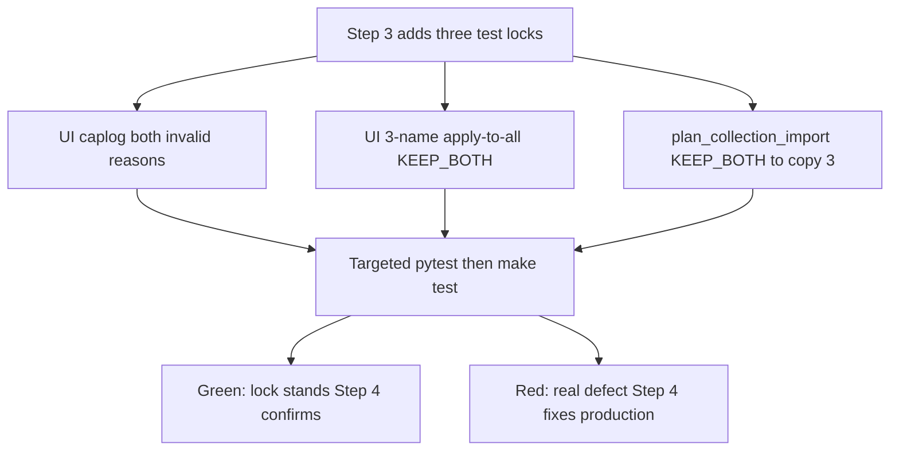
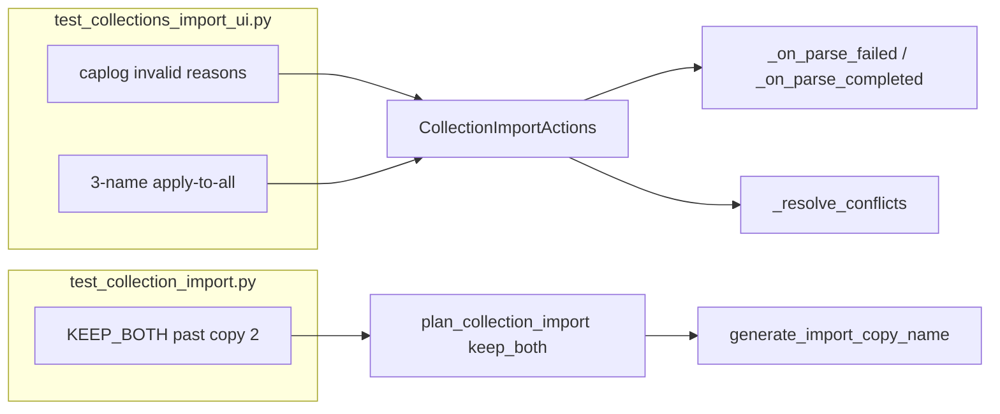

# PYPOST-1006: Close collection import combinatorial/caplog test gaps

## Research

This is **verification/testing debt** from PYPOST-987 follow-up #4
([PYPOST-1006](https://pypost.atlassian.net/browse/PYPOST-1006)). Product
behavior is believed correct. Architecture is test-only unless a new
assertion fails against current code.

### Production seams (unchanged intent)

- **Invalid-file WARNING** —
  `pypost/ui/presenters/collection_import_actions.py`.
  Lock both `reason`s of one event.
- **Apply-to-all loop** — `CollectionImportActions._resolve_conflicts`.
  Lock 3+ names with one prompt.
- **Copy-name caller** — `plan_collection_import` → `keep_both`.
  Lock uniqueness past `(2)`.

**Invalid-file logging** (`collection_import_actions.py`):

- `_on_parse_completed` (empty list):
  `logger.warning("collection_import_file_invalid reason=no_valid_collections")`
- `_on_parse_failed` (`CollectionImportFileError`):
  `logger.warning("collection_import_file_invalid reason=%s", error)`
  (`%s` is `str(error)`, the exception message).
- Logger: `logging.getLogger(__name__)` →
  `pypost.ui.presenters.collection_import_actions`.
- Level is **WARNING**, not ERROR. Both branches share one event name and
  differ only by `reason`.

Parse runs off-thread (PYPOST-1005) via `CollectionImportParseWorker`. File
failures are logged twice on purpose (`doc/dev/collection_import.md`): worker
`collection_import_parse_worker_failed`, then the orchestrator terminal
`collection_import_file_invalid`. Tests must assert the **orchestrator**
event, not the worker line. Zero-usable-collections is *not* a worker
failure: parse succeeds with `[]`, and only the orchestrator emits
`reason=no_valid_collections`.

Existing UI invalid-file tests inject a raising `read_import_file` or an
empty candidate list, then `_wait_import` until the invalid-file dialog.
That same async wait is required for caplog.

**Apply-to-all** (`_resolve_conflicts`):

```text
apply_to_all = None
for i, name in enumerate(conflicts):
    if apply_to_all is not None:
        decisions[name] = apply_to_all
        continue
    remaining_count = len(conflicts) - i - 1
    decision, use_for_all = prompt...(..., remaining_count=remaining_count)
    decisions[name] = decision
    if use_for_all:
        apply_to_all = decision
```

The checkbox is shown only when `remaining_count > 0`
(`collection_item_dialogs.py`). `plan_collection_import` defaults a missing
decision to **SKIP**. Therefore a 3+ apply-to-all test that uses SKIP cannot
tell "applied skip to remaining names" from "the loop never recorded the
third name". The existing two-conflict test uses SKIP; the new 3+ test must
use **KEEP_BOTH** or **OVERWRITE**.

**Copy names** (`pypost/core/import_conflicts.py`):

```text
"Copy of X" if free, else "Copy of X (2)", "(3)", … until unique
```

`plan_collection_import`'s nested `keep_both` is the collection caller:

```text
new_name = generate_import_copy_name(name, {col.name for col in result})
```

`generate_import_copy_name` is **not** re-exported from
`collection_import.py`. Environment tests already cover the helper through
`(2)`. This ticket locks the **collection caller**, not a second helper
unit test (that would be PYPOST-1002 territory).

### Current test coverage (confirmed by reading the files)

**Invalid-file log**

- Exists: `test_invalid_file_shows_error_and_changes_nothing` (parse fail:
  error dialog, state untouched).
- Exists: `test_zero_candidates_treated_as_invalid_file` (empty list plus
  parse_errors in the dialog).
- Exists: `test_logs_completed_event_with_counts` locks
  `collection_import_completed` via `caplog`.
- Exists: `test_collection_import_apply.py` locks
  `collection_import_save_failed` via `caplog`.
- Missing: **no** `caplog` assert of `collection_import_file_invalid` for
  either reason.

**Apply-to-all**

- Exists: `test_apply_to_all_prompts_only_once_for_two_conflicts` — exactly
  two names, SKIP + apply-to-all, `assert_called_once`.
- Missing: **no** 3+ distinct conflicting names.

**Copy past `(2)`**

- Exists: `test_three_duplicate_names_report_two_renames_each` reaches
  `Copy of API (2)` via in-file duplicates on an empty tree.
- Exists: UI keep-both reaches only `Copy of My API`.
- Exists: environment `TestGenerateImportCopyName` covers free name and
  `(2)` only.
- Missing: **no** collection-side case where `Copy of X` and
  `Copy of X (2)` are already taken.

`tests/test_collection_import_apply.py` is the wrong home for these gaps
(invalid file never reaches apply).
`tests/test_collection_import_responsiveness.py` is PYPOST-1005, out of
scope.

### Language / test rules

- Python per `.cursor/lsr/do-python.md` (PEP 8, type hints, pytest).
- `.cursor/lsr/do-testing.md`: explicit `pytest.mark.timeout` (already
  module-scoped: 60s GUI in `test_collections_import_ui.py`, 30s unit in
  `test_collection_import.py`); bounded `_wait_import` (`timeout_ms=5000`);
  caplog C1/C5 — `caplog.at_level(..., logger="...")` and structured event
  prefixes. Invalid-file is WARNING, so `at_level(logging.WARNING, logger=)`
  matches the save-failed tests (those use WARNING to capture WARNING
  reconcile plus ERROR save-failed).
- GUI tests keep the default signal-based timeout (no `method="thread"`).

### External notes (websearch)

- [pytest logging / caplog](https://pytest.org/en/latest/how-to/logging.html):
  `caplog.at_level(level, logger=...)` scopes capture; assert on
  `caplog.records` (level, logger name, message), not live `log_cli`.
- Project C5: one caplog block per logger; match structured prefixes
  (`collection_import_file_invalid reason=`).
- Combinatorial lock: one extra N (3 names, `(3)`) catches loop/suffix
  off-by-ones that N=2 hides. No pytest-parametrize matrix is required;
  one well-chosen case per gap is enough and stays hermetic.

## Implementation Plan

**Primary deliverable: tests only.** No production API, log-format, conflict
policy, or copy-name scheme change unless Step 3 assertions fail.

1. **Gap 1 — caplog both invalid reasons** in
   `tests/test_collections_import_ui.py` (`TestImportCollections`).
   Add two dedicated tests next to `test_logs_completed_event_with_counts`,
   reusing `_make_presenter`, `_reader` / raising reader, `_wait_import`,
   `_INVALID`, `_PICKER`. Keep the existing behavioral invalid-file tests
   unchanged (regression lock).
2. **Gap 2 — 3+ apply-to-all** in the same class, next to
   `test_apply_to_all_prompts_only_once_for_two_conflicts`. Use KEEP_BOTH
   (not SKIP). Do not change the existing two-conflict SKIP test.
3. **Gap 3 — copy name past `(2)`** in `tests/test_collection_import.py`
   (`TestPlanKeepBoth`). Drive `plan_collection_import` so `keep_both` is
   the collection caller. Do not add a helper-only test that imports
   `generate_import_copy_name` from `import_conflicts`.
4. Run targeted pytest (`PYTEST_ARGS` on those two modules), then `make test`
   as needed. Timeouts already present; new tests inherit them.
5. Step 4: production fix **only if** a new assertion is red; otherwise
   confirm green and move on.
6. Later steps: cleanup/observability likely N/A for test-only; docs note
   the three locks in `doc/dev/collection_import.md` if that file lists
   tests.

### Mandatory — Failing Repro (next Step 3)

Verification debt: the gap is **missing tests**, not missing product
behavior. Step 3 **still adds** the tests below. Against current production
they are **expected to pass (green)** once written. That is OK: they lock
the intended behavior. If any assertion is red, treat it as a real defect
and fix it in Step 4. Do **not** mark Step 3 N/A.

Sequencing: research (this file) → Step 3 write/run the tests → Step 4 only
if red (else green confirmation) → cleanup / observability / review / docs.

#### Repro 1 — both invalid-file `reason`s via caplog

- **Where:** `tests/test_collections_import_ui.py`.
- **Names:** `test_logs_file_invalid_on_parse_failure` and
  `test_logs_file_invalid_on_zero_usable_collections`.
- **How (no live deps):** same fakes as existing invalid-file tests —
  patched picker/dialog, `FakeRequestManager`, injected `read_import_file`.
  Wait with `_wait_import` until the invalid dialog. Wrap act+wait in
  `caplog.at_level(logging.WARNING, logger=_MODULE)` (`_MODULE` is already
  `pypost.ui.presenters.collection_import_actions`).
- **Parse-fail asserts:** raising reader
  `CollectionImportFileError("File is not valid JSON: boom")` (same text as
  today's behavioral test). After wait: invalid dialog called; collections
  unchanged; a record whose message contains
  `collection_import_file_invalid reason=` plus the parse-failure text
  (`not valid JSON` / `boom`); **no** record contains
  `reason=no_valid_collections`. Prefer `r.name == _MODULE` so worker
  `collection_import_parse_worker_failed` cannot satisfy the assert.
- **Zero-usable asserts:** `_reader([], [an entry error])`. After wait:
  invalid dialog; state untouched; a WARNING record with the **exact token**
  `collection_import_file_invalid reason=no_valid_collections`; that reason
  is distinct from the parse-fail reason.
- **Why this would fail if the gap were real:** dropping either log,
  collapsing both branches onto one reason, or renaming the event would
  fail CI the same way completed/save-failed already do. Today the tests
  simply do not exist.
- **Expected color today:** green once added, if production still emits the
  two WARNING lines.

#### Repro 2 — three conflicting names, apply-to-all, one prompt

- **Where:** `tests/test_collections_import_ui.py::TestImportCollections`.
- **Name:** `test_apply_to_all_prompts_only_once_for_three_conflicts`.
- **How (no live deps):** existing three collections (`My API`, `Billing`,
  `Auth`). Incoming: three with the same names, new ids. Patch conflict to
  return `(ImportConflictDecision.KEEP_BOTH, True)`. Wait until the result
  dialog.
- **Asserts:** `mock_conflict.assert_called_once()` (a second prompt after
  the second name fails). First call `remaining_count == 2`
  (`len(conflicts) - 0 - 1`; proves the prompt was the first of three, not
  the last with `remaining_count=0`). Result names include the three
  originals plus `Copy of My API`, `Copy of Billing`, `Copy of Auth` (a loop
  that stops after two would leave the third as default SKIP — no third
  copy). Do **not** use SKIP here.
- **Regression:** leave
  `test_apply_to_all_prompts_only_once_for_two_conflicts` green.
- **Expected color today:** green once added, if the loop is
  name-count-independent as documented.

#### Repro 3 — collection-side copy name past `(2)`

- **Where:** `tests/test_collection_import.py::TestPlanKeepBoth`.
- **Name:**
  `test_keep_both_uses_next_numbered_copy_when_copy_and_copy_2_taken`.
- **How (no live deps):** pure `plan_collection_import`; no Qt, no disk.
  Existing: `API`, `Copy of API`, `Copy of API (2)`. Incoming: one `API`.
  Decision: `KEEP_BOTH`.
- **Asserts:** result names
  `["API", "Copy of API", "Copy of API (2)", "Copy of API (3)"]`
  (three existing, then the new copy).
  `result.renamed == [("API", "Copy of API (3)")]`.
  New collection is in `persisted`; existing ids/names untouched.
- **Why collection-side:** this goes through `keep_both` →
  `generate_import_copy_name`, not a direct helper call. In-file four
  duplicates would also reach `(3)`; KEEP_BOTH with occupied earlier copies
  matches the DoD wording ("earlier copy names already taken") more
  closely. One test is enough.
- **Regression:** leave `test_three_duplicate_names_report_two_renames_each`
  (through `(2)`) green.
- **Expected color today:** green once added, if the `suffix += 1` loop
  still continues past 2.



## Architecture

No new production modules, interfaces, log events, or on-disk format. Tests
observe existing seams.



- `collection_import_actions.py` — emits
  `collection_import_file_invalid`; apply-to-all loop (unchanged).
- `collection_import.py` — `plan_collection_import` / `keep_both` caller
  (unchanged).
- `import_conflicts.py` — shared copy-name helper (unchanged; not
  unit-tested here past `(2)`).
- `collection_item_dialogs.py` — conflict prompt + apply-to-all checkbox
  (patched in UI tests).
- `test_collections_import_ui.py` — gaps 1 and 2; timeout 60;
  `_wait_import`.
- `test_collection_import.py` — gap 3; timeout 30; no Qt.

**Patterns:**

- **Observe, do not reshape.** No new DI. Reuse patched picker/conflict/
  result/invalid dialogs and `FakeRequestManager`.
- **caplog C1/C5.** Scoped logger + structured prefix; distinguish the two
  `reason`s; do not treat worker logs as the terminal event.
- **Combinatorial N+1.** Two names and `(2)` stay as regression; new cases
  are three names and `(3)`.
- **Decision that is not the planner default.** KEEP_BOTH for 3+ apply-to-all
  so a truncated loop cannot hide behind SKIP.

**Out of scope (unchanged):** PYPOST-1002 (environment combinatorial sibling),
PYPOST-1003 (rename-summary undercount), PYPOST-1004 (atomicity),
PYPOST-1005 (off-thread parse — already shipped; tests must wait for it),
PYPOST-1007 (mypy baseline keying), very-large-file import tests.

## Q&A

**Q:** Why may Step 3 tests go green immediately?

**A:** The gap is missing tests. Production already logs both reasons, loops
all conflict names, and increments the copy suffix. Step 3 still **writes**
the tests; green means the lock holds. Red means a real defect for Step 4.

**Q:** Why not mark Step 3 N/A?

**A:** N/A is for no runtime behavioral *or* test deliverable. This ticket's
deliverable *is* the tests.

**Q:** Why both `reason`s, not just the event name?

**A:** The branches share `collection_import_file_invalid`. Asserting only
the name would still allow one reason to be dropped or swapped.

**Q:** Why dedicated caplog tests instead of only extending the two existing
invalid-file tests?

**A:** Matches `test_logs_completed_event_with_counts`. Existing tests stay
as UX/state locks. Dedicated tests own the log contract. Extending the
existing two tests is an acceptable equivalent if Step 3 prefers a smaller
diff, provided both reasons and mutual exclusion are asserted.

**Q:** Why KEEP_BOTH (not SKIP) for three conflicts?

**A:** Missing decisions default to SKIP. SKIP + `assert_called_once` cannot
catch a loop that never records the third name. KEEP_BOTH requires a third
copy. Leave the two-conflict SKIP test as-is.

**Q:** Why `remaining_count == 2`?

**A:** Together with `called_once`, it proves the single prompt was the
*first* of three. A single prompt on the last name would have
`remaining_count=0` (and no checkbox).

**Q:** Why not a direct `generate_import_copy_name(..., {(2) taken})` test in
the collection suite?

**A:** That tests the shared helper, which environment tests already own
through `(2)`. The debt asks for the **collection caller**.
`plan_collection_import` KEEP_BOTH is that caller.

**Q:** Is PYPOST-1002 in scope?

**A:** No. Environment-import combinatorial gaps stay on that ticket.

**Q:** Could worker `collection_import_parse_worker_failed` satisfy a loose
caplog assert?

**A:** Yes, if tests only search for `invalid` or `failed`. Assert the
orchestrator prefix `collection_import_file_invalid` (and logger `_MODULE`).
Zero-usable does not emit the worker failure line at all.

**Q:** Must product behavior change?

**A:** No, unless a new assertion fails.
