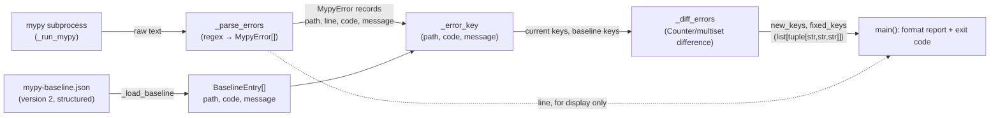

# PYPOST-1007: Make mypy baseline gate resilient to line-number churn

## Research

- Current implementation: `scripts/check_mypy_baseline.py`. Identity of a
  baselined error today is the string `"{path}:{line}:{code}"`, built by
  `_ERROR_RE` from mypy's `--show-error-codes` output. The message text
  (`error: <message> [<code>]`) is matched by `.*` but never captured or
  stored.
- Baseline file `mypy-baseline.json`: `{"error_count": N, "errors": [...],
  "scope": [...]}`, `errors` is a flat, sorted list of `"path:line:code"`
  strings (218 entries today). Comparison in `main()` converts both the
  baseline list and the freshly parsed list to Python `set`s and diffs them
  — so **duplicate identical keys already collapse today**, but because
  `line` is part of today's key, two instances colliding on the exact same
  `path:line:code` is a near-zero-incidence accident (it would require two
  mypy errors of the same code reported on the exact same line), not a
  meaningful gap in today's script. `error_count`, however, is `len(errors)`
  on the raw (non-deduplicated) list, so it can currently exceed the number
  of distinct set members in that rare case.
  **This is directly relevant to the key-format decision below**: dropping
  `line` from the key (to fix the churn problem) turns this from a
  near-zero-incidence quirk into a common case — see "Chosen key format" →
  duplicate-key collision rate. A set-based diff over the new key would
  therefore silently break detection for roughly half of today's baselined
  errors; the diff algorithm must change from set-difference to
  **multiset (Counter) difference** as part of this task, not be preserved
  as-is. See "Diff algorithm" section below.
- Root cause of the churn problem (`ai-tasks/PYPOST-987/60-tech-debt.md`,
  lines ~163-167 and Follow-up Task #5, lines ~210-213): line number is
  baked into identity, so an edit anywhere above a baselined error (e.g. an
  added import) shifts every error below it, producing a matched pair of
  phantom "fixed" (old line) + "new" (new line) entries per real error, even
  though nothing about the error changed. PYPOST-987 observed ~30 phantom
  entries in `tabs_presenter_worker.py` from an unrelated import edit in a
  different file (`collection_item_dialogs.py`) that happened to shift line
  numbers via import-side-effects in the shared module graph.
- The Jira/tech-debt source explicitly proposes keying on
  `(file, error-code, message)`. `10-requirements.md` (Q&A, last item)
  confirms this is a candidate, not a mandate, and leaves the exact key
  format, message handling, JSON shape, and migration strategy to this step.
- `make typecheck` (`Makefile:128-129`) is documented as an "optional" gate
  (not part of `make check`), which lowers the blast radius of a breaking
  baseline-format change: no CI merge gate depends on the old flat-string
  shape.

## Implementation Plan

1. Extend `_ERROR_RE` to also capture the message text between `error: ` and
   the trailing ` [<code>]`.
2. Replace the flat `"path:line:code"` string identity with a structured
   `MypyError` record (`path`, `line`, `code`, `message`) produced by
   `_parse_errors`, and derive the comparison **key** as `(path, code,
   message)` — line is kept on the record for human-facing output only, and
   is never part of equality/hashing used for baseline comparison.
3. Change `mypy-baseline.json` to store structured entries (objects with
   `path`/`code`/`message`) instead of flat strings, and add a `"version":
   2"` field so the loader can distinguish old- from new-format files
   deterministically instead of guessing from content shape.
4. `_load_baseline()` rejects a legacy (unversioned / flat-string) file with
   a clear, actionable error message ("regenerate via --update-baseline"),
   mirroring the existing missing-file error path — this is a breaking,
   non-backward-compatible format change by design (see Architecture →
   Backward Compatibility).
5. `_write_baseline()` and `main()` are updated to build/consume the new
   record shape. The new/fixed diff logic **does change**, not just the key
   composition: `_diff_errors` moves from a set-of-keys difference to a
   `collections.Counter`-based multiset difference, so that a key with N
   duplicate instances is tracked by count, not by presence/absence — see
   "Diff algorithm: multiset (Counter) difference" in Architecture below.
6. Regenerate `mypy-baseline.json` in the new format via
   `--update-baseline` as part of Step 4, committed atomically with the
   script change (no code fix to any currently-baselined error — out of
   scope per `10-requirements.md`).
7. Update `tests/test_mypy_baseline.py` for the new record/JSON shape and
   add tests that directly demonstrate the two governing properties: line
   shift alone → no diff; genuine error change → still detected.

**Mandatory — Failing Repro (next Step 3):** Write a red test in
`tests/test_mypy_baseline.py` that asserts line-number resilience end to
end through the real comparison path (not just `_parse_errors` in
isolation). Concretely:
- Extract a small, pure, directly-testable diff function during Step 3/4 —
  `_diff_errors(current: list[MypyError], baseline: list[BaselineEntry]) ->
  tuple[list[tuple[str, str, str]], list[tuple[str, str, str]]]` (`(new_keys,
  fixed_keys)`, each a flat list of raw `(path, code, message)` key-tuples
  with one entry per surplus/deficit *instance* — see "Diff algorithm" in
  Architecture for the exact return-shape contract) — factored out of
  `main()` so it can be unit-tested without mocking `subprocess`/filesystem,
  and without string-matching formatted output. This extraction is itself
  part of the red-test setup: today `main()` is a monolith that makes this
  scenario awkward to test in isolation, which is exactly why the current
  test suite never caught the churn bug.
- Red test 1 (must fail against **today's** `path:line:code` key, pass
  after the fix): build two synthetic mypy outputs for the *same*
  `(file, code, message)` at two *different* line numbers (simulating an
  import shift); assert `_diff_errors` reports zero new and zero fixed
  entries when one is used as "baseline" and the other as "current."
- Red test 2 (must already pass, and must keep passing — regression guard
  for detection power): same file/line, but a different `code` or a
  different `message`; assert it *is* reported as both fixed (old) and new
  (changed), so a real change is never masked by the new key's leniency.
- Red test 3: an entry present in baseline but absent from current (any
  key) is still reported as fixed — unchanged guarantee.
- Red test 4 (multiset case, must fail against a **set-based** diff, pass
  against the **Counter-based** diff): baseline has 3 entries sharing the
  same `(path, code, message)` key, current run has 2 (one instance fixed,
  two remain). `_diff_errors` must report exactly 1 fixed and 0 new for
  that key — not 0 fixed (what a set-difference would report, since the key
  is still present in both sides) and not 3 fixed. A companion case:
  baseline has 1 instance of a key, current run has 2 (a duplicate
  appeared) — must report exactly 1 new, 0 fixed.
- No live mypy invocation or `pypost/` source changes are needed for these
  tests: synthetic mypy-output strings (as `test_parse_errors_...` already
  uses) are sufficient and keep the tests hermetic and fast.
- Force the failure without live external deps: run test 1 against the
  *current* (pre-fix) key logic first to confirm it fails for the expected
  reason (line included in key → spurious diff), then implement the fix
  (Step 4) until it passes.

This task has a real, if narrowly-scoped, behavioral change (the gate's
matching/diffing logic), so `N/A` does not apply — the above is the
required red-test design.

## Architecture

### Module responsibilities (unchanged decomposition, changed internals)

The script remains a single-file CLI tool; no new modules are introduced.
Responsibilities within `scripts/check_mypy_baseline.py`:

| Component | Responsibility | Change in this task |
| --- | --- | --- |
| `_run_mypy()` | Invoke mypy over `MYPY_PATHS`, capture raw text output | **No change** |
| `_ERROR_RE` / `_parse_errors()` | Parse raw mypy text into structured error records | Capture `message`; return `MypyError` records instead of flat strings |
| `_error_key()` *(new)* | Derive the comparison identity from a parsed/baseline record | **New**: `(path, code, message)` |
| `_load_baseline()` | Read `mypy-baseline.json` into comparable records | Parse structured entries; reject legacy flat-string format with a clear error |
| `_write_baseline()` | Serialize current errors to `mypy-baseline.json` | Emit structured entries + `version: 2` |
| `_diff_errors()` *(new, extracted)* | Pure multiset (Counter) difference of current vs. baseline keys; returns `(new_keys, fixed_keys)` as `tuple[list[tuple[str, str, str]], list[tuple[str, str, str]]]` — raw key-tuples, no display formatting | **New**: extracted from `main()` for testability (see Step 3 plan); uses `collections.Counter` subtraction, not set difference, so duplicate-key counts are tracked correctly |
| `main()` | CLI orchestration: run mypy, diff, report, `--update-baseline` | Delegates key derivation/diffing to `_diff_errors`; owns all string formatting of `_diff_errors`'s key-tuples into the human-readable report, including optional line-number hints for *new* errors (see below) |

### Data flow



### Chosen key format: `(path, code, message)`

**Decision:** a baselined error's identity is the tuple `(path, code,
message)`, where `message` is mypy's error message text **verbatim**
(only leading/trailing whitespace stripped — no further normalization),
captured between `error: ` and the trailing ` [<code>]`. Line number is
parsed (for display) but is **not** part of the key.

**Duplicate-key collision rate (empirically measured, not assumed):**
running mypy over the full baseline scope (`pypost/core`, `pypost/models`,
`pypost/ui`) produces 219 total error instances but only 137 distinct
`(path, code, message)` keys — **33 key-groups have 2+ instances with
byte-identical messages at different lines**, accounting for 115 of the
219 instances (**~52%**). Examples: `pypost/ui/collection_item_dialogs.py`
has an `attr-defined` error `"type[QMessageBox]" has no attribute "Yes"` /
`"...No"` repeated across 8 lines each (PyQt/PySide stub boilerplate
repeated per dialog); `pypost/ui/widgets/mixins.py` has 25 `attr-defined`
errors collapsing to only 11 distinct messages. This is not a rare edge
case to wave off — it is the *majority-adjacent, expected shape* of this
codebase's mypy output, driven by repeated Qt-stub attribute-access
patterns across near-identical widget/dialog boilerplate. **It is handled
by making the diff algorithm count-aware (multiset/Counter-based, see
"Diff algorithm" below), not by declaring it out of scope or by further
refining the key** — the key itself stays `(path, code, message)` per the
alternatives analysis below; refining the key further (e.g. adding an
occurrence index) would reintroduce line-shift-style fragility, since an
index is itself position-dependent.

Alternatives considered:

| Key | Verdict | Reasoning |
| --- | --- | --- |
| `(path, line, code)` (current) | Rejected | Exactly the problem: line is incidental, shifts on unrelated edits. |
| `(path, code)` — drop message too | Rejected | Too coarse. Files like `pypost/ui/widgets/mixins.py` have 20+ distinct `attr-defined` errors on different attributes/lines. Collapsing them to one key per `(path, code)` means the diff can no longer tell *which* instance changed — a real new `attr-defined` error and a real fixed one could net out to "no change," silently weakening the gate. Violates the requirement that genuinely new/fixed errors must still be reported. |
| `(path, code, message)` — **chosen** | **Adopted** | Drops the incidental field (line) while keeping the fields that actually characterize *what's wrong*: which file, what kind of error, and mypy's own description of it (which, for these error codes — `attr-defined`, `arg-type`, `assignment`, `union-attr`, etc. — routinely encodes the specific attribute/argument/variable name involved). This restores the specificity lost by dropping line, without reintroducing line's fragility. The ~52% empirical duplicate-key rate this key produces (see above) is addressed by making `_diff_errors` count-aware (Counter/multiset), not by further splitting the key. |
| `(path, code, normalized-message)` — e.g. strip quoted identifiers | Rejected (for now) | Per `10-requirements.md` Q&A, message text "might legitimately need to stay significant to catch real changes" — e.g. if a rename changes *which* attribute is missing, that's a real change in what the error is about, not noise, and should surface as fixed+new. Normalization also adds regex-fragility risk (a wrong substitution could mask real changes) for no demonstrated benefit — there is no evidence in this codebase that message text itself is a source of line-content-driven churn (mypy messages are derived from types/names, not from line position or arbitrary line content). Revisit only if practice shows otherwise. |
| Content hash of the full mypy line minus line number | Rejected | Opaque in JSON (unreviewable in PR diffs), no advantage over structured fields, harder to debug when a hash "just" doesn't match. |
| AST/semantic identity (e.g. enclosing function + error shape) | Rejected | Requires parsing source, disproportionate complexity for a CI gate script; mypy's own line+message already is the semantic identity for practical purposes. |

Why not include column number? mypy is invoked here without
`--show-column-numbers` (unchanged, see Non-Goals); no column data is
available or needed.

Does message text ever encode line-derived noise? No observed case in this
codebase's error codes (`arg-type`, `attr-defined`, `assignment`,
`union-attr`, `no-any-return`, `var-annotated`, `return-value`, `misc`,
`method-assign`, `override`) — these messages describe types, attribute
names, and argument names, not line positions or file layout. If a future
mypy upgrade changes message wording globally, that is an explicit
out-of-scope concern (see Non-Goals) handled the same way any baseline
regeneration is handled today: `--update-baseline`.

### Diff algorithm: multiset (Counter) difference, not set difference

**Decision:** `_diff_errors` computes its new/fixed results via
`collections.Counter` over the `(path, code, message)` key, not via
`set` difference:

```python
current_counts = Counter(_error_key(e) for e in current)
baseline_counts = Counter(_error_key(e) for e in baseline)

new_counts = current_counts - baseline_counts     # Counter subtraction:
fixed_counts = baseline_counts - current_counts    # negative/zero results drop out
```

`Counter.__sub__` keeps only positive results, so `new_counts[key]` is
exactly "how many more instances of `key` exist in the current run than
were baselined" and `fixed_counts[key]` is exactly "how many fewer." This
is the direct fix for the blocking gap identified in review: a set
difference treats a key as a single present/absent element, so if 1 of 3
duplicate-key instances is fixed, the key is still present in both sides
and the set diff reports nothing; `Counter` subtraction reports it as
`fixed_counts[key] == 1`. Symmetrically, a new 4th occurrence of an
already-baselined key reports as `new_counts[key] == 1` via `Counter`,
where a set diff would report nothing (key already "present").

**Return-type contract (unambiguous, used consistently throughout this
document):** `_diff_errors` returns `tuple[list[tuple[str, str, str]],
list[tuple[str, str, str]]]` — `(new_keys, fixed_keys)`, each a flat list of
raw `(path, code, message)` key-tuples, expanded from the counts via
`list(new_counts.elements())` / `list(fixed_counts.elements())` (one list
entry per surplus/deficit *instance*, so a key with 3 new instances appears
three times). `_diff_errors` returns structured key-tuples, **not**
pre-formatted display strings — `len(new_keys)` and `len(fixed_keys)` are
exact instance counts, and `Counter(new_keys)` recovers the per-key
breakdown if needed. This keeps `_diff_errors` a pure, string-formatting-free
function that tests can assert against directly (tuple equality, no
string-matching); all human-readable formatting (the `NEW:`/`Baseline
matched` report lines shown below, including the line-number lookups) is
done separately in `main()`, which is the only place that turns keys into
display text.

**Which line to show for a new key with multiple current-run instances:**
this reporting step happens in `main()`, which rebuilds `new_counts =
Counter(new_keys)` / `fixed_counts = Counter(fixed_keys)` from
`_diff_errors`'s returned key-tuple lists purely for per-key display
grouping — `_diff_errors` itself never produces or returns a `Counter`.
`line` is display-only, never part of identity, so when `new_counts[key]`
is positive, there is no per-instance signal telling us *which* of the
current run's line-occurrences for that key are "the new one(s)" — only
*how many* are new. Decision: the report lists **all current-run line
numbers for that key** (sorted ascending), and appends the new-count in
parentheses only when it differs from the total occurrence count (i.e.,
when the key was already partially baselined):

```
NEW: pypost/ui/widgets/mixins.py: "SomeWidget" has no attribute "foo" [attr-defined]
  lines: 40, 88, 120, 155  (3 new of 4 total; 1 already baselined)
```

When the key is entirely new (`new_counts[key] == total occurrences in
current run`, i.e. it wasn't in the baseline at all), the parenthetical is
omitted as redundant — every listed line is new. This is unambiguous,
needs no arbitrary "pick one line" heuristic, and gives the developer
every location to inspect. The symmetric "fixed" report has no line
numbers available (the baseline never stores `line`), so it prints
`path: message [code]`, with a `(N of M baselined instances)` suffix when
`fixed_counts[key]` is less than the total baselined count for that key.

### Baseline JSON shape (v2)

```json
{
  "version": 2,
  "scope": ["pypost/core", "pypost/models", "pypost/ui"],
  "error_count": 218,
  "errors": [
    {
      "path": "pypost/core/alert_manager.py",
      "code": "arg-type",
      "message": "Argument 1 to \"emit\" of \"AlertManager\" has incompatible type \"str\"; expected \"AlertLevel\""
    }
  ]
}
```

- `errors` becomes a list of objects (`path`, `code`, `message`) instead of
  flat `"path:line:code"` strings — required because `message` can contain
  colons, brackets, and quotes, which would make a delimiter-joined flat
  string ambiguous/unreadable. Structured objects are self-describing,
  diff-friendly in PR review, and avoid any escaping scheme.
- `errors` is sorted by `(path, code, message)` for deterministic,
  reviewable diffs (`json.dumps(..., sort_keys=True)` already sorts object
  keys; the *list order* is additionally produced pre-sorted the same way
  `sorted(errors)` sorts today).
- **Duplicate entries are preserved as repeated objects, not deduplicated.**
  If two baselined errors share the exact same `(path, code, message)`
  (the empirically-measured ~52% case, see "Chosen key format" above),
  `errors` contains that object **twice** — `_write_baseline` performs no
  dedup step. This is load-bearing for the multiset design: `_diff_errors`
  counts occurrences per key via `Counter`, so a deduplicated baseline list
  would under-count baselined instances and make every duplicate group look
  like it has only 1 baselined instance regardless of how many really
  exist, silently reintroducing the same blind spot the multiset diff is
  meant to close.
- `error_count` remains `len(errors)` on the (intentionally
  duplicate-containing) list — this now has direct semantic meaning under
  the multiset design (it is exactly `sum(baseline_counts.values())`, the
  total baselined instance count), not just a preserved quirk. This
  preserves the DoD requirement "the reported error count still matches
  the number of baseline entries" literally.
- `scope` is unchanged (`MYPY_PATHS`, unchanged — see Non-Goals).
- `version: 2` is new: an explicit, self-describing format marker so the
  loader can give a precise, actionable error instead of a confusing
  `KeyError`/`TypeError` if it ever encounters the old shape (e.g. a stale
  branch, a bad merge, or a developer's local file predating this change).

### Migration story

**Decision: regenerate, do not hand-migrate.** The old
`mypy-baseline.json` stores no message text at all (only `path`, `line`,
`code`) — there is nothing to derive the new `message` field from without
re-running mypy. Hand-migration is therefore not just undesirable but
impossible without invoking mypy anyway, so:

1. Ship the script change and the regenerated baseline in the **same
   commit** (Step 4): run `python scripts/check_mypy_baseline.py
   --update-baseline` locally against the current codebase, producing a
   fresh v2 `mypy-baseline.json` with the current error set (still ~218
   errors — this task does not fix any of them, see Non-Goals).
2. `_load_baseline()` explicitly detects a legacy file (`"version"` key
   absent, or `errors` entries are `str` rather than `dict`) and raises a
   clear error directing the developer to run `--update-baseline`, using
   the same pattern as today's missing-baseline-file message
   (`scripts/check_mypy_baseline.py:85-87`). It does **not** attempt a
   best-effort partial migration (e.g. keying legacy entries as
   `(path, code, "")`) — an empty-message key would silently and
   permanently under-distinguish every legacy entry sharing a `(path,
   code)`, reintroducing exactly the coarseness problem rejected above,
   and would mask itself (no error, just silently wrong grouping) rather
   than failing loudly.
3. Because the script and baseline are committed together, there is no
   window where a deployed script expects v2 but the repo still has v1 (or
   vice versa) — a plain `git revert` of that single commit cleanly
   restores the old script+baseline pair together.

### Impact on existing functions

- **`_parse_errors`**: regex gains a `message` capture group; return type
  changes from `list[str]` to `list[MypyError]` (a `NamedTuple` with
  `path: str`, `line: int`, `code: str`, `message: str`), sorted by
  `(path, line, code)` (unchanged sort key — line remains useful for
  ordering the *current* run's human-facing output, even though it drops
  out of the comparison key).
- **`_load_baseline`**: return type changes from `list[str]` to
  `list[BaselineEntry]` (`NamedTuple` with `path`, `code`, `message` —
  deliberately no `line` field, since the baseline never stores it).
  Gains the legacy-format detection/rejection described above.
- **`_write_baseline`**: takes the current run's `MypyError` records (or an
  equivalent sequence of `(path, code, message)` triples), projects out
  `line`, and writes the v2 JSON shape including `"version": 2"`.
- **`main()`**: unchanged control flow (run mypy → parse → either
  `--update-baseline` write-and-exit, or load baseline → diff → report →
  exit 1 on any diff, exit 0 clean). What changes: the diff now operates on
  `(path, code, message)` keys via `_error_key`/`_diff_errors`, using
  `Counter`-based multiset subtraction instead of `set` difference (see
  "Diff algorithm" above) — this is a **behavioral** change, not just a
  key-composition change, since it changes what gets reported for
  duplicate-key groups. The "new errors" report line gains all current-run
  line numbers for each new key (looked up from the current run's
  `MypyError` records, purely for developer convenience in locating the
  error — not part of identity), with a "(N new of M total)" suffix when
  only some of a duplicate group's instances are new; the "fixed errors"
  report has no line number available (the baseline never stored one) and
  prints `path: message [code]`, with a "(N of M baselined)" suffix when
  only some of a duplicate group's baselined instances were fixed.
- **Preserved exactly**: missing-baseline-file handling and exit code (1,
  stderr message, `--update-baseline` hint); `--update-baseline` still
  fully regenerates from a live mypy run; exit code 0 on a clean match;
  exit code 1 on any new/fixed entries; the final "Baseline: N errors;
  current: M errors" summary line (N/M = list lengths, unchanged
  semantics).

### Backward compatibility / rollout

This **is** a breaking, non-backward-compatible baseline format change —
by design, since the whole point is to change what "the same error" means.
There is no soft/dual-read migration path because, as established above,
the new field (`message`) cannot be synthesized from old data.

Rollout sequencing:

1. Step 3: add the extracted `_diff_errors` pure function and the red
   tests against it (fails on today's key logic).
2. Step 4: implement the new `_parse_errors`/`_load_baseline`/
   `_write_baseline`/`main()` logic; run `--update-baseline` once locally;
   commit script + regenerated `mypy-baseline.json` together.
3. Because `make typecheck` is documented as an optional gate not wired
   into `make check`/CI merge gating (`10-requirements.md` Q&A, confirmed
   against `ai-tasks/PYPOST-987/60-tech-debt.md`), there is no CI pipeline
   that could observe an inconsistent script/baseline pair mid-rollout —
   the risk window is limited to a developer's local machine between
   `git pull` and re-running `make typecheck`, which self-resolves on the
   next `--update-baseline` invocation if they happen to run the gate
   between two divergent commits (extremely unlikely in a single-commit
   rollout, and self-explanatory via the legacy-format error message if it
   ever happens).
4. No developer-facing workflow change: `make typecheck` and
   `--update-baseline` keep the same names/semantics/flags. Only the
   internal notion of "same error" changes, per the Definition of Done.

### Selected architectural patterns and justification

This task applies four patterns, each already justified in detail above;
this section collects them for a checklist pass. **Composite/structured
identity key** (`(path, code, message)` in place of the line-coupled
`path:line:code` string, see "Chosen key format") — chosen because it drops
the one incidental, position-dependent field (`line`) while keeping every
field that actually characterizes the error, without the coarseness of
dropping `message` too. **Multiset (Counter) difference in place of set
difference** (see "Diff algorithm") — required because the chosen key
collides on ~52% of today's baselined instances; a set diff would silently
under-report fixed/new errors within a duplicate-key group, so `_diff_errors`
tracks per-key *counts* via `collections.Counter` subtraction instead of
presence/absence. **Pure-function extraction for testability** — `_diff_errors`
is factored out of the `main()` monolith and kept side-effect-free, returning
structured `(path, code, message)` key-tuples rather than pre-formatted
strings (see "Return-type contract" under "Diff algorithm"), so tests assert
on tuple/count equality and all display formatting is isolated to `main()`.
**Breaking, regenerate-not-migrate rollout** (see "Migration story" and
"Backward compatibility / rollout") — because the old baseline format stores
no `message` field to migrate from, the format bump (`version: 2`) is shipped
as a hard cutover with an explicit, actionable rejection of legacy files,
committed atomically with a freshly regenerated baseline in the same commit
as the script change, rather than maintaining a dual-format reader.

### Test impact (`tests/test_mypy_baseline.py`)

Existing tests, updated:

- `test_parse_errors_extracts_path_line_code` → renamed
  `test_parse_errors_extracts_path_line_code_and_message`; asserts against
  `MypyError` records (all four fields) instead of flat strings, using the
  same two-line sample already in the test (message text is already
  present in the sample strings, just previously discarded).
- `test_baseline_scope_includes_core_models_and_ui` → assertions on
  `scope`/`error_count`/`len(errors)` are shape-agnostic and keep working
  unchanged; add an assertion `data["version"] == 2` for extra rigor once
  the real file is regenerated.
- `test_baseline_entries_use_scoped_paths` → `entry` is now a `dict`;
  change `entry.startswith(...)` to `entry["path"].startswith(...)`.

New tests to add:

- `test_diff_errors_ignores_line_shift_alone` — the Step 3 red test: same
  `(path, code, message)` at two different lines → zero new, zero fixed.
- `test_diff_errors_detects_new_error_same_line` — same `path`/`line`,
  different `code` or `message` → reported as both fixed (old identity) and
  new (changed identity); guards against the leniency of dropping `line`
  accidentally swallowing real changes.
- `test_diff_errors_detects_fixed_error` — a baseline key absent from the
  current run is reported as fixed, unconditionally of line.
- `test_load_baseline_rejects_legacy_flat_string_format` — feeding a v1
  (`"path:line:code"` list, no `version` key) file into `_load_baseline`
  raises a clear, actionable error rather than crashing on `entry["path"]`
  with a `TypeError`/`KeyError`.
- `test_write_baseline_round_trip` (optional but recommended) —
  `_write_baseline` → `_load_baseline` produces the same set of
  `(path, code, message)` keys as the input, confirming the v2 schema
  round-trips losslessly for the fields that matter to identity.
- **`test_diff_errors_multiset_partial_fix`** (required, closes the
  blocking review gap): baseline has 3 entries with an identical
  `(path, code, message)` key; current run has 2 entries with that same
  key (one instance was fixed, two remain). Assert `_diff_errors` reports
  **exactly 1 fixed and 0 new** for that key. This is the case a
  set-based diff gets wrong (it would report 0 fixed, since the key is
  still present on both sides) and is the direct regression test for the
  reviewer-identified gap.
- **`test_diff_errors_multiset_new_duplicate`** (required, companion
  case): baseline has 1 entry for a key; current run has 2 (a duplicate
  instance appeared). Assert `_diff_errors` reports **exactly 1 new and 0
  fixed** for that key — not 0 new (what a set diff would report, since
  the key was already "present").
- **`test_diff_errors_multiset_full_fix`** (regression guard): baseline
  has 3 identical-key entries, current run has 0 — assert exactly 3 fixed,
  not 1 (guards against under-counting via an accidental set-collapse
  reintroduced by a future refactor).
- `test_write_baseline_preserves_duplicate_entries` — write two
  `MypyError` records that share the same `(path, code, message)` but
  differ only in `line`; assert `_write_baseline`'s output `errors` list
  contains **two** objects for that key (not deduplicated to one), since
  the multiset diff depends on the baseline list's length reflecting the
  true per-key instance count.

### Non-goals (explicitly not changing)

- The three-directory mypy invocation scope (`pypost/core`, `pypost/models`,
  `pypost/ui`) and `MYPY_PATHS` — unchanged.
- `_run_mypy()`'s subprocess invocation, flags (`--show-error-codes`), or
  mypy version — unchanged. No column-number tracking is introduced.
- The `--update-baseline` CLI flag's name or semantics ("regenerate from a
  live mypy run") — unchanged.
- `make typecheck`'s role as an optional, non-`make check` gate — unchanged.
- Resolving, suppressing, or otherwise touching any of the ~218 currently
  baselined mypy errors or any `pypost/` production code — unchanged, out
  of scope per `10-requirements.md`.
- Message *normalization* (stripping quoted identifiers, wildcarding
  numbers, etc.) — considered and explicitly rejected for this iteration
  (see key-format alternatives table).
- Any dual-format (v1-and-v2) reader/compatibility shim — explicitly
  rejected in favor of a clean regenerate-and-commit-atomically rollout.
- **Correction (Step 2 re-review):** an earlier draft of this document
  claimed "today's set-based collapse behavior is preserved as-is" for
  multiplicity/duplicate-key handling and declared it out of scope. That
  characterization was **wrong** and has been removed: under the old
  `(path, line, code)` key, duplicate-key collisions were a near-zero-
  incidence accident, so a set-based diff's blind spot there was
  immaterial; under the new `(path, code, message)` key, empirical
  measurement shows ~52% of baselined instances (115/219) share a key with
  at least one duplicate, so the same set-based blind spot would silently
  break "new errors are always detected and fixed errors are always
  credited" for roughly half the baseline. **Multiset (Counter-based)
  diffing is therefore squarely in scope for this task** — see "Diff
  algorithm: multiset (Counter) difference" above — not a follow-up.
  What remains a genuine non-goal: per-instance lineage across runs (e.g.
  tracking that "the specific error that used to be at line 40 is the one
  that got fixed, not the one at line 88") — the design tracks *counts*
  per key, not identity of individual instances, since mypy's output
  provides no stable per-instance identifier once line is excluded from
  the key.

## Q&A

**Q: Given `(path, code, message)` collides on ~52% of instances, why not
change the key instead of the diff algorithm?**
A: The alternatives that would eliminate collisions entirely (e.g.
appending an occurrence index, or including `line` in the key) either
reintroduce the exact line-shift fragility this task exists to remove, or
require some other position-dependent tiebreaker with the same problem.
The collisions themselves aren't a defect in the key — they're mypy
correctly reporting the same *kind* of problem (same file, same code,
same message) at multiple, genuinely repeated, call sites (e.g. the same
`attr-defined` boilerplate across near-identical Qt dialogs). The
key format is doing its job (grouping "the same problem"); what was
missing was an algorithm that counts *how many* of that problem exist
rather than just whether at least one does. That's exactly what
`Counter`-based multiset diffing (see "Diff algorithm" above) provides,
without sacrificing the key's line-shift resilience.

**Q: Why not just drop the message and key on `(path, code)` — isn't that
simpler?**
A: It would silently lose detection power on files with multiple errors of
the same code (e.g. `pypost/ui/widgets/mixins.py` has 20+ `attr-defined`
entries). A real fix of one and a real new occurrence of another with the
same code could cancel out in the diff and go unreported. Rejected — see
key-format alternatives table above.

**Q: Should mypy message text be normalized (e.g. strip out quoted
variable/attribute names) to reduce sensitivity to renames?**
A: No, per `10-requirements.md`'s Q&A: message text "might legitimately
need to stay significant to catch real changes." A rename that changes
*which* attribute/argument is involved in an error is a real change in the
error's identity, not noise, and should be reported as fixed+new, exactly
like today's behavior for any other genuine change. No evidence in this
codebase's mypy output that message text itself is a source of
line-content-driven churn (unlike line numbers, which shift for reasons
entirely unrelated to the error).

**Q: Why regenerate the baseline instead of writing a migration script
that maps old entries to new ones?**
A: Old entries don't contain a `message` field at all — there's nothing to
map from. Any migration would have to invoke mypy anyway to recover the
message text, at which point it *is* just `--update-baseline`. A
best-effort migration using an empty/placeholder message would
reintroduce the exact `(path, code)`-only coarseness problem rejected
above, silently.

**Q: Is this rollout safe given `make typecheck` isn't a CI merge gate?**
A: Yes — per `10-requirements.md` Q&A and `ai-tasks/PYPOST-987/60-tech-debt.md`,
`typecheck` is documented as an explicitly optional gate, not part of
`make check`. Shipping the script and the regenerated baseline in one
commit means there's no window where a merged/pushed state has a
script/baseline mismatch that could break anyone's build.

**Q: Does keeping `line` on the `MypyError` record (for current-run
display only) risk it leaking back into the comparison key by accident?**
A: The comparison key is produced by a single function, `_error_key`
(`(path, code, message)`), used uniformly for both current and baseline
records; `_diff_errors` operates only on keys via `Counter`, never on raw
records. `line` is used exclusively downstream, in `main()`'s human-readable
reporting of *new*/*fixed* errors (to help a developer locate the error in
the current file — see "Which line to show" above) — it is structurally
excluded from the `Counter` that gets diffed, not just conventionally
excluded, so `_diff_errors`/the tests covering it are the guardrail against
regression here.
