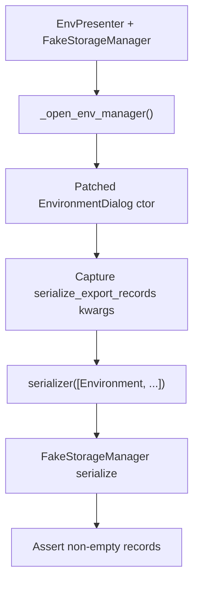

# PYPOST-1008: Architecture — EnvPresenter export wiring test

## Research

### Source debt framing

[PYPOST-988](https://pypost.atlassian.net/browse/PYPOST-988) follow-up 1
([PYPOST-1008](https://pypost.atlassian.net/browse/PYPOST-1008)) asks for an
`EnvPresenter`-level lock that `_open_env_manager` passes a **working**
`serialize_export_records` callable into `EnvironmentDialog`, bound to the
presenter’s storage via `self._storage.serialize_environment_records`.

Pure `environment_export` helpers and
`EnvironmentListWidget.export_environments` are already covered. The single
seam that connects core export to a concrete `StorageInterface` for the
Environments manager is the presenter wiring. This ticket is the export-side
counterpart of [PYPOST-1000](https://pypost.atlassian.net/browse/PYPOST-1000)
(import-reader wiring on the same constructor seam).

### Current coverage (evaluated)

- **Core export** — `tests/test_environment_export.py` (payload / file
  helpers). Gap: no presenter.
- **Widget export** — `tests/test_environment_export_ui.py`. Gap: injects
  its own callable; skips presenter.
- **Presenter import wiring** —
  `test_open_env_manager_passes_working_read_import_file`. Sibling pattern:
  **invokes** the captured callable against a `FakeStorageManager` subclass.
- **Presenter export wiring** —
  `test_open_env_manager_passes_storage_serializer_directly`. Identity of
  bound method only; local `FakeStorage`; **does not invoke**.

`test_open_env_manager_passes_storage_serializer_directly` proves the dialog
constructor received `p._storage.serialize_environment_records` by comparing
`__self__` / `__func__`. That is a useful identity lock, but it is **weaker
than DoD**:

- It never calls the captured callable, so a no-op
  `serialize_environment_records` on the local `FakeStorage` would still pass.
- It uses the file-local `FakeStorage`, not `tests.helpers.FakeStorageManager`
  named in the PYPOST-988 follow-up and in Step 1 DoD.
- It does not prove records actually reach the dialog’s injected serializer.

**Decision:** keep the identity test (existing coverage). Step 3 **must add**
a sibling invoke test using `FakeStorageManager` so the ticket’s stated gap
is closed. Do not treat identity-only coverage as already-done.

### Production shape (unchanged intent)

`EnvPresenter._open_env_manager` constructs:

```text
EnvironmentDialog(
    ...,
    read_import_file=lambda path: load_import_candidates(path, self._storage),
    serialize_export_records=self._storage.serialize_environment_records,
)
```

`EnvironmentDialog` forwards `serialize_export_records` to
`EnvironmentListWidget`. Widget Export then calls that callable with the
chosen environments.

Unlike import deserialize, shared
`FakeStorageManager.serialize_environment_records` already returns
`[env.model_dump(mode="json") for env in environments]`. The new test can
use `FakeStorageManager` **directly** (no subclass required) and still
exercise the named shared fake. A thin subclass remains allowed if Step 3
needs a spy; prefer the shared implementation unless a stub blocks the
assertion.

### Industry notes (wiring / DI tests)

Constructor injection is the preferred seam (PTD, "Injecting Fakes vs
Mocks in Constructors"). When a collaborator is constructed inside a
method, patch the name **where it is used** and assert constructor kwargs
([SO 57859599](https://stackoverflow.com/q/57859599);
[path-to-mock](https://narcismiclaus.com/programming/python/20-mocks-parametrize-conftest/);
[unittest.mock.patch](https://docs.python.org/3.11/library/unittest.mock.html)).

A fake’s coherent state beats a `Mock` when the test must prove resulting
records, not only that a method was referenced. Identity (`is` / `__func__`)
is interaction-style; DoD requires **state**: invoking the captured callable
returns export records. PYPOST-1000 already follows invoke-the-callable;
export coverage should match that strength.

### Language / test rules

- Python per `.cursor/lsr/do-python.md`.
- New/edited tests must declare `pytestmark = pytest.mark.timeout(...)` (or
  equivalent) per `.cursor/lsr/do-testing.md` —
  `tests/test_env_presenter.py` already has module-level `timeout(60)`.
- Prefer `make test` / targeted `PYTEST_ARGS`.
- Hermetic: no network, no real modal `exec()`, no live key service.

## Implementation Plan

**Primary deliverable: test-only.** No production API or behavior change
unless Step 3’s assertions fail against current code.

1. Add `test_open_env_manager_passes_working_serialize_export_records` to
   `tests/test_env_presenter.py`, next to the identity export test and the
   PYPOST-1000 import invoke test. Keep
   `test_open_env_manager_passes_storage_serializer_directly` unchanged.
2. Build `EnvPresenter` with `FakeStorageManager()` from `tests.helpers`
   (same construction style as the import wiring test: storage, config, MCP,
   settings, collections getter, metrics mock). Do not use `_make_presenter`
   (that injects local `FakeStorage`).
3. `@patch("pypost.ui.presenters.env_presenter.EnvironmentDialog")`; set
   `return_value.environments = []`; call `_open_env_manager()`.
4. Capture `serialize_export_records` from `mock_dialog.call_args.kwargs`.
   Assert it is not `None`.
5. Invoke the captured callable with one or more plaintext `Environment`
   instances (no hidden keys; encryption is PYPOST-1009). Assert a
   non-empty list of records and that a known name / variable appears in a
   record.
6. Run targeted pytest, then confirm the EnvPresenter suite still green.
7. Step 8: brief note in `doc/dev/environments_dialog.md` Tests that
   presenter wiring for `serialize_export_records` is locked by invoke, not
   identity only.

### Mandatory — Failing Repro (next Step 3)

**What it asserts.** After `_open_env_manager`, `EnvironmentDialog` received
a `serialize_export_records` that, given one or more plaintext environments
and `FakeStorageManager`-backed serialize, returns one or more export
records (name/variable present).

**Where.** `tests/test_env_presenter.py::TestEnvPresenter`
`test_open_env_manager_passes_working_serialize_export_records`

**How to force without live deps.** Patch `EnvironmentDialog`; use
`FakeStorageManager` from `tests.helpers`; pass a plaintext `Environment`
list. No UI `exec()`, network, or encryption.

**Initial red vs green.** Verification debt: against current production, the
test is **expected to pass (green)** once written. Step 3 still adds the
locking test as the missing repro of the coverage gap. If it fails, that is
a real defect → Step 4 fixes production. Do **not** mark Step 3 N/A.

**Sequencing.** Research → Step 3 write/run test → Step 4 only if red (or
green confirmation) → cleanup / observability / review / docs.

**Already-done?** **No.** Identity test does not meet DoD (no invoke, not
`FakeStorageManager`).



## Architecture

No new modules, interfaces, or on-disk format changes. The test observes the
existing DI seam.


- **`EnvPresenter._open_env_manager`** — supplies `serialize_export_records`
  bound to storage (unchanged).
- **`EnvironmentDialog`** — forwards callable to list widget (unchanged;
  patched in test).
- **`FakeStorageManager`** — shared fake; existing
  `serialize_environment_records` is sufficient.
- **Identity test (existing)** — bound-method identity; keep; not
  sufficient alone.
- **New invoke test** — patches dialog, invokes callable, asserts records.

**Patterns:** dependency inversion (callable injection, already in product);
patch-where-used for construction; fake storage for hermetic serialize;
state assertion on returned records (not only identity).

**Interfaces (existing, unchanged):**

- `serialize_export_records: Callable[[list[Environment]], list[dict]] | None`
  on `EnvironmentDialog` / `EnvironmentListWidget`.
- `StorageInterface.serialize_environment_records(environments, *,
  target_envelope_version=None) -> list[dict]`.

## Q&A

**Q:** Is the identity test enough to close PYPOST-1008?

**A:** No. DoD requires invoking the callable against `FakeStorageManager`
and proving records. Identity is complementary, not a substitute.

**Q:** Why not only extend the identity test?

**A:** `_make_presenter` uses local `FakeStorage`. A dedicated invoke test
matches PYPOST-1000 and uses the named shared fake without mixing concerns.

**Q:** Why not subclass FakeStorageManager?

**A:** Shared serialize already returns `model_dump` records. Direct use
locks the named fake. Subclass only if a spy is needed.

**Q:** Why patch EnvironmentDialog?

**A:** Same pattern as identity export and PYPOST-1000 import; avoids modal
`exec()`.

**Q:** Production change expected?

**A:** No, unless assertions fail.

**Q:** Encrypted records?

**A:** Out of scope (PYPOST-1009). Plaintext environments only.
