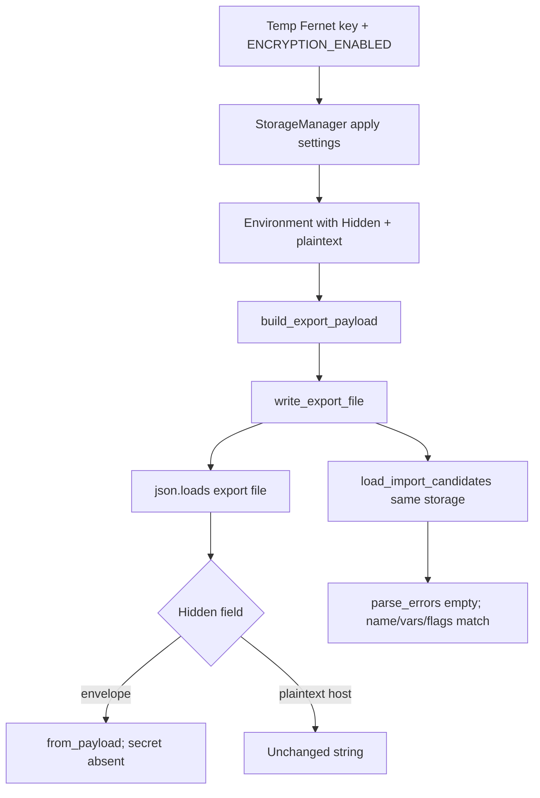
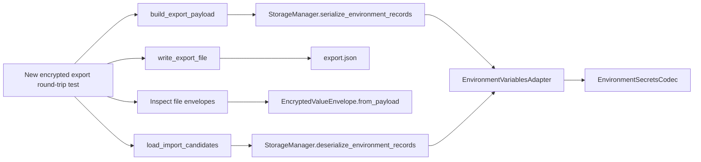

# PYPOST-1009: Architecture — encrypted-at-rest export round-trip test

## Research

### Source debt framing

[PYPOST-988](https://pypost.atlassian.net/browse/PYPOST-988) follow-up 2
([PYPOST-1009](https://pypost.atlassian.net/browse/PYPOST-1009)) asks CI to lock
the user-facing promise already written in `doc/user/environments.md`: with
encryption at rest **on**, Export writes Hidden values as encrypted envelopes
(the same shape as local `environments.json`), and Import on **this**
installation restores them. Today the only export → import file round-trip
(`tests/test_environment_export.py::test_write_export_file_round_trips_through_import`)
explicitly **disables** encryption via `_make_storage`.

That gap is verification debt unless new assertions reveal a defect. Sibling
tickets stay out of scope: presenter wiring
([PYPOST-1008](https://pypost.atlassian.net/browse/PYPOST-1008)), JSON-root
helper ([PYPOST-1010](https://pypost.atlassian.net/browse/PYPOST-1010)), and
UI click of **Export…**.

### Current coverage (evaluated)

- **Export file round-trip** —
  `test_write_export_file_round_trips_through_import`. Gap: encryption off;
  no envelope inspect.
- **Adapter encrypt** —
  `test_serialize_encrypts_only_hidden_keys_when_enabled`. Gap: in-memory
  payload; not an export file.
- **Storage persist** —
  `test_save_environments_encrypts_only_hidden_keys_when_enabled`. Gap:
  writes `environments.json`, not Export.
- **Import decrypt failure** —
  `test_load_import_candidates_reports_partial_decrypt_failure`. Gap:
  **different** key; not the export write path.
- **Overwrite × reuse** —
  `test_overwrite_import_reuses_unchanged_and_reencrypts_changed_hidden`.
  Gap: import plan + save, not Export.
- **Presenter export** — PYPOST-1008 invoke test. Gap: plaintext fakes; no
  encryption.

Nothing composes **export serialize → real file → envelope inspect → same-key
import**. In-memory adapter checks and `environments.json` persist do not
satisfy DoD.

### Production serialize / write / import APIs (reuse as-is)

Export already shares native on-disk JSON with storage. No new production API.

```text
build_export_payload(envs, storage)
  -> storage.serialize_environment_records(envs)
     -> EnvironmentVariablesAdapter.serialize_environment
        (encrypts Hidden when enabled; plaintext otherwise)
  -> json_root_for_records(records)   # one env → dict; many → list

write_export_file(path, payload)
  -> write_json_export_file (UTF-8 JSON, trailing newline)

load_import_candidates(path, storage)
  -> JSON object or list
  -> storage.deserialize_environment_records
     -> adapter.deserialize_environment (decrypts envelopes)
```

`StorageManager.apply_encryption_settings(settings)` rebuilds the codec and
key provider. `EncryptedValueEnvelope.from_payload` is the canonical v1/v2
envelope validator (`enc`, `v`, `alg`, `kid`, `ct`; encrypt still emits v1
fernet).

`FakeStorageManager.serialize_environment_records` returns
`model_dump(mode="json")` and **does not encrypt**. It is the wrong double
for this ticket.

### Encryption-on test fixture pattern (existing)

Hermetic enablement already used in
`test_overwrite_import_reuses_unchanged_and_reencrypts_changed_hidden` and
adapter/storage tests:

1. `pytest.importorskip("cryptography.fernet")`
2. `Fernet.generate_key().decode("utf-8")` into
   `PYPOST_ENV_ENCRYPTION_KEY`
3. `monkeypatch.setenv("PYPOST_ENV_ENCRYPTION_ENABLED", "true")`
4. `StorageManager(data_dir=tmp_path / "pypost-data")`
5. `storage.apply_encryption_settings(AppSettings(env_encryption_enabled=True))`

No keyring, secret-store spec, or network. `_make_storage` in the export
module currently **deletes** those env vars; the new test must not use it as
written.

On-disk envelope assertions in
`test_save_environments_encrypts_only_hidden_keys_when_enabled` already check
`enc is True`, `v == 1`, `alg == "fernet"`, string `kid`/`ct`, and
non-Hidden plaintext. The export test should match that strength on the
**export file**, plus `EncryptedValueEnvelope.from_payload` so a dict with
only `enc: true` cannot pass.

### Industry notes (file-at-rest round-trip)

Encryption-at-rest tests lock three properties together, not decrypt alone:

- **Isolation:** pytest `monkeypatch.setenv` / `delenv` so ambient machine
  keys cannot leak in ([pytest monkeypatch][pytest-monkeypatch];
  [config/secrets testing][secrets-hub]).
- **Temp files:** `tmp_path` for the export destination
  ([pytest tmp_path][pytest-tmp-path]).
- **Ciphertext ≠ plaintext:** inspect the stored blob and assert the secret
  string is absent; Fernet envelope metadata (`v`, `kid`, ciphertext field)
  is the usual shape ([OpenAI EncryptedSession][encrypted-session];
  [toup-agent vault][toup-vault]).

PyPost’s Hidden-only policy is narrower than whole-file encryption: the
export JSON stays readable; only Hidden values become envelopes.

### Language / test rules

- Python per `.cursor/lsr/do-python.md`.
- New tests keep `pytestmark = pytest.mark.timeout(60)` already on
  `tests/test_environment_export.py` (`.cursor/lsr/do-testing.md`).
- Hermetic: no network, no modal dialogs, no live key services.
- Prefer `make test` / targeted `PYTEST_ARGS` after Step 3.

### Seam decision

**Extend `tests/test_environment_export.py`.** It already owns
`build_export_payload` + `write_export_file` + `load_import_candidates` and
the encryption-off sibling. A second file would split the same seam.
Keep `test_write_export_file_round_trips_through_import` unchanged.

## Implementation Plan

**Primary deliverable: test-only.** No production API or behavior change
unless Step 3’s assertions fail against current code.

1. In `tests/test_environment_export.py`, add a sibling helper
   `_make_encrypted_storage(tmp_path, monkeypatch)` that generates a temp
   Fernet key, sets `PYPOST_ENV_ENCRYPTION_ENABLED` and
   `PYPOST_ENV_ENCRYPTION_KEY`, constructs `StorageManager` on `tmp_path`,
   and calls
   `apply_encryption_settings(AppSettings(env_encryption_enabled=True))`.
   Leave `_make_storage` (encryption off) for existing tests.
2. Add
   `test_write_encrypted_export_file_round_trips_through_import`.
   One environment: non-Hidden host plus Hidden token with a distinctive
   secret string. Single-object JSON root (already covered for list shape
   without encryption).
3. `payload = build_export_payload([env], storage)` then
   `write_export_file(export_path, payload)`.
4. **Inspect the written file** (`json.loads(export_path.read_text())`), not
   only the in-memory payload:
   - Hidden field is an envelope: `EncryptedValueEnvelope.from_payload`
     succeeds; `enc is True`; secret plaintext is not in that field (and
     not as that JSON string).
   - Non-Hidden field remains the original plaintext string.
5. **Same installation re-import:** call
   `load_import_candidates(export_path, storage)` with encryption still on
   and the **same** key. Assert `parse_errors == []`, name, Hidden flag,
   Hidden plaintext after decrypt, and non-Hidden value.
6. Do not call UI, `FakeStorageManager`, `save_environments`, or a second
   key. Do not weaken the encryption-off round-trip.
7. Targeted pytest, then `make test`.
8. Step 8: one row in `doc/dev/environment_encryption_at_rest.md` Tests
   (and a short note in `doc/dev/environments_dialog.md` if the export
   test list is updated there).

### Mandatory — Failing Repro (next Step 3)

**What it asserts.** With encryption enabled and a temp local key, Export
writes a real file whose Hidden values are envelopes (not the secret
strings) while non-Hidden values stay plaintext; re-import of that file
on the same `StorageManager` / key succeeds and restores name, variables
(including Hidden plaintext), and Hidden flags.

**Where.** `tests/test_environment_export.py` —
`test_write_encrypted_export_file_round_trips_through_import`

**How to force without live deps.** Temp Fernet key +
`PYPOST_ENV_ENCRYPTION_ENABLED`; `tmp_path` export file; real
`StorageManager`; `build_export_payload` → `write_export_file` → read JSON
→ `load_import_candidates`. No Qt, network, or keyring.

**Initial red vs green.** Verification debt: against current production the
test is **expected to pass (green)** once written. Step 3 still adds the
locking test. If it fails, that is a real defect → Step 4 fixes production.
Do **not** mark Step 3 N/A.

**Sequencing.** Research → Step 3 write/run test → Step 4 only if red (or
green confirmation) → cleanup / observability / review / docs.

**Already-done?** **No.** The existing round-trip leaves encryption off.



## Architecture

No new modules, interfaces, or on-disk format changes. The test composes
existing export, storage, codec, and import seams.



| Module | Responsibility in this task |
| --- | --- |
| `pypost.core.environment_export.build_export_payload` | Serialize via storage; JSON root |
| `pypost.core.environment_export.write_export_file` | Real UTF-8 JSON file |
| `pypost.core.storage.StorageManager` | Encrypt/decrypt policy + records |
| `pypost.core.environment_variables_adapter` | Hidden-only encrypt on serialize |
| `pypost.core.environment_secrets_codec.EncryptedValueEnvelope` | Envelope shape contract |
| `pypost.core.environment_import.load_import_candidates` | Same-machine import path |
| Existing encryption-off test | Unchanged plaintext round-trip lock |
| New test | Orchestrates enable → write → inspect → import |

**Patterns:** reuse over invention (no export-only crypto); pure core /
impure shell (export helpers stay Qt-free); test-as-contract for a
cross-module path unit tests of adapter or storage miss; hermetic local
key via process env (same as PYPOST-999).

**Interfaces used (existing, unchanged):**

```text
build_export_payload(environments, storage) -> list[dict] | dict
write_export_file(path, payload) -> None
load_import_candidates(path, storage) -> (list[Environment], list[str])
StorageManager.apply_encryption_settings(settings) -> None
StorageManager.serialize_environment_records(environments) -> list[dict]
StorageManager.deserialize_environment_records(records)
  -> (list[Environment], tuple[EnvironmentLoadFailure, ...])
EncryptedValueEnvelope.from_payload(payload) -> EnvelopePayload
```

## Q&A

**Q:** Why extend `tests/test_environment_export.py` instead of a new module?

**A:** That file already locks the realistic export-file → import path. The
new case is the encryption-on sibling of
`test_write_export_file_round_trips_through_import`. PYPOST-999 co-located
its encrypted import round-trip the same way.

**Q:** Why not `FakeStorageManager`?

**A:** Shared fake dumps plaintext `model_dump` and never encrypts. DoD
requires real envelopes on disk.

**Q:** Why not assert only on `build_export_payload`’s in-memory dict?

**A:** DoD requires write file → inspect file → import from that file.
In-memory-only checks miss writer bugs.

**Q:** Why not `save_environments` / `environments.json`?

**A:** That is local persist, already covered. This ticket is Export’s
chosen file.

**Q:** Why `EncryptedValueEnvelope.from_payload` plus “secret absent”?

**A:** `enc is True` alone is a weak marker. `from_payload` is the product
schema; absence of plaintext is the security lock. Non-Hidden plaintext
must remain readable.

**Q:** Must the test call `apply_encryption_settings` if env vars are set?

**A:** Yes. It matches the documented enablement path, rebuilds the codec
after the temp key is in the environment, and mirrors PYPOST-999.

**Q:** Is a different-key import in scope?

**A:** No. That failure is already covered by
`test_load_import_candidates_reports_partial_decrypt_failure`.

**Q:** Is Step 3 N/A because no product change is intended?

**A:** No. A new automated lock is required. “No intended production
change” is not “no failing-repro artifact.”

**Q:** Production change expected?

**A:** No, unless the new assertions fail.

[pytest-monkeypatch]: https://docs.pytest.org/en/stable/howto/monkeypatch.html
[pytest-tmp-path]: https://docs.pytest.org/en/stable/howto/tmp_path.html
[secrets-hub]: https://python-config-secrets-hub.com/
[encrypted-session]: https://github.com/openai/openai-agents-python
[toup-vault]: https://github.com/toup-com/toup-agent
