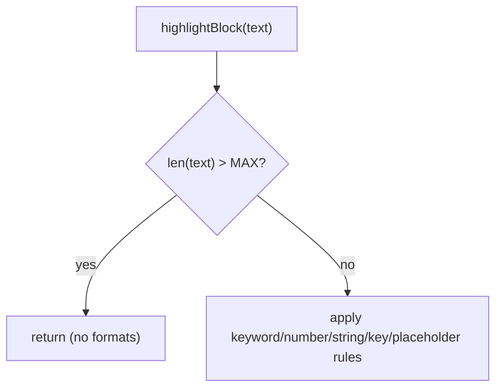

# PYPOST-101: Architecture — large-block highlighting guard

## Problem

`QSyntaxHighlighter.highlightBlock` receives one `QTextBlock` at a time. Pretty-printed JSON
splits across many short lines (cheap). Minified JSON can be a single block of megabytes;
string and key regexes scan the entire block synchronously on the UI thread.

## Approach

Add a module-level constant `MAX_HIGHLIGHT_BLOCK_CHARS` (32_768). When `len(text)` exceeds
the limit, `highlightBlock` returns immediately without applying rules. Plain text remains
readable; only coloring is omitted for that block.

| Choice | Rationale |
| ------ | --------- |
| Skip all rules | Simplest; avoids partial coloring on huge lines |
| 32 KiB threshold | Covers typical API lines; blocks multi-MB minified payloads |
| No settings knob | Debt task; threshold is documented for future tuning |

## Flow



## Verification

```bash
QT_QPA_PLATFORM=offscreen .venv/bin/python -m pytest tests/test_json_highlighter.py -q
```
