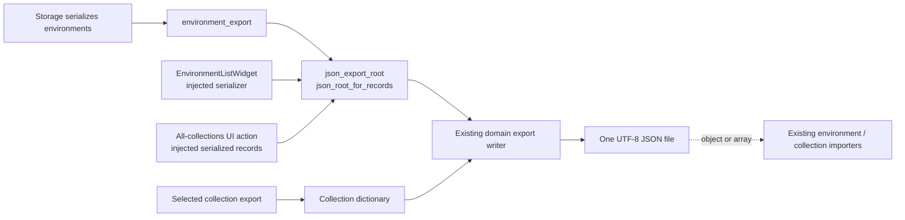

# PYPOST-1010: Consistent JSON root shape for exported records

## Research

### Existing application seams

- `pypost.core.environment_export.build_export_payload` already chooses a dictionary for
  exactly one serialized environment and a list otherwise. The Qt-facing
  `EnvironmentListWidget.export_environments` repeats that same conditional after using
  its injected record serializer.
- `pypost.core.collection_export.build_export_payload` produces one collection dictionary,
  and `build_all_export_payload` returns serialized records as a list. However,
  `CollectionExportActions.export_all_collections` does not call that bulk builder: it
  directly serializes each collection with its injected `serialize_collection` callable,
  writes the resulting list, and therefore bypasses any policy added only to the core bulk
  builder. This is the collection export seam that must own the final root conversion.
- Both `environment_import.load_import_candidates` and
  `collection_import.load_collection_import_candidates` already accept either one JSON
  object or a list of objects and normalize a single object to a one-item record list.
  No import change is required.
- The Python standard-library JSON encoder maps a `dict` to a JSON object and a `list` to
  a JSON array. A valid export must therefore select its root before the existing file
  writer encodes one document. The [Python JSON documentation][python-json] documents
  those mappings and that repeated writes of separate JSON documents to one file are invalid.

### Design constraints

- Root shape is a user-visible contract: one record means a JSON object; zero or more than
  one records mean a JSON array. `[]` remains the valid representation of an empty bulk
  export.
- The helper must be domain-neutral. It must not serialize models, access Qt or storage,
  write files, alter records, or decide export scope.
- Existing import acceptance, record content, save dialogs, errors, logging, and encryption
  behaviour remain unchanged.
- The current worktree has unrelated PYPOST-1011 changes. This task must not alter or depend
  on those changes.

## Implementation Plan

1. Add a small Qt-free `pypost.core.json_export_root` module that exposes
   `json_root_for_records(records: list[dict]) -> dict | list[dict]`. It returns
   `records[0]` only for a one-record list and otherwise returns the list unchanged.
   The helper owns the root-shape decision, with no I/O or model knowledge.
2. Replace the two existing environment conditionals with this helper:
   `environment_export.build_export_payload` after storage serialization and
   `EnvironmentListWidget.export_environments` after its injected serializer. This keeps
   the testable core path and the dependency-injected UI path consistent.
3. Apply the shared helper directly in
   `CollectionExportActions.export_all_collections`, after the action has created its list
   with the injected serializer and immediately before it calls `write_export_file`. This
   keeps serializer injection intact and makes the UI action write an object for exactly one
   collection and arrays for zero or many. The standalone core bulk builder keeps returning
   its ordered record list because this action does not consume it.
4. Add focused unit and workflow regression tests. Do not change either importer because
   both existing parsers accept the resulting object and list roots.

**Mandatory — Failing Repro (next Step 3):** Add
`test_all_export_one_collection_writes_object_root` to
`tests/test_collection_export_ui.py`, which already has the module-level
`pytest.mark.timeout(60)`. Use `_make_presenter` with one collection and its injected
serializer, patch the existing all-collections save dialog (`_ALL_SAVE`) to return a
`tmp_path` destination, invoke `presenter.export_all_collections()`, parse the real written
file with `json.loads`, and assert the decoded root is a `dict` containing the original
collection name. Before the production change, that UI action writes its one-element
serialized list directly, so the test fails for the intended action-level root-shape defect
without live external dependencies. Step 4 then adds the shared helper and changes the action
until this red test is green; it will also add direct helper coverage for one, many, and zero
records and regression coverage for the injected environment-widget path.

## Architecture



### Modules and responsibilities

- `pypost.core.json_export_root` selects a dictionary root for one record and a list root
  otherwise. It depends only on Python built-ins.
- `pypost.core.environment_export` serializes environment models, calls the root helper,
  and preserves its domain error boundary. It depends on the storage interface,
  environment model, and root helper.
- `pypost.ui.widgets.environments.environment_list_widget` coordinates the environment UI
  and applies the root helper to injected serializer output. It depends on Qt, the
  environment export API, and the root helper.
- `pypost.core.collection_export` serializes individual collection records and retains its
  ordered bulk-record builder. It depends on the collection model.
- `pypost.ui.presenters.collection_export_actions` coordinates selected and all-collection
  export actions. `export_all_collections` applies the root helper to its injected serializer
  output before writing, so it has no duplicate conditional. It depends on Qt, the collection
  export API, and the root helper.
- Existing import modules normalize an object or list root to records and validate domain
  data. They depend on standard JSON and domain models.

### Interaction and data contracts

1. An export workflow produces ordered JSON-ready `list[dict]` records through its existing
   serializer. In particular, `CollectionExportActions.export_all_collections` builds that
   list using the injected `serialize_collection` callable.
2. It calls the shared interface exactly once:

   ```python
   def json_root_for_records(records: list[dict]) -> dict | list[dict]: ...
   ```

3. The interface returns `records[0]` when `len(records) == 1`; otherwise it returns the
   list, including an empty list.
4. Existing domain writers encode that one returned value as indented UTF-8 JSON and retain
   their existing domain-specific error translation.
5. Existing importers accept the written object or array root, normalize it to records, and
   retain their current validation and conflict handling.

### Patterns and rationale

- **Functional policy helper:** one pure transformation owns the cross-cutting root policy.
  It is easy to test exhaustively and cannot introduce UI, storage, or write side effects.
- **Dependency inversion retained:** the environment widget continues to receive a serializer
  from the presenter; it shares only the generic root policy rather than importing storage
  or duplicating the decision.
- **Layered export design:** model serialization remains in domain exporters, orchestration
  remains in UI actions/widgets, and file encoding remains in existing writers. The all-
  collections action is the actual injected-serializer seam, so it passes its finished record
  list through the new helper immediately before the writer. The helper is deliberately the
  narrow link between those layers.
- **Backward-compatible import boundary:** preserve the importers' tolerant object-or-array
  readers. The change makes exported output more predictable without rejecting previously
  supported files.

### Test matrix after the Step 3 repro

- **Core helper:** one record returns its object; multiple records and no records return
  arrays without modifying entries.
- **Collection export UI:** `CollectionExportActions.export_all_collections` with its
  injected serializer writes an object for one collection; multiple and empty exports retain
  list roots and import compatibility. The test patches the save dialog and validates the
  actual JSON file root.
- **Environment export:** core and injected-widget serialization use the helper and retain
  object/list roots for one/many records.
- **Regression:** selected collection export remains object-shaped; both importers accept
  the emitted root forms and preserve record content.

## Q&A

**Q: Why use a helper instead of having each exporter check its own record count?**

**A:** The same user-visible decision already existed in two environment locations and now
applies to bulk collection export. One pure implementation prevents those callers drifting.

**Q: Should an empty export be a JSON object?**

**A:** No. It contains no single record to expose, so `[]` is the established valid bulk
representation and preserves current empty-library behaviour.

**Q: Should importers require this shape or be changed to use the helper?**

**A:** No. They consume files rather than produce them and intentionally accept both roots
for compatibility. The helper belongs only to outbound export construction.

**Q: Does this alter fields, encryption, conflict handling, or file writing?**

**A:** No. It only selects the top-level container after existing serialization and before
the existing writer. All domain record content and downstream behaviour stay unchanged.

[python-json]: https://docs.python.org/3/library/json.html
