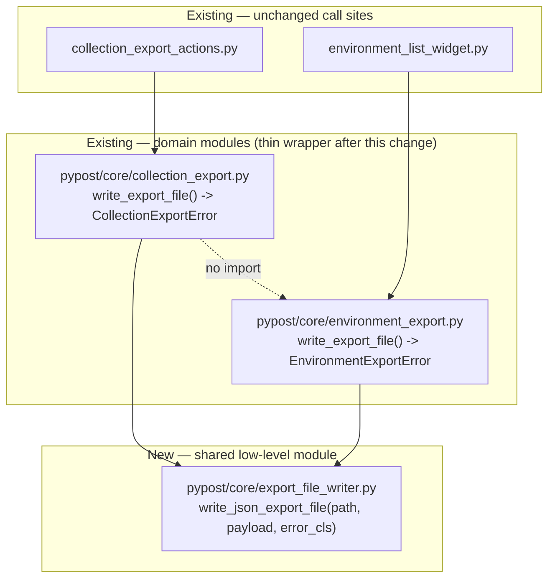

# PYPOST-1011: Extract shared JSON export write helper

## Research

- **Current duplication** — `write_export_file()` is implemented twice, with identical
  intent but drifted error handling:
  - `pypost/core/collection_export.py:95` — catches `(OSError, TypeError, ValueError)`,
    raises `CollectionExportError`, logs `collection_export_file_written path=%s`.
  - `pypost/core/environment_export.py:106` — catches only `OSError`, raises
    `EnvironmentExportError`, logs `environment_export_file_written path=%s`.
  - Both otherwise do the exact same three steps: `path.parent.mkdir(parents=True,
    exist_ok=True)` → `json.dumps(payload, indent=2)` → `path.write_text(text + "\n",
    encoding="utf-8")`.
- **Call sites** (unchanged by this task, verified as part of scoping):
  - `pypost/ui/presenters/collection_export_actions.py:88-94` and `:124-130` call
    `write_export_file(path, payload)` from `pypost.core.collection_export` and catch
    `CollectionExportError` (the second call site also catches `TypeError`/`ValueError`
    around the *serialize* step, which is separate from the write step and out of scope).
  - `pypost/ui/widgets/environments/environment_list_widget.py:391-398` calls
    `write_export_file(path, payload)` from `pypost.core.environment_export` and catches
    `EnvironmentExportError`.
  - Neither call site imports across the collection/environment boundary; both consume
    the write helper from their own domain module.
- **Existing tests** locking in current behavior/signatures:
  - `tests/test_collection_export.py::test_write_export_file_raises_on_write_failure` —
    asserts `pytest.raises(CollectionExportError, match="Could not write file")` for an
    `OSError` from `Path.write_text`.
  - `tests/test_environment_export.py::test_write_export_file_raises_on_write_failure` —
    same shape, asserts `EnvironmentExportError`. No existing test drives the
    `TypeError`/`ValueError` (non-serializable payload) path for environment export — this
    is the coverage gap Step 3's failing repro closes.
  - Both modules also have round-trip tests (`test_write_export_file_round_trips_through_import`
    for environments; `test_exported_json_is_single_object_shape` and friends for
    collections) that pin the on-disk format (indented JSON, trailing newline, UTF-8).
- **Origin of the duplication** — `ai-tasks/PYPOST-989/60-tech-debt.md` recorded it as
  intentional at the time ("duplicates the small JSON write helper from
  `environment_export.py` — intentional to avoid collection → environment module
  dependency") with an explicit follow-up to extract a shared helper, tracked as this
  Jira ticket. The constraint that motivated the duplication (no cross-domain import) is
  still a hard requirement per `10-requirements.md` Q&A — it's satisfied here by a new,
  independent module that both sides depend on, rather than either depending on the other.
- **Existing precedent in the codebase for this exact shape** — `pypost/core/` already
  hosts several Qt-free, no-cross-dependency modules (`collection_import.py`,
  `environment_import.py`, `yaml_json_converter.py`, `bind_address_validation.py`, etc.)
  used by multiple domains without those domains importing each other. A new
  `pypost/core/export_file_writer.py` fits this established pattern directly — no new
  layering convention is being introduced.
- **Language guide** (`.cursor/lsr/do-python.md`) — no constraint beyond standard
  practice (type hints, docstrings, exceptions for error handling, tests under `tests/`
  with `pytest.mark.timeout`); nothing here conflicts with the design below.

## Implementation Plan

1. Add `pypost/core/export_file_writer.py`: a new, Qt-free, dependency-free (no imports
   from `collection_export`/`environment_export`) leaf module containing the single real
   implementation of "write a JSON export payload to a path."
2. Change `pypost/core/collection_export.py:write_export_file` and
   `pypost/core/environment_export.py:write_export_file` from full implementations into
   thin wrappers that call the shared function and then emit their existing
   domain-specific success log line. Their public signature, return type (`None`), and
   raised exception type (`CollectionExportError` / `EnvironmentExportError`
   respectively) do not change.
3. No changes to either call site (`collection_export_actions.py`,
   `environment_list_widget.py`) or to any existing test's exception-type assertions —
   both keep working unmodified because the public contract of each domain's
   `write_export_file` is preserved byte-for-byte.
4. Add direct unit tests for the new shared module (`tests/test_export_file_writer.py`)
   covering: successful write (format/parent-dir-creation), `OSError` wrapped into the
   caller-supplied error class, and `TypeError`/`ValueError` (non-serializable payload)
   wrapped into the caller-supplied error class.
5. Add the one behavior-closing test called out in Definition of Done: environment
   export must now raise `EnvironmentExportError` (not an unhandled `TypeError`) for a
   non-JSON-serializable payload — see failing repro below.

**Mandatory — Failing Repro (next Step 3):** Add
`test_write_export_file_raises_on_non_serializable_payload` to
`tests/test_environment_export.py` (mirroring the existing
`test_write_export_file_raises_on_write_failure` in that file, same
`pytestmark = pytest.mark.timeout(60)` module marker). It calls
`write_export_file(tmp_path / "export.json", {"name": "Dev", "variables": {"bad": object()}})`
— a payload `json.dumps` cannot serialize — inside `pytest.raises(EnvironmentExportError,
match="Could not write file")`. No mocking of the filesystem is needed: `object()` is not
JSON-serializable, so `json.dumps` raises `TypeError` deterministically with no live
external dependency involved. Against the current, unconsolidated
`environment_export.write_export_file` (which only catches `OSError`), this test fails
with an unhandled `TypeError` escaping the `pytest.raises(EnvironmentExportError, ...)`
block — that is the red state. It goes green only once `environment_export.write_export_file`
routes through the shared helper (or is otherwise widened to catch `TypeError`/`ValueError`),
which is exactly the Step 4 production change. Sequencing: this repro (and the
`test_export_file_writer.py` unit tests for the new module) are written and confirmed
failing/absent-target *before* `pypost/core/export_file_writer.py` and the two
`write_export_file` wrappers are implemented in Step 4.

## Architecture

### Module diagram



- Dependency direction is strictly downward: `collection_export.py` and
  `environment_export.py` both depend on the new `export_file_writer.py`; neither
  depends on the other. The dotted "no import" edge is the constraint this design
  preserves — verified by `grep` after implementation finding zero references to
  `environment_export` in `collection_export.py` or vice versa.
- `export_file_writer.py` has no knowledge of collections or environments — it accepts
  a plain `payload: object` and a caller-supplied exception class, so it cannot itself
  create a coupling in either direction; it is a pure, generic "write this JSON to that
  path" utility, consistent with the other Qt-free single-purpose modules already in
  `pypost/core/`.

### Module responsibilities

| Module | Responsibility | Changed? |
|---|---|---|
| `pypost/core/export_file_writer.py` (new) | Own the single real implementation: create parent dirs, serialize to indented UTF-8 JSON with a trailing newline, write to disk; translate `OSError`/`TypeError`/`ValueError` into a caller-chosen exception type. No logging, no domain knowledge. | New file |
| `pypost/core/collection_export.py` | Collection payload shaping (`build_export_payload`, etc.) plus a thin `write_export_file` wrapper that delegates to the shared writer with `error_cls=CollectionExportError` and keeps its existing `collection_export_file_written` success log. | Shrinks; public API unchanged |
| `pypost/core/environment_export.py` | Environment payload shaping plus a thin `write_export_file` wrapper delegating to the shared writer with `error_cls=EnvironmentExportError` and keeping its existing `environment_export_file_written` success log. | Shrinks; public API unchanged |
| `pypost/ui/presenters/collection_export_actions.py` | Orchestration (dialog → write → result). | Untouched |
| `pypost/ui/widgets/environments/environment_list_widget.py` | Orchestration (dialog → write → result). | Untouched |

### Selected pattern: parametrized shared implementation, not a shared exception type

Two designs were considered for how the shared module reports failure:

1. **Chosen — inject the exception class.** The shared function's signature is
   `write_json_export_file(path: Path, payload: object, *, error_cls: type[Exception]) ->
   None`. It performs the write and, on `(OSError, TypeError, ValueError)`, raises
   `error_cls(f"Could not write file: {exc}") from exc`. Each domain's `write_export_file`
   becomes a one-line delegation passing its own existing exception class:
   ```python
   def write_export_file(path: Path, payload: dict | list[dict]) -> None:
       """Write the export payload to ``path`` as indented UTF-8 JSON."""
       write_json_export_file(path, payload, error_cls=CollectionExportError)
       logger.info("collection_export_file_written path=%s", path)
   ```
   ```python
   def write_export_file(path: Path, payload: list[dict] | dict) -> None:
       """Write the export payload to ``path`` as indented UTF-8 JSON."""
       write_json_export_file(path, payload, error_cls=EnvironmentExportError)
       logger.info("environment_export_file_written path=%s", path)
   ```
   `CollectionExportError` and `EnvironmentExportError` remain exactly as they are today
   (distinct classes, unchanged names, unchanged `__init__`/message shape). This means:
   - Zero changes to either call site's `except CollectionExportError` /
     `except EnvironmentExportError` clauses.
   - Zero changes to existing tests that assert on those exception types.
   - No double-wrapping: the message text raised is produced once, by the shared
     function, with the exact same `f"Could not write file: {exc}"` format both domains
     use today — so `str(exc)` shown to the user is byte-identical to current behavior.
   - The "same class of failures caught" requirement is satisfied structurally: there is
     only one `except` clause, in one place, so collection and environment export can no
     longer drift apart on which exceptions are caught.

2. **Rejected — introduce one shared exception type** (e.g. `ExportFileWriteError`) either
   as the sole raised type or as a common base class. Rejected because it would require
   either (a) changing both call sites' `except` clauses and both existing tests'
   `pytest.raises(...)` targets to the new shared type — a larger diff than necessary and
   a public API break for two independently-versioned domain error types the rest of the
   app may reference — or (b) making `CollectionExportError`/`EnvironmentExportError`
   subclass a new shared base purely for this one call site, adding an inheritance
   relationship that buys nothing here (nothing catches the base type) while touching two
   more files than the chosen design. The injected-`error_cls` approach gets full
   consolidation of the *logic* with zero disturbance to the *public exception surface*,
   which is what "preserve current failure handling/success feedback" in the Definition
   of Done calls for.

### Logging approach

- The shared `export_file_writer.py` does not log. It is a pure mechanism; logging
  which *domain* wrote a file is domain information, not write-mechanism information.
- Each domain's `write_export_file` keeps its own existing `logger.info(...)` call,
  under its own existing message and its own existing `logger = logging.getLogger(__name__)`
  (`pypost.core.collection_export` / `pypost.core.environment_export`), unchanged. Operators
  who grep for `collection_export_file_written` or `environment_export_file_written`
  see identical log output before and after this change.
- Failure logging is also unchanged: both call sites already do their own
  `logger.warning("..._export_failed reason=%s", exc)` after catching their domain
  exception — that code is untouched.

### Interfaces

```python
# pypost/core/export_file_writer.py (new)
def write_json_export_file(
    path: Path,
    payload: object,
    *,
    error_cls: type[Exception],
) -> None:
    """Write ``payload`` to ``path`` as indented UTF-8 JSON with a trailing newline.

    Creates ``path``'s parent directories as needed. Wraps any failure to
    serialize or write (``OSError``, ``TypeError``, ``ValueError``) in
    ``error_cls(f"Could not write file: {exc}")``.
    """
```

```python
# pypost/core/collection_export.py (existing name/signature, new body)
def write_export_file(path: Path, payload: dict | list[dict]) -> None: ...
    # raises CollectionExportError

# pypost/core/environment_export.py (existing name/signature, new body)
def write_export_file(path: Path, payload: list[dict] | dict) -> None: ...
    # raises EnvironmentExportError
```

No changes to `__all__` exports of either domain module beyond nothing (both already
export `write_export_file` and their own error class; that stays true).
`export_file_writer.py`'s `__all__` is `["write_json_export_file"]`.

### Impact on call sites and tests

- **Call sites** — no source changes required in
  `pypost/ui/presenters/collection_export_actions.py` or
  `pypost/ui/widgets/environments/environment_list_widget.py`. They keep importing
  `write_export_file` and their respective error class from their existing domain
  module paths.
- **Existing tests** — `tests/test_collection_export.py`,
  `tests/test_collection_export_ui.py`, `tests/test_environment_export.py` need no
  changes to keep passing; they exercise the public `write_export_file` /
  `CollectionExportError` / `EnvironmentExportError` surface, which is unchanged.
- **New tests**:
  - `tests/test_export_file_writer.py` — direct unit coverage of
    `write_json_export_file`: successful write creates missing parent dirs and produces
    indented UTF-8 JSON with a trailing newline; an `OSError` during write is wrapped in
    the passed `error_cls`; a non-serializable payload (`TypeError`/`ValueError` from
    `json.dumps`) is wrapped in the passed `error_cls`.
  - `tests/test_environment_export.py::test_write_export_file_raises_on_non_serializable_payload`
    — the Step 3 failing repro described above, closing the DoD gap for environment
    export.

## Q&A

**Q:** Where should the new shared module live?

**A:** `pypost/core/export_file_writer.py`, alongside `collection_export.py` and
`environment_export.py`. It follows the existing convention in `pypost/core/` of small,
Qt-free, single-purpose modules (e.g. `yaml_json_converter.py`,
`bind_address_validation.py`) that multiple domains use without depending on each other.

**Q:** Does making the shared function accept `error_cls` as a parameter count as
"coupling" between collection and environment export?

**A:** No — `export_file_writer.py` has zero references to either
`CollectionExportError`, `EnvironmentExportError`, `collection_export`, or
`environment_export`. It only sees `type[Exception]`, supplied by whichever caller
imports it. This is standard dependency injection, not coupling: verified by the
absence of any import between `collection_export.py` and `environment_export.py` in
either direction.

**Q:** Should `write_json_export_file` also take over the domain success-log line, e.g.
via an optional `logger`/`log_message` parameter, to save the two wrapper functions from
needing their own trailing `logger.info` line?

**A:** No — kept the shared function log-free and left each wrapper's existing
`logger.info` call in place. Passing a `logging.Logger` plus a format-string parameter
into a generic write helper for the sake of one saved line per wrapper adds an API
surface (and a way for the two domains' log lines to accidentally end up identical or
misordered relative to the try/except) for no real benefit — the two-line wrapper
(`write_json_export_file(...)` then `logger.info(...)`) is simpler to read and keeps
each domain module in full control of its own log message, matching current behavior
exactly.

**Q:** Does this change the on-disk file format, success dialog text, or error message
text shown to the user?

**A:** No. The shared function performs the exact same three operations
(`mkdir(parents=True, exist_ok=True)` → `json.dumps(payload, indent=2)` →
`write_text(text + "\n", encoding="utf-8")`) in the same order, and the raised message
format (`f"Could not write file: {exc}"`) is unchanged. Only the *set* of exceptions
caught for environment export widens from `{OSError}` to `{OSError, TypeError,
ValueError}`, per the Definition of Done.

## Worklog

tokens_used: 45000
role: execution
step: 2
step_name: Architecture
