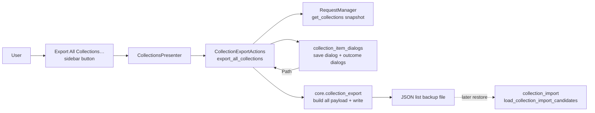

# PYPOST-1012: Export all collections to a JSON list

## Research

### Existing application seams

- `pypost.core.collection_import.load_collection_import_candidates` already accepts a
  JSON list of collection objects (and normalizes a single object to a one-item list).
  It therefore remains the restore path; this task must not change parsing, validation,
  conflict resolution, or storage application.
- `pypost.core.collection_export.build_export_payload` uses
  `Collection.model_dump(mode="json")`, preserving the persisted collection and request
  fields. `write_export_file` is the existing UTF-8, indented JSON writer and reports
  `CollectionExportError` on an `OSError`.
- `CollectionExportActions` already owns collection-export orchestration from the
  sidebar: user action -> save dialog -> pure serialization/write -> dialog and logging.
  `CollectionsPresenter` wires it into `build_collections_panel`; this is the appropriate
  boundary for an action that has no tree-selection prerequisite.
- The standard-library JSON encoder serializes a Python list as one JSON document;
  repeated writes of independent documents to one file would create invalid JSON. The
  export must consequently construct and write one `list[dict]` payload. See the
  [Python `json` documentation](https://docs.python.org/3/library/json.html).

### Constraints carried into the design

- Snapshot the current `RequestManager.get_collections()` list once, serialize its
  collections in that order, and never mutate the returned models, the tree selection, or
  storage.
- Continue using the native per-collection representation, so existing import restores
  the file. Empty input is deliberately written as `[]` and is a successful export.
- Cancellation returns before serialization or writing. Write/serialization failures show
  an error rather than a success dialog. A successful result includes destination,
  collection count, and total request count.
- Preserve the existing selected-collection and context-menu export flow unchanged.

## Implementation Plan

1. Extend `pypost.core.collection_export` with a small pure helper that maps an ordered
   `list[Collection]` to `list[dict]` by using the existing `build_export_payload` once
   per collection. Widen `write_export_file`'s payload type to `dict | list[dict]`; keep
   its JSON formatting and `CollectionExportError` boundary. Add a distinct immutable
   all-collections result/formatter containing `collection_count`, `request_count`, and
   `path`, without changing the single-collection result contract.
2. Add all-export labels, dialog caption, suggested filename (for example
   `collections.json`), and an identified **Export All Collections…** sidebar button.
   Add one dialog helper returning `Path | None`, reusing the existing JSON filter, plus
   the normal success/error result helpers.
3. Add `CollectionExportActions.export_all_collections()`. It obtains a single snapshot
   from `RequestManager`, opens the save dialog even when the snapshot is empty, writes
   the pure list payload, logs the result/failure, and shows the formatted outcome.
   `CollectionsPresenter` delegates the panel callback to this method; no index or tree
   selection is consulted.
4. Add core and Qt-facing tests, then update the collection user/developer documentation
   with backup creation and restoration through **Import Collection…**.

**Mandatory — Failing Repro (next Step 3):** Add a new, focused red test in
`tests/test_collection_export.py`, marked with the existing module-level
`pytest.mark.timeout(60)`. Construct two `Collection` fixtures with distinct requests,
call the planned pure all-collections payload builder, write it to `tmp_path`, parse the
file through the real `load_collection_import_candidates`, and assert: the decoded root
is a list; both collection names and request fields survive in manager order; and there
are no parse errors. Before Step 4, this test will fail at import/attribute resolution
because the planned bulk payload API does not exist. It uses no dialogs, storage, or live
external dependencies. Step 4 will implement the helper and make this test green before
adding the UI outcome tests for empty, cancellation, and write failure.

## Architecture



### Modules and responsibilities

| Module | Responsibility | Depends on |
| --- | --- | --- |
| `pypost.core.collection_export` | Pure ordered list serialization, JSON write, typed outcome summary, and failure abstraction. | `Collection`, `Path`, standard-library `json` |
| `pypost.core.collection_messages` | All user-visible all-export labels, captions, default filename, and result wording. | None |
| `pypost.ui.collection_item_dialogs` | Qt save-file prompt and success/error presentation for bulk export. | Qt widgets, message constants |
| `pypost.ui.presenters.collection_export_actions` | Coordinates snapshot, dialog, core call, logging, and result; has no selection requirement for the new method. | Core export API, `RequestManager`, dialogs |
| `pypost.ui.presenters.collections_panel` | Displays and wires the identified button with collection-management actions. | Button constants and callback |
| `pypost.ui.presenters.collections_presenter` | Constructs the callback graph and delegates the new panel action to `CollectionExportActions`. | Panel and actions |
| `pypost.core.collection_import` | Existing, unchanged JSON-list restore compatibility boundary. | `Collection` parsing |

### Interaction and data contracts

1. Clicking **Export All Collections…** invokes `CollectionsPresenter.export_all_collections`,
   then `CollectionExportActions.export_all_collections`.
2. The action takes one `list[Collection]` snapshot via `get_collections()`, calculates
   `sum(len(collection.requests) for collection in collections)`, and asks for a file path.
3. `None` from the prompt is cancellation: return immediately and do not call the
   serializer/writer.
4. The core helper returns `list[dict]`; `[]` remains `[]`. The writer encodes this once
   as UTF-8 JSON. `CollectionExportError` is caught at the UI boundary and displayed.
5. On success, a bulk result formatter supplies the path, collection count, and request
   count to the success dialog. Import later reads the list with the existing loader.

Proposed main interfaces (names are intentionally implementation-ready while preserving
the existing single-export API):

```python
def build_all_export_payload(collections: list[Collection]) -> list[dict]: ...

def write_export_file(path: Path, payload: dict | list[dict]) -> None: ...

@dataclass(frozen=True)
class CollectionsExportResult:
    collection_count: int
    request_count: int
    path: Path

def format_all_export_result(result: CollectionsExportResult) -> str: ...

def prompt_export_all_collections_file(parent: QWidget) -> Path | None: ...

def CollectionExportActions.export_all_collections(self) -> None: ...

def CollectionsPresenter.export_all_collections(self) -> None: ...
```

### Patterns and rationale

- **Layered presenter/action/core split:** preserve the project’s existing separation:
  Qt orchestration stays in the presenter action, while serialization and file writing are
  deterministically unit-testable in core.
- **Functional transformation:** map `Collection` objects to JSON-ready dictionaries
  without modifying them. This makes non-destructive export explicit and supports exact
  unit tests.
- **Dependency injection retained:** `serialize_collection` continues to be injected into
  `CollectionExportActions`; bulk export applies that callable for every collection. Tests
  can therefore exercise UI outcomes with a deterministic serializer or forced failure.
- **Backward-compatible extension:** do not alter the selected single-export method,
  context menu, or import interface. Add narrowly scoped all-export constants and methods
  alongside their equivalents.

### Test matrix after the Step 3 repro

| Layer | Behaviour |
| --- | --- |
| Core | Multiple collections encode as one JSON list and real import restores fields; empty input encodes as `[]`; writer failure raises the existing domain error; source models/lists remain unchanged. |
| UI/action | Identified all-export button is wired; no selection still exports every collection; success includes destination and both counts; cancel writes no file; injected/write failure displays error; empty library reports zero collections. |
| Regression | Existing selected collection, request-row, and context-menu exports keep their current object-shaped output and tests. |

## Q&A

**Q: Should bulk export change the import parser or conflict handling?**

**A:** No. The current loader already accepts the required list root and downstream import
behavior is explicitly out of scope.

**Q: Why not call the single-export method repeatedly?**

**A:** It requires a selection and prompts/writes one file per collection. More
importantly, concatenating individual JSON writes would not create the one valid JSON list
the import flow expects.

**Q: Does an empty library count as an error?**

**A:** No. Its intentionally serialized representation is the valid JSON list `[]`, and
the result reports zero collections and zero requests.

**Q: Does a failed or cancelled export change the workspace?**

**A:** No. The action only snapshots and serializes models. Cancellation exits before the
writer; writer errors become an error outcome and are never reported as success.
