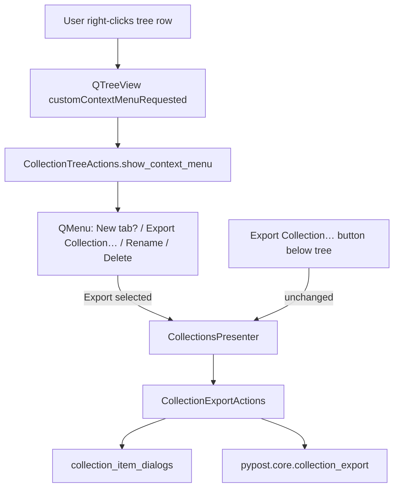

# PYPOST-1013: Context-menu Export Collection… on collection rows

## Research

### Repository findings

- **Export already exists (PYPOST-989):** `CollectionExportActions.export_collection()`
  resolves the tree’s `currentIndex()` via `_selected_collection_id` (collection row → that
  id; request row → parent collection id), then runs save dialog → write → result through
  `pypost.core.collection_export` and `collection_item_dialogs`. Label string is
  `BUTTON_EXPORT_COLLECTION` (`"Export Collection…"`) in `collection_messages.py`.
- **Button entry point:** `build_collections_panel` wires `COLLECTION_EXPORT_BUTTON` to
  `CollectionsPresenter.export_collection()`, which delegates to
  `CollectionExportActions`. Button behavior must stay unchanged.
- **Context menu owner:** `CollectionTreeActions.show_context_menu` builds a `QMenu` from
  `indexAt(pos)` for rename/delete (and **New tab** on request rows). It does **not**
  currently offer export. PYPOST-989 tech debt explicitly listed this gap as
  [PYPOST-1013](https://pypost.atlassian.net/browse/PYPOST-1013).
- **Clicked vs selected:** Rename/delete use the clicked index; export today uses only
  `currentIndex()`. Right-click must export the collection associated with the **clicked**
  row (requirements), so the menu path must not silently export a distant selection.
- **Test harness:** `tests/helpers/collections_tree.py` patches `QMenu` with ordered
  `addAction` mocks; `action_count=2` means collection menu `[Rename, Delete]`,
  `action_count=3` means request menu `[New tab, Rename, Delete]`. Adding export will
  bump those counts and require helper/test updates across rename/delete suites.
- **Docs:** `doc/user/collections.md` documents button-only export; rename/delete already
  document right-click. `doc/dev/collection_export.md` describes the button →
  `CollectionExportActions` path only.

### External research

- Qt’s supported pattern for item-specific menus is `Qt.CustomContextMenu` +
  `customContextMenuRequested` + `indexAt(pos)` + `viewport().mapToGlobal(pos)` for
  `QMenu.exec` ([Stack Overflow / Qt interest list][qt-tree-ctx]). PyPost already follows
  this in `CollectionTreeActions`.
- Prefer resolving the target from the click index at action time rather than relying on
  selection alone; the same guidance appears in Qt community answers for `QTreeView`
  context menus ([indexAt for clicked item][qt-indexat]).

[qt-tree-ctx]: https://lists.qt-project.org/pipermail/interest/2014-February/011422.html
[qt-indexat]: https://stackoverflow.com/questions/2666367/how-to-find-item-selected-from-customcontextmenurequested-on-qtreeview-item

## Implementation Plan

1. **Extend export orchestration for an explicit tree index** — In
   `CollectionExportActions`, allow export from a provided model index (clicked row) while
   keeping the no-arg path on `currentIndex()` for the below-tree button. Reuse
   `_selected_collection_id` for both.
2. **Wire presenter** — Expose a thin presenter method (or reuse `export_collection` with
   an optional index) that tree actions can call without duplicating save/write/result
   logic.
3. **Add context-menu action** — In `CollectionTreeActions.show_context_menu`, add
   **Export Collection…** (`BUTTON_EXPORT_COLLECTION`) for both collection and request
   rows; on trigger, resolve the clicked index and invoke the shared export path.
4. **Inject callback** — Pass an export callable into `CollectionTreeActions` from
   `CollectionsPresenter` (same dependency-injection style as other tree emits).
5. **Update test helpers** — Extend `patch_rename_context_menu` /
   `patch_delete_context_menu` / `make_delete_menu_actions` so action lists include the
   new export action at a stable position; bump `action_count` call sites.
6. **Tests** — Red test first (Step 3), then green coverage for menu labels + dispatch on
   collection and request rows (Step 4). Prefer extending
   `tests/test_collection_tree_actions.py` and/or `tests/test_collection_export_ui.py`
   using existing `patch_view_context_menu` patterns; mock save/result dialogs as today.
7. **Docs** — Mention the context-menu path in `doc/user/collections.md` and
   `doc/dev/collection_export.md` (Step 8 / with development).

**Out of scope (unchanged):** export format/core, import, export-all (PYPOST-1012), shared
JSON write helper (PYPOST-1011), removing the button, sidebar layout redesign.

### Mandatory — Failing Repro (next Step 3)

Write an automated **red** test **before** any production change:

| Item | Plan |
| --- | --- |
| **What it asserts** | Right-clicking a **collection** row builds a context menu that includes an action labeled `Export Collection…` (`BUTTON_EXPORT_COLLECTION`), and choosing that action starts the shared export flow for **that** collection (e.g. `export_collection` / `CollectionExportActions` invoked once with the clicked collection as target — verified via mock of save dialog / export method, without writing a real file if mocked). |
| **Where it lives** | Prefer `tests/test_collection_tree_actions.py` (menu composition + dispatch) and/or a focused case in `tests/test_collection_export_ui.py` (wiring through presenter). Follow existing `patch_view_context_menu` + `@pytest.mark.timeout` / module `pytestmark` patterns. |
| **How to force failure** | No live network or disk required: use `FakeRequestManager` / `build_isolated_tree_actions` or `CollectionsPresenter` with fakes; patch `QMenu` so `addAction`/`exec` are controllable. Today the collection menu only adds `Rename` and `Delete`, so asserting label list contains `BUTTON_EXPORT_COLLECTION` (or that selecting export calls the export mock) **fails until Step 4**. |
| **Sequencing** | Research (done) → write red test → run and confirm fail → implement menu + shared export-from-index → update helpers/call sites → re-run until green → keep button-path tests green. |

Optional second red assertion (same PR or immediately after first green): request-row menu also offers export and resolves parent collection — still red until Step 4.

## Architecture

### Module diagram



### Module responsibilities

| Module | Responsibility for this task |
| --- | --- |
| `CollectionTreeActions` | Add **Export Collection…** to the row context menu; dispatch to injected export callback with the **clicked** index as the target source. |
| `CollectionsPresenter` | Inject export callback into tree actions; keep panel button wired to the same export orchestration. |
| `CollectionExportActions` | Single export orchestration; accept optional source index so menu and button share save/write/result (button continues to use `currentIndex()`). |
| `collection_messages` | Reuse `BUTTON_EXPORT_COLLECTION` for menu label (parity with button). |
| `collection_export` (core) | Unchanged — payload, write, formatting. |
| `collection_item_dialogs` | Unchanged — save dialog and result/error boxes. |
| Test helpers (`collections_tree.py`) | Include export action in mocked menu action lists; document new `action_count` meaning. |

### Patterns

- **Additional entry point, shared orchestration:** Context menu is discoverability only;
  all file I/O and dialogs stay in `CollectionExportActions` + core (same as PYPOST-989).
- **Dependency injection:** Tree actions receive an export callable from the presenter —
  mirrors existing emit/callback constructor style; avoids tree actions importing export
  dialogs.
- **Clicked-index targeting:** Resolve collection id from the menu’s model index (via
  existing `_selected_collection_id` rules), not from an unrelated prior selection.
- **Label/string centralization:** Menu text from `BUTTON_EXPORT_COLLECTION`.

### Main interfaces

```text
CollectionTreeActions.__init__(..., export_collection: Callable[..., None], ...)
CollectionTreeActions.show_context_menu(pos)
  → on Export: export_collection(/* clicked index or equivalent */)

CollectionsPresenter.export_collection(...)  # button: no index / currentIndex
CollectionExportActions.export_collection(source_index: QModelIndex | None = None)
  → _selected_collection_id(model, source_index or tree.currentIndex())
  → collection_for_export → prompt → write → result  (unchanged body)
```

Exact callable signature (index vs set-current-then-no-arg) is an implementation detail as
long as: (1) button behavior is unchanged, (2) menu exports the clicked row’s collection
(or parent for a request), (3) dialogs/file content/feedback stay identical.

### Interaction scheme

1. User right-clicks collection or request row → `show_context_menu`.
2. Menu includes **Export Collection…** (plus existing actions).
3. User chooses export → presenter/export-actions resolve collection from clicked index
   (request → parent).
4. Same flow as button: no selection → clear error; cancel save → no write; success/error
   feedback; in-app collections unchanged.
5. Below-tree button remains a parallel entry point on `currentIndex()`.

## Q&A

**Q:** Why not only `setCurrentIndex(clicked)` then call today’s no-arg `export_collection`?

**A:** That can work and maximizes path sharing. Prefer an optional source index (or
equivalent) so export targets the clicked row even if selection semantics differ by
platform; either approach is acceptable if tests prove clicked-row targeting.

**Q:** Should request rows omit export?

**A:** No — requirements require parent-collection export, matching the button.

**Q:** New metrics?

**A:** Not required for this step; rename/delete have GUI metrics, button export does not.
Observability (Step 6) can note reuse of existing `collection_export_*` logs.

**Q:** Does this change export format?

**A:** No — same PYPOST-989 native JSON path.
