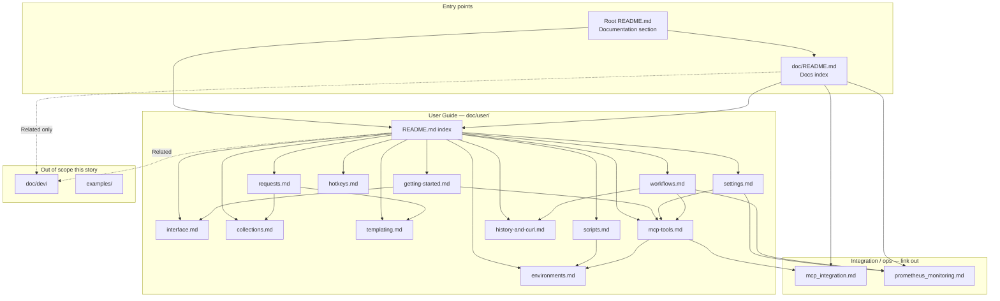
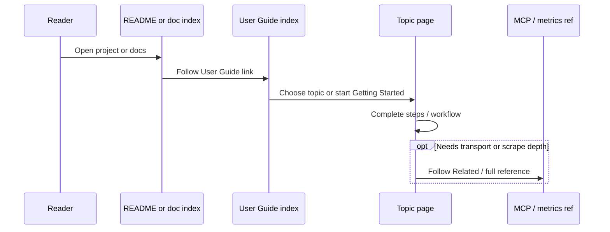

# PYPOST-1015: Structured end-user guide under doc/user/

## Research

### Jira / requirements context

- [PYPOST-1015](https://pypost.atlassian.net/browse/PYPOST-1015) — Story: ship
  User Guide under `doc/user/`; wire docs index + root README; docs-only.
- `10-requirements.md` — Fixed topic set, DoD, NFRs (discoverability, accuracy,
  safety), out-of-scope list.
- `00-roadmap.md` — Step 1 complete; Step 2 in progress; Step 3 N/A for
  docs-only.

Audience is end users / operators of the desktop app. Developer docs
(`doc/dev/`), example fixtures, tech-debt sync, and local agent tooling config
stay out of scope.

### Existing draft inventory (baseline — do not redesign TOC)

Working-tree and committed artifacts already define the navigation model.
Step 4 completes and accuracy-corrects them; it must not invent a conflicting
topic set.

| Artifact | Git state | Role |
| -------- | --------- | ---- |
| `doc/user/README.md` | Untracked | Guide index + overview + Related |
| `doc/user/getting-started.md` | Untracked | Install, run, first request |
| `doc/user/interface.md` | Untracked | Main window layout |
| `doc/user/requests.md` | Untracked | Create, send, body, response |
| `doc/user/collections.md` | Committed | Save, open, import/export |
| `doc/user/environments.md` | Committed | Vars, hidden, encryption, MCP |
| `doc/user/templating.md` | Untracked | `{{ var }}` + functions |
| `doc/user/scripts.md` | Untracked | Post-request Python examples |
| `doc/user/history-and-curl.md` | Untracked | History + Copy cURL |
| `doc/user/mcp-tools.md` | Untracked | User-level MCP setup |
| `doc/user/settings.md` | Untracked | Preferences and bind ports |
| `doc/user/hotkeys.md` | Untracked | Shortcuts + in-app pointer |
| `doc/user/workflows.md` | Untracked | Recipes + Operator metrics |
| `doc/README.md` | Modified | Docs index → User Guide |
| Root `README.md` | Modified | Documentation → User Guide |

Draft TOC order (already in `doc/user/README.md`) matches requirements Goals:

1. Getting Started → 2. Interface → 3. Requests → 4. Collections →
   5. Environments → 6. Templating → 7. Scripts → 8. History/cURL →
   9. MCP tools → 10. Settings → 11. Hotkeys → 12. Common Workflows.

### Step 1 review note — Operator metrics

Requirements list of workflow recipes is non-exhaustive. The draft
`workflows.md` already includes **Operator metrics** (`curl` to `:9080/metrics`
+ link to Prometheus docs). Architecture decision: **keep that section** if
Step 4 accuracy review confirms the scrape URL/behavior; do not drop it solely
because it was omitted from the requirements recipe bullets.

### External guidance (web)

- [Diátaxis](https://www.diataxis.fr/start-here/) — Separate tutorial / how-to /
  reference / explanation needs; avoid one monolithic manual.
- [NN/g progressive disclosure](https://www.nngroup.com/articles/progressive-disclosure/)
  — Surface frequent paths first; defer depth (MCP envelope, scrape setup) to
  secondary docs.
- Docs hierarchy practice (README → guides → reference) — Shallow, predictable
  paths; each level compresses the next.

Applied here without renaming the existing folder layout into four Diátaxis
directories (Diátaxis itself warns against empty four-bucket shells). Map
**roles** onto the existing pages:

| Diátaxis need | Primary pages in this guide |
| ------------- | --------------------------- |
| Tutorial | `getting-started.md` |
| How-to | Capability pages + `workflows.md` |
| Light reference | `hotkeys.md`, settings/templating tables |
| Deep reference / explanation | `mcp_integration.md`, `prometheus_monitoring.md` (link out) |

### Architectural decision: complete baseline vs redesign

- **A. Complete existing `doc/user/*`** — Matches requirements; keeps shipped
  pages; still needs an accuracy pass.
- **B. Redesign TOC / merge pages** — Fewer files, but conflicts with the fixed
  TOC.
- **C. Absorb MCP/Prometheus** — One place, but duplicates large references.

**Decision: Option A.** Treat drafts + committed collections/environments as
the documentation modules. Step 4 ships that structure with accuracy fixes and
consistent cross-links.

### Accuracy and safety themes (for Step 4)

Cross-cutting concerns every module must respect (not separate files):

- Steps match current UI labels and hotkeys (or point to in-app live list).
- Secrets: hidden env vars, history masking, cURL redaction before sharing.
- MCP: prefer `127.0.0.1`; warn on `0.0.0.0`; tools use active environment.
- Collections/environments import/export stay consistent with committed pages.
- No inventing product features; no application code changes.

## Implementation Plan

Docs-only delivery in Step 4 (no production code). Sequence:

1. **Freeze IA** — keep the twelve-topic TOC and file names above; no new topic
   files unless accuracy review finds a hard gap that cannot live as a section
   (unlikely; Operator metrics stays inside `workflows.md`).
2. **Accuracy pass per topic** — walk each draft against current product
   behavior (install/run, UI labels, MCP/settings defaults, import/export).
   Prefer edit-in-place over rewrite.
3. **Collections / environments** — only touch if accuracy or cross-link gaps;
   do not contradict shipped import/export guidance.
4. **Navigation wiring** — ensure `doc/user/README.md` lists all topics;
   `doc/README.md` routes to User Guide; root `README.md` Documentation
   section links User Guide (and docs index / MCP as already drafted).
5. **Cross-links** — progressive disclosure: user MCP page → full MCP
   reference; settings/workflows metrics → Prometheus doc; guide index →
   developer docs as Related only, not as the main path.
6. **Safety callouts** — confirm secrets / MCP bind / cURL sharing notes remain
   on history, environments, mcp-tools, and workflows pages.
7. **Out-of-scope guard** — do not edit `doc/dev/`, `examples/`, tech-debt sync
   artifacts, or local agent tooling config.

**Mandatory — Failing Repro (next Step 3):**

**N/A — no behavioral change.** This story ships Markdown documentation only.
There is no application runtime behavior to assert with a red test, and
requirements explicitly do not require a docs-contract check. Step 3 records
N/A rationale only; Step 4 implements the doc changes.

## Architecture

### Documentation module diagram

### Module responsibilities

| Module | Responsibility |
| ------ | -------------- |
| Root `README.md` Documentation | Discoverability from repo front page |
| `doc/README.md` | Hub: user vs integration vs developer |
| `doc/user/README.md` | User Guide index + capability overview |
| `getting-started.md` | Tutorial: install, run, first success |
| `interface.md` | Orientation map of the main window |
| `requests.md` | Day-to-day request editing and send |
| `collections.md` | Organize / share request sets |
| `environments.md` | Variables, hidden, encryption, MCP enable |
| `templating.md` | Placeholders + allow-listed functions |
| `scripts.md` | Post-response automation |
| `history-and-curl.md` | Reproduce / share calls safely |
| `mcp-tools.md` | User-level expose-to-agent path |
| `settings.md` | Preferences and bind ports |
| `hotkeys.md` | Shortcut summary; defers to in-app list |
| `workflows.md` | End-to-end recipes + Operator metrics |
| MCP / Prometheus docs | Deep references; link out, do not absorb |

Interfaces (content contracts):

- Root README and `doc/README.md` link to `doc/user/README.md`.
- Guide index uses the fixed numbered TOC filenames above.
- Topics cross-link peers (`templating`, `collections`, workflows compose).
- User MCP / settings / workflows link to `../mcp_integration.md` and
  `../prometheus_monitoring.md` for depth.
- Collections/environments keep import/export guidance consistent with the
  already-shipped pages.
- `doc/dev/` appears only under Related, not on the primary end-user path.

### Reader interaction flow

### Selected patterns and justification

| Pattern | Why |
| ------- | --- |
| Topic-based pages | Matches user stories; keeps pages scannable |
| Progressive disclosure | Avoids monolithic landing; defers rare depth |
| Diátaxis roles, not folders | Purpose without violating baseline TOC |
| Hub-and-spoke navigation | Docs index + guide index are hubs |
| Link-out for MCP/metrics | Single source for envelopes and scrape |
| Preserve committed pages | No conflict with shipped import/export |

### Main interfaces between modules

- **Entry → Guide**: relative Markdown links
  (`doc/user/README.md` from root; `user/README.md` from `doc/README.md`).
- **Index → Topic**: numbered TOC links using existing filenames.
- **Topic → Topic**: "Next", "see Templating", workflow composition links.
- **Guide → Integration**: `../mcp_integration.md`,
  `../prometheus_monitoring.md`.
- **Guide → Developer**: Related only (`../dev/README.md`); not part of the
  end-user progressive path.
- **Content contract**: English Markdown per `.cursor/lsr/do-markdown.md`;
  ATX headers; fenced examples; clear link text; safety notes where costly
  mistakes are possible.

### Out of scope (explicit non-modules)

No changes to application packages, tests, Makefile targets, `doc/dev/*`,
`examples/*`, tech-debt Jira sync files, or local agent config
(`.codex`, `.claude`, `.mcp.json`).

## Q&A

| Q | A |
| - | - |
| Redesign the topic list? | No — complete the existing structure. |
| Keep Operator metrics? | Yes, if accurate; recipes are non-exhaustive. |
| Absorb MCP Integration? | No — user page links out for depth. |
| Step 3 red test? | N/A — docs-only; no runtime change. |
| Edit collections/environments? | Only accuracy/cross-links if needed. |
| Automated docs lint? | Not required by business goals. |
| Diátaxis four folders? | No — apply roles to existing pages. |

External refs:

- [Diátaxis](https://www.diataxis.fr/start-here/)
- [NN/g progressive disclosure](https://www.nngroup.com/articles/progressive-disclosure/)
- [PYPOST-1015](https://pypost.atlassian.net/browse/PYPOST-1015)
