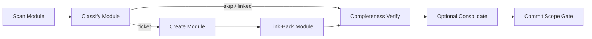

# PYPOST-1016: Sync unticketed tech debt from ai-tasks to Jira

## Research

### Problem and local process

Top-down reviews leave follow-ups in `ai-tasks/*/60-tech-debt.md`. Without a
Jira Debt issue and a browse link in that file, items fall out of sprint
planning. The project already defines the sync procedure in
`.claude/skills/tech-debt-jira-sync/SKILL.md`:

1. Scan only `ai-tasks/*/60-tech-debt.md`.
2. Classify each item (ticket / skip / already linked).
3. Create Debt issues via `jira-create-issue` (estimate → create with story
   points; never raw `jira_create_issue` / blind batch create).
4. Write browse links back into each source `60-tech-debt.md`.
5. Optionally regenerate the derived rollup with
   `python scripts/consolidate_tech_debt.py`.

Related completed work: [PYPOST-57](https://pypost.atlassian.net/browse/PYPOST-57)
delivered the consolidate script and inventory; this story is the inverse
direction (markdown → Jira → link-back), then optionally refresh the rollup.

### Industry patterns (2025–2026)

Current practice favors **local markdown as technical source of truth** and
**Jira as the planning / visibility layer**, with explicit sync rather than
treating Jira alone as authoritative (SpecWeave-style dual-store models;
CLI tools such as `tkt` / Ticket Mate for markdown↔Jira). Debt registers
emphasize actionable, prioritized items with remediation triggers — not
ticket-every-note. That aligns with this repo's rules: skip accepted /
out-of-scope / resolved / already-tracked rows; prefer skip-with-rationale
when classification is unclear; dedupe identical narratives to one Debt key.

This story does **not** introduce a new bidirectional sync product; it
executes the existing agent skill once (finish + verify) against Atlassian
MCP.

### Consolidate script touchpoints

`scripts/consolidate_tech_debt.py` (PYPOST-57):

- Walks `ai-tasks/**` for `60-tech-debt.md`, `40-tech-debt.md`, `60-review.md`.
- Extracts `[PYPOST-N](https://pypost.atlassian.net/browse/PYPOST-N)` links.
- Rebuilds `ai-tasks/00-tech-debt-consolidated.md` (derived only).
- Optional `--json` dump of unique keys → titles.

**Implication for this story:** never hand-edit the consolidated file to add
new tickets; update per-task `60-tech-debt.md`, then re-run the script when
links changed. No application Python feature work; script changes only if a
regeneration bug blocks the DoD (unlikely — treat as out of scope unless
proven).

### Partial sync residue (working tree + audit log)

Audit log `scripts/untracked_debt_tickets_created.json` (untracked) records
five already-created Debt issues:

| Key | Source artifact | Parent | Summary (audit) |
| --- | --- | --- | --- |
| PYPOST-799 | `ai-tasks/PYPOST-75/60-tech-debt.md` | PYPOST-75 | MetricsProtocol / NullMetrics |
| PYPOST-800 | `ai-tasks/PYPOST-794/60-tech-debt.md` | PYPOST-794 | pytest smoke for `make help` |
| PYPOST-801 | `ai-tasks/PYPOST-747/60-tech-debt.md` | PYPOST-747 | Startup/shutdown log strings |
| PYPOST-802 | `ai-tasks/PYPOST-63/60-tech-debt.md` | PYPOST-63 | Shared Resolved/Masked alias |
| PYPOST-803 | `ai-tasks/PYPOST-68/60-tech-debt.md` | PYPOST-68 | Collections/Tabs `apply_font` |

Observed link-back state at architecture time:

- **Committed** link-backs: PYPOST-75 ↔ 799, PYPOST-68 ↔ 803 (already on
  HEAD; no further edit required unless verification finds a mismatch).
- **Uncommitted** link-backs for the partial create set: PYPOST-794 ↔ 800,
  PYPOST-747 ↔ 801, PYPOST-63 ↔ 802.
- **Uncommitted** additional link hygiene on other `60-tech-debt.md` files
  (e.g. PYPOST-180 TD-2 → PYPOST-593, PYPOST-555 follow-ups) plus a
  regenerated `ai-tasks/00-tech-debt-consolidated.md`.

Architecture treats this residue as **input to verify-and-finish**, not as
work to recreate. Step 4 must not open duplicate Debt issues for 799–803.

### Create-path constraints

- Issue type: Debt; label `tech-debt`; priority from artifact (default Low).
- Summary shape: `[<parent-key>] <short description>`.
- Persist check: `jira_get_issue` on at least the first new key before
  bulk markdown edits.
- Dedup: normalize narrative text across files → one key, multiple
  source link-backs.

## Implementation Plan

High-level execution (process / documentation sync — no app feature code):

1. **Inventory residue** — Confirm PYPOST-799–803 exist in Jira; map each
   key to its source line via the audit log and grep for browse links.
2. **Rescan** — Apply skill Phase 1 classification across all
   `ai-tasks/*/60-tech-debt.md` (unticketed actionable vs skip vs linked).
3. **Create remaining** — For any still-unticketed actionable items, create
   Debt issues via `jira-create-issue` (estimate → create → verify).
4. **Link-back** — Ensure every newly created and residue key has a browse
   link in the correct source file(s); finish uncommitted 800–802 updates;
   leave committed 799/803 alone if already correct.
5. **Completeness check** — Re-scan; zero actionable unticketed remain, or
   document intentional skips with rationale.
6. **Optional consolidate** — If any source links changed,
   `python scripts/consolidate_tech_debt.py` (already partially done —
   refresh if further link-backs land).
7. **Commit scope** — Stage only legitimate debt-link / inventory / audit
   artifacts; exclude local agent config, secrets, and unrelated dirty
   files.

**Mandatory — Failing Repro (next Step 3):**
`N/A — no behavioral change` — This story does not alter product runtime,
APIs, or user-visible application behavior. Deliverables are markdown
link-backs, optional derived inventory regeneration, an audit log, and a
scoped documentation commit. There is no production defect or feature
acceptance criterion that a red pytest against the app could assert before
a fix.

**Verification substitute (document for Step 3 / Step 4, not a red test):**

- Scripted / agent checks are still expected: grep/scan for unticketed
  actionable patterns; assert audit keys 799–803 appear in their mapped
  source files; confirm consolidate output is regenerated from sources
  when links change; confirm commit path excludes secrets / agent config.
- Roadmap Step 3 remains marked N/A with the same justification; do not
  invent an application failing test solely to satisfy the red-first ritual.

## Architecture

### Pipeline modules



Residue path (already-created keys):

```text
Audit log + Jira keys 799–803
        │
        ▼
Link-Back Module (finish missing source links)
        │
        ▼
Completeness Verify → Optional Consolidate → Commit Scope Gate
```

### Module responsibilities

#### Scan

- **Responsibility:** Enumerate `ai-tasks/*/60-tech-debt.md`; extract candidate
  follow-up lines (TD/D rows, `no Jira yet`, `Jira: _none_`).
- **Input:** Glob of debt files.
- **Output:** Candidate list `{file, line, text, priority?}`.

#### Classify

- **Responsibility:** Label each candidate `create` / `skip` /
  `already_linked` / `residue_linked`. Apply skill skip table; conservative
  skip when unsure. Dedupe narratives.
- **Input:** Candidates from Scan.
- **Output:** Work queue + skip ledger with rationale.

#### Create

- **Responsibility:** For `create` items only: call `jira-create-issue`
  (Debt, priority, labels, story points); verify persistence.
- **Input:** Work queue from Classify.
- **Output:** `{key, url, file, line, parent, summary, story_points}` and
  optional audit-log append.

#### Link-Back

- **Responsibility:** Write browse links into source `60-tech-debt.md`
  (table column, replace `_none_`, or bullet append). Never strip existing
  valid links. Finish residue 799–803.
- **Input:** Create results + residue map (799–803).
- **Output:** Updated markdown source files.

#### Completeness Verify

- **Responsibility:** Re-scan; assert no actionable unticketed remain;
  confirm residue keys present in sources.
- **Input:** Post-link working tree.
- **Output:** Pass/fail report + intentional-skip list.

#### Optional Consolidate

- **Responsibility:** Run existing `scripts/consolidate_tech_debt.py` when
  source links changed.
- **Input:** Linked source artifacts.
- **Output:** `ai-tasks/00-tech-debt-consolidated.md`.

#### Commit Scope Gate

- **Responsibility:** Stage only sync-related docs/audit/inventory; block
  secrets and unrelated dirty paths.
- **Input:** Working tree.
- **Output:** Commit-ready index.

### External dependencies

| Dependency | Role |
| --- | --- |
| Atlassian MCP (`user-mcp-atlassian`) | Create / get Debt issues |
| `jira-create-issue` skill | Estimation + create with story points |
| `tech-debt-jira-sync` skill | Classification and link-back rules |
| `scripts/consolidate_tech_debt.py` | Derived inventory rebuild |
| `scripts/untracked_debt_tickets_created.json` | Run audit (optional retain) |

### Patterns and justification

- **Pipeline / ETL:** discrete stages with clear handoffs; matches the skill
  phases and supports resume after partial sync.
- **Source-of-truth + derived view:** per-task `60-tech-debt.md` owns links;
  consolidated file is regenerate-only (PYPOST-57 pattern).
- **Idempotent outcome:** a second sync after completion finds nothing new
  to ticket (aside from future debt writes).
- **Conservative classification:** skip-over-create reduces duplicate and
  noise tickets (industry register hygiene + local skill anti-patterns).

### Commit boundary (architectural)

**In scope for commit:** updated `ai-tasks/*/60-tech-debt.md` link-backs,
regenerated `ai-tasks/00-tech-debt-consolidated.md` (if refreshed),
`scripts/untracked_debt_tickets_created.json` if retained as audit,
PYPOST-1016 step artifacts.

**Out of scope for commit:** `.codex/`, credentials, unrelated feature/docs
dirty files already present in the working tree.

## Q&A

**Is Step 3 a red application test?**

No. `N/A — no behavioral change`. Verification is scan/link/commit checks,
not a failing product test.

**Do we recreate PYPOST-799–803?**

No. Treat as created; verify Jira existence and source browse links; finish
any missing link-backs only.

**Where do new links go?**

Always into the owning task's `60-tech-debt.md`. Never author new ticket
links only in `00-tech-debt-consolidated.md`.

**Must consolidate run?**

Yes if any source links changed this run (including finishing residue
link-backs). Optional only if a run produced no source-link changes.

**Who creates Debt issues?**

Only via `jira-create-issue` skill (estimate + story points). Raw MCP
create / unverified batch create are anti-patterns.

**What if classification is ambiguous?**

Skip with documented rationale (requirements NFR: conservative skips).

**User approval for this step?**

Required before Step 3. Under sprint-task-runner, the Step 2 review
subagent provides that approval; roadmap STEP 2 stays `[x]` only after
a PASS review of this artifact.
