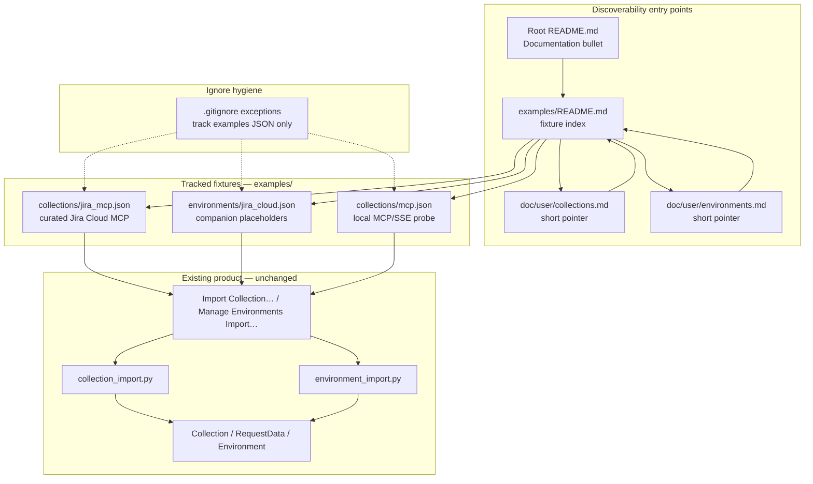

# PYPOST-1017: Importable example collections and environments

## Research

### Jira / requirements context

- [PYPOST-1017](https://pypost.atlassian.net/browse/PYPOST-1017) — Story: ship
  curated importable fixtures under `examples/` plus fixture-specific docs;
  finish working-tree Jira Cloud drafts; no new product features.
- `10-requirements.md` — Goals, user stories, DoD, NFRs (secret safety,
  importability, discoverability, role clarity, ignore hygiene, scope
  discipline, baseline fidelity).
- `00-roadmap.md` — Step 1 complete; Step 2 complete (`[x]`); programming
  language JSON + Markdown (application Python out of scope unless a tiny
  fixture/docs-only fix is unavoidable).
- [PYPOST-1015](https://pypost.atlassian.net/browse/PYPOST-1015) architecture
  explicitly lists `examples/` as out of scope; this ticket owns that gap.

### Existing draft inventory (baseline — finish/review, do not redesign)

| Artifact | Git state | Role |
| -------- | --------- | ---- |
| `examples/collections/jira_mcp.json` | Untracked draft | Curated end-user collection: 12 MCP-exposed Jira Cloud REST tools |
| `examples/environments/jira_cloud.json` | Untracked draft | Companion env: `jira_base_url`, hidden `jira_credentials`, `enable_mcp: true` |
| `examples/collections/mcp.json` | Tracked | Local MCP/SSE probe collection (dev/test); already loaded by test helpers |
| `.gitignore` exceptions | Present | `!examples/collections/`, `!examples/collections/*.json`, `!examples/environments/`, `!examples/environments/*.json` |
| `examples/README.md` | Missing | Needed for discoverability index |
| Root `README.md` Documentation | No `examples/` pointer | Needs a short link |
| User Guide import pages | Present | Generic Import Collection / Import… already documented |

Draft Jira pair shape (already matches native models):

- Collection root: single object `{ id, name, requests[] }` — accepted by
  `load_collection_import_candidates` (object or list).
- Each request carries `expose_as_mcp`, `mcp_description`, `mcp_params`, and
  templates using `{{ jira_base_url }}`, `{{ base64(jira_credentials) }}`, and
  `{{ mcp.request.* }}` agent inputs.
- Environment root: JSON list with one object — accepted by
  `load_import_candidates` (object or list). Placeholders:
  `https://your-team.atlassian.net` and `you@example.com:your-api-token`;
  `jira_credentials` in `hidden_keys`.

### How import works (application — consume, do not change)

```text
UI: Import Collection…  →  collection_import.load_collection_import_candidates
                        →  Collection / RequestData (Pydantic)
                        →  plan + apply (conflict Overwrite / Keep Both / Skip)

UI: Manage Environments → Import…
                        →  environment_import.load_import_candidates
                        →  Environment (via storage.deserialize_environment_records)
                        →  plan + apply (same conflict decisions)
```

Native format contracts (already documented in User Guide):

- Collection: same shape as `collections/<id>.json` — `name` required;
  `requests` list; MCP fields optional and carried through.
- Environment: same shape as `environments.json` records — `name` +
  `variables` required; `hidden_keys` / `enable_mcp` optional.

Precedent for committed fixtures under test:
`tests/helpers/mcp_test_collection.py` loads
`examples/collections/mcp.json` via `Collection.model_validate` for PYPOST-180
integration/helpers. That path is **dev/test probe**, not the curated
end-user Jira story.

### Docs landscape (where fixture guidance should live)

| Location | Current | Decision for this story |
| -------- | ------- | ----------------------- |
| `doc/user/collections.md` | Generic Import Collection… tutorial | Add a short **Example fixtures** pointer (paths + link to `examples/README.md`); do not duplicate the full tutorial |
| `doc/user/environments.md` | Generic Import… tutorial | Same: short pointer + secret/placeholder note for companion envs |
| `doc/user/workflows.md` | MCP expose recipe | Optional one-line “start from shipped examples” link; keep recipe intact |
| `doc/user/mcp-tools.md` | User-level MCP setup | Optional Related link only; no second MCP tutorial |
| `doc/user/README.md` | Twelve-topic TOC | Optional Related bullet to `examples/README.md`; do not add a 13th TOC topic |
| Root `README.md` | Documentation section, no examples | Add one bullet pointing at `examples/README.md` |
| `examples/README.md` | Missing | **Primary** fixture-specific doc: inventory, roles, import order, placeholders |
| `doc/README.md` | Hub | Optional one-line under user guide; not required if root + examples README + User Guide pointers suffice |
| Full PYPOST-1015 rewrite | Out of scope | Do not reopen |

### External guidance (web)

- [Atlassian basic auth for REST APIs](https://developer.atlassian.com/cloud/jira/platform/basic-auth-for-rest-apis/)
  — email + API token; `email:api_token` then Base64; matches draft
  `Authorization: Basic {{ base64(jira_credentials) }}`.
- [Manage API tokens](https://support.atlassian.com/atlassian-account/docs/manage-api-tokens-for-your-atlassian-account/)
  — generate tokens at Atlassian account settings; never commit real tokens.
- [Diátaxis](https://www.diataxis.fr/start-here/) — examples are how-to /
  tutorial starting points; keep concept docs in the User Guide and put
  fixture inventory next to the files.
- README / examples discoverability practice — shallow path from repo front
  page → `examples/README.md` → import steps; avoid burying fixtures only
  inside deep guide pages.

Applied here: Atlassian auth pattern stays as in the draft; docs tell readers
to substitute their own site URL and API token locally after import.

### Architectural decision: complete baseline vs redesign

- **A. Finish/review existing drafts + thin discoverability docs** — Matches
  requirements; keeps native import formats; reuses User Guide import tutorials.
- **B. Greenfield example redesign** — Higher risk; conflicts with “baseline
  not redesign.”
- **C. Absorb full MCP Integration / rewrite User Guide** — Expands into
  PYPOST-1015 / reference scope.

**Decision: Option A.** Curated Jira Cloud pair + clarify `mcp.json` role +
`.gitignore` verify + `examples/README.md` as hub + short pointers from root
README and existing User Guide import pages.

### Roles of shipped examples (must stay distinct in docs)

| Fixture | Audience | Purpose |
| ------- | -------- | ------- |
| `jira_mcp.json` + `jira_cloud.json` | End users | Import, fill placeholders, run/adapt Jira Cloud MCP workflow |
| `mcp.json` | Contributors / local probing | SSE/metrics/MCP probe against local PyPost ports; not the primary “learn Jira + MCP” starter |

## Implementation Plan

Fixture + docs delivery in Step 4 (no product feature work). Sequence:

1. **Review Jira Cloud pair** — walk `jira_mcp.json` / `jira_cloud.json`
   against `Collection` / `Environment` / import parsers; keep placeholder-only
   secrets; confirm variable names match templates; keep `enable_mcp` and
   `hidden_keys` as drafted unless review finds a safety/usability bug.
2. **Keep `mcp.json`** — no redesign; docs state its probe role vs the Jira
   curated pair.
3. **Verify `.gitignore`** — exceptions remain; local `collections/` and
   `environments.json` stay ignored.
4. **Add `examples/README.md`** — inventory table, recommended import order
   (environment first → fill placeholders → collection → select env → Send or
   MCP), secret-handling rules, links into User Guide import/MCP pages.
5. **Wire discoverability** — root `README.md` Documentation bullet;
   short “Example fixtures” sections or Related links on
   `doc/user/collections.md` and `doc/user/environments.md`; optional Related
   on guide index / workflows. Do not rewrite those pages’ tutorials.
6. **Out-of-scope guard** — no app package changes unless import of a finished
   fixture fails; no local agent config; no full User Guide completion; no
   Postman/OpenAPI converters.

**Mandatory — Failing Repro (next Step 3):**

**N/A — no behavioral change.** This story ships importable JSON fixtures and
Markdown discoverability docs only. Application import/export runtime behavior
is unchanged and already covered by existing collection/environment import
tests. Requirements do not introduce a new product code path to assert with a
red test. Step 3 records N/A rationale only.

Optional (Step 4, not Step 3 red): a green fixture-contract test mirroring
`tests/helpers/mcp_test_collection.py` that loads the Jira pair through
`load_collection_import_candidates` /
`environment_import.load_import_candidates` and asserts parse success,
placeholder markers, and `hidden_keys` — as a regression guard after fixtures
are finalized, not as a failing repro of missing app behavior.

## Architecture

### Module diagram



### Module responsibilities

| Module | Responsibility |
| ------ | -------------- |
| `examples/collections/jira_mcp.json` | Curated end-user collection: MCP-exposed Jira REST tools with templated host/auth and agent params |
| `examples/environments/jira_cloud.json` | Companion variables, hidden credentials placeholder, MCP enable flag |
| `examples/collections/mcp.json` | Existing local probe example; remain tracked; clarify role in docs |
| `examples/README.md` | Fixture inventory, roles, import order, secret safety, links to User Guide |
| Root `README.md` Documentation | One-line discoverability from repo front page |
| User Guide import pages | Keep generic tutorials; add short pointers to `examples/` |
| `.gitignore` exceptions | Keep `examples/{collections,environments}/*.json` trackable |
| Import core + UI | Unchanged consumers of native JSON |

### Reader / contributor interaction flow

```mermaid
sequenceDiagram
  participant R as Reader
  participant Docs as README or User Guide pointer
  participant Ex as examples/README.md
  participant EnvUI as Manage Environments Import…
  participant CollUI as Import Collection…
  participant App as PyPost runtime

  R->>Docs: Find examples link
  Docs->>Ex: Open fixture index
  Ex->>R: Paths, roles, secret rules
  R->>EnvUI: Import jira_cloud.json
  R->>EnvUI: Replace placeholders locally
  R->>CollUI: Import jira_mcp.json
  R->>App: Select Jira Cloud MCP environment
  alt Manual send
    R->>App: Open request and Send
  else Agent demo
    R->>App: MCP already enabled on env; agent calls tools
  end
```

### Selected patterns and justification

| Pattern | Why |
| ------- | --- |
| Baseline-complete (finish drafts) | Requirements forbid greenfield redesign |
| Companion pair | Collection templates need matching env vars |
| Hub-and-spoke docs | `examples/README.md` owns fixture detail; User Guide keeps generic import tutorials |
| Progressive disclosure | Pointers only in guide pages; no second full import manual |
| Native JSON only | Matches current import parsers; no format redesign |
| Placeholder + hidden_keys | Secret safety NFR without encryption envelopes (portable plaintext placeholders) |
| Role labeling | Prevents confusion between Jira curated pair and `mcp.json` probe |

### Main interfaces between modules

- **Docs → fixtures**: relative paths from `examples/README.md` to JSON files;
  root README and User Guide link to `examples/README.md`.
- **Fixtures → import parsers**: JSON must validate as `Collection` /
  `Environment` records with the shapes already accepted by
  `load_collection_import_candidates` and `load_import_candidates`.
- **Collection ↔ environment**: shared variable names (`jira_base_url`,
  `jira_credentials`); auth via existing `base64` template function.
- **Fixtures → MCP runtime**: `expose_as_mcp` + env `enable_mcp`; no new MCP
  server code.
- **Ignore interface**: `.gitignore` negation rules remain the only mechanism
  that keeps fixtures trackable beside ignored local data dirs.
- **Content contract**: English Markdown per `.cursor/lsr/do-markdown.md`;
  JSON UTF-8 LF; placeholders only in committed secrets.

### Out of scope (explicit non-modules)

No changes to application packages (unless a tiny import-blocking fixture fix
is unavoidable), no Postman/Insomnia/OpenAPI importers, no full User Guide
completion (PYPOST-1015), no tech-debt Jira sync, no baseline metrics, no local
agent tooling config (`.codex`, `.claude`, `.mcp.json`).

## Q&A

| Q | A |
| - | - |
| Redesign the Jira example from scratch? | No — finish/review existing drafts. |
| Where do fixture-specific docs live? | Primary: `examples/README.md`; pointers from root README + collections/environments User Guide pages. |
| Rewrite import tutorials in the User Guide? | No — keep generic tutorials; add short pointers only. |
| Change import/export formats? | No — fixtures must match current native JSON. |
| Keep `mcp.json`? | Yes; docs clarify probe vs curated Jira pair. |
| Touch `.gitignore`? | Only if review finds a break; expected work is verify-keep. |
| Step 3 red test? | N/A — fixtures + docs only; no app runtime behavioral change. |
| Optional fixture contract test? | Allowed in Step 4 as a green regression guard, not as Step 3 red. |
| Real Jira tokens in git? | Never — placeholders only; reader substitutes locally. |
| Application Python? | Out of scope unless a tiny fixture/docs-only fix is unavoidable. |

External refs:

- [PYPOST-1017](https://pypost.atlassian.net/browse/PYPOST-1017)
- [PYPOST-1015](https://pypost.atlassian.net/browse/PYPOST-1015)
- [Atlassian basic auth for REST APIs](https://developer.atlassian.com/cloud/jira/platform/basic-auth-for-rest-apis/)
- [Manage API tokens](https://support.atlassian.com/atlassian-account/docs/manage-api-tokens-for-your-atlassian-account/)
- [Diátaxis](https://www.diataxis.fr/start-here/)
