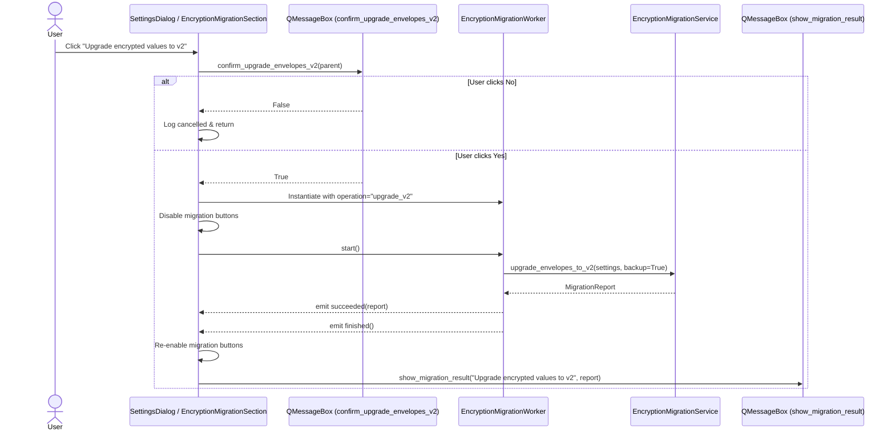

# PYPOST-1019: Architecture & Technical Design

## Research

### Current Architecture
- `EncryptionMigrationService` in `pypost/core/encryption_migration.py` has `upgrade_envelopes_to_v2(settings, backup=True, dry_run=False)` which rewrites v1 envelopes to v2.
- `EncryptionMigrationWorker` in `pypost/core/qt/encryption_migration_worker.py` supports `re_encrypt` and `encrypt_plaintext`.
- `EncryptionMigrationSection` in `pypost/ui/widgets/settings/encryption_migration_section.py` provides buttons for Verify, Re-encrypt, and Encrypt plaintext.
- `collection_item_dialogs.py` contains confirmation dialog helpers `confirm_re_encrypt_environments` and `confirm_encrypt_plaintext_hidden`.

## Architecture & Component Design

### Module Responsibilities

1. **`pypost/core/qt/encryption_migration_worker.py`**:
   - Extend `MigrationOperation = Literal["re_encrypt", "encrypt_plaintext", "upgrade_v2"]`.
   - In `run()`, when `self._operation == "upgrade_v2"`, invoke `self._service.upgrade_envelopes_to_v2(self._settings, backup=True)`.

2. **`pypost/ui/collection_item_dialogs.py`**:
   - Add `confirm_upgrade_envelopes_v2(parent: QWidget) -> bool` with clear warning about v1 -> v2 envelope conversion and automatic timestamped backup.

3. **`pypost/ui/widgets/settings/encryption_migration_section.py`**:
   - Add `confirm_upgrade_envelopes_v2: Callable[[QWidget], bool] = confirm_upgrade_envelopes_v2` to constructor.
   - Create `self.upgrade_v2_btn = QPushButton("Upgrade encrypted values to v2", parent)`.
   - Wire `self.upgrade_v2_btn.clicked.connect(self.on_upgrade_envelopes_v2)`.
   - Add button to form layout and include in `_set_migration_buttons_enabled`.
   - Implement `on_upgrade_envelopes_v2()` calling `_start_migration_worker("upgrade_v2", title="Upgrade encrypted values to v2", confirm=self._confirm_upgrade_v2)`.

4. **`pypost/ui/dialogs/settings_dialog.py`**:
   - Expose `self.upgrade_v2_btn = encryption_migration.upgrade_v2_btn`.
   - Wire `confirm_upgrade_envelopes_v2` in `EncryptionMigrationSection` call.

## Implementation Plan

1. **Step 3 (Failing Repro)**:
   - Add tests to `tests/test_settings_encryption_migration_ui.py` for `upgrade_v2`:
     - Verification that `upgrade_v2_btn` is enabled when service is present and disabled when absent.
     - Verification that worker triggers `upgrade_envelopes_to_v2(backup=True)` when confirmed.
     - Verification that worker does not run when confirmation is rejected.
     - Verification that report is displayed via `show_migration_result`.
   - Run tests to verify RED failure.
2. **Step 4 (Development)**:
   - Update `pypost/core/qt/encryption_migration_worker.py`.
   - Update `pypost/ui/collection_item_dialogs.py`.
   - Update `pypost/ui/widgets/settings/encryption_migration_section.py`.
   - Update `pypost/ui/dialogs/settings_dialog.py`.
   - Run `make test` to verify GREEN.
3. **Steps 5–8**: Code cleanup, observability logging, tech debt, and dev docs.

## Q&A

- **Q: Is backup created automatically?**
  - **A**: Yes, `backup=True` creates a timestamped copy of `environments.json` prior to disk writes.
