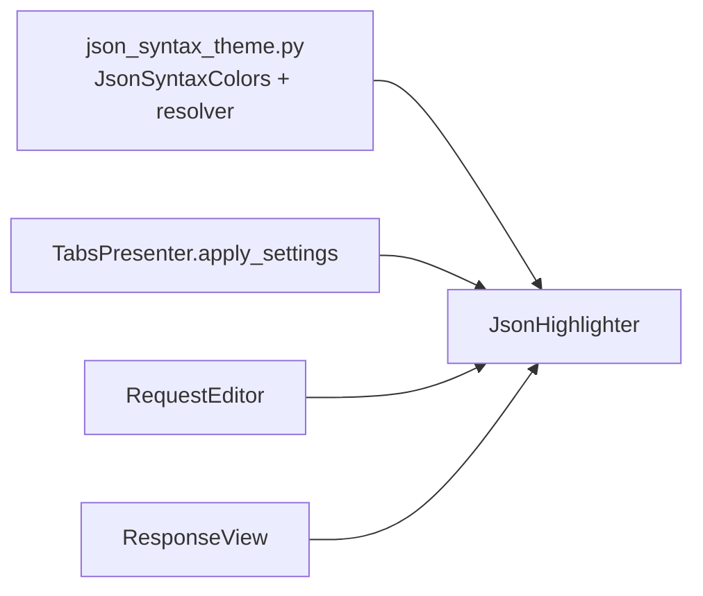

# PYPOST-102: Architecture

## Review Outcome

No architectural changes. Existing design from PYPOST-398, PYPOST-395, and PYPOST-99
remains correct.

## Current Design



| Module | Responsibility |
| ------ | -------------- |
| `pypost/ui/theme/json_syntax_theme.py` | Light/dark palettes, `resolve_json_syntax_colors()` |
| `pypost/ui/widgets/json_highlighter.py` | Regex rules; reads `self._colors.*`; `set_colors()` |
| `pypost/ui/presenters/tabs_presenter.py` | Refreshes highlighter colors on settings apply |

## Duplicate Rationale

PYPOST-99 scope explicitly verified theme extraction and closed the PYPOST-11 hardcoded-
colors item. PYPOST-102 restates the same follow-up ("move color settings to theme or
config") from `PYPOST-11/40-tech-debt.md`. Implementation, tests, and dev docs from
PYPOST-99 satisfy this ticket's acceptance criteria.

## Verification

```bash
QT_QPA_PLATFORM=offscreen .venv/bin/python -m pytest tests/test_json_highlighter.py -q
```

All 22 tests pass (2026-06-12).
