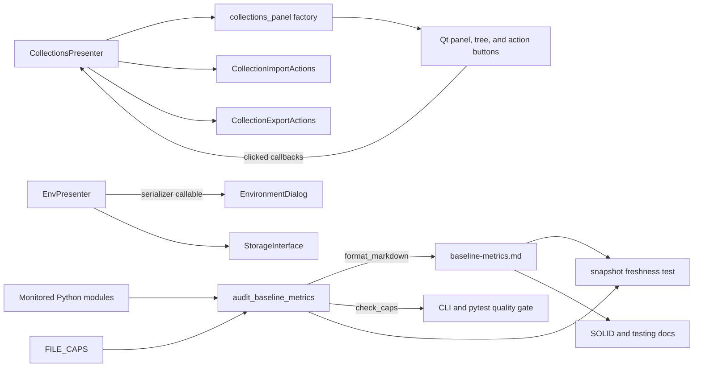

# PYPOST-1025: Reconcile the SOLID quality baseline

## Research

### Repository Findings

- The approved Step 1 scope requires the baseline definition, generated snapshot,
  validation, and relevant developer guidance to agree without changing user-visible
  behavior.
- `scripts/audit_baseline_metrics.py --check` currently exits with status 1 for exactly two
  violations:
  - `collections_presenter.py`: 352 lines against a cap of 330.
  - `env_presenter.py`: 472 lines against a cap of 470.
- `tests/test_solid_audit_baseline.py` reproduces both violations through
  `test_audit_module_inventory_within_caps`; the other two baseline tests pass.
- The committed snapshot is older than the current generator output. It contains previous
  values for multiple modules and previous MainWindow caps, so merely making the cap check
  green would not prevent snapshot drift from recurring.
- The collection presenter currently owns 22 lines of sidebar layout construction in
  addition to tree orchestration. The import and export workflows are already delegated to
  `CollectionImportActions` and `CollectionExportActions`, making panel construction a
  low-cost extraction boundary.
- The environment presenter is over its cap only because a callable expression is spread
  over three physical lines. Passing the equivalent bound storage method directly removes
  two lines without changing the dialog interface or runtime behavior.
- The collections cap of 330 and environment cap of 470 can therefore remain unchanged.
  No intentional cap increase is justified by the current drift.

### External Research

- Python's official [`pathlib` documentation](https://docs.python.org/3/library/pathlib.html)
  defines `Path.read_text()` and `Path.write_text()` as the direct text-file read/write
  interfaces. The existing generator already uses these interfaces with UTF-8, so the
  snapshot consistency test can compare the committed text with `format_markdown()` without
  introducing another serializer.
- Python's official
  [`ast` documentation](https://docs.python.org/3/library/ast.html#ast.AST.end_lineno)
  defines `lineno` and `end_lineno` as the first and last source lines represented by a node.
  This confirms that the existing class-size measurement remains the appropriate source for
  the MainWindow guard; no measurement algorithm change is needed.
- Qt for Python documents that a
  [`QVBoxLayout` documentation][qt-vbox]
  becomes that widget's top-level layout and reparents added widgets. Extracting construction
  into a factory preserves the current ownership model as long as the same panel is the
  layout parent.
- Qt's official
  [signals and slots guide][qt-signals]
  supports connecting a button signal to a Python callable. The extracted panel factory can
  therefore receive presenter callbacks while keeping workflow ownership in the presenter.
- Python's official
  [`unittest.TestCase.assertEqual` documentation][unittest-equal]
  supports a direct generated-text versus committed-text assertion with a useful diff. This
  is sufficient for the proposed snapshot freshness regression guard.

## Implementation Plan

1. In Step 3, extend `tests/test_solid_audit_baseline.py` with a snapshot freshness test.
   Keep the existing cap test unchanged and demonstrate both red conditions before any
   production change.
2. In Step 4, add `pypost/ui/presenters/collections_panel.py` with a focused panel factory.
   Move only collection sidebar widget construction and button signal wiring into it.
3. Replace `CollectionsPresenter._build_panel()` with the factory call. Preserve the
   existing `widget`, `panel`, import, export, tree, and signal interfaces.
4. Pass `StorageInterface.serialize_environment_records` directly to `EnvironmentDialog`
   from `EnvPresenter`, replacing the behaviorally equivalent three-line lambda.
5. Keep both existing `FILE_CAPS` values. Update the collection cap comment so its rationale
   describes the extracted panel and retained presenter delegation rather than claiming the
   layout remains in the presenter.
6. Regenerate `ai-tasks/PYPOST-376/baseline-metrics.md` from the canonical generator only
   after the source reconciliation is complete.
7. Synchronize the MainWindow regression table and add a PYPOST-1025 reconciliation note in
   `doc/dev/solid_audit.md`. Update `doc/dev/testing.md` to state that the regression test
   also checks committed snapshot freshness.
8. Verify the focused baseline test, cap-check command, affected presenter tests, linting,
   and the normal repository quality gate. The generator and regenerated snapshot must be
   committed in the same change set.

### Mandatory Failing Repro (Step 3)

Add
`TestSolidAuditBaseline.test_markdown_snapshot_matches_current_metrics` to
`tests/test_solid_audit_baseline.py`. The test will:

- generate desired text in memory with
  `format_markdown(measure_all())`;
- derive the repository root from the existing `_SCRIPTS` path and read
  `ai-tasks/PYPOST-376/baseline-metrics.md` from that root as UTF-8;
- assert exact equality, including the final newline; and
- require no GUI, network, Jira, clock, or other live external dependency.

Before the production fix, the new test must fail because the committed snapshot contains
stale measurements and caps. The existing
`test_audit_module_inventory_within_caps` must independently remain red for the two current
over-cap modules. Step 3 will add only the test and capture both failures; it will not modify
the presenters, caps, generator, snapshot, or documentation.

Sequence: repository research and approved architecture → add snapshot test → demonstrate
red snapshot and cap tests → review the red repro → extract/reflow in Step 4 → regenerate the
snapshot → run both tests until green.

## Architecture

### Component Diagram



### Components and Responsibilities

| Component | Responsibility | Change |
| --- | --- | --- |
| `CollectionsPresenter` | Coordinate tree, actions, state, and signals | Delegate panel assembly |
| `collections_panel` | Construct the sidebar and connect buttons | New factory module |
| `CollectionImportActions` | Execute the import workflow | No behavior or interface change |
| `CollectionExportActions` | Execute the export workflow | No behavior or interface change |
| `EnvPresenter` | Coordinate environment state and dialog dependencies | Pass serializer directly |
| `EnvironmentDialog` | Host environment management UI | No behavior or interface change |
| `audit_baseline_metrics` | Measure, enforce caps, and render reports | Retain behavior |
| `baseline-metrics.md` | Store the generated repository snapshot | Regenerate canonically |
| Baseline tests | Guard caps and exact snapshot freshness | Add one deterministic regression test |
| Developer docs | Explain baseline values and verification | Synchronize with the generated truth |

### Interactions and Dependencies

1. `CollectionsPresenter` constructs its tree model and action delegates, then calls the
   panel factory with the tree and its import/export callbacks.
2. The factory owns only widget creation, layout, stable widget IDs, and signal connections.
   Button activation calls the presenter's existing delegation methods.
3. `EnvPresenter` supplies the storage serializer through the existing callable parameter;
   `EnvironmentDialog` and its child widget continue to invoke it without knowing the
   concrete storage implementation.
4. `audit_baseline_metrics.measure_all()` reads monitored modules and combines measurements
   with `FILE_CAPS`.
5. `check_caps()` drives the CLI and existing cap test; `format_markdown()` drives both the
   committed snapshot and the new exact-text freshness test.
6. The generated snapshot is the detailed source for developer documentation. Summary tables
   must be copied from the same post-reconciliation measurements.

### Selected Patterns

- **Extract Component:** sidebar layout construction moves out of the already over-cap
  presenter into a cohesive, stateless factory.
- **Dependency injection by callback:** the panel factory receives import/export callbacks,
  and `EnvironmentDialog` receives a serializer callable. Neither component acquires a new
  dependency on presenter or storage internals.
- **Single source of truth:** `format_markdown(measure_all())` remains the only canonical
  snapshot renderer. Tests compare its output to the committed artifact rather than
  duplicating expected measurements.
- **Generated artifact guard:** exact text comparison makes source and snapshot drift visible
  in CI, while the existing cap test continues to express the independent size policy.
- **Minimal change:** measurement semantics, CLI flags, public presenter properties, action
  classes, and user-visible workflows remain unchanged.

### Main Interfaces

#### Collection Panel Factory

```python
def build_collections_panel(
    tree_view: QTreeView,
    *,
    import_collection: Callable[[], None],
    export_collection: Callable[[], None],
) -> QWidget:
    """Build the collection tree panel and connect its action buttons."""
```

The returned `QWidget` continues to back `CollectionsPresenter.panel`. Button text and stable
widget IDs remain sourced from the existing constants.

#### Environment Serializer Boundary

```python
serialize_export_records: Callable[[list[Environment]], list[dict]] | None
```

The boundary is unchanged. The presenter passes
`self._storage.serialize_environment_records` directly instead of wrapping it in a lambda.

#### Baseline Measurement and Rendering

```python
def measure_all() -> list[FileMetrics]: ...
def check_caps() -> list[str]: ...
def format_markdown(metrics: list[FileMetrics]) -> str: ...
```

The CLI contracts remain:

- `--check`: return non-zero and print every cap violation.
- `--markdown PATH`: overwrite the requested snapshot with canonical UTF-8 report text.

#### Snapshot Freshness Contract

```text
committed baseline-metrics.md == format_markdown(measure_all())
```

This contract detects stale measurements, caps, ordering, and report formatting without live
dependencies.

### Decisions and Risks

- **Decision:** extract collection panel construction instead of raising the 330-line cap.
  The layout is cohesive and already separated from import/export workflow logic.
- **Decision:** retain the 470-line environment cap and remove an unnecessary wrapper. A cap
  increase for two formatting lines would weaken the guard without adding capability.
- **Decision:** do not change the baseline measurement algorithm or original baseline date.
  This task reconciles the current snapshot; it does not redefine the audit era.
- **Risk:** Qt ownership could change during extraction. Mitigation: construct
  `QVBoxLayout(panel)` exactly as today and keep the tree model parented to the tree view.
- **Risk:** callback wiring could regress. Mitigation: retain public presenter tests and run
  focused collection import/export UI coverage after extraction.
- **Risk:** exact snapshot comparison is intentionally sensitive to report formatting.
  This is desirable because the committed file is generated and must not be hand-edited.

## Q&A

**Q:** Why not raise the collection cap to 352 and the environment cap to 472?

**A:** Both overages have cheaper behavior-preserving resolutions. Raising the caps would
hide avoidable drift and conflict with the approved preference for extraction.

**Q:** Why add another test when the existing cap test already fails?

**A:** The cap test detects oversized modules but does not detect a stale committed markdown
snapshot. The new test enforces the separate acceptance criterion that source and snapshot
must be updated together.

**Q:** Does the new panel factory own import or export behavior?

**A:** No. It owns only layout and Qt signal wiring. The presenter remains the coordinator,
and the existing action objects continue to own both workflows.

**Q:** Are cap values changed by this plan?

**A:** No. The existing 330 and 470 limits remain valid after the low-cost reconciliation.

[qt-vbox]: https://doc.qt.io/qtforpython-6/PySide6/QtWidgets/QVBoxLayout.html
[qt-signals]: https://doc.qt.io/qtforpython-6/tutorials/basictutorial/signals_and_slots.html
[unittest-equal]: https://docs.python.org/3/library/unittest.html#unittest.TestCase.assertEqual
