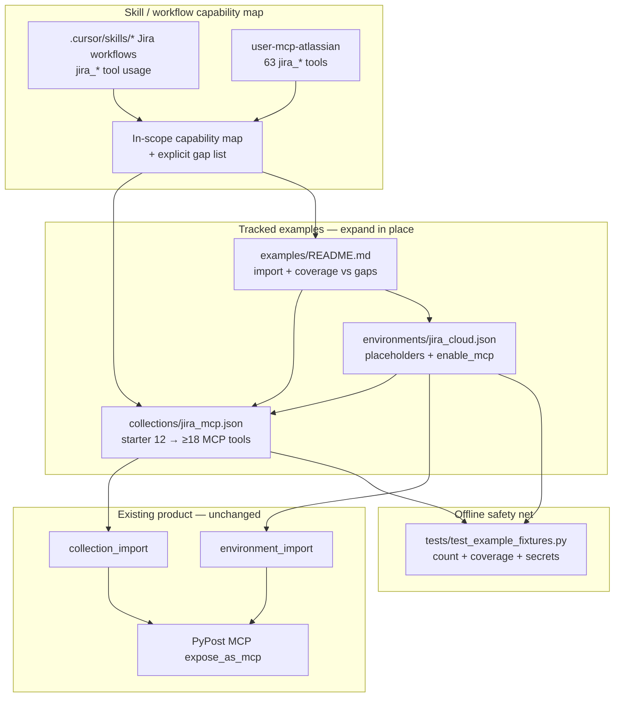

# PYPOST-1026: Expand jira-mcp example collection for Atlassian MCP parity

## Research

### Requirements and baseline

- [PYPOST-1026](https://pypost.atlassian.net/browse/PYPOST-1026) — Expand the
  PYPOST-1017 jira-mcp starter (~12 MCP-exposed tools) toward a practical analog
  of the Atlassian MCP Jira surface used by in-repo agent skills/workflows.
- `10-requirements.md` — fixture/docs/test expansion only; no product redesign;
  no live Jira CI; placeholders only; explicit gap list OK; skill/workflow
  capabilities take priority over Service Desk / ProForma.
- `00-roadmap.md` — Step 1 complete (`[x]`); Step 2 in progress (`[/]`).
- Languages: JSON fixtures + English Markdown docs
  (`.cursor/lsr/do-markdown.md`); Python only for existing fixture contract
  tests (`.cursor/lsr/do-python.md`).

### PYPOST-1017 baseline (expand, do not redesign)

| Artifact | Current state | Notes |
| -------- | ------------- | ----- |
| `examples/collections/jira_mcp.json` | 12 MCP-exposed requests | Collection id `jira-cloud-mcp` |
| `examples/environments/jira_cloud.json` | Companion env | Placeholders, hidden creds, MCP on |
| `examples/README.md` | Documents 12-tool starter | Import order, secrets, role vs `mcp.json` |
| `tests/test_example_fixtures.py` | Contract tests | Asserts `len(collection.requests) == 12` |
| PYPOST-1017 `20-architecture.md` | Prior architecture | Finish-drafts; Step 3 was N/A then |

Starter request IDs today:

1. `jira-search-issues-jql` — `POST /rest/api/3/search/jql`
2. `jira-get-issue` — `GET /rest/api/3/issue/{key}`
3. `jira-create-issue` — `POST /rest/api/3/issue`
4. `jira-update-issue` — `PUT /rest/api/3/issue/{key}`
5. `jira-get-transitions` — `GET .../transitions`
6. `jira-transition-issue` — `POST .../transitions`
7. `jira-add-worklog` — `POST .../worklog`
8. `jira-search-fields` — `GET /rest/api/3/field/search`
9. `jira-list-boards` — `GET /rest/agile/1.0/board`
10. `jira-list-board-sprints` — `GET /rest/agile/1.0/board/{id}/sprint`
11. `jira-get-sprint` — `GET /rest/agile/1.0/sprint/{id}`
12. `jira-update-sprint` — `PUT /rest/agile/1.0/sprint/{id}`

Auth/env pattern is correct and stays: `jira_base_url` +
`Authorization: Basic {{ base64(jira_credentials) }}` with placeholder
`you@example.com:your-api-token`.

### Atlassian MCP Jira tool surface (live inventory)

Inspected `user-mcp-atlassian` via MCP tool discovery: **63** `jira_*` tools.
Full dump includes issue lifecycle, agile/sprint, projects/fields/versions,
watchers, links, attachments, Service Desk, ProForma, SLA, and development
info. Requirements forbid a full OpenAPI dump; inventory is used only to map
skill needs and to name explicit gaps.

### Skill / workflow capability inventory

Skills live at `.cursor/skills/` (symlinked as `.claude/skills`). Tools
referenced in skill Markdown (positive use unless noted):

| Capability | MCP tool(s) | Skills using it | In starter? |
| ---------- | ----------- | --------------- | ----------- |
| Search issues (JQL) | `jira_search` | audit, sprint-planning, sprint-runner | Yes |
| Get issue | `jira_get_issue` | create-issue, tech-debt, sprint-* | Yes |
| Create issue | `jira_create_issue` | create-issue, audit, runners | Yes |
| Update issue (SP etc.) | `jira_update_issue` | story-points, sprint-runner | Yes |
| List / get transitions | `jira_get_transitions` | sprint-runner, sprint-task-runner | Yes |
| Transition issue | `jira_transition_issue` | sprint-runner, sprint-task-runner | Yes |
| Add worklog | `jira_add_worklog` | token-worklog, top-down, runners | Yes |
| Search fields | `jira_search_fields` | story-points, create-issue, sprint-runner | Yes |
| List boards | `jira_get_agile_boards` | sprint-planning | Yes (`jira-list-boards`) |
| List board sprints | `jira_get_sprints_from_board` | sprint-planning, runners | Yes |
| Get / update sprint | `jira_update_sprint` (+ get) | sprint-planning, runners | Yes |
| **Create sprint** | `jira_create_sprint` | sprint-planning | **No** |
| **Add issues to sprint** | `jira_add_issues_to_sprint` | sprint-planning | **No** |
| **Link to epic / parent** | `jira_link_to_epic` | audit-tickets | **No** |
| Get sprint issues | `jira_get_sprint_issues` | mentioned (prefer JQL) | **No** |
| Batch create | `jira_batch_create_issues` | Explicitly **avoided** | Gap / omit |

Requirements also call out **comments** and **assign** as in-scope practical
capabilities even when skills mostly use other paths today. Live MCP confirms
dedicated tools (`jira_add_comment`, `jira_assign_issue` — assign notes that
setting assignee via update is unreliable). Those belong in the curated
expansion as low-cost, high-value analogs.

### REST / Agile endpoint mapping (web + current fixtures)

External refs used (full URLs in Q&A):

- Jira Software Cloud REST — Sprint
- Jira Cloud platform REST — Issues
- Epic Link / Parent deprecation (Atlassian developer community)
- Basic auth for REST APIs

Proposed new / clarified mappings for expansion (same host + basic auth):

| Capability | Preferred REST | MCP analog |
| ---------- | -------------- | ---------- |
| Create sprint | `POST /rest/agile/1.0/sprint` | `jira_create_sprint` |
| Add issues to sprint | `POST .../sprint/{id}/issue` | `jira_add_issues_to_sprint` |
| List sprint issues | `GET .../sprint/{id}/issue` | `jira_get_sprint_issues` |
| Move to backlog | `POST /rest/agile/1.0/backlog/issue` | `jira_move_issues_to_backlog` |
| Add comment | `POST .../issue/{key}/comment` | `jira_add_comment` |
| Assign issue | `PUT .../issue/{key}/assignee` | `jira_assign_issue` |
| Link to epic | `PUT .../issue/{key}` + `fields.parent` | `jira_link_to_epic` |
| Get worklog | `GET .../issue/{key}/worklog` | `jira_get_worklog` |
| Assignable users | `GET .../user/assignable/search` | `jira_search_assignable_users` |

Epic linking: Atlassian deprecates Epic Link custom field in REST in favor of
the `parent` field. Architecture chooses a dedicated MCP-exposed request that
edits `parent` (clear agent description), rather than requiring agents to reuse
generic update with undocumented field shapes. Note classic Epic Link only in
`mcp_description` as historical context.

### Gap list (explicit out of scope unless cheap later)

Leave gap-listed (document in `examples/README.md`); do not block Done:

- Service Desk / JSM: `jira_get_service_desk_*`, queues, request types,
  `jira_create_customer_request`
- ProForma: `jira_get_issue_proforma_forms`, form details / answers
- Watchers, attachments/images, delete issue, remote/issue-link CRUD beyond
  epic-parent, versions/components batch, SLA, development info, cross-project
  dependencies, customer-facing comment flags
- `jira_batch_create_issues` — skills forbid it; omit from curated analog

Optional low-cost stretch (include only if Step 4 stays small): get worklog,
move to backlog, assignable-user search. Prefer must-have skill gaps first.

### Architectural decision: expand same pair vs split collections

- **A. Expand existing `jira_mcp.json` + keep `jira_cloud.json`** — Matches
  requirements (“expand rather than greenfield”); one import story; contract
  tests already point here.
- **B. Split into multiple collections** (e.g. core vs agile) — Clearer folders,
  worse discoverability and import UX for “one practical analog.”
- **C. Redesign IDs/formats** — Conflicts with baseline fidelity.

**Decision: Option A.** Grow the existing collection in place; keep companion
environment variables unchanged unless a new shared var is truly required
(prefer MCP request params over new env keys). Update README coverage map and
extend `tests/test_example_fixtures.py`.

### Target curated surface (capability set for Done)

Keep all 12 starter requests. Add at least these MCP-exposed requests
(ids illustrative; Step 4 may refine naming for consistency):

| New request (proposed id) | Capability |
| ------------------------- | ---------- |
| `jira-create-sprint` | Create future sprint on a board |
| `jira-add-issues-to-sprint` | Sprint membership |
| `jira-get-sprint-issues` | List issues in a sprint (analog; docs note JQL preference) |
| `jira-link-issue-parent` | Epic/parent link via `parent` field |
| `jira-add-comment` | Issue comments |
| `jira-assign-issue` | Dedicated assignee endpoint |

Stretch (include if low-cost in same change):

| Proposed id | Capability |
| ----------- | ---------- |
| `jira-get-worklog` | Read worklogs |
| `jira-move-issues-to-backlog` | Remove from sprint / backlog |
| `jira-search-assignable-users` | Resolve assignee accountId |

**Target floor:** ≥ **18** MCP-exposed requests (12 + 6 must-haves). Stretch
may land ~20–21. Exact count is fixed in Step 4 and asserted by contract tests.

Every new request follows the starter conventions: `expose_as_mcp: true`,
agent-facing `mcp_description` / `mcp_params`, templated host/auth, serialized
JSON body params where MCP cannot pass nested objects cleanly.

## Implementation Plan

Fixture + docs + contract-test expansion only (Step 4). No application package
feature work.

1. **Freeze capability map** — Use the Research tables as the Done checklist;
   keep gap list for Service Desk / ProForma / batch-create / niche tools.
2. **Extend `jira_mcp.json`** — Add must-have requests with the same header/auth
   boilerplate and MCP param style as the starter; prefer `parent`-based epic
   link; map agile create/membership to Agile 1.0 sprint endpoints.
3. **Keep `jira_cloud.json` aligned** — No new secrets; only add variables if a
   template truly needs a shared non-secret default (unlikely).
4. **Update `examples/README.md`** — Replace “12 REST tools” with expanded
   inventory; add **Coverage vs gaps** section (included capabilities +
   explicit omissions); keep import order and secret guidance.
5. **Extend contract tests** — Raise count floor; assert required request ids /
   path fragments; keep placeholder/secret hygiene and `enable_mcp` checks.
6. **Out-of-scope guard** — Do not change import parsers, MCP server code,
   agent Atlassian MCP config, or unrelated dirty trees (e.g. PYPOST-376).

**Mandatory — Failing Repro (next Step 3):**

Concrete red tests in `tests/test_example_fixtures.py` (extend existing module;
`pytestmark = pytest.mark.timeout(30)` retained).

Sequencing: research (this doc) → write red assertions → confirm fail on
current 12-request fixtures → Step 4 expand fixtures/docs until green.

**Test A — expanded MCP-exposed count (primary red):**

- Assert `load_collection_import_candidates(jira_mcp.json)` still yields one
  collection `jira-cloud-mcp`.
- Assert `len(collection.requests) >= 18` (or the exact target count chosen when
  writing the red test; floor must be **> 12**).
- Assert `all(r.expose_as_mcp for r in collection.requests)`.
- **Current fixtures fail** because count is 12.

**Test B — required capability coverage by request id / URL marker:**

Assert the imported request set includes ids (or stable name/path markers) for
at least:

- create sprint (`/rest/agile/1.0/sprint` POST without only `{sprintId}` get/put)
- add issues to sprint (`.../sprint/` + `/issue` membership path)
- epic/parent link (dedicated request id, not only generic update)
- add comment (`.../comment`)
- assign issue (`.../assignee`)
- get sprint issues (`.../sprint/{id}/issue` GET) **or** documented stretch
  swap if Step 3 locks a slightly different must-have set — prefer include

Force failure without live Jira: read committed JSON via existing native
loaders only (same pattern as PYPOST-1017 contract tests).

**Test C — keep green baseline hygiene (may stay green immediately):**

- Env still imports with placeholders, `hidden_keys`, `enable_mcp`.
- Collection text still uses `{{ jira_base_url }}` and
  `base64(jira_credentials)`; no real token patterns beyond the known
  placeholder string in the env fixture.

Step 3 lands A+B as red; C may already pass. Step 4 turns A+B green by
expanding the collection (and README), not by weakening assertions.

## Architecture

### Module diagram



### Module responsibilities

| Module | Responsibility |
| ------ | -------------- |
| Capability map (this doc + README) | Defines in-scope skill/workflow analog and gap list |
| `examples/collections/jira_mcp.json` | Curated MCP-exposed Jira Cloud REST/Agile requests |
| `examples/environments/jira_cloud.json` | Companion placeholders, hidden credentials, MCP enable |
| `examples/README.md` | Import order, secrets, coverage vs gaps for readers |
| `tests/test_example_fixtures.py` | Offline importability + expanded coverage contracts |
| Import / MCP runtime (`pypost/`) | Unchanged consumers of native JSON |

### Interaction flow

```text
Skill inventory + Atlassian MCP tool list
        → capability map (in-scope vs gaps)
        → expand jira_mcp.json requests (expose_as_mcp)
        → keep jira_cloud.json aligned
        → document coverage in examples/README.md
        → contract tests assert count + required capabilities
        → reader imports env → fills placeholders → imports collection
        → Send manually or use PyPost MCP tools (analog surface)
```

External Atlassian MCP remains configured for agents; this story does not
replace it — it ships a PyPost-native practical analog.

### Selected patterns and justification

| Pattern | Why |
| ------- | --- |
| Expand-in-place companion pair | Baseline fidelity from PYPOST-1017 / requirements |
| Capability over tool-count parity | One request may cover a capability; gaps documented |
| Skill-first prioritization | Matches real `.cursor/skills` usage; Service Desk deferred |
| Parent-field epic link | Aligns with current Jira Cloud REST guidance |
| Dedicated assign endpoint | Matches MCP guidance (update assignee is unreliable) |
| Serialized JSON body MCP params | Matches starter style for nested Cloud payloads |
| Offline fixture contracts | No live Jira; count/path assertions force expansion |
| Hub docs in `examples/README.md` | Discoverability without User Guide rewrite |

### Main interfaces

- **Skills → architecture:** tool names and workflows define the in-scope map.
- **Architecture → fixtures:** proposed request ids, methods, and REST paths.
- **Collection ↔ environment:** shared `jira_base_url` / `jira_credentials`
  only; MCP inputs via `{{ mcp.request.* }}`.
- **Fixtures → import parsers:** unchanged native `Collection` / `Environment`
  JSON shapes.
- **Fixtures → MCP runtime:** `expose_as_mcp` + env `enable_mcp`.
- **Fixtures → tests:** path + request-id contracts; placeholder hygiene.
- **Docs → readers:** coverage vs gaps so “analog” is not mistaken for full
  63-tool parity.

### Out of scope (explicit non-modules)

No new in-process Atlassian MCP server; no agent MCP config changes; no live
Jira CI; no import-format redesign; no Service Desk/ProForma dump; no unrelated
dirty-file work (e.g. `ai-tasks/PYPOST-376/`).

## Q&A

**Q:** Expand or redesign the collection?

**A:** Expand `jira_mcp.json` / `jira_cloud.json` in place.

**Q:** Must every Atlassian MCP tool have a request?

**A:** No — skill/workflow capability parity plus an explicit gap list.

**Q:** Why not Service Desk / ProForma?

**A:** Out of skill priority; gap-list unless trivial.

**Q:** Why add assign/comment if skills rarely call them?

**A:** Requirements list them; MCP has dedicated tools; low-cost REST analogs.

**Q:** How to link to epic?

**A:** Prefer `PUT` issue with `fields.parent`; document in `mcp_description`.

**Q:** Replace external Atlassian MCP?

**A:** No.

**Q:** Step 3 red test?

**A:** Yes — extend `tests/test_example_fixtures.py` for count ≥18 and
required capability markers; fails on the current 12-request starter.

**Q:** Live Jira for Done?

**A:** No — offline fixture/contract checks only.

**Q:** Change application Python?

**A:** Only fixture contract tests or tiny unavoidable fixture/docs fixes.

External refs:

- <https://pypost.atlassian.net/browse/PYPOST-1026>
- <https://pypost.atlassian.net/browse/PYPOST-1017>
- <https://developer.atlassian.com/cloud/jira/software/rest/api-group-sprint/>
- <https://developer.atlassian.com/cloud/jira/platform/rest/v3/api-group-issues/>
- <https://community.developer.atlassian.com/t/deprecation-of-the-epic-link-parent-link-and-other-related-fields-in-rest-apis-and-webhooks/54048>
- <https://developer.atlassian.com/cloud/jira/platform/basic-auth-for-rest-apis/>
