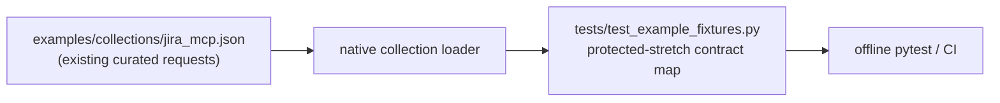

# PYPOST-1027: Lock stretch Jira MCP request IDs in fixture contract tests

## Research

### Requirements and current baseline

- `10-requirements.md` defines a deliberately narrow, offline regression
  hardening task: preserve three existing agent workflows without changing the
  Jira MCP collection or PyPost runtime.
- `tests/test_example_fixtures.py` is already the native-loader contract
  boundary.  It imports `examples/collections/jira_mcp.json`, has a 30-second
  module timeout, checks a request-count floor and locked required IDs, and
  uses `_has_request()` to check selected method/path contracts.
- The collection already contains all three protected requests:
  `jira-get-worklog`, `jira-move-issues-to-backlog`, and
  `jira-search-assignable-users`.  The backlog request is currently protected
  by the prior required-capability test; worklog and assignable-user search
  are not.  No collection JSON, environment, credentials, live endpoint, or
  product-code change is needed for this story.

### Jira operation evidence

Official Atlassian Cloud API documentation confirms the committed request
shapes that this test must preserve:

| Protected request ID | Intended operation | Evidence |
| --- | --- | --- |
| `jira-get-worklog` | `GET /rest/api/3/issue/{issueIdOrKey}/worklog` | The Jira Platform worklogs reference describes **Get issue worklogs** at this path. |
| `jira-move-issues-to-backlog` | `POST /rest/agile/1.0/backlog/issue` | The Jira Software backlog reference defines this as moving issues to backlog, equivalent to removing active/future sprint membership. |
| `jira-search-assignable-users` | `GET /rest/api/3/user/assignable/search` | The Jira Platform user-search reference exposes the assignable-user search endpoint at this path. |

The research only validates the fixed route/method markers.  The resulting
test remains offline and does not call Jira or require live credentials.

## Implementation Plan

1. **Step 3 — create the red contract repro.** In
   `tests/test_example_fixtures.py`, add the three-ID protected-stretch
   expectation to the existing required-capability assertion before changing
   the implementation-side contract data.  On the baseline, the assertion
   must fail and name the currently unprotected IDs
   (`jira-get-worklog`, `jira-search-assignable-users`).  Retain the module
   `pytest.mark.timeout(30)` and native JSON loader; do not mutate the shipped
   fixture or make a network call.
2. **Step 4 — make the contract complete.** Introduce one immutable,
   data-driven tuple table in the same test module from each protected request ID
   to its expected HTTP method and route markers.  Use it to add every ID to
   the required-ID check and to run one focused parametrized operation check.
   Keep using `_has_request()` rather than adding a production helper.
3. **Diagnostic design.** The missing-ID assertion must report the sorted
   request IDs.  Each operation assertion must include the exact request ID
   and intended `METHOD path` in its failure message, so an ID replacement,
   method change, or route drift points directly to the broken capability.
4. **Verification.** Run the focused fixture contract test and the relevant
   project test target.  Demonstrate that a removed ID, changed ID, changed
   method, and changed route marker each make the focused contract fail; these
   are local, deterministic mutations only and must not be committed.

### Mandatory — Failing Repro (next Step 3)

Write the red assertion in `tests/test_example_fixtures.py` against the
existing native-loaded collection.  It will assert that the required-ID
contract includes the three protected stretch IDs, while the current
implementation-side `REQUIRED_JIRA_MCP_REQUEST_IDS` has only the backlog
request.  The baseline failure therefore establishes the missing regression
protection without falsely claiming that the shipped JSON is broken.

Step 4 will make that same test green by making the fixture-contract data and
its method/route checks explicitly cover all three already-correct requests.
It must not weaken the assertion, alter the collection, or use a live Jira
dependency.

## Architecture

### Module diagram



### Responsibilities and dependencies

| Component | Responsibility | Change |
| --- | --- | --- |
| `examples/collections/jira_mcp.json` | Source of the three established MCP request definitions. | None; its behavior and inventory remain unchanged. |
| Native collection loader | Deserializes the committed collection into `Collection` / `RequestData`. | None; remains the contract's source of truth. |
| `tests/test_example_fixtures.py` | Declares the protected ID-to-operation contract, loads the fixture, and produces focused diagnostics. | Add the narrow contract map and tests. |
| PyPost MCP runtime | Consumes `expose_as_mcp` requests at runtime. | None; this story only protects its fixture input. |

The test module depends on the existing import path and `_has_request()`
predicate.  It owns no network client and creates no new abstraction: a
module-level immutable mapping is sufficient because the contract is static,
small, and already lives in that test module.

### Main interface / contract

The new private test-data interface is conceptually an immutable tuple table:

```python
PROTECTED_STRETCH_JIRA_MCP_OPERATIONS = (
    ("jira-get-worklog", "GET", ("/rest/api/3/issue/", "/worklog")),
    ("jira-move-issues-to-backlog", "POST", ("/rest/agile/1.0/backlog/issue",)),
    ("jira-search-assignable-users", "GET", ("/rest/api/3/user/assignable/search",)),
)
```

The implementation must retain this immutable shape (or an equivalent
immutable record) as the single source of truth for the three rows.  The test
will pass each row's ID, method, and markers to `_has_request()` and retain the
existing overall required-ID set.  It intentionally asserts route *markers*,
not an absolute host or every query parameter, so placeholder configuration
and unrelated request metadata remain outside this narrowly scoped contract.

### Interaction and failure flow

```text
Contributor changes Jira MCP collection or contract
  -> native loader reads committed JSON offline
  -> ID-set check verifies every protected capability is present
  -> per-capability method/path check verifies its intended Jira operation
  -> pytest reports the missing or drifted request ID and expected operation
```

### Selected patterns and justification

| Pattern | Decision and reason |
| --- | --- |
| Data-driven contract table | One small mapping avoids three duplicated, drifting assertion blocks while preserving readable request IDs in pytest output. |
| Native-loader boundary | Validates the same parsed representation used by the application; no fragile raw-JSON parsing or live Jira dependency. |
| Explicit ID plus method/path markers | An ID alone cannot detect an operation swap; a full API snapshot would exceed the defined scope. |
| Reuse existing `_has_request()` | Keeps behavior and test style consistent, avoiding needless helper or runtime changes. |
| No fixture mutation in production changes | The collection is already correct; modifying it would violate the task's regression-only scope. |

## Q&A

**Q: Why does the contract include `jira-move-issues-to-backlog` when it is
already partly checked?**

**A:** The task protects one coherent three-capability stretch set.  Moving it
into the single protected-operation table prevents that earlier isolated check
from drifting and gives it the same diagnostics as worklog and assignable-user
search.

**Q: Why not freeze every request field or the complete collection inventory?**

**A:** Requirements explicitly reject broad parity/inventory freezing.  The
three IDs and their method/route markers are the smallest contract that guards
the named agent workflows.

**Q: Does route checking verify Jira is reachable or current at runtime?**

**A:** No.  This is an offline fixture contract.  It protects committed intent;
endpoint freshness and live credentials are separately scoped work.

**Q: Which sources informed the expected operations?**

**A:** Atlassian's official references: [Get issue worklogs](https://developer.atlassian.com/cloud/jira/platform/rest/v3/api-group-issue-worklogs/), [Move issues to backlog](https://developer.atlassian.com/cloud/jira/software/rest/api-group-backlog/), and [User search](https://developer.atlassian.com/cloud/jira/platform/rest/v3/api-group-user-search/), accessed 2026-08-03.
