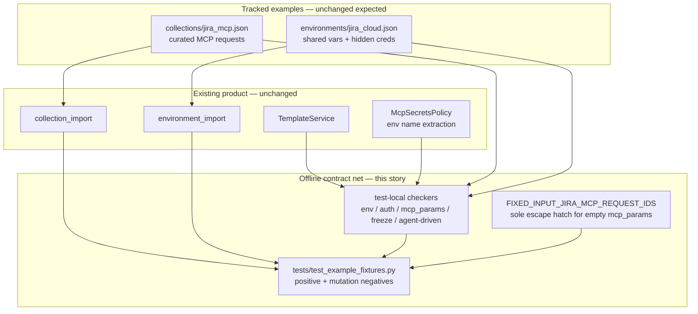

# PYPOST-1028: Strengthen Jira MCP fixture contracts for env, auth, and MCP parameters

## Research

### Requirements and baseline

- [PYPOST-1028](https://pypost.atlassian.net/browse/PYPOST-1028) — Debt follow-up
  from [PYPOST-1026](https://pypost.atlassian.net/browse/PYPOST-1026) TD-2: harden
  offline fixture contracts for companion environment keys, Basic auth
  convention, `mcp.request.*` ↔ `mcp_params` agreement, and agent-driven
  query/body inputs (or an explicit fixed-input allowlist).
- `10-requirements.md` — test/fixture-contract hardening only; no new Jira
  capabilities; no live Jira, network, credentials, or core runtime redesign.
- `00-roadmap.md` — Step 1 complete (`[x]`); Step 2 in progress (`[/]`).
- Languages: Python for `tests/test_example_fixtures.py`
  (`.cursor/lsr/do-python.md`); English Markdown artifacts
  (`.cursor/lsr/do-markdown.md`). Shipped JSON fixtures are inputs under test,
  not a feature surface to expand.

### Current fixture and contract state

| Artifact | Role today |
| -------- | ---------- |
| `examples/collections/jira_mcp.json` | 23 MCP-exposed curated Jira requests |
| `examples/environments/jira_cloud.json` | `jira_base_url`, `jira_project_key`, `jira_credentials` (hidden); `enable_mcp` |
| `tests/test_example_fixtures.py` | Import, capability floor, stretch locks, numeric IDs, project soft-guidance, placeholders |

Existing tests prove importability, required request ids/paths, placeholder
hygiene, and soft project guidance. They do **not** systematically assert:

1. every environment template name used by the collection exists in the
   companion environment;
2. every request keeps `Authorization: Basic {{ base64(jira_credentials) }}`;
3. every `mcp.request.<name>` usage has a matching `mcp_params` key;
4. empty `mcp_params` is allowed only for an explicit fixed-input allowlist
   (frozen set equality / subset), and agent-driven query/body values imply
   non-empty `mcp_params` unless the request id is that same allowlist.

### Inventory of the four agreements (offline scan, 2026-08-03)

Companion env keys: `jira_base_url`, `jira_project_key`, `jira_credentials`
with `hidden_keys == {"jira_credentials"}`.

Per-request scan of the shipped collection (native JSON + model fields):

| Agreement | Current shipped state |
| --------- | --------------------- |
| Env coverage | All referenced env names (`jira_base_url`, `jira_credentials`, and `jira_project_key` on `jira-list-boards`) are present |
| Auth convention | All 23 requests use `Basic {{ base64(jira_credentials) }}` |
| `mcp.request.*` ↔ `mcp_params` | Every broad `mcp.request.<name>` usage has a matching `mcp_params` key |
| Agent-driven + empty mcp_params | Query/body `mcp.request.*` ⇒ non-empty `mcp_params`; empty-`mcp_params` ids match the two candidates below |

Intentional empty-`mcp_params` requests (candidates for the fixed-input
allowlist):

| Request id | Why empty `mcp_params` is intentional |
| ---------- | ------------------------------------- |
| `jira-get-current-user` | Read-only `/myself` smoke; no agent inputs |
| `jira-list-boards` | Query bound to env `jira_project_key` + hardcoded `maxResults`; pagination parameterization is [PYPOST-1029](https://pypost.atlassian.net/browse/PYPOST-1029), not this story |

So Step 4 is expected to add **tests and a small allowlist constant**, not to
rewrite the curated collection. Fixture JSON changes are out of scope unless a
later step finds a genuine agreement gap.

### Production discovery gap (important for contract design)

`McpSecretsPolicy.extract_mcp_request_variables` matches only bare

```text
{{ mcp.request.VAR }}
```

It does **not** discover function-wrapped forms such as

```text
{{ to_int(mcp.request.board_id) }}
{{ to_int(mcp.request.sprint_id) }}
```

Those identifiers still work at `list_tools` time because
`resolve_mcp_param_specs` merges **explicit** `mcp_params` entries. The
fixture contract must therefore scan for `mcp.request.<name>` in URL, headers,
query params, and body with a **broader** pattern (or equivalent string scan),
not reuse the narrow secrets-policy regex alone. Fixing production discovery is
out of scope (core runtime); document as follow-up debt if desired.

### External / industry context

Contract-testing practice for MCP tool surfaces treats schemas and parameter
declarations as CI-gated agreements: snapshot or statically verify that
declared inputs match what callers need, fail on drift, and keep checks
offline where possible
([mcpward](https://github.com/TsvetanG2/mcpward),
[Specmatic on schema drift](https://specmatic.io/demonstration/exposed-mcp-servers-are-lying-about-their-schemas/),
[MCP testing CI guidance](https://niteagent.com/blog/2026-06-09-mcp-server-testing-ci-cd-guide/)).
This story applies the same idea to curated fixture JSON: local, deterministic
agreement checks without a live MCP server or Jira tenant.

Atlassian Basic auth for REST remains the published credential pattern for the
example
([Basic auth for REST APIs](https://developer.atlassian.com/cloud/jira/platform/basic-auth-for-rest-apis/)).

### Architectural decision: where the contracts live

| Option | Pros | Cons |
| ------ | ---- | ---- |
| **A. Extend `tests/test_example_fixtures.py` only** | Matches TD-2 and prior Jira fixture stories; reuses loaders/helpers; no product surface | Module grows; keep helpers local and focused |
| B. New production `pypost/` validator module | Reusable outside tests | Out of scope; risks runtime redesign |
| C. Change collection/env JSON to “fix” contracts | Unnecessary — inventory already complies | Violates “no capability / behavior change” |

**Decision: Option A.** Add focused offline assertions (and small test-local
helpers / allowlist) in the existing fixture-contract module. Do not change
`pypost/` packages or curated request behavior unless a real gap appears.

### Definition of the four contracts

1. **Companion env coverage** — Union of environment template names referenced
   by every request’s URL, headers, params, and body (via
   `TemplateService` + `McpSecretsPolicy.extract_environment_variable_names`,
   or equivalent) must be a subset of companion `environment.variables`.
   Keep existing secret/non-secret rules: `jira_credentials` hidden;
   `jira_base_url` and `jira_project_key` not hidden.
2. **Credential convention** — For every shipped request,
   `headers["Authorization"] == "Basic {{ base64(jira_credentials) }}"`.
3. **MCP input declaration** — For every `mcp.request.<name>` occurrence in
   URL/headers/params/body (including function-wrapped forms),
   `name in request.mcp_params`. Diagnostics name `request.id` and `name`.
4. **Fixed-input allowlist (single escape hatch)** — One test-module frozenset
   `FIXED_INPUT_JIRA_MCP_REQUEST_IDS` (starts as
   `{"jira-get-current-user", "jira-list-boards"}`; reviewable; PYPOST-1029
   may later remove `jira-list-boards`) is the **only** permitted reason for
   empty `mcp_params`. The contract enforces both directions so the allowlist
   is not documentation-only:

   - **Freeze (empty `mcp_params`):**
     `{r.id for r in requests if not r.mcp_params} == FIXED_INPUT_JIRA_MCP_REQUEST_IDS`
     (exact equality preferred; ⊆ of the allowlist is acceptable only if a
     later step documents a temporary subset while fixtures still match). Any
     non-allowlisted request with empty `mcp_params` **must fail**, even when
     it has no `mcp.request.*` in query/body.
   - **Agent-driven query/body:** If `params` values or `body` contain
     `mcp.request.`, then `mcp_params` must be non-empty **or** `request.id`
     is in that same allowlist.

   Allowlisted ids may keep empty `mcp_params`; every other id must declare
   agent inputs. Contract 3 (name ⊆ `mcp_params` keys) still applies to any
   `mcp.request.*` that appears.

## Implementation Plan

Test-only hardening in Step 3–4. No application-package feature work. No
expected edits to `jira_mcp.json` / `jira_cloud.json` given the Research
inventory.

1. **Freeze allowlist and helper APIs in the test module** — Document
   `FIXED_INPUT_JIRA_MCP_REQUEST_IDS` and shared checkers used by positive and
   negative tests, including the empty-`mcp_params` freeze assertion.
2. **Env coverage test** — Load companion env + collection; assert referenced
   env names ⊆ env variables; retain hidden/non-hidden secret rules already
   partially covered by soft-guidance tests.
3. **Per-request auth test** — Assert exact Basic `base64(jira_credentials)`
   header on every request (not only a collection-wide substring).
4. **MCP params coverage test** — Broad-scan `mcp.request.<name>`; assert each
   name is declared in `mcp_params`; failure message includes request id and
   missing name(s).
5. **Fixed-input allowlist + agent-driven test** — Freeze empty-`mcp_params`
   request ids against `FIXED_INPUT_JIRA_MCP_REQUEST_IDS` (equality, or
   documented ⊆); fail any non-allowlisted empty `mcp_params`. Separately,
   detect agent-driven params/body and require non-empty `mcp_params` unless
   the id is that same allowlist. Failure names the request. The allowlist is
   the single explicit escape hatch for both rules.
6. **Preserve green baselines** — Do not weaken import, capability floor,
   stretch locks, numeric-identifier, project soft-guidance, or probe-collection
   tests.
7. **Out-of-scope guard** — No pagination parameterization (PYPOST-1029), no
   live Jira, no auth redesign, no production `McpSecretsPolicy` regex change
   in this story.

**Mandatory — Failing Repro (next Step 3):**

Shipped fixtures already satisfy the four agreements, so Step 3 must **not**
break committed JSON to go red. Instead:

- Add shared checkers in `tests/test_example_fixtures.py` (or immediately
  adjacent test helpers in that module).
- **Positive tests** load real `jira_mcp.json` / `jira_cloud.json` via existing
  `_load_jira_mcp_collection` / `load_import_candidates` and assert all four
  contracts.
- **Negative (mutation) tests** `copy.deepcopy` a loaded request or env,
  deliberately break one agreement at a time, and assert the shared checker
  fails with a diagnostic that names the missing key or `request.id`.

Sequencing: research (this doc) → write mutation tests that call missing
checkers (red) → implement checkers + positive shipped-fixture tests until
green → run focused module via `make test` with
`PYTEST_ARGS=tests/test_example_fixtures.py`. No live Jira, network, MCP
server, or real secrets. Module keeps `pytestmark = pytest.mark.timeout(30)`.

Concrete mutation cases for Step 3:

| Mutation | Expected diagnostic signal |
| -------- | -------------------------- |
| Remove `jira_base_url` from env variables | Missing companion key `jira_base_url` |
| Clear or alter one request’s `Authorization` | Request id + auth convention breach |
| Drop `issue_key` from `mcp_params` while URL still has `mcp.request.issue_key` | Request id + missing `mcp_params` key |
| Clear `mcp_params` on a non-allowlisted id | Request id + empty `mcp_params` outside allowlist |
| Set body to `{{ mcp.request.x }}` with empty `mcp_params` on a non-allowlisted id | Request id + agent-driven without inputs |
| Drift empty-`mcp_params` set vs allowlist | Freeze mismatch vs `FIXED_INPUT_JIRA_MCP_REQUEST_IDS` |

Step 4 turns the suite green by implementing the checkers and freezing the
allowlist; fixture JSON remains unchanged unless a real gap is found.

## Architecture

### Module diagram



### Module responsibilities

| Module | Responsibility |
| ------ | -------------- |
| `examples/collections/jira_mcp.json` | Source of request templates, auth headers, `mcp_params` (read-only for this story) |
| `examples/environments/jira_cloud.json` | Companion shared configuration and sensitivity flags (read-only expected) |
| `collection_import` / `environment_import` | Unchanged native loaders used by contract tests |
| `TemplateService` + `McpSecretsPolicy.extract_environment_variable_names` | Discover env template names referenced by a request |
| Broad `mcp.request.<name>` scan (test-local) | Discover agent inputs including `to_int(...)` wrappers |
| Fixed-input allowlist constant | Sole escape hatch: freeze empty-`mcp_params` ids; shared by agent-driven |
| `tests/test_example_fixtures.py` | Positive regression + mutation diagnostics for the four agreements |

### Interaction flow

```text
Contributor edits jira_mcp.json or jira_cloud.json
        → native loaders parse fixtures offline
        → checkers verify env ⊆ companion keys
        → checkers verify per-request Basic auth convention
        → broad mcp.request scan ⊆ mcp_params keys
        → empty mcp_params ids == FIXED_INPUT allowlist (freeze)
        → agent-driven query/body ⇒ mcp_params or same allowlist
        → green: agents keep a dependable curated starting point
        → red: diagnostic names request id / missing key before merge
```

### Selected patterns and justification

| Pattern | Why |
| ------- | --- |
| Extend existing fixture-contract module | Matches PYPOST-1026 TD-2 and sibling Jira stories; lowest churn |
| Test-local checkers, not production validators | Scope discipline; requirements forbid runtime redesign |
| Broad `mcp.request` scan in tests | Closes `to_int(mcp.request.*)` blind spot without changing secrets policy |
| Exact auth header equality | Stronger than collection-wide substring; pinpoints the broken request |
| Explicit fixed-input allowlist + freeze | Empty `mcp_params` only for allowlisted ids; set equality enforces the hatch |
| Mutation negatives + positive shipped tests | Provides failing repro without vandalizing committed placeholders |
| Offline / placeholder-only | Secret-safe, deterministic CI |

### Main interfaces

- **Fixtures → loaders:** unchanged native `Collection` / `Environment` JSON.
- **Loaders → checkers:** in-memory `RequestData` / environment models.
- **Checkers → pytest:** raise `AssertionError` with request id and missing
  agreement details (no secret values in messages).
- **Allowlist → empty-`mcp_params` freeze:** frozenset
  `FIXED_INPUT_JIRA_MCP_REQUEST_IDS` compared to
  `{r.id for r in requests if not r.mcp_params}` (equality preferred; ⊆ only
  if documented). Non-allowlisted empty `mcp_params` always fails — including
  requests with no `mcp.request.*` in query/body.
- **Allowlist → agent-driven rule:** the **same** frozenset is the sole escape
  hatch when query/body is agent-driven and `mcp_params` would otherwise be
  required. No second exception list.
- **Existing tests → new tests:** additive; do not relax capability, stretch,
  numeric-id, or soft-guidance contracts.

### Out of scope (explicit non-modules)

- Adding/removing/renaming Jira MCP requests or changing their HTTP behavior.
- Parameterizing `maxResults` / pagination (PYPOST-1029).
- Changing credential format or committing real secrets.
- Live Jira, browser, UI-import, or network-dependent validation.
- Widening `McpSecretsPolicy` discovery for function-wrapped placeholders
  (optional later debt; not required for this fixture contract).
- Core import/export or MCP server redesign.

## Q&A

**Q: Do we need to change `jira_mcp.json` or `jira_cloud.json`?**

**A:** Not expected. Offline inventory shows the four agreements already hold;
this story hardens tests so future drift fails CI.

**Q: Why an allowlist if agent-driven requests already have `mcp_params`?**

**A:** Fixed-input requests (`jira-get-current-user`, `jira-list-boards`)
intentionally omit agent inputs. Contract 4 freezes
`{r.id for r in requests if not r.mcp_params}` against
`FIXED_INPUT_JIRA_MCP_REQUEST_IDS`, so empty `mcp_params` cannot silently
cover accidental omissions on other requests — even when those requests have
no `mcp.request.*` in query/body (which would never trip an agent-driven-only
rule). The same allowlist is the sole escape hatch for the agent-driven
query/body rule. `jira-list-boards` may leave the allowlist when PYPOST-1029
parameterizes it.

**Q: Why not call `extract_mcp_request_variables` alone?**

**A:** It misses `to_int(mcp.request.*)` path identifiers. The contract must
use a broader scan so those usages still require matching `mcp_params` keys
(the metadata that actually publishes them to agents today).

**Q: Is Step 3 N/A because fixtures already pass?**

**A:** No. Step 3 uses mutation-based failing repros against shared checkers,
plus positive tests on shipped fixtures. That yields a real red→green path
without editing committed placeholders.

**Q: Will production code change?**

**A:** No application package change is planned. Only the fixture-contract
test module (helpers + assertions + allowlist).

**Q: Live Jira or real credentials?**

**A:** No. Deterministic offline checks with existing placeholders only.

External refs:

- <https://pypost.atlassian.net/browse/PYPOST-1028>
- <https://pypost.atlassian.net/browse/PYPOST-1026>
- <https://pypost.atlassian.net/browse/PYPOST-1029>
- <https://developer.atlassian.com/cloud/jira/platform/basic-auth-for-rest-apis/>
- <https://github.com/TsvetanG2/mcpward>
- <https://specmatic.io/demonstration/exposed-mcp-servers-are-lying-about-their-schemas/>
- <https://niteagent.com/blog/2026-06-09-mcp-server-testing-ci-cd-guide/>
