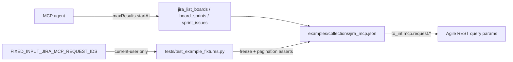

# PYPOST-1029: Parameterize pagination mcp_params on board/sprint lists

## Research

### Requirements and baseline

- [PYPOST-1029](https://pypost.atlassian.net/browse/PYPOST-1029) — Debt
  follow-up from [PYPOST-1026](https://pypost.atlassian.net/browse/PYPOST-1026)
  TD-3: expose pagination on board/sprint list MCP tools via `mcp_params`,
  replace empty `mcp_params` on `jira-list-boards`, and remove that id from
  `FIXED_INPUT_JIRA_MCP_REQUEST_IDS` ([PYPOST-1028](https://pypost.atlassian.net/browse/PYPOST-1028)).
- Languages: Python tests (`.cursor/lsr/do-python.md`); Markdown artifacts
  (`.cursor/lsr/do-markdown.md`); curated JSON fixture inputs.

### Current shipped state (offline scan)

| Request id | Query today | `mcp_params` today |
| ---------- | ----------- | ------------------ |
| `jira-list-boards` | `maxResults=50`, `projectKeyOrId={{ jira_project_key }}` | `{}` (allowlisted) |
| `jira-list-board-sprints` | `state={{ mcp.request.state }}`, `maxResults=50` | `board_id`, `state` |
| `jira-get-sprint-issues` | `maxResults=50` | `sprint_id` |

`FIXED_INPUT_JIRA_MCP_REQUEST_IDS` currently freezes
`{"jira-get-current-user", "jira-list-boards"}`. After this story it must be
`{"jira-get-current-user"}` only.

Numeric path ids already use `integer_or_string` + `{{ to_int(mcp.request.*) }}`
(PYPOST-1038). Pagination integers should follow the same pattern so agents
may pass native ints or decimal strings.

### External API context

Atlassian Agile REST list endpoints historically paginate with `startAt` and
`maxResults` ([Board API](https://developer.atlassian.com/cloud/jira/software/rest/api-group-board/),
[Sprint API](https://developer.atlassian.com/cloud/jira/software/rest/api-group-sprint/),
[Pagination overview](https://docs.atlassian.com/software/jira/docs/api/REST/1000.1570.0/)).
Some Agile *issue* list endpoints are moving to `nextPageToken` + `maxResults`
(token pagination; offset `startAt` scheduled for removal on a subset of
endpoints). The curated fixture still calls classic
`/rest/agile/1.0/...` list routes that accept `maxResults` and `startAt`
today. This story parameterizes those query names; migrating to token
pagination is out of scope (follow-up debt if desired).

### Template defaulting constraint

PyPost's allowed template functions are `urlencode`, `md5`, `base64`, and
`to_int` only — there is no `| default(...)` filter for omitted MCP args.
Therefore pagination query values bound to `mcp.request.*` must be
**required** agent inputs (descriptions guide typical `50` / `0` values).
Adding runtime defaults for optional MCP params is out of scope.

## Implementation Plan

1. **Fixture** — In `examples/collections/jira_mcp.json`, for the three
   request ids:
   - Bind `params.maxResults` to
     `{{ to_int(mcp.request.maxResults) }}`.
   - Bind `params.startAt` to
     `{{ to_int(mcp.request.startAt) }}`.
   - Declare `maxResults` and `startAt` in `mcp_params` as
     `integer_or_string`, `required: true`, with clear descriptions
     (page size; 0-based offset; typical first-page values 50 and 0).
   - Keep existing params (`projectKeyOrId` env, `state`, path ids) unchanged.
2. **Allowlist** — In `tests/test_example_fixtures.py`, set
   `FIXED_INPUT_JIRA_MCP_REQUEST_IDS = frozenset({"jira-get-current-user"})`
   and refresh comments that mention PYPOST-1029 / list-boards.
3. **Contracts** — Add focused assertions that the three requests declare
   and bind `maxResults` / `startAt`; keep existing PYPOST-1028 checkers
   green.
4. **Docs** — Update `doc/dev/testing.md` (and related MCP/Jira example
   notes) for the narrowed allowlist and pagination inputs.

**Failing Repro (Step 3):** Before any fixture/allowlist fix, add automated
tests in `tests/test_example_fixtures.py` that assert the **desired** end
state:

- Each of the three request ids has `maxResults` and `startAt` keys in
  `mcp_params` (`integer_or_string`, required) and uses
  `mcp.request.maxResults` / `mcp.request.startAt` (via `to_int`) in query
  params.
- `FIXED_INPUT_JIRA_MCP_REQUEST_IDS == frozenset({"jira-get-current-user"})`
  and empty-`mcp_params` freeze still holds against the shipped collection.

Run with `make test PYTEST_ARGS='tests/test_example_fixtures.py -k pagination -v'`
(or the dedicated test names). Expect RED today because fixtures still
hard-code `maxResults` and list-boards remains allowlisted. No production
`pypost/` package change is required for the green path — fixture + test
module only. Sequencing: research → red tests → fixture/allowlist until
green → cleanup/docs.

## Architecture

| Module | Responsibility |
| ------ | -------------- |
| `examples/collections/jira_mcp.json` | Bind and declare pagination agent inputs on three list requests |
| `tests/test_example_fixtures.py` | Narrow allowlist; assert pagination `mcp_params` / query bindings |
| `MCPServerImpl` / template stack | Unchanged — already publishes explicit `mcp_params` and renders `to_int` |
| `doc/dev/testing.md` | Document allowlist and pagination contract |

**Pattern:** Fixture-only parameterization matching PYPOST-1032 / 1038 style;
reuse `integer_or_string` + `to_int` for query integers; keep PYPOST-1028
checkers as the agreement gate.

## Q&A

| Question | Answer |
| -------- | ------ |
| Why require maxResults/startAt instead of optional with default 50/0? | No safe template default filter exists; empty omitted values would send blank query params. |
| Why include startAt now? | Ticket allows it; classic Agile list routes still accept offset pagination; improves agent page walking. |
| Why not switch to nextPageToken? | Fixture still uses classic routes; token migration is a separate debt item. |
| Why remove list-boards from the allowlist? | Non-empty `mcp_params` for pagination ends the intentional empty-input exception. |
