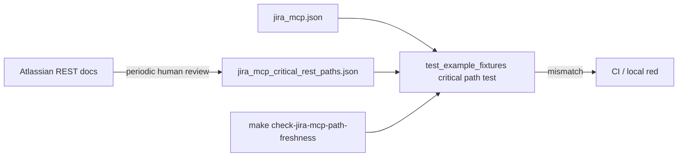

# PYPOST-1030: Periodic freshness check for jira-mcp REST paths

## Research

### Requirements and baseline

- [PYPOST-1030](https://pypost.atlassian.net/browse/PYPOST-1030) — Debt
  follow-up from [PYPOST-1026](https://pypost.atlassian.net/browse/PYPOST-1026)
  TD-4: periodic human or scripted check that critical Jira Cloud / Agile
  paths in `jira_mcp.json` still match current Atlassian REST docs.
- Languages: Python tests (`.cursor/lsr/do-python.md`); Markdown
  (`.cursor/lsr/do-markdown.md`); curated JSON catalog + collection.
- Existing contracts in `tests/test_example_fixtures.py` already lock some
  capability ids/paths, but there is no dedicated checked-in catalog or
  Makefile freshness target focused on the TD-4 critical set, and no
  maintainer checklist for refreshing that lock after doc review.

### Current shipped critical markers (offline scan)

| Request id | Method | Path markers today |
| ---------- | ------ | ------------------ |
| `jira-search-issues-jql` | POST | `/rest/api/3/search/jql` |
| `jira-create-sprint` | POST | `/rest/agile/1.0/sprint` (exact create URL, no trailing id) |
| `jira-add-issues-to-sprint` | POST | `/rest/agile/1.0/sprint/` + `/issue` |
| `jira-link-issue-parent` | PUT | `/rest/api/3/issue/` + `parent_payload` MCP input |
| `jira-assign-issue` | PUT | `/rest/api/3/issue/` + `/assignee` |

### External API context (Atlassian docs, 2026)

- **Enhanced JQL search:** Atlassian documents
  `POST /rest/api/3/search/jql` as the supported search path; legacy
  `/rest/api/3/search` is deprecated/removed on Jira Cloud
  ([Issue search API](https://developer.atlassian.com/cloud/jira/platform/rest/v3/api-group-issue-search/),
  [KB migrate to search/jql](https://confluence.atlassian.com/jirakb/run-jql-search-query-using-jira-cloud-rest-api-1289424308.html)).
- **Sprint create / membership:** Agile REST
  `POST /rest/agile/1.0/sprint` and
  `POST /rest/agile/1.0/sprint/{sprintId}/issue`
  ([Sprint API](https://developer.atlassian.com/cloud/jira/software/rest/api-group-sprint/)).
- **Parent / epic link:** Prefer `fields.parent` on issue update over
  deprecated Epic Link custom field
  ([Issues API](https://developer.atlassian.com/cloud/jira/platform/rest/v3/api-group-issues/)).
- **Assignee:** Dedicated
  `PUT /rest/api/3/issue/{issueIdOrKey}/assignee`.

This story does **not** fetch those docs in CI. Maintainers periodically
confirm the locked catalog still matches docs, then update the catalog if
paths change; CI only compares collection ↔ catalog.

## Implementation Plan

1. **Catalog** — Add checked-in
   `examples/collections/jira_mcp_critical_rest_paths.json` listing the five
   critical entries (id, method, `url_contains`, optional notes / doc refs).
2. **Contract test** — In `tests/test_example_fixtures.py`, load the catalog
   and assert each entry exists in `jira_mcp.json` with matching method and
   path markers (and parent MCP input for epic link). Fail clearly on
   missing catalog, missing request, or drift.
3. **Makefile** — Add `check-jira-mcp-path-freshness` that runs the focused
   pytest (no credentials, no network).
4. **Docs** — Document the catalog, Makefile target, and a short human
   checklist in `doc/dev/` (extend `testing.md` and/or a small dedicated
   page; link from `doc/dev/README.md`).

**Failing Repro (Step 3):** Before creating the catalog or Makefile target,
add an automated test that asserts the **desired** end state: a checked-in
critical-path catalog exists next to the collection and every catalog entry
matches the loaded `jira_mcp.json` request. Run via
`make test PYTEST_ARGS='tests/test_example_fixtures.py -k critical_rest_path -v'`.
Expect RED today because the catalog file is absent (FileNotFound / assert).
No `pypost/` package change required for green. Sequencing: research → red
test → catalog + Makefile + docs until green → cleanup.

## Architecture

| Module | Responsibility |
| ------ | -------------- |
| `examples/collections/jira_mcp_critical_rest_paths.json` | Locked expected method/path markers + doc review metadata |
| `examples/collections/jira_mcp.json` | Curated collection under test (unchanged unless drift fix needed) |
| `tests/test_example_fixtures.py` | Offline compare collection ↔ catalog |
| `Makefile` | `check-jira-mcp-path-freshness` convenience target |
| `doc/dev/*` | Checklist + how to refresh after Atlassian doc changes |

**Pattern:** Catalog-as-lockfile (same spirit as PYPOST-1027/1028 frozen
capability sets), offline-only, Makefile wrapper for maintainer ritual.

## Q&A

| Question | Answer |
| -------- | ------ |
| Why a JSON catalog file vs only Python frozensets? | Humans update JSON after doc review; Python test stays thin and fails when the file is missing. |
| Why not lock all 20+ requests? | Ticket scopes critical paths only; existing capability tests cover broader ids. |
| Why keep collection paths as they are today? | Offline scan already matches current Atlassian docs for the critical set; story adds the gate, not a path migration. |
