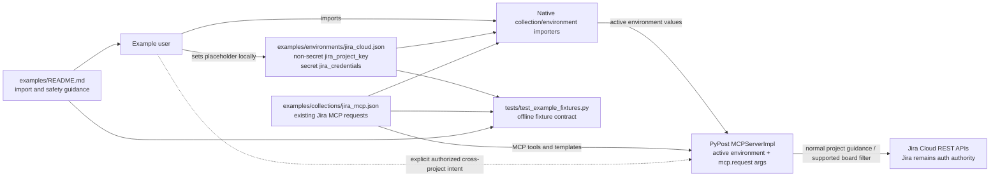

# PYPOST-1032: Soft-scope Jira MCP examples to one project

## Research

### Repository findings

- The shipped end-user pair is already deliberately fixture-only:
  `examples/environments/jira_cloud.json` supplies environment values and
  `examples/collections/jira_mcp.json` supplies the MCP-exposed requests.
  Native import parsing is covered by `tests/test_example_fixtures.py`; no
  PyPost runtime feature or external MCP-server configuration is needed.
- `MCPServerImpl` merges active-environment variables with per-call
  `mcp.request.*` arguments before rendering a request. Environment values are
  therefore appropriate for a project default in request URL/query templates,
  while the JSON payload inputs for issue search and creation remain caller
  controlled.
- `mcp_description` and `mcp_params` are agent-visible metadata, not a Jira
  authorization mechanism. They are the correct place to state the preferred
  project and the deliberate cross-project escape hatch. In particular, a
  serialized `search_payload` or `issue_payload` is inserted as one MCP
  argument, so this fixture change must not claim that PyPost merges or
  validates a `project` member inside it.
- The existing offline fixture test module has `pytestmark =
  pytest.mark.timeout(30)`, matching the Python/testing rules for the planned
  deterministic contract test.

### External API check (2026-08-02)

- Jira's enhanced JQL search accepts a JQL expression such as `project =
  HSP`; Jira still filters results by the caller's Jira permissions. This
  supports a soft preferred-project instruction but not a security claim.
  [Jira Cloud issue-search reference](https://developer.atlassian.com/cloud/jira/platform/rest/v3/api-group-issue-search/)
- Jira Software's `GET /rest/agile/1.0/board` supports the
  `projectKeyOrId` query parameter. It is the supported list request that can
  be directly bound to the example default. Board-, sprint-, and
  sprint-issue-addressed endpoints remain keyed by the board or sprint the
  caller deliberately selects.
  [Jira Software board reference](https://developer.atlassian.com/cloud/jira/software/rest/api-group-board/)

No live Jira account, credentials, or network call is needed or permitted for
this fixture architecture.

## Implementation Plan

1. Add one non-secret `jira_project_key` placeholder to the companion Jira
   environment. Keep `jira_credentials` the only hidden key and retain the
   current base URL, import shape, and `enable_mcp` setting.
2. Update the existing Jira MCP collection in place. Make `jira-list-boards`
   send `projectKeyOrId={{ jira_project_key }}`. Update its agent-facing
   description and the search/create payload guidance to say that the active
   environment's project is the normal starting point, and that a user may
   deliberately request an authorized different project. Do not add a new
   server, credentials, permission checks, or an unbounded set of Jira tools.
3. For list endpoints that Jira does not directly project-filter (for example,
   sprints fetched from a selected board and issues fetched from a selected
   sprint), preserve the existing endpoint and explicitly describe that its
   scope is the chosen board/sprint, not a simulated project restriction.
4. Update the Jira import instructions and coverage table in `examples/README.md`
   so users set the project key locally and readers see the soft-guidance,
   non-security limitation before importing the collection.
5. Add an offline contract test in the existing fixture test module. It must
   load the JSON through the native import paths, then assert the project
   placeholder, supported board query binding, agent-facing default/cross-project
   wording, and user-facing non-security wording.

**Mandatory — Failing Repro (next Step 3):** Add
`test_jira_project_default_is_wired_as_soft_guidance` to
`tests/test_example_fixtures.py` before editing the shipped fixtures. The test
will load `jira_cloud.json` with `load_import_candidates` and
`jira_mcp.json` with `_load_jira_mcp_collection`, then assert all of the
following desired behavior:

- `environment.variables["jira_project_key"]` is an obvious placeholder,
  is not in `hidden_keys`, and leaves credentials as the only secret;
- `jira-list-boards` has a `projectKeyOrId` template using
  `{{ jira_project_key }}`;
- the existing JQL-search and create-issue MCP descriptions/parameter
  guidance name `jira_project_key` as the normal project default and say a
  different permitted project may be used when explicitly requested;
- board/sprint list guidance distinguishes directly project-scoped board
  listing from board- or sprint-scoped calls; and
- `examples/README.md` tells an importer how to set the key and says it is
  not an authorization, permission, or security boundary.

Run that focused test first against the current files: it fails because there
is no `jira_project_key`, board query binding, or required guidance. Then make
the fixture/documentation change until it passes, followed by the current
fixture test module. This uses committed JSON and native parsers only—no live
Jira dependency, credentials, or network access—and inherits the module's
30-second timeout marker.

## Architecture

### Module diagram

### Responsibilities and interactions

| Module | Responsibility | Interaction / boundary |
| --- | --- | --- |
| `jira_cloud.json` | Holds the chosen normal Jira project under `jira_project_key`, alongside the existing host and credential placeholders. | Imported as a normal PyPost environment. The project key is configuration guidance, not a secret and not an MCP input parameter. |
| `jira_mcp.json` | Keeps the curated 22+ request collection and makes applicable routine actions start from the environment's default. | Uses `{{ jira_project_key }}` where the REST endpoint natively supports it (`jira-list-boards`); uses precise MCP descriptions and payload guidance for search/create and unsupported list shapes. |
| `examples/README.md` | Gives the user one import/configuration path and states the security boundary correctly. | Must match the fixture keys and tool behavior; never include a real site, project, account, or token. |
| PyPost native importer and MCP execution | Existing infrastructure that imports JSON and renders a request from active environment values plus call arguments. | Unchanged. It must not be presented as parsing, merging, or enforcing arbitrary Jira payload project fields. |
| Jira Cloud REST API | Executes the eventual request and applies its own authentication, Browse/Create permissions, and endpoint behavior. | The only authorization authority. The project default cannot prevent an authorized cross-project request. |
| Offline fixture contracts | Protect importability, template wiring, documentation wording, and secret-placeholder rules. | Pure tests; no GUI, MCP listener, credential, or Jira tenant. |

The normal flow is: user imports the environment, replaces the project-key
placeholder and credentials locally, imports/selects the collection, and uses
the exposed tools. The selected environment directly filters board discovery;
agent-facing text directs issue-search/create payloads toward that project.
Once a user explicitly asks for another project, the tool remains usable with
their supplied payload and Jira decides whether it is authorized. A board or
sprint selected by that deliberate workflow keeps its native board/sprint
semantics rather than being falsely labelled project-filtered.

### Interfaces and data contracts

| Interface | Contract |
| --- | --- |
| Environment variable | `jira_project_key: "YOUR_PROJECT_KEY"` (final placeholder spelling to be locked by Step 3). It is a visible, non-secret Jira key/ID value; `hidden_keys` continues to contain only `jira_credentials`. |
| Board listing | Existing `jira-list-boards` request keeps `GET /rest/agile/1.0/board` and adds `params.projectKeyOrId = "{{ jira_project_key }}"`. Its existing pagination parameter remains unchanged. |
| JQL issue search | Existing required `search_payload: string` remains a serialized body, preserving all supported Jira search fields. Its MCP description/parameter guidance tells callers to begin JQL with the configured normal project (for example, `project = <configured key>`) unless explicit cross-project work is requested. No payload rewriting or authorization is introduced. |
| Issue creation | Existing required `issue_payload: string` remains a serialized create-issue body. Guidance says `fields.project.key` should use the configured normal project by default; a different project is allowed only on deliberate, authorized request. |
| Board/sprint list workflows | Existing `board_id`/`sprint_id` interfaces are unchanged. Their descriptions explain that these endpoints use the selected board or sprint and are not automatically project-scoped by this preference. |
| Documentation interface | Import steps name `jira_project_key`, state that it guides normal actions, and explicitly deny any permission/security enforcement. |

### Patterns and decisions

- **Configuration over runtime change:** use the established importable
  environment/collection pair, not a new PyPost setting, server feature, or
  dependency-injection path. This keeps the task within its fixture-only
  boundary.
- **Soft-default / explicit-override policy:** make the normal choice clear in
  configuration and agent metadata while leaving the existing generic payload
  interfaces capable of intentional, permitted cross-project work.
- **Capability-aligned scoping:** add a project template only where the Jira
  REST endpoint accepts one; retain native board/sprint identifiers elsewhere.
  This avoids fake project filtering and makes the scope limit observable to
  readers.
- **Contract testing at the import boundary:** verify the source-controlled
  JSON through the same parsers users receive, plus targeted textual contracts
  for safety language. This is simpler and more stable than a live Jira test.
- **Python guidance:** no Python production module is planned. The one
  pytest-based fixture contract follows the repository's existing typed,
  deterministic test layout and module timeout marker.

### Non-goals and guardrails

- No Jira permission, dedicated-account, token, or Atlassian MCP server change.
- No claim that this setting is an isolation boundary, payload validator, or
  authorization control.
- No real credentials, tenant names, or customer project keys in source control.
- No broad collection expansion: modify existing high-value action guidance and
  the one directly supported board-list parameter only.

## Q&A

**Q: Why is `jira_project_key` visible rather than hidden?**

**A:** A project key is not a credential and must be simple for the importing
user to select and edit. Hiding it would also incorrectly imply secrecy.

**Q: Why not force every supplied JQL or create payload to the environment
project?**

**A:** The requirements preserve deliberate authorized cross-project work, and
the existing payload interfaces are opaque serialized JSON. Rewriting them
would require a new runtime policy/JSON-merge feature and would turn guidance
into an unreliable pseudo-security control, both out of scope.

**Q: Which list workflow is genuinely project-scoped?**

**A:** Board discovery: Jira's board endpoint supports `projectKeyOrId`.
Follow-on sprint and sprint-issue endpoints are intentionally described by
their board/sprint input rather than falsely asserting a project filter.

**Q: Does this alter how PyPost authorizes Jira calls?**

**A:** No. PyPost continues to send the configured credentials; Jira evaluates
the account's own permissions for every request.

---

Worklog: tokens_used 6434; role execution; step 2; step_name Architecture.
