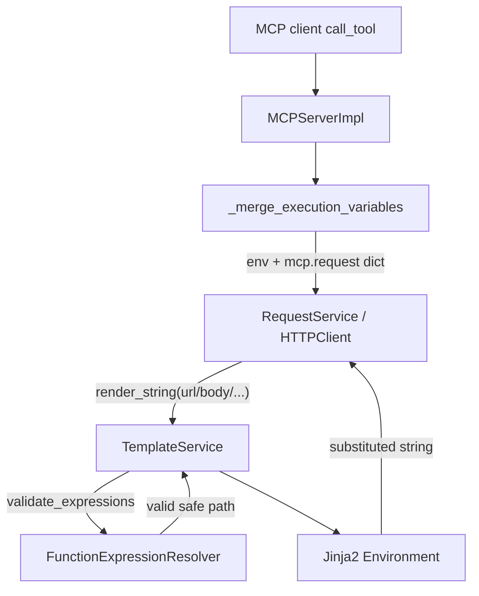

# PYPOST-1033: MCP request templates must substitute tool arguments

## Research

### Root cause (verified)

MCP already merges tool arguments into the Jinja context correctly:

```40:44:pypost/core/mcp_server_impl.py
def _merge_execution_variables(
    env_vars: dict[str, str], mcp_args: dict[str, Any]
) -> dict[str, Any]:
    """Merge active env snapshot with mcp.request namespace."""
    return {**env_vars, "mcp": {"request": mcp_args}}
```

Integration tests already assert that `call_tool` passes
`{"mcp": {"request": {...}}}` into `RequestService.execute`. The gap is **not**
merge wiring; it is **pre-render validation**.

`TemplateService.render_string` always validates via
`FunctionExpressionResolver` before Jinja render. On validation failure it
raises `ValueError`, which is caught and causes a fallback to the **original
unsubstituted** content (silent from the caller's perspective).

`FunctionExpressionResolver._IDENTIFIER_RE` only accepts a single Python-style
identifier:

```21:42:pypost/core/function_expression_resolver.py
    _IDENTIFIER_RE = re.compile(r"^[a-zA-Z_][a-zA-Z0-9_]*$")
    ...
    def _validate_expression(self, expression: str) -> ValidationResult | None:
        if self._IDENTIFIER_RE.fullmatch(expression):
            return None
```

A plain placeholder `mcp.request.issue_key` contains dots, so it fails the
identifier check, fails the function-signature parse, and returns
`invalid_syntax`. Render therefore leaves `{{ mcp.request.issue_key }}` (and
siblings) unsubstituted — matching the live jira-mcp failures (path/query/body).

Jinja itself would resolve nested dict attribute access (`mcp.request.issue_key`
against `{"mcp": {"request": {"issue_key": "..."}}}`) if validation allowed the
expression through. No MCP merge or RequestService change is required for the
happy path.

### Security baseline (must preserve)

PyPost does **not** use Jinja `SandboxedEnvironment`. Safety relies on
pre-render grammar validation + catalog allow-list
(`doc/dev/template_expression_functions.md`):

- Filters like `{{ db|md5 }}` → `invalid_syntax` (locked).
- Attribute forms like `{{ db.__class__ }}` → `invalid_syntax` (locked) via
  `test_validate_rejects_attribute_access_form` /
  `test_render_attribute_access_form_returns_original_content`.
- Nested function rules (PYPOST-453) unchanged: catalog membership, single
  argument, recursive allow-listed calls.

[Jinja2 sandbox](https://jinja.palletsprojects.com/en/stable/sandbox/) blocks
attributes starting with `_` and internal attributes. That is the reference
model for **which dotted forms stay rejected** after we allow safe paths:
segments that start with `_` (e.g. `__class__`) must remain invalid.

[OWASP Input Validation](https://cheatsheetseries.owasp.org/cheatsheets/Input_Validation_Cheat_Sheet.html)
prefers allow-listing structural form over denylisting known-bad strings. A
regex allow-list for safe dotted identifier paths is the right shape; an
MCP-string special case is a product coupling, not a stronger security control.

### Ambiguity resolution: broader safe dotted paths vs MCP-only allowlist

| Approach | Pros | Cons |
| --- | --- | --- |
| **A. MCP-only allowlist** (`mcp.request.<param>` only) | Minimal apparent surface | Couples generic grammar to MCP; other nested dicts stay broken; harder to document; security gain is illusory (same segments as a general safe path) |
| **B. Safe dotted variable paths** (chosen) | Matches Jinja nested-dict access; honors `mcp.request.*` without MCP-aware parser; one rule for plain expressions and function args; aligns with Jinja sandbox underscore policy | Slightly broader than MCP-only; must lock unsafe dotted forms with tests |

**Decision: Option B — allow safe dotted variable paths in the resolver.**

Justification:

1. Requirements define the **business contract** as `mcp.request.*` substitution,
   not an MCP-specific grammar. The merge already uses a nested dict; validation
   should accept the natural Jinja path for that dict.
2. MCP-only allowlisting still needs segment rules (identifier characters,
   reject `__class__`). Those rules are identical to a general safe-path
   allow-list, so the MCP special case adds coupling without safety.
3. Keeping the resolver MCP-agnostic preserves the existing module boundary:
   MCP owns merge; TemplateService/resolver own expression grammar.
4. Underscore-leading **attribute** segments remain rejected, so
   `{{ db.__class__ }}` and similar stay `invalid_syntax`.

### Safe-path grammar (design)

Allow expressions (and function arguments) that match a **safe variable path**:

- One or more segments separated by `.` (no empty segments, no trailing/leading
  `.`).
- First segment: `[a-zA-Z_][a-zA-Z0-9_]*` (same as today's plain identifier,
  including legacy top-level names like `_foo` if present).
- Each subsequent segment: `[a-zA-Z][a-zA-Z0-9_]*` — **must not start with `_`**
  (blocks `__class__`, `_private`, etc., consistent with Jinja sandbox private
  attribute policy).
- Depth: no special MCP depth limit; practical paths used by the product are
  two levels under `mcp` (`mcp.request.<param>`). Cap is unnecessary if segment
  rules are strict; optional soft max (e.g. 8) only if STEP 3 wants a
  DoS-hardening assertion — not required for DoD.

Examples:

| Expression | After fix |
| --- | --- |
| `mcp.request.issue_key` | valid → Jinja renders |
| `urlencode(mcp.request.query)` | valid (same path rule for args) |
| `db.__class__` | still `invalid_syntax` |
| `mcp.request.__class__` | still `invalid_syntax` |
| `db\|md5` / filter forms | still `invalid_syntax` |
| Nested catalog calls | unchanged |

### Out of scope (confirmed)

- No new jira-mcp tools; no MCP auth/env changes; no Jinja sandbox migration;
  no collection format redesign; no change to `_merge_execution_variables`
  shape.

### Related artifacts

- Requirements: `ai-tasks/PYPOST-1033/10-requirements.md`
- MCP merge contract: PYPOST-550 / `doc/dev/mcp_integration.md`
- Expression grammar: `doc/dev/template_expression_functions.md`
- Example surface: `examples/collections/jira_mcp.json` (`mcp.request.issue_key`,
  body payloads, query params)

## Implementation Plan

High-level only (no production code in this step).

1. **Extend identifier validation in `FunctionExpressionResolver`**
   - Replace single-token-only acceptance with a safe-path matcher used for:
     - plain expressions (`_validate_expression`)
     - function arguments that today use `_IDENTIFIER_RE`
   - Keep function-call grammar and nested-call policy unchanged.
   - Prefer a small private helper / compiled regex (e.g. `_SAFE_PATH_RE`) over
     MCP-string literals.

2. **Leave MCP and RequestService untouched for the fix**
   - `_merge_execution_variables` already correct.
   - `TemplateService` orchestration stays: validate → Jinja → fallback on
     error.
   - Optional docstring/comment updates only if needed for clarity.

3. **Update developer docs in STEP 8** (not this step)
   - Document safe dotted paths and continued rejection of underscore attribute
     segments in `doc/dev/template_expression_functions.md` /
     `doc/dev/template_service.md`.

4. **jira-mcp re-verification (STEP 4 / manual or integration)**
   - After green unit/integration tests, exercise existing jira-mcp tools via
     local MCP `call_tool` (path, query, body placeholders) without adding
     tools.

### Mandatory — Failing Repro (next Step 3)

Write automated **red** tests **before** any production fix. Expected: fail on
current `main` because `mcp.request.*` is `invalid_syntax` / unsubstituted.

**Sequencing:** research (done) → red tests (STEP 3) → implement safe-path
validation until green (STEP 4) → keep unsafe-form tests green throughout.

#### R1 — Resolver accepts safe MCP path (unit)

- **Where:** `tests/test_function_expression_resolver.py` (or adjacent module
  following existing class layout).
- **Assert:** `validate_content("{{ mcp.request.issue_key }}")` is valid
  (`is_valid` true).
- **Also assert (same module, may be same commit as green):**
  `validate_content("{{ db.__class__ }}")` remains invalid with
  `invalid_syntax`; `validate_content("{{ mcp.request.__class__ }}")` invalid.
- **Force failure without live deps:** pure unit against
  `FunctionExpressionResolver` + `FunctionRegistry`; no network/MCP.

#### R2 — TemplateService renders nested MCP variables (unit)

- **Where:** `tests/test_template_service.py`.
- **Assert:**  
  `render_string("{{ mcp.request.issue_key }}", {"mcp": {"request": {"issue_key": "PROJ-1"}}})`
  returns `"PROJ-1"`.
- **Regression lock:**  
  `render_string("{{ db.__class__ }}", {"db": "secret"})` still returns original
  content (existing test must remain green after fix).
- **Force failure without live deps:** in-process `TemplateService` only.

#### R3 — MCP `call_tool` end-to-end substitution (integration)

- **Where:** `tests/test_mcp_server_integration.py` (or sibling MCP integration
  module that uses real `RequestService` / stub HTTP — not a mock that skips
  render).
- **Setup:** tool URL (and at least one body or query case) containing
  `{{ mcp.request.<param> }}`; variable supplier optional for env keys; execute
  path must run real template render (mock only the outbound HTTP if needed).
- **Assert:** after `call_tool` with args, the executed request URL/body/query
  contains the substituted value, not the literal `{{ mcp.request... }}` text.
- **Force failure without live deps / live Jira:** local MCP test harness +
  stubbed HTTP client / recorded execute assertion; do **not** require Atlassian.

#### R4 — jira-mcp placeholder smoke (optional in STEP 3, required by DoD later)

- Prefer loading a representative URL/body string from
  `examples/collections/jira_mcp.json` (or a minimal copy of its placeholder
  shapes) into R2/R3 rather than expanding the tool surface.
- Full live jira-mcp against 127.0.0.1:1080 remains a STEP 4 verification
  checklist item, not a blocker for the initial red suite.

**STEP 3 deliverable:** R1 + R2 required; R3 strongly preferred in the same
red suite so MCP call path cannot regress behind unit-only green. Mark roadmap
STEP 3 checkbox with the concrete test node ids once written.

## Architecture

### Module diagram



### Module responsibilities

| Module | Responsibility | Change in this task |
| --- | --- | --- |
| `MCPServerImpl` / `_merge_execution_variables` | Build execution variables with nested `mcp.request` | **None** (already correct) |
| `RequestService` / `HTTPClient` | Render request fields then send HTTP | **None** |
| `TemplateService` | Orchestrate validate → Jinja → fallback | **None** (behavior improves via resolver) |
| `FunctionExpressionResolver` | Grammar gate for `{{...}}` expressions | **Yes** — accept safe dotted paths; keep unsafe forms rejected |
| `FunctionRegistry` / nested-call policy | Catalog of allowed functions | **None** |
| `examples/collections/jira_mcp.json` | Example MCP tools using `mcp.request.*` | **None** (re-verify only) |

### Interaction scheme

1. Client calls MCP tool with arguments `{issue_key: "PROJ-1", ...}`.
2. Impl merges env + `{"mcp": {"request": args}}`.
3. RequestService asks TemplateService to render each templated field.
4. Resolver validates each expression:
   - `mcp.request.issue_key` → **valid** (safe path).
   - `db.__class__` → **invalid_syntax** (underscore attribute segment).
5. On valid, Jinja renders nested dict attributes into the string.
6. HTTP client sends the substituted request.

### Selected patterns

- **Single responsibility:** MCP owns argument merge; resolver owns expression
  grammar — no MCP imports in the resolver.
- **Allow-list validation (OWASP):** structural safe-path regex, not a denylist
  of “bad” attribute names alone.
- **Fail-closed render:** invalid expressions still fall back to original
  content (existing TemplateService contract).
- **Defense in depth (reference only):** Jinja sandbox underscore policy informs
  segment rules; we do **not** migrate to `SandboxedEnvironment` in this bugfix.

### Main interfaces (unchanged signatures)

```text
FunctionExpressionResolver.validate_content(content: str) -> ValidationResult
FunctionExpressionResolver.validate_expressions(expressions: list[str]) -> ValidationResult
TemplateService.render_string(content, variables, render_path="runtime") -> str
_merge_execution_variables(env_vars, mcp_args) -> dict  # unchanged
```

Internal addition (illustrative; exact name left to STEP 4):

```text
# Private to FunctionExpressionResolver
_is_safe_variable_path(expression: str) -> bool
# or compiled _SAFE_PATH_RE.fullmatch(expression)
```

Public APIs and error codes stay the same; only which plain expressions count
as valid identifiers expand from single segment to safe dotted paths.

## Q&A

| Question | Answer |
| --- | --- |
| Broader safe dotted paths or MCP-only allowlist? | **Broader safe dotted paths** (Option B). See Research. |
| Why not SandboxedEnvironment? | Out of scope; existing security model is pre-render grammar + catalog. Underscore segment ban mirrors sandbox private-attribute policy without a stack migration. |
| Does merge need a fix? | No — `_merge_execution_variables` already nests `mcp.request`. |
| Will `{{ urlencode(mcp.request.q) }}` work? | Yes if function-argument validation uses the same safe-path helper (intended for consistency). |
| Does this expand jira-mcp tools? | No — only substitution for existing placeholders. |
| Hover / `PLAIN_VARIABLE_PATTERN`? | Out of scope; hover still uses undotted plain names. Dotted MCP paths continue through full render path. |
| References | [Jinja2 sandbox](https://jinja.palletsprojects.com/en/stable/sandbox/); [OWASP Input Validation](https://cheatsheetseries.owasp.org/cheatsheets/Input_Validation_Cheat_Sheet.html); `doc/dev/template_expression_functions.md`; PYPOST-550 architecture. |
