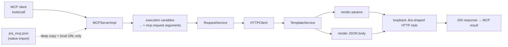

# PYPOST-1034: Verify MCP Jira request-template substitution in query and body

## Research

### Existing execution path (verified in this repository)

`MCPServerImpl` accepts an MCP `call_tool` invocation and builds the template
context with `_merge_execution_variables`:

```python
{**env_vars, "mcp": {"request": mcp_args}}
```

The resulting context is passed to a fresh `RequestService` for that call.
`RequestService` delegates ordinary requests to `HTTPClient`; its
`_prepare_request_kwargs` renders URL, headers, every `RequestData.params`
key/value, and the body through `TemplateService`. For a non-empty JSON body,
it then parses the rendered text and sends it with `requests`' `json=` option.
Thus the existing flow already has one shared substitution path for the three
request locations. PYPOST-1033 supplied the safe dotted-path grammar that lets
`{{ mcp.request.<argument> }}` render; this task adds end-to-end proof for the
remaining query and body locations.

The closest existing proof is
`tests/test_mcp_server_integration.py::TestMCPServerIntegration::test_call_tool_substitutes_mcp_request_path_placeholder`.
It uses a real Streamable HTTP MCP client/server and a local `ThreadingHTTPServer`
to prove path substitution. Its pattern is suitable for the missing coverage
because it reaches the real `RequestService`/`HTTPClient` rendering path rather
than asserting only the context passed to a mock.

The shipped `examples/collections/jira_mcp.json` contains the two representative
shapes to protect:

| Location | Existing request | Template / supplied argument |
| --- | --- | --- |
| Query | `jira-search-fields` | `params["query"] = "{{ mcp.request.query }}"` |
| JSON body | `jira-search-issues-jql` | `body = "{{ mcp.request.search_payload }}"` |

`tests/test_example_fixtures.py` already exposes the native collection-import
pattern (`load_collection_import_candidates`) and validates this fixture. The
new integration coverage should load that fixture, select these requests by
their stable IDs, and make only a deep test-local copy whose URL points to the
loopback stub. That prevents a hand-written surrogate from drifting away from
the published Jira MCP request shape while avoiding real Jira credentials or
mutation.

### External protocol reference

The MCP specification defines `tools/call` parameters as a tool `name` plus an
object-valued optional `arguments` map; tool input schemas describe those
arguments. A successful tool call is represented by a result without `isError`
set. The integration test will therefore call the public MCP transport with
named arguments and assert the normal client-visible success payload, in
addition to what the local HTTP stub recorded. See the official
[MCP tools specification](https://modelcontextprotocol.io/specification/2025-11-25/server/tools)
and [schema reference](https://modelcontextprotocol.io/specification/2025-11-25/schema).

### Constraints confirmed

- No production substitution change is designed: the existing MCP merge and
  `TemplateService`/`HTTPClient` rendering route are the system under test.
- The test must not require Jira, credentials, a network service, or mutation
  of the example collection.
- The current code already includes PYPOST-1033's dotted-path fix. Therefore
  this coverage is expected to be green on the current branch; it is a red
  regression test in the sense that it fails immediately if that support is
  removed or a query/body rendering call is bypassed. No artificial production
  regression is needed to make the test deterministic.

## Implementation Plan

1. Add two bounded integration tests to
   `tests/test_mcp_server_integration.py`, retaining its module-level
   `pytest.mark.timeout(120)` and its real Streamable HTTP helpers.
2. Add a small test-only helper in that module to import
   `examples/collections/jira_mcp.json` through
   `load_collection_import_candidates`, select an ID, and return a deep copy
   with only `url` replaced by the local stub URL. Supply harmless local
   values for the fixture's environment-only template keys (for example
   `jira_credentials`) through `MCPServerImpl.set_variable_supplier` where
   needed; do not use an imported real environment or alter the fixture.
3. Run a local `ThreadingHTTPServer` for each scenario (or a shared handler
   with isolated capture state). It records `self.path` and, for POST, exactly
   the received bytes parsed as JSON; it returns a fixed 200 JSON response.
4. Invoke the selected tool over `_mcp_call_tool`, passing ordinary MCP
   arguments. Assert both (a) the tool's normal `{"error": false,
   "status": 200, ...}` result and (b) the captured outbound HTTP data. Do
   not mock `RequestService.execute`, `HTTPClient`, or template rendering.
5. Run the two node IDs and the related fixture/integration modules. No
   production code or public tool contract should change.

### Mandatory — Failing Repro (next Step 3)

Write the tests before making any production change. The expected test names
below deliberately parallel the existing path proof and use the actual Jira
fixture request shapes.

#### R1 — Query argument reaches an outgoing query string

- **Where:**
  `tests/test_mcp_server_integration.py::TestMCPServerIntegration::test_call_tool_substitutes_jira_mcp_query_parameter`
- **Fixture shape:** import `jira-search-fields`, preserving its
  `params={"query": "{{ mcp.request.query }}"}` and MCP metadata. Replace
  only its base URL with `http://127.0.0.1:<stub-port>/rest/api/3/field/search`.
- **Call:** `jira_search_fields` with `{"query": "Story Point"}`.
- **Assertions:** the MCP response reports `error is False` and `status == 200`;
  the stub records one request whose parsed query maps exactly to
  `{"query": ["Story Point"]}`. The raw path must not contain
  `mcp.request` or encoded braces.
- **Deterministic red condition:** it fails if MCP argument merging, parameter
  rendering, or the safe dotted-path support regresses, because the stub sees a
  literal placeholder, a missing query value, or a non-successful call. It uses
  only loopback TCP.

#### R2 — Body argument reaches an outgoing JSON object

- **Where:**
  `tests/test_mcp_server_integration.py::TestMCPServerIntegration::test_call_tool_substitutes_jira_mcp_json_body`
- **Fixture shape:** import `jira-search-issues-jql`, preserving its
  `body="{{ mcp.request.search_payload }}"`, `body_type="json"`, and MCP
  metadata. Replace only its URL with
  `http://127.0.0.1:<stub-port>/rest/api/3/search/jql`.
- **Call:** `jira_search_issues_jql` with `search_payload` set to the serialized
  value `json.dumps({"jql": "project = DEMO", "maxResults": 1})`, matching
  the collection's existing string argument contract.
- **Assertions:** the MCP response reports `error is False` and `status == 200`;
  the stub records one POST and `json.loads(received_body)` equals
  `{"jql": "project = DEMO", "maxResults": 1}`. The received body must not
  contain `mcp.request` or braces from the template expression.
- **Deterministic red condition:** it fails if the argument is not rendered
  before JSON parsing/sending, without contacting Jira.

**Sequencing:** create R1 and R2 → run them against the current implementation
(they document the already-fixed PYPOST-1033 behavior) → make no production
change unless they expose a real regression → keep them green through Steps
4–8. The new tests must use the existing module timeout marker; their HTTP
server shutdown and thread join remain bounded exactly as in the path test.

## Architecture

### Module diagram



### Modules and responsibilities

| Module | Responsibility | Change for this task |
| --- | --- | --- |
| `examples/collections/jira_mcp.json` | Source of the public query/body template shapes and parameter contracts | None; native-import it in tests only |
| Collection importer / `RequestData.model_copy` | Parse the fixture, then isolate networking through a deep, local request copy | Test helper only |
| `MCPServerImpl` | Expose fixture requests as tools and merge call arguments under `mcp.request` | None; exercised for real |
| `RequestService` | Orchestrate MCP-triggered HTTP execution | None; exercised for real |
| `TemplateService` | Validate/render nested MCP expressions | None; PYPOST-1033 behavior protected |
| `HTTPClient` | Render params/body and issue the outbound request | None; exercised for real |
| Local `ThreadingHTTPServer` | Deterministically capture query/body and reply successfully | Test-only adapter |
| `tests/test_mcp_server_integration.py` | End-to-end regression boundary | Add R1/R2 and minimal fixture/capture helpers |

### Interaction scheme

1. The test imports a real Jira MCP request, deep-copies it, and directs only
   the copy to a loopback stub.
2. The test starts the real PyPost Streamable HTTP MCP server with that copied
   request and invokes its public tool name with a supplied argument.
3. `MCPServerImpl` gives `RequestService` the nested context
   `{"mcp": {"request": arguments}}`, plus harmless test environment values.
4. `HTTPClient` invokes `TemplateService` for the selected `params` or JSON
   body and sends the rendered result to the stub.
5. The stub records the actual HTTP query/body, replies 200, and the MCP
   client receives the normal success result. The test asserts both edges so a
   mock cannot hide a broken render-to-transport handoff.

### Selected patterns

- **Black-box integration at the MCP boundary:** test public `tools/call` over
  real Streamable HTTP, not an internal context-only unit seam.
- **Contract fixture reuse:** import the published Jira collection, select
  stable request IDs, and preserve each request's template/metadata. A
  loopback URL override isolates I/O without inventing a new tool shape.
- **Test double at the external boundary:** the HTTP stub replaces Jira only;
  all PyPost modules between MCP input and outgoing HTTP remain production
  implementations.
- **Arrange–Act–Assert with dual evidence:** assert client-visible success and
  captured wire data. This protects both outward behavior and the precise
  argument-to-request contract.
- **No new production abstraction:** both required locations already share the
  existing rendering pipeline; a test-only helper is lower-risk than changing
  production interfaces for observability.

### Main interfaces (unchanged)

```text
MCPServerImpl.call_tool(name: str, arguments: dict) -> list[TextContent]
_merge_execution_variables(env_vars: dict[str, str], mcp_args: dict[str, Any]) -> dict[str, Any]
RequestService.execute(request: RequestData, variables: dict[str, Any], ...) -> ExecutionResult
HTTPClient.send_request(request_data: RequestData, variables: dict[str, Any], ...) -> HTTPRequestResult
TemplateService.render_string(content: str, variables: dict[str, Any], ...) -> str
load_collection_import_candidates(path: Path) -> tuple[list[Collection], list[str]]
RequestData.model_copy(update={"url": loopback_url}, deep=True) -> RequestData
```

The MCP tool names, argument names, collection JSON, request models, and
production signatures remain unchanged.

## Q&A

| Question | Answer |
| --- | --- |
| Why test `jira-search-fields` and `jira-search-issues-jql`? | They are existing exported Jira MCP requests with the exact query and whole-JSON-body template shapes missing from PYPOST-1033's path proof. |
| Why import the fixture instead of creating a small request inline? | Importing ties the test to the shipped contract and catches accidental fixture drift; the test only redirects networking locally. |
| Why not call Jira Cloud? | The DoD requires isolation. A local stub makes the request data and success response deterministic, credential-free, and non-mutating. |
| Why not mock `RequestService.execute`? | A mock would verify only MCP context construction and bypass the rendering/HTTP path that must be protected. |
| Does this add behavior or tools? | No. It adds regression coverage for existing behavior and preserves all public contracts. |
| Why call this a red test when PYPOST-1033 already fixed it? | The new coverage detects a future regression; on this branch it should begin green. It becomes red under the relevant broken behavior without requiring a live dependency or a temporary source edit. |
| References | [MCP tools specification](https://modelcontextprotocol.io/specification/2025-11-25/server/tools), [MCP schema reference](https://modelcontextprotocol.io/specification/2025-11-25/schema), `tests/test_mcp_server_integration.py`, `tests/test_example_fixtures.py`, `examples/collections/jira_mcp.json`. |
