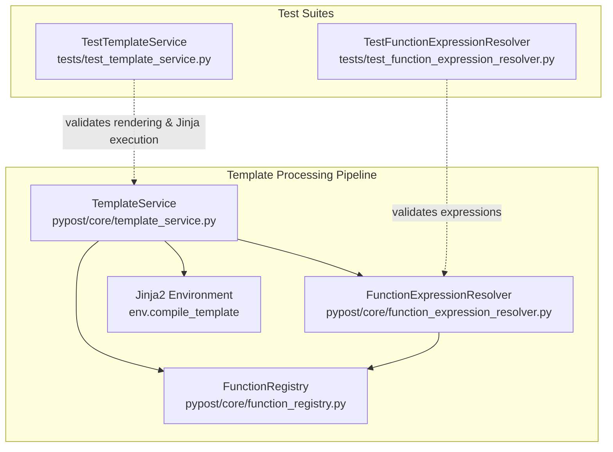

# PYPOST-1035: Unit-test function-arg safe dotted paths (urlencode(mcp.request.*))

## Research

### Background & Context
Task [PYPOST-1033](https://github.com/koctep/pypost) introduced `_SAFE_PATH_RE` into `FunctionExpressionResolver` to allow dotted identifiers (e.g. `mcp.request.query`) while continuing to reject unsafe attribute access patterns (such as `db.__class__` or `mcp.request.__class__`).
During the Technical Debt review of PYPOST-1033 (recorded as TD-2), it was identified that while standalone safe dotted paths (e.g. `{{ mcp.request.issue_key }}`) had dedicated unit test locks, the function argument validation branch (`_validate_function_args` in `FunctionExpressionResolver`) and the corresponding evaluation in `TemplateService.render_string` did not have explicit unit test locks for safe dotted paths across all catalog functions.

### Codebase Analysis
1. **`FunctionExpressionResolver` (`pypost/core/function_expression_resolver.py`)**:
   - `_SAFE_PATH_RE` is defined as `r"^[a-zA-Z_][a-zA-Z0-9_]*(\.[a-zA-Z][a-zA-Z0-9_]*)*$"`.
   - `_validate_function_args(self, function_name: str, args: str)`:
     - Extracts the single argument via `_extract_single_argument`.
     - Validates if `self._SAFE_PATH_RE.fullmatch(argument)` is satisfied. If so, it returns `None` (indicating the argument is valid).
     - If not matching `_SAFE_PATH_RE`, checks if the argument is a nested function call matching `_FUNCTION_SIGNATURE_RE` and validates it recursively.
     - Otherwise returns `ValidationResult.error("invalid_argument", function_name)`.
   - Unsafe attribute segments like `{{ urlencode(db.__class__) }}` or `{{ urlencode(mcp.request.__class__) }}` do not match `_SAFE_PATH_RE` (as sub-segments must start with `[a-zA-Z]`, forbidding leading underscores) and do not match `_FUNCTION_SIGNATURE_RE`, so they are rejected with `invalid_argument`.

2. **`TemplateService` (`pypost/core/template_service.py`)**:
   - Compiles Jinja2 templates and registers catalog functions (`urlencode`, `md5`, `base64`, `env`, `to_int`) from `FunctionRegistry`.
   - In Jinja2 standard evaluation, dotted variable paths `mcp.request.query` evaluate to nested dictionary lookups `variables["mcp"]["request"]["query"]` or attribute lookups.
   - When passed into a catalog function such as `{{ urlencode(mcp.request.query) }}`, Jinja2 passes the resolved value as the argument to `urlencode`.

3. **Existing Unit Tests**:
   - `tests/test_function_expression_resolver.py`: Contains tests for standalone safe paths (`test_validate_accepts_safe_mcp_request_path`), unsafe paths (`test_validate_rejects_unsafe_underscore_attribute_segments`), nested functions, arity, and `env` expressions, but lacks explicit parameterized tests locking catalog functions (`urlencode`, `md5`, `base64`, `to_int`, etc.) with safe dotted arguments and unsafe dotted arguments.
   - `tests/test_template_service.py`: Contains `test_render_env_function_with_dotted_path`, but lacks tests covering `urlencode`, `md5`, `base64`, `to_int` with nested dictionary lookups via dotted arguments.

## Implementation Plan

### Mandatory — Failing Repro / Test Strategy (Step 3)
- **Nature of Task:** This task is a technical debt / unit test lock task (TD-2 from PYPOST-1033).
- **Repro / Test Suite Additions:**
  - In `tests/test_function_expression_resolver.py`:
    - Add tests asserting that catalog functions (`urlencode`, `md5`, `base64`, `to_int`, `env`) with safe dotted arguments (e.g. `mcp.request.query`, `nested.payload.value`) validate successfully (`is_valid == True`).
    - Add tests asserting that catalog functions with unsafe attribute paths (e.g. `urlencode(db.__class__)`, `md5(mcp.request.__class__)`, `to_int(data._private)`) are rejected with `invalid_argument` or `invalid_syntax`.
  - In `tests/test_template_service.py`:
    - Add tests asserting that `TemplateService.render_string` correctly renders expressions where catalog functions take dotted paths against nested variable dicts:
      - `{{ urlencode(mcp.request.query) }}` -> url-encoded value.
      - `{{ md5(mcp.request.body) }}` -> md5 hash of nested value.
      - `{{ base64(mcp.request.data) }}` -> base64 encoding of nested value.
      - `{{ to_int(mcp.request.count) }}` -> integer string of nested value.
- **Sequencing:**
  1. Step 3 (Failing Repro / Test Locking): Implement the new test cases in `tests/test_function_expression_resolver.py` and `tests/test_template_service.py`. If existing production code already satisfies the requirements, the tests will pass (or if any edge case in catalog function handling is uncovered, it will fail and be addressed in Step 4). Note in Step 3 the exact test suite and assertion coverage.
  2. Step 4 (Development): Ensure all tests pass, verify code cleanliness and timeout requirements.
  3. Step 5-8: Code cleanup, observability review, tech debt analysis, and documentation updates.

## Architecture

### System & Module Diagram

### Module Boundaries & Responsibilities

| Module | Location | Responsibility |
| --- | --- | --- |
| `FunctionExpressionResolver` | `pypost/core/function_expression_resolver.py` | Validates syntax, arity, safe variable paths (`_SAFE_PATH_RE`), and catalog membership for expressions inside `{{ ... }}`. |
| `TemplateService` | `pypost/core/template_service.py` | Orchestrates expression validation and Jinja2 rendering against variable contexts, handling fallbacks and strict conversion modes. |
| `FunctionRegistry` | `pypost/core/function_registry.py` | Maintains allowed catalog function definitions and registers them with the Jinja environment. |
| `tests/test_function_expression_resolver.py` | `tests/test_function_expression_resolver.py` | Unit tests for syntax, arity, argument validation, and safe/unsafe dotted variable path validation in `FunctionExpressionResolver`. |
| `tests/test_template_service.py` | `tests/test_template_service.py` | Unit tests for string rendering, error fallbacks, and multi-function evaluation in `TemplateService`. |

### Interfaces & Validation Contracts

1. **`FunctionExpressionResolver.validate_content(content: str) -> ValidationResult`**:
   - For `{{ fn(dotted.path.name) }}`:
     - Parses `fn` and verifies `fn` in `FunctionRegistry.is_allowed`.
     - Validates `dotted.path.name` against `_SAFE_PATH_RE`.
     - Returns `ValidationResult.valid()` when `_SAFE_PATH_RE` matches.
     - Returns `ValidationResult.error("invalid_argument", fn, expression)` when `_SAFE_PATH_RE` fails and argument is not a nested function call.

2. **`TemplateService.render_string(content: str, variables: dict[str, Any], ...) -> str`**:
   - First invokes `_validate_template_expressions`.
   - On success, renders using Jinja2 with `variables` mapping. Jinja2 resolves `mcp.request.query` through dictionary key lookups when `variables = {"mcp": {"request": {"query": "hello world"}}}`.
   - Applies the function transformation (`urlencode("hello world")` -> `"hello+world"` or `"hello%20world"`).

## Q&A

| Question | Answer |
| --- | --- |
| Q1: Are any changes to production code required? | Based on code inspection, `FunctionExpressionResolver` already applies `_SAFE_PATH_RE` in `_validate_function_args`. However, comprehensive test locks across catalog functions (`urlencode`, `md5`, `base64`, `to_int`, `env`) are needed in both `test_function_expression_resolver.py` and `test_template_service.py` to prevent regression. |
| Q2: What exact pattern does `_SAFE_PATH_RE` enforce? | It permits leading underscores on the root variable segment (e.g. `_var.prop`), but strictly forbids leading underscores on sub-segments (e.g. `db.__class__`, `mcp._secret`), preventing traversal into dunder / private attributes. |
| Q3: Are timeouts required on test cases? | Yes, all test files must maintain module-level `pytestmark = pytest.mark.timeout(...)` or individual timeout marks per repository rules. Both target test files already declare `pytestmark = pytest.mark.timeout(30)`. |
