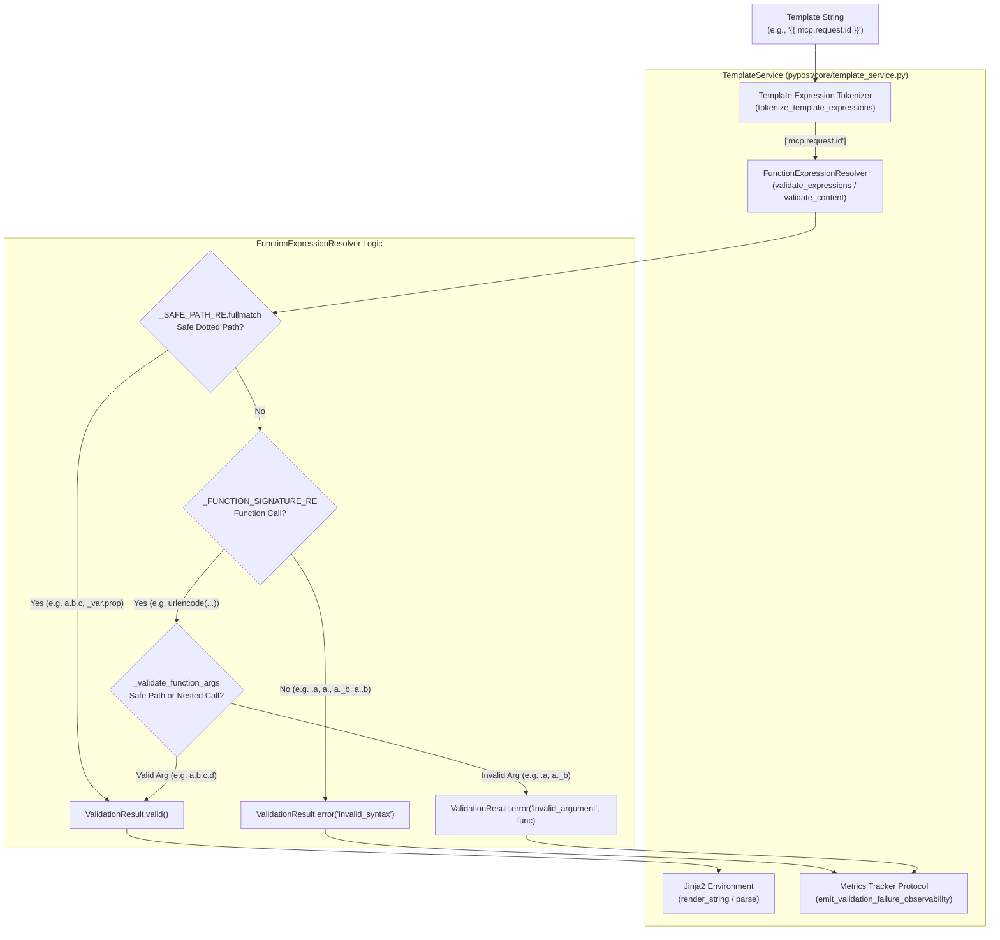

# PYPOST-1036: Expand safe-path grammar edge locks for dotted template identifiers

## Research

### Background & Problem Context
Template expressions in PyPost allow dotted variable identifiers such as `mcp.request.<param>` or `payload.user.address.city` both as standalone expressions (e.g. `{{ mcp.request.id }}`) and as arguments to catalog functions (e.g. `{{ urlencode(mcp.request.query) }}`).

In [PYPOST-1033](https://pypost.atlassian.net/browse/PYPOST-1033) and [PYPOST-1035](https://pypost.atlassian.net/browse/PYPOST-1035), support for dotted variable navigation was introduced. Technical debt item TD-3 identified that while basic happy paths and specific attributes like `__class__` were tested, the full grammar boundary suite lacked comprehensive edge locks. Specifically:
- Malformed syntax boundaries (leading dots, trailing dots, empty consecutive dot segments, invalid segment characters).
- Security boundary locks preventing access to internal/private attributes on objects via non-root underscore prefixes (e.g. `._private`, `.__dict__`, `.__globals__`, `._hidden.val`).
- Deep navigation paths with 3+ segments across both standalone and catalog function argument contexts.

### Current Implementation Analysis
The grammar for safe dotted identifier expressions is implemented in [`pypost/core/function_expression_resolver.py`](file:///home/src/pypost/core/function_expression_resolver.py#L21-L26):

```python
# Safe path: first segment may start with `_`; later segments must not
# (blocks ``db.__class__`` / ``mcp.request.__class__``).
_SAFE_PATH_RE = re.compile(
    r"^[a-zA-Z_][a-zA-Z0-9_]*(\.[a-zA-Z][a-zA-Z0-9_]*)*$"
)
_FUNCTION_SIGNATURE_RE = re.compile(r"^(?P<func>[a-zA-Z_][a-zA-Z0-9_]*)\((?P<args>.*)\)$")
```

#### Validation Flow
1. **Tokenization:** [`tokenize_template_expressions(content)`](file:///home/src/pypost/core/template_expression_tokenizer.py) scans content for `{{ ... }}` placeholders and returns inner expressions.
2. **Standalone Path Validation:**
   - Evaluates `_SAFE_PATH_RE.fullmatch(expression)`.
   - If match succeeds: valid standalone variable path (returns `None` / `ValidationResult.valid()`).
   - If match fails: attempts function expression parsing via `_FUNCTION_SIGNATURE_RE`.
   - If not a function signature: returns `ValidationResult.error("invalid_syntax", expression=...)`.
3. **Function Argument Validation:**
   - Extracts single argument string via `_extract_single_argument(args)`.
   - Rejects multiple top-level arguments with `invalid_arity`.
   - Checks `_SAFE_PATH_RE.fullmatch(argument)`:
     - If match succeeds: argument is a valid safe path.
     - If match fails and argument is not another valid function signature: returns `ValidationResult.error("invalid_argument", function_name=function_name, expression=...)`.
     - If argument is a nested function call: recursively validates.

#### Grammar Breakdown
- **Root segment:** `^[a-zA-Z_][a-zA-Z0-9_]*`
  - Starts with an ASCII letter or underscore `_`.
  - Followed by zero or more letters, digits, or underscores.
  - Allows valid root names like `x`, `_var`, `mcp`, `req1`.
- **Subsequent segments:** `(\.[a-zA-Z][a-zA-Z0-9_]*)*$`
  - Starts with a single dot `.`.
  - First character after dot must be an ASCII letter `[a-zA-Z]` (explicitly disallows `_` and digits `0-9`).
  - Followed by zero or more letters, digits, or underscores.
  - Disallows consecutive dots `..`, trailing dots `.`, and non-root underscore prefixes `._private`, `.__class__`, `.__dict__`, `.__globals__`.

### Gap Analysis in Test Suite
While `_SAFE_PATH_RE` is structurally sound, `tests/test_function_expression_resolver.py` and `tests/test_template_service.py` currently only assert a small subset of cases (`db.__class__`, `mcp.request.__class__`, and basic 3-segment paths).

The following test matrices are required to lock the grammar contracts:
1. **Leading dots:** `.a`, `.mcp.request`, `.a.b.c` (Standalone: `invalid_syntax`; Function arg: `invalid_argument`).
2. **Trailing dots:** `a.`, `mcp.request.`, `a.b.c.` (Standalone: `invalid_syntax`; Function arg: `invalid_argument`).
3. **Consecutive dots / empty segments:** `a..b`, `mcp..request`, `a...b`, `a.b..c` (Standalone: `invalid_syntax`; Function arg: `invalid_argument`).
4. **Underscore child segments across depths:** `a._b`, `a.b._c`, `a.b.c._d`, `data._hidden.val`, `_root._child`, `root.__dict__`, `root.__globals__`, `root.__class__` (Standalone: `invalid_syntax`; Function arg: `invalid_argument`).
5. **Root underscore permitted with safe child segments:** `_var`, `_context.field`, `_a.b.c.d` (Valid across all contexts).
6. **Deep safe navigation paths (4+ segments):** `payload.user.contact.address.city`, `a.b.c.d.e.f` (Valid across all contexts).
7. **Invalid segment characters:** `a.b-c`, `a.b$c`, `a.1b`, `a.b/c` (Standalone: `invalid_syntax`; Function arg: `invalid_argument`).

---

## Implementation Plan

### High-Level Execution Phases
1. **Step 3 (Failing Repro Test):**
   - Create explicit automated red tests in `tests/test_function_expression_resolver.py` targeting all missing edge cases across standalone and function argument contexts.
   - Run tests via `make test` to confirm test execution and timeout compliance.
2. **Step 4 (Development / Grammar Hardening):**
   - Verify `_SAFE_PATH_RE` and `FunctionExpressionResolver` against all test matrix cases.
   - If any edge cases fail, adjust `_SAFE_PATH_RE` / argument parser without breaking existing syntax contracts.
   - Verify integration rendering via `TemplateService` tests in `tests/test_template_service.py`.
3. **Step 5 (Code Cleanup):**
   - Run `make lint` and `make typecheck` to verify zero static analysis or type checking violations.
   - Document any cleanup findings in `40-code-cleanup.md`.
4. **Step 6 (Observability):**
   - Ensure validation failure metric tracking and error code emission are consistent for newly locked edge cases.
5. **Step 7 (Technical Debt Analysis):**
   - Record technical debt analysis in `60-tech-debt.md`.
6. **Step 8 (Dev Docs):**
   - Update developer documentation under `doc/dev/` if grammar specifications are maintained there.

### Mandatory — Failing Repro (next Step 3)
- **Target Test File:** [`tests/test_function_expression_resolver.py`](file:///home/src/tests/test_function_expression_resolver.py) (and complementary render assertions in [`tests/test_template_service.py`](file:///home/src/tests/test_template_service.py)).
- **What it asserts:**
  - Standalone expressions with leading dots (`{{ .mcp.request }}`), trailing dots (`{{ mcp.request. }}`), double dots (`{{ mcp..request }}`), and underscore attributes (`{{ data._secret }}`, `{{ obj.__dict__ }}`) fail validation with `code="invalid_syntax"`.
  - Catalog function calls with the above invalid dotted paths (`{{ urlencode(.mcp.request) }}`, `{{ md5(mcp.request.) }}`, `{{ base64(mcp..request) }}`, `{{ to_int(data._secret) }}`, `{{ env(obj.__dict__) }}`) fail validation with `code="invalid_argument"` naming the enclosing function.
  - Standalone and function call expressions with valid deep paths (`{{ a.b.c.d.e }}`, `{{ urlencode(payload.user.contact.city) }}`) and root underscores (`{{ _ctx.user.name }}`) validate successfully (`is_valid=True`).
- **Isolation:** Pure unit tests executing locally with standard fixtures and `pytestmark = pytest.mark.timeout(30)` — no live network, external processes, or UI dependencies.
- **Sequencing:**
  1. Add comprehensive parameterized test matrices in `tests/test_function_expression_resolver.py`.
  2. Execute `make test` to verify test suite pass/repro status.

---

## Architecture

### System Diagram



### Module Boundaries & Responsibilities

| Module | Responsibility | Invariants Maintained |
| --- | --- | --- |
| [`pypost.core.template_expression_tokenizer`](file:///home/src/pypost/core/template_expression_tokenizer.py) | Scans raw string content and extracts expressions within `{{ ... }}` boundaries | Preserves whitespace inside delimiters for resolver inspection |
| [`pypost.core.function_expression_resolver`](file:///home/src/pypost/core/function_expression_resolver.py) | Validates extracted expressions against grammar rules and function registry | Fail-closed: non-matching expressions return `invalid_syntax` or `invalid_argument` |
| [`pypost.core.function_registry`](file:///home/src/pypost/core/function_registry.py) | Maintains catalog of allowed built-in functions | Only registered single-argument functions are allowed |
| [`pypost.core.template_service`](file:///home/src/pypost/core/template_service.py) | Orchestrates validation, metric emission, and Jinja rendering fallback | Validation errors prevent Jinja evaluation and return raw fallback |

### Formal Grammar Specification

$$\begin{aligned}
\text{SafePath} &::= \text{RootSegment} (\text{"."} \text{ChildSegment})^* \\
\text{RootSegment} &::= [a-zA-Z\_][a-zA-Z0-9\_]* \\
\text{ChildSegment} &::= [a-zA-Z][a-zA-Z0-9\_]* \\
\text{FunctionExpression} &::= \text{FunctionName} \text{"("} \text{Argument} \text{")"} \\
\text{Argument} &::= \text{SafePath} \mid \text{FunctionExpression}
\end{aligned}$$

#### Error Code Mapping Contract

| Pattern Type | Example Expression | Standalone Code | Function Arg Code |
| --- | --- | --- | --- |
| Leading Dot | `{{ .path }}` / `{{ func(.path) }}` | `invalid_syntax` | `invalid_argument` |
| Trailing Dot | `{{ path. }}` / `{{ func(path.) }}` | `invalid_syntax` | `invalid_argument` |
| Consecutive Dots | `{{ a..b }}` / `{{ func(a..b) }}` | `invalid_syntax` | `invalid_argument` |
| Underscore Child | `{{ a._b }}` / `{{ func(a._b) }}` | `invalid_syntax` | `invalid_argument` |
| Dunder Attribute | `{{ a.__class__ }}` / `{{ func(a.__class__) }}` | `invalid_syntax` | `invalid_argument` |
| Invalid Characters | `{{ a.b-c }}` / `{{ func(a.b-c) }}` | `invalid_syntax` | `invalid_argument` |
| Digit Child Start | `{{ a.1b }}` / `{{ func(a.1b) }}` | `invalid_syntax` | `invalid_argument` |
| Valid Deep Path | `{{ a.b.c.d.e }}` / `{{ func(a.b.c.d.e) }}` | `valid` | `valid` |
| Valid Root Underscore | `{{ _ctx.prop }}` / `{{ func(_ctx.prop) }}` | `valid` | `valid` |

---

## Q&A

### Q1: Why are leading underscores permitted on the root segment (`_root.sub`) but forbidden on child segments (`root._sub`)?
**A:** Root identifiers frequently use leading underscores for internal template scope variables (e.g. `_ctx`, `_index`, `_loop`), which are safely passed in the template variable mapping. However, child property navigation (`obj._private`, `obj.__dict__`, `obj.__class__`) traverses Python object attributes at runtime, creating sandbox escape and unauthorized introspection risks.

### Q2: Does this require regex or parser changes if `_SAFE_PATH_RE` already matches the grammar?
**A:** `_SAFE_PATH_RE = re.compile(r"^[a-zA-Z_][a-zA-Z0-9_]*(\.[a-zA-Z][a-zA-Z0-9_]*)*$")` natively implements this exact grammar rule. The primary goal of PYPOST-1036 is to establish complete regression lock coverage across all specified edge categories and ensure no unintended bypasses or parser regressions exist across standalone, function-argument, and render paths.

### Q3: How are timeouts enforced across newly added test cases?
**A:** Per [do-testing](file:///home/.gemini/config/skills/do-testing/SKILL.md) and [lsr-python](file:///home/.gemini/config/skills/lsr-python/SKILL.md), all test modules enforce timeouts via module-level `pytestmark = pytest.mark.timeout(30)` or per-test decorators, ensuring bounded execution in test and CI environments.
