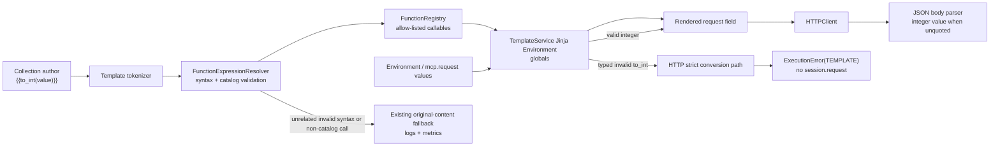

# PYPOST-1037: Safely coerce template string values to integers

## Research

### Existing system and confirmed boundary

`TemplateService` is the single runtime template entry point.  It validates
each `{{...}}` token through `FunctionExpressionResolver`, then renders it in
one Jinja `Environment`.  A failed validation or render returns the original
field content, and records the existing validation/fallback observability.

The expression language is deliberately controlled by two cooperating pieces:

- `FunctionRegistry` is the single catalog of callable template functions.  It
  exposes the catalog to both `FunctionExpressionResolver` and Jinja globals.
- `FunctionExpressionResolver` accepts only a safe variable path or a
  catalogued, single-argument function call (including already supported
  nesting).  It rejects filters, literals, arbitrary expressions, unknown
  functions, and unsafe attribute paths before Jinja renders.

`HTTPClient` invokes `TemplateService.render_string` for URL, header,
parameter, and body fields.  For a JSON request body it then parses the
rendered body with `json.loads`; consequently an unquoted expression such as
`{"id": {{to_int(mcp.request.issue_id)}}}` becomes a JSON integer at the
transport boundary.  URL and query-param transports remain textual by design,
but receive the validated decimal rendering produced by the same function.

There is a gap relevant to this story: the current compatibility fallback
returns original content after every render failure, and `HTTPClient` can send
that literal content (existing tests lock this for unrelated invalid function
expressions in parameters).  That alone cannot meet this story's DoD that an
invalid integer conversion must not cause an unintended outbound operation.
The design therefore adds a narrowly typed failure signal for every failed
expression that contains a `to_int` call (invalid input, arity, syntax, or
nested validation failure) and a strict render mode used only by outbound HTTP
request preparation.  Existing default rendering and its literal fallback
remain compatible for all other template expressions and UI/hover callers.

The current MCP variable contract supplies tool arguments under
`mcp.request.*`; PYPOST-1033 added safe dotted-path validation, so no
MCP-specific parsing or request-pipeline change is needed for this story.

The official Jinja documentation confirms that application-provided callables
are made available through environment globals and that dotted access resolves
mapping items/attributes.  PyPost's pre-render allow-list remains the security
boundary; this task must not expose Jinja's general expression language.

### Decision and alternatives

| Option | Decision | Reason |
| --- | --- | --- |
| Add `to_int` to the existing `FunctionRegistry` catalog | Chosen | Reuses the sole callable allow-list and Jinja-global registration mechanism. |
| Special-case `to_int` in `TemplateService`, `HTTPClient`, or MCP handling | Rejected | Duplicates grammar/registration responsibility and makes the reusable feature MCP- or transport-coupled. |
| Accept Jinja's builtin conversion or arbitrary expressions | Rejected | Violates the controlled-expression safety requirement. |
| Add a type-preserving rendering API | Rejected | Existing request fields are strings before JSON parsing; a catalog function plus normal JSON parsing gives the required native integer body value without changing public interfaces. |
| Let invalid `to_int` use the current literal fallback through HTTP | Rejected | Existing fallback can still reach `session.request`, violating the explicit fail-safe outbound requirement. |
| Make every invalid template expression fail closed | Rejected | Broad compatibility change; this story needs only invalid integer conversion to block dispatch. |

References: [Jinja Template Designer Documentation](https://jinja.palletsprojects.com/en/stable/templates/), [Jinja API — environment globals](https://jinja.palletsprojects.com/en/stable/api/), `pypost/core/template_service.py`, `pypost/core/function_registry.py`, `pypost/core/function_expression_resolver.py`, and `doc/dev/template_expression_functions.md`.

## Implementation Plan

1. Add a private, typed integer-conversion callable to
   `pypost/core/function_registry.py` and a narrow conversion exception in
   the existing template-expression type module.  Accept only ASCII decimal
   whole-number text matching `^[+-]?[0-9]+$` (so `42`, `+42`, and `-42` are
   valid; empty strings, whitespace, floats, exponent notation, underscores,
   booleans, and arbitrary objects are not).  Return `int(value)` only after
   that validation; raise the dedicated exception for rejected input.
2. Register that callable in `_DEFAULT_CATALOG` under the author-visible name
   `to_int`.  The existing `FunctionRegistry` registration will make the
   same callable available to resolver validation and Jinja rendering.
3. Extend `FunctionExpressionResolver` / `TemplateService` with an opt-in
   strict-conversion render path.  It must identify whether a failed token
   contains a `to_int` call, including when validation reports bad arity,
   syntax, or a nested-function failure rather than a direct conversion
   exception.  It must also handle a Jinja parse error before tokenization:
   inspect the raw failed template only for an opening `{{` followed by
   optional whitespace and a `to_int` function-call form (`to_int` followed
   by optional whitespace and `(`).  This deliberately does not treat a
   bare `{{to_int}}` variable or an arbitrary `to_int(` substring outside a
   template opening as a conversion expression.  Its default public behavior
   continues returning original content for render failures.  In the opt-in
   path, every such `to_int` failure preserves existing observability and
   raises the dedicated error rather than returning a literal token;
   unrelated validation and render failures continue using the compatibility
   fallback.
4. Make `HTTPClient` use that strict-conversion path for URL, headers,
   parameters, and body before any `session.request` call.  Catch the typed
   failure in `send_request` (including URL preparation), and convert it to
   the existing `ExecutionError` with `ErrorCategory.TEMPLATE`.  No session
   request may be attempted.  MCP and RequestService keep their existing
   error propagation.
5. Add focused unit/transport tests for URL, query parameter, and JSON body
   contexts, then document the supported syntax, integer grammar, and
   fail-closed invalid-input outcome in the developer-facing expression
   reference.

### Mandatory — Failing Repro (next Step 3)

Write the following automated tests before the production catalog change. They
must be separate from their review and require no credentials, Jira instance,
or external network.

| Repro | Where | Desired assertion | Why it is red before Step 4 |
| --- | --- | --- | --- |
| R1: supported expression | `tests/test_template_service.py` | `TemplateService().render_string("{{to_int(value)}}", {"value": "42"}) == "42"`; validation accepts the expression. | `to_int` is not currently catalogued, so validation reports an unknown function and returns the original token. |
| R2: native JSON integer | `tests/test_http_client.py`, adjacent to existing function-expression transport tests | A JSON body `{"id": {{to_int(issue_id)}}}` with `issue_id="42"` is passed to the mocked session as `json={"id": 42}`. | The missing catalog entry leaves the token literal; JSON parsing cannot produce the expected native integer. |
| R3: valid-input grammar matrix | `tests/test_template_service.py` | Assert `42`, `+42`, and `-42` render to their integer decimal form. Assert whitespace, empty input, decimals, exponent notation, underscores, boolean-like text, and non-text values are rejected. | The catalog expression does not exist before Step 4. |
| R4: invalid `to_int` blocks dispatch | `tests/test_http_client.py` | Parameterize invalid values plus `{{to_int()}}`, `{{to_int(a,b)}}`, malformed `to_int` syntax, an unclosed placeholder such as `{{to_int(value)`, and a nested invalid call such as `{{to_int(unknown(value))}}`; place each representative in URL, params, and JSON body. Each call raises `ExecutionError` with `ErrorCategory.TEMPLATE`, retains observability, and asserts `session.request` was never called. | Before Step 4 the expression is unknown and the current HTTP path can dispatch a literal token; the desired fail-closed behavior does not exist. |
| R5: URL and query parameters | `tests/test_http_client.py`, adjacent to R2 | A mocked HTTP send for `.../items/{{to_int(issue_id)}}` and `params={"id": "{{to_int(issue_id)}}"}` with `issue_id="42"` uses URL suffix `/items/42` and `params={"id": "42"}`. | The missing catalog entry preserves the literal expression in both request fields instead of the required decimal transport value. |

Retain the test module's `pytest.mark.timeout`.  Sequence: add R1–R3 and
run them red → add only the registry callable/catalog entry → rerun until
green → keep all existing function and HTTP-client tests green.  R2, R4, and R5 use
the repository's mocked `requests.Session`; together they prove body, URL,
parameter, and invalid-input no-dispatch behavior without a live service.

## Architecture

### Module diagram



### Modules and responsibilities

| Module | Responsibility | Change |
| --- | --- | --- |
| `FunctionRegistry` | Own the finite function catalog and bind its callable objects to Jinja globals. | Add the private conversion callable and `to_int` catalog entry. |
| Template-expression types | Carry shared validation outcomes. | Add a dedicated exception that identifies failed `to_int` expression processing without conflating it with unrelated template errors. |
| `FunctionExpressionResolver` | Parse and allow only safe paths / known single-argument calls. | Preserve its normal grammar decision and expose enough structured provenance for strict rendering to identify a failed outer/nested `to_int` expression. |
| `TemplateService` | Validate first, render second, and preserve original content on invalid/failed rendering while emitting existing signals. | Add opt-in propagation only for the typed conversion exception; default rendering remains compatible. |
| `HTTPClient` | Render request fields and parse rendered JSON bodies. | Request strict conversion rendering, map typed failure to `ExecutionError(TEMPLATE)`, and prevent dispatch; valid unquoted decimal still becomes a native JSON integer. |
| MCP adapter | Supply `mcp.request` values as template variables. | None; stays generic. |
| Tests and developer documentation | Preserve syntax, conversion, invalid-input, and request-context contracts. | Add in Steps 3/4 and 8 respectively. |

### Interaction scheme

1. A collection author places `{{to_int(value)}}` in an existing template
   field.  For a JSON integer, the expression is unquoted in the JSON body.
2. `TemplateService` tokenizes and asks `FunctionExpressionResolver` to
   validate the expression.  The resolver permits exactly one safe value path
   because `to_int` is in `FunctionRegistry`.
3. The registry-bound callable receives the resolved value.  Only
   `^[+-]?[0-9]+$` text returns an `int`; Jinja renders its decimal form into
   the field.
4. `HTTPClient` uses the rendered field.  JSON body parsing converts the
   unquoted decimal token to a Python `int`; URL and params receive its
   decimal text as required by those transports.
5. An invalid, empty, non-numeric, malformed (including an unclosed
   placeholder), wrongly arity'd, or nested invalid `to_int` expression emits
   the current observability, becomes `ExecutionError(TEMPLATE)` in an
   outbound request, and prevents `session.request`.  Other template failures
   retain the existing original-content compatibility fallback.  No
   best-effort coercion, defaulting, or external operation rewrite is
   introduced.

### Selected patterns

- **Registry / allow-list:** one catalog remains the source of truth for
  grammar permission and runtime exposure.  This keeps the security policy
  explicit and auditable.
- **Validation-before-render:** preserve the current resolver boundary rather
  than relying on Jinja to constrain expressions.
- **Narrow fail-closed conversion:** every failed complete or syntactically
  started `to_int(...)` expression is distinguishable from compatibility
  fallbacks, so only that feature's invalid forms block outbound dispatch
  while no partial or default numeric value is invented.
- **Dependency injection unchanged:** existing injected `TemplateService` and
  mocked session seams support isolated tests; no new service or dependency is
  required.

### Main interfaces

```text
FunctionRegistry.allowed_names() -> frozenset[str]
FunctionRegistry.get(name: str) -> Callable[..., Any] | None
FunctionRegistry.register_into_env(env: Environment) -> None
FunctionExpressionResolver.validate_content(content: str) -> ValidationResult
TemplateService.render_string(content: str, variables: dict[str, Any], render_path="runtime") -> str
HTTPClient.send_request(request_data: RequestData, variables: dict[str, str] | None, ...) -> HTTPRequestResult
```

The only new author-visible interface is `to_int(value)` inside an already
supported `{{...}}` template expression.  It requires exactly one safe supplied
value and returns an integer to Jinja; no Python API or MCP schema changes.

## Q&A

| Question | Answer |
| --- | --- |
| Why put the conversion in the registry? | It is the existing single source of truth for callable expression capability and Jinja registration. |
| Does `to_int` broaden arbitrary template execution? | No. The resolver still accepts only catalogued names, one safe argument path, and the existing nested-call rules. |
| How can a body receive an integer when templates render text? | Use an unquoted expression in a JSON body; after rendering, the current JSON parser materializes the decimal as a native integer. |
| What input is valid? | Exactly optional `+` or `-` followed by one or more ASCII digits. Whitespace, decimals, exponent notation, underscores, booleans, empty values, and non-text values are rejected. |
| What happens with `"abc"`, `""`, bad arity, or malformed/nested calls? | A failed complete or started `{{to_int(...)` expression emits existing diagnostics, becomes `ExecutionError(TEMPLATE)` during HTTP preparation, and prevents an outbound request. No fallback value is invented. |
| Are floats, booleans, schemas, or the Jira example collection changed? | No. They are explicitly out of scope. |
| Why no RequestService/MCP change? | Both already provide template variables to the shared `TemplateService`; conversion is a generic expression feature. |
