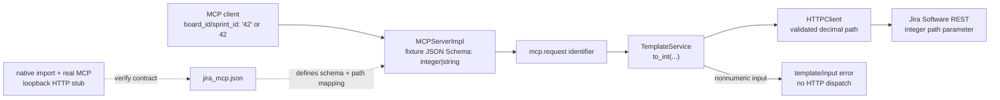

# PYPOST-1038: Accept string-form numeric identifiers in the Jira MCP example

## Research

### Repository boundary and affected contract

`MCPServerImpl` publishes each `RequestData.mcp_params` entry as JSON Schema.
Consequently, the Jira collection currently advertises the following six path
arguments as `integer`; a JSON string is rejected by the MCP contract before
the request template can render:

| Collection request | Argument | Current destination shape |
| --- | --- | --- |
| `jira-list-board-sprints` | `board_id` | `/rest/agile/1.0/board/{boardId}/sprint` |
| `jira-get-sprint` | `sprint_id` | `/rest/agile/1.0/sprint/{sprintId}` |
| `jira-update-sprint` | `sprint_id` | `/rest/agile/1.0/sprint/{sprintId}` |
| `jira-delete-sprint` | `sprint_id` | `/rest/agile/1.0/sprint/{sprintId}` |
| `jira-add-issues-to-sprint` | `sprint_id` | `/rest/agile/1.0/sprint/{sprintId}/issue` |
| `jira-get-sprint-issues` | `sprint_id` | `/rest/agile/1.0/sprint/{sprintId}/issue` |

These are every integer-typed `mcp_params` entry in the shipped Jira
collection. JSON payload fields such as `issues_payload` are already declared
as serialized JSON strings and are not a separate identifier location in the
published tool schema.

PYPOST-1037 provides the deliberately narrow `to_int(...)` template function.
It currently accepts only decimal *string* input, renders its decimal result
into URLs and parameters, and makes an invalid conversion fail closed in the
HTTP preparation path. That is sufficient for the new string form but not for
this story's explicit backward-compatibility requirement: an existing native
JSON integer would be rejected after the template is wired through `to_int`.

Likewise, `McpToolParam.type` is currently a single string from a closed
catalog, and `build_tool_input_schema` emits only `{"type": spec.type}`.
Replacing `integer` with `string` would advertise an incompatible contract to
native-number clients. The design must therefore add an explicit union type to
the MCP parameter model and schema builder, rather than choosing one input
form at the expense of the other.

The current integration helpers in `tests/test_mcp_server_integration.py`
already import the real Jira collection, deep-copy just one request with a
loopback URL, run a real Streamable HTTP MCP server/client pair, and capture an
outbound local HTTP request. This is the appropriate test seam: it observes
JSON Schema acceptance, template rendering, and request dispatch without Jira
credentials or a real Jira mutation.

Atlassian's Jira Software Cloud REST reference defines board and sprint path
IDs as integer parameters, including `boardId` for board resources and
`sprintId` for sprint resources. The collection must therefore continue to
render only a validated decimal identifier at the HTTP boundary, even though
the agent-facing MCP schema accepts the string representation. References:
[Atlassian Board REST API](https://developer.atlassian.com/cloud/jira/software/rest/api-group-board/)
and [Atlassian Sprint REST API](https://developer.atlassian.com/cloud/jira/software/rest/api-group-sprint/).

### Decision

Add one reusable, deliberately constrained MCP schema type, then apply it only
to the six identified Jira fixture locations:

1. Add `integer_or_string` to the allowed `McpToolParam` type catalog and the
   request-editor type selector. `build_tool_input_schema` renders this
   internal authoring type as standard JSON Schema
   `anyOf: [{"type": "integer"}, {"type": "string", "pattern":
   "^[+-]?[0-9]+$"}]`. Existing single types keep their current schema output.
2. Extend `to_int` to accept either an actual `int` (excluding `bool`) or the
   existing ASCII-decimal string grammar. Floats, booleans, `None`, mappings,
   lists, whitespace, exponent notation, and nonnumeric strings remain
   rejected. Its strict HTTP failure behavior remains unchanged.
3. Declare each affected fixture argument as `integer_or_string`, make the
   description explicitly say that decimal JSON strings and native integers
   are accepted, and replace its matching direct path expression with
   `{{ to_int(mcp.request.<identifier>) }}`.
4. Retain the request IDs, human names, argument names, HTTP verbs, endpoints,
   payload argument schemas, and tool count exactly as they are.

This deliberately makes the protocol boundary tolerant while retaining
numeric validation nearest to the outbound Jira request. Invalid strings do
not become a different resource identifier and must not reach the loopback
stub or Jira.

## Implementation Plan

1. In `pypost/models/models.py`, add `integer_or_string` to the closed
   `McpToolParam` type catalog. In `pypost/core/mcp_tool_contract.py`, render
   that type as the documented `anyOf` JSON Schema union, including the exact
   decimal string pattern. Keep every existing single-type schema byte-for-byte
   compatible. In `pypost/ui/widgets/request_editor.py`, add the same named
   choice so loading and saving an affected collection does not silently
   downgrade the union to a different type.
2. In `pypost/core/function_registry.py`, adjust only `_to_int` to pass through
   a true `int` and preserve its existing exact decimal-string handling. Do
   not accept `bool` despite Python's `bool` subclassing `int`, and do not
   broaden to floats or arbitrary coercion.
3. In `examples/collections/jira_mcp.json`, apply `integer_or_string` plus the
   `to_int` path template to exactly the one board and five sprint locations
   listed above. Do not alter any other request or add a tool.
4. Extend `tests/test_example_fixtures.py` with a collection-import contract:
   assert the exact affected request/argument set, the
   `integer_or_string` metadata, a visible dual-representation contract, and
   the matching `{{ to_int(mcp.request.<argument>) }}` URL expression. Assert
   no other Jira MCP parameter has the new type. This makes missed locations
   and a reverted published contract deterministic.
5. Add model/schema unit tests proving `integer_or_string` is accepted by the
   importer and produces precisely the intended `anyOf` schema, while existing
   `string` and `integer` schemas remain unchanged. Add `_to_int` unit cases
   for native `int`, `bool`, and float values.
6. Add a parameterized real-MCP/loopback integration scenario in
   `tests/test_mcp_server_integration.py`. For every affected request, load
   the shipped collection through `_jira_mcp_request_with_local_url`, invoke
   its normalized tool name once with identifier string `"42"` and once with
   native integer `42`, provide its other required existing inputs, and assert
   a successful MCP result and a path containing the decimal ID rather than a
   placeholder. The loopback handler implements the required request verbs and
   returns a harmless success response.
7. Add the companion invalid-input scenario through the same real MCP route:
   submit a nonnumeric identifier such as `"not-an-id"`, assert the tool
   reports an input/template failure, and assert the loopback handler records
   no call. This validates the fail-closed contract supplied by PYPOST-1037
   rather than relying on an external Jira error.
8. Update `examples/README.md` for importers and
   `doc/dev/jira_mcp_project_default.md` for collection maintainers. State
   that board/sprint identifiers may be supplied as decimal JSON strings,
   native JSON number clients remain compatible, and nonnumeric values remain
   invalid. Keep the existing project-default security language intact.
9. Run the affected model/contract, fixture, integration, and existing
   `to_int`/template transport coverage. No live Jira credentials or network
   service is part of the verification.

### Mandatory — Failing Repro (next Step 3)

Create the following tests before editing the collection or documentation.
They are expected to fail now because the current MCP parameter model cannot
express the union, `to_int` rejects native integers, and the fixture URLs do
not call `to_int`.

| Repro | Location | Setup and desired assertion | Deterministic current failure |
| --- | --- | --- | --- |
| R1: union-schema contract | `tests/test_mcp_tool_contract.py` and `tests/test_collection_import.py` | Construct/import `integer_or_string`; assert the emitted property is exactly `anyOf` integer plus decimal-pattern string. Assert pre-existing scalar types retain `{ "type": ... }` schemas. | The model rejects the unknown union type and the builder can only emit one `type`. |
| R2: native integer conversion | `tests/test_template_service.py` | Assert `{{to_int(value)}}` renders `"42"` when `value` is the integer `42`; assert `True` and `42.0` still use the invalid-conversion behavior. | PYPOST-1037 intentionally rejects every non-string value. |
| R3: published collection mapping | `tests/test_example_fixtures.py` | Import `jira_mcp.json`; assert exactly the six rows expose `integer_or_string`, their descriptions state both accepted forms, and each matching URL contains `to_int(mcp.request...)`. | The six current parameters are `integer`, and their URLs contain direct placeholders. |
| R4: both valid forms reach every path | `tests/test_mcp_server_integration.py` | Parameterize all six fixture request IDs and both values `"42"` / `42`. Deep-copy only the URL to a loopback server, provide existing required arguments, then assert success and one captured path with `/42` in the expected position. | String input fails the current published integer schema; native input would fail once wrapping begins unless R2 is implemented. |
| R5: nonnumeric input never dispatches | `tests/test_mcp_server_integration.py` | Use at least one board request and one sprint request with `"not-an-id"`; assert the public MCP response is an error and the loopback capture remains empty. | Current integer schema rejects it, but after R3 it proves that string acceptance has not bypassed strict conversion. |

Keep the module-level timeout markers. The test-local environment supplies only
the harmless placeholder `jira_credentials`; it never imports a credentialed
environment, contacts Jira, or mutates a Jira project. Sequence: write R1–R5
and observe red → add the bounded union/conversion support → wire only the six
fixture locations → make tests green → retain the existing PYPOST-1037
conversion/transport tests as shared safety evidence.

## Architecture

### Module diagram



### Modules and responsibilities

| Module | Responsibility | Change |
| --- | --- | --- |
| `pypost/models/models.py` | Define valid author-visible MCP parameter types | Add the explicit `integer_or_string` type without changing existing scalar types. |
| `pypost/core/mcp_tool_contract.py` | Publish parameter metadata as JSON Schema | Map `integer_or_string` to standard integer-or-decimal-string `anyOf`; retain old schema output for all other types. |
| `pypost/ui/widgets/request_editor.py` | Preserve and allow editing supported MCP parameter types | Add the explicit union choice so GUI round trips do not lose the fixture contract. |
| `pypost/core/function_registry.py` / `TemplateService` | Apply PYPOST-1037's allow-listed conversion and signal invalid conversion | Let `to_int` accept a true native integer as well as its existing strict string grammar; retain strict failures for bool/float/invalid values. |
| `examples/collections/jira_mcp.json` | The published Jira MCP tool schema and request templates | Change exactly six identifiers to `integer_or_string` and wrap only their matching path expressions in `to_int`. |
| `MCPServerImpl` | Place MCP call arguments under `mcp.request` and publish the builder's JSON Schema | No direct change; it consumes the enhanced model/builder contract. |
| `HTTPClient` | Render the path and enforce failed `to_int` conversion before dispatch | No change; sends decimal path text for valid input and makes invalid input fail closed. |
| `tests/test_example_fixtures.py` | Guard published collection topology and metadata | Add exact mapping assertions for all current identifier locations. |
| `tests/test_mcp_server_integration.py` | Demonstrate the user-facing protocol-to-wire behavior | Add parameterized valid and invalid loopback scenarios against imported fixture requests. |
| `examples/README.md`, `doc/dev/jira_mcp_project_default.md` | Explain use and authoring of the accepted representation | Document valid decimal strings, native numeric compatibility, and invalid-value rejection. |

### Interaction scheme

1. A client invokes an existing normalized Jira MCP tool name and supplies a
   path identifier as either a decimal JSON string or a native JSON integer.
2. The fixture's union schema permits both representations and preserves the
   supplied value under `mcp.request`.
3. The request's path template calls the allow-listed `to_int` helper, which
   returns a true integer unchanged or validates a decimal string.
4. Either valid input form renders as canonical decimal text in the Jira path;
   the existing HTTP flow dispatches the unchanged request.
5. An invalid string, boolean, float, or other unsupported form raises the
   existing typed conversion failure during HTTP
   preparation, producing an MCP-visible failure without an outbound call.
6. Tests confirm the public MCP result plus captured loopback path, preventing
   a unit-only assertion from masking a schema, rendering, or transport gap.

### Selected patterns and justification

- **Explicit JSON Schema union:** a reusable `integer_or_string` authoring
  type maps to standard JSON Schema, preserving both the old integer contract
  and the new string contract without Jira-specific server logic.
- **Narrow generic conversion extension:** accepting only actual integers in
  addition to PYPOST-1037's existing decimal strings preserves the declared
  union. Rejecting bools/floats avoids Python's broad implicit coercions.
- **Validate at the transport template:** permissive MCP input is converted at
  exactly the field Jira requires to be numeric. This keeps the tool argument
  name/surface stable and ensures invalid values do not silently select another
  resource.
- **Fixture contract plus black-box integration:** fixture tests protect
  completeness across six locations; real Streamable HTTP MCP/loopback tests
  prove that accepted strings reach the outbound request and rejected strings
  do not.
- **No live-service dependency:** a local stub is the only external adapter.
  It makes successes, failures, and no-dispatch assertions deterministic.

### Main interfaces

```text
MCP tool input schema:
  board_id | sprint_id: {
    "anyOf": [
      {"type": "integer"},
      {"type": "string", "pattern": "^[+-]?[0-9]+$"}
    ],
    "required": true
  }

Collection template:
  {{ to_int(mcp.request.board_id) }}
  {{ to_int(mcp.request.sprint_id) }}

TemplateService.render_string_strict_conversion(
  content: str, variables: dict[str, Any], render_path: str = "http"
) -> str  # existing PYPOST-1037 interface

MCPServerImpl.call_tool(name: str, arguments: dict) -> MCP tool result
```

The schema accepts both established native integers and the normal JSON string
representation. The rendered Jira path remains a decimal numeric identifier;
no public tool names, argument names, or endpoint interfaces change.

## Q&A

| Question | Answer |
| --- | --- |
| Why add a union type instead of changing the schema to `string`? | The requirement explicitly retains native JSON integers. A standard JSON Schema `anyOf` truthfully advertises both accepted representations, whereas `string` would be a public compatibility regression. |
| Do native JSON number clients break? | No. The union admits an integer and the narrowly extended `to_int` accepts a true `int`. R4 asserts it through the actual MCP route, not merely by calling a template helper. |
| Why are only six locations changed? | They are the complete set of integer-typed `mcp_params` in the current shipped Jira MCP fixture. Payload strings are serialized bodies, not independently typed identifier parameters. |
| Does this allow a nonnumeric ID? | No. `to_int` is the validation boundary; invalid values result in an error and no outbound request. |
| Why does this modify generic MCP/template code? | The existing model cannot express the required two-form input contract and PYPOST-1037 rejects native integers. The changes are bounded, reusable, and necessary to preserve the original behavior while adding string tolerance. |
| What confirms the Jira REST contract? | Atlassian documents the relevant `boardId` and `sprintId` path parameters as integers in its official Board and Sprint REST references. |
