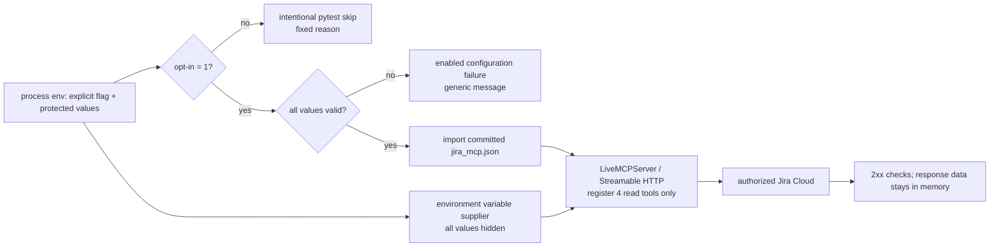

# PYPOST-1039: Optional secret-gated live Jira MCP smoke

## Decision

The committed Jira example already carries the production templates for search,
issue lookup, and board listing. `tests/test_mcp_server_integration.py` already
demonstrates the correct end-to-end test boundary: import the committed
collection, register its requests on `LiveMCPServer`, inject environment values,
and call the local Streamable HTTP MCP endpoint with an MCP client. The live
smoke will reuse that boundary; it will not make direct `requests` calls or
rebuild Jira request objects in test code.

The collection has no current-user request today. Step 4 must add the following
MCP-exposed, read-only request, then update the offline fixture contract and
exposed-tool floor accordingly:

| field | value |
| --- | --- |
| id / display name / MCP tool | `jira-get-current-user` / `Jira Get Current User` / `jira_get_current_user` |
| method and URL | `GET {{ jira_base_url }}/rest/api/3/myself` |
| headers | `Accept: application/json` and existing Basic-auth template |
| inputs | none; empty body and parameters |

The smoke has four and only four calls: current user, JQL search, issue
retrieval, and board listing. The search is the sole POST and is an explicitly
read-only Jira search endpoint. No mutation-capable collection request is
registered with its local server, which makes an accidental write impossible
through this test.

## Configuration and gate

The process environment is the only configuration source. There are no prompts,
credential files, secret-bearing command-line arguments, or committed values.

| Name | Required for enabled run | Handling |
| --- | --- | --- |
| `PYPOST_LIVE_JIRA_SMOKE` | Yes, exactly `1` | Explicit operator opt-in. Unset or any value other than `1` is an intentional skip. |
| `JIRA_BASE_URL` | Yes | Protected run configuration; map to `jira_base_url`. |
| `JIRA_CREDENTIALS` | Yes | Protected secret; map to `jira_credentials`. |
| `JIRA_PROJECT_KEY` | Yes | Protected run configuration; scopes the JQL search and board listing. |

The gate has two distinct outcomes:

1. If `PYPOST_LIVE_JIRA_SMOKE` is unset or is any value other than `1`, call `pytest.skip` with the fixed,
   value-free reason `live Jira MCP smoke intentionally skipped: opt-in is not enabled`.
   Do not inspect the other names or make any network request.
2. If the opt-in is `1`, require the three Jira values to be non-empty and not
   committed placeholder values. A missing, placeholder, or malformed value is
   a failed enabled run with the single generic message `live Jira MCP smoke
   configuration is incomplete or invalid`; it is never converted to a skip.

The explicit flag prevents a laptop with ambient Jira values from making a live
call accidentally. Values are never interpolated into skip reasons, assertions,
logs, docs, command lines, worklogs, artifacts, or job summaries. All injected
values (`jira_base_url`, `jira_credentials`, and `jira_project_key`) are marked
hidden in the MCP server test harness, so its sanitizer cannot reveal them.

## Execution architecture

### Test module

`tests/test_jira_mcp_live_smoke.py` will have a registered `live_jira` pytest
marker and a timeout. It imports the committed collection with the native
loader, selects only `jira-get-current-user`, `jira-search-issues-jql`,
`jira-get-issue`, and `jira-list-boards`, and starts them with the existing
`LiveMCPServer` helper. The calls use the complete Streamable HTTP MCP client
session pattern already proven in `tests/test_mcp_server_integration.py`.

The module's process-facing smoke is marked `slow` so standard `make test` and
ordinary PR CI remain strictly offline. Its dedicated Make target runs it
explicitly; without opt-in the target exits successfully and visibly reports
the intentional skip. A small offline gate test remains in the normal suite to
lock the skip-versus-enabled-failure behavior. This gives contributors a clear
safe outcome without an external-service dependency.

On an enabled run the four calls are sequential:

| MCP tool | Input | Required result |
| --- | --- | --- |
| `jira_get_current_user` | `{}` | 2xx and no PyPost/MCP execution error. |
| `jira_search_issues_jql` | Serialized JQL for `project = <configured project>`, `maxResults: 1`, fields `key`. | 2xx, no execution error, and exactly one usable issue key obtained in memory. |
| `jira_get_issue` | The in-memory key returned by search. | 2xx and no execution error. |
| `jira_list_boards` | `{}` | 2xx and no execution error. |

Using the search result removes the need to version or configure a separate
issue key. A zero-result search is a generic enabled-run failure, not a skip.
The test never renders response bodies, account IDs, issue keys, board data,
URLs, headers, configuration, or caught exceptions in assertion messages. It
uses fixed operation labels only. The live test run suppresses or filters the
relevant PyPost HTTP/MCP error logs because lower layers can include endpoint or
exception text; a failing operation reports only its fixed label.

## CI and developer interface

Step 4 adds a `test-jira-mcp-live` Makefile target that invokes only the smoke
module and does not put values on the command line. `pyproject.toml` registers
the `live_jira` marker for strict-marker compatibility. Documentation names the
four environment variables, target, intentional-skip behavior, and read-only
limit without supplying example values.

The existing `push` and `pull_request` jobs receive no Jira configuration and
never invoke the live target. A separate `workflow_dispatch` job is the only
CI entry point. It uses the protected GitHub Environment `jira-live-smoke` and
passes its configuration only as process environment variables to the target;
credentials are a GitHub secret and the remaining values use protected
variables/secrets under repository policy. The job summary contains only
`passed`, `failed`, or `intentionally skipped`, never configuration or Jira
response data. Do not use `pull_request_target`, do not check out untrusted PR
code in the protected job, and do not make a secrets-presence conditional in a
PR workflow.

## Step 3 mandatory red repro

Step 3 starts with deterministic offline tests; no Jira values or outbound
network are used.

1. Extend `tests/test_example_fixtures.py` to require the current-user request
   id, MCP exposure, `GET`, `/rest/api/3/myself`, no inputs, shared base-URL /
   Basic-auth templates, and the raised exposed-tool floor. This is red against
   today's collection because the request is absent.
2. Add gate tests that prove absent opt-in produces the fixed intentional
   skip, while opt-in with incomplete/placeholder configuration produces the
   generic failure rather than a skip.
3. Add a local-stub integration test using the existing MCP harness that locks
   the current-user tool/path and proves its returned response is not exposed
   in a test assertion/log message.
4. Add an offline workflow/Makefile contract assertion that normal PR jobs
   have no live-target invocation or Jira-secret mapping.

Step 4 turns the primary red fixture contract green by adding the read-only
current-user request. It must not weaken the test or substitute a direct HTTP
probe.

## Guardrails

- Preserve all offline fixture and stub integration coverage; the live smoke is
  complementary evidence for actual authentication and request rendering.
- Never register write tools, mutate Jira, or broaden the smoke beyond the four
  defined read operations.
- Never skip an explicitly enabled but bad configuration or failed live call.
- Never commit or deliberately emit credentials, real service addresses,
  account identifiers, issue/board data, or response bodies.
- Do not modify Jira access policy, external Atlassian MCP, or PyPost runtime
  authentication as part of this story.
