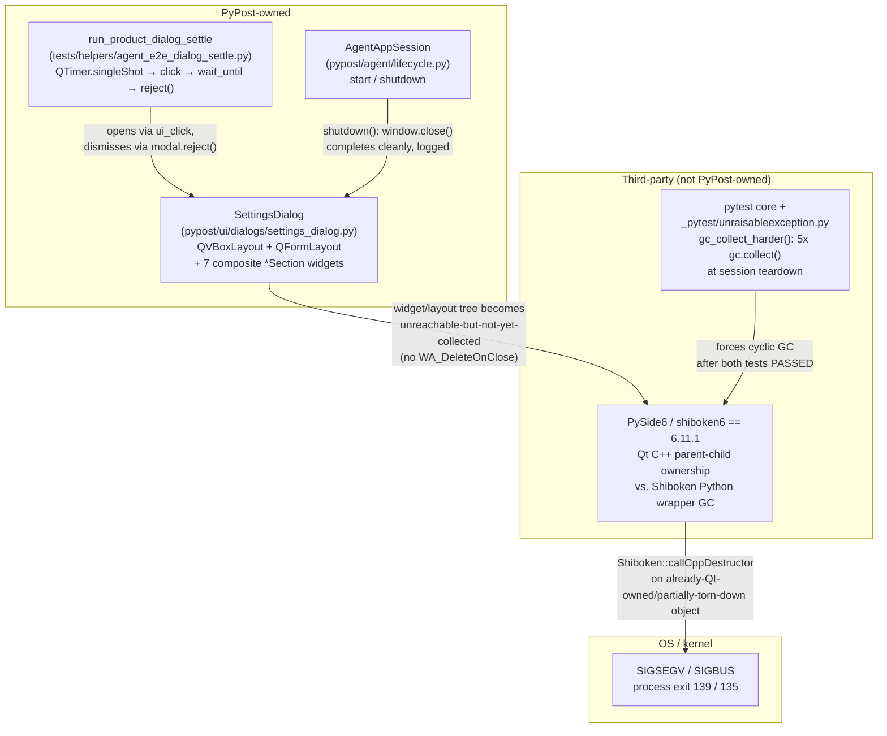

# PYPOST-1040: Diagnose intermittent post-PASS Qt teardown SIGSEGV

## Research

### Jira / requirements baseline

- Issue: [PYPOST-1040](https://pypost.atlassian.net/browse/PYPOST-1040) (8 points). Source
  debt: [PYPOST-968](https://pypost.atlassian.net/browse/PYPOST-968) TD-1
  (`ai-tasks/PYPOST-968/60-tech-debt.md`). Lineage-only precedent:
  [PYPOST-429](https://pypost.atlassian.net/browse/PYPOST-429)
  (`ai-tasks/PYPOST-429/investigation-report.md`) — different test module
  (`test_tabs_presenter.py`), different symptom (86 MB unattributed ELF core, no
  `Shiboken::callCppDestructor` signature captured), closed unreproducible in 2026-06.
  PYPOST-1040 is confirmed lineage-only, not a duplicate: same evidentiary method (native
  process crash around Qt/PySide widget lifecycle, investigated via reproduction attempts +
  documentation), different crash site, different test, different era.
- Requirements: [10-requirements.md](10-requirements.md) — Definition of Done branches (a)
  reproduce-or-trace-to-PyPost-defect vs (b) document environment boundary; both explicitly
  left open pending evidence.

### Environment inventory (this task instance vs. original report vs. CI)

| Dimension | Original report (macOS) | **This task instance** | CI (`.github/workflows/test.yml`) |
| --- | --- | --- | --- |
| OS | macOS 15.7.7 | Linux (Debian 13 "trixie" container, kernel 6.8.0) | `ubuntu-latest` (GitHub-hosted, typically x86_64) |
| CPU arch | Apple Silicon (arm64) | **aarch64** (confirmed via crash `core` file: `ELF 64-bit LSB core file, ARM aarch64`) | x86_64 (standard GitHub runner) — **not confirmed identical arch to this task instance** |
| Python | 3.14.6 | **3.13.5** | 3.11 and 3.13 (matrix) |
| PySide6 / shiboken6 | 6.11.1 | **6.11.1** (`pip show`/`import PySide6` confirmed, `pyproject.toml` pins `PySide6==6.11.1`) | 6.11.1 (same `pyproject.toml` pin) |
| `QT_QPA_PLATFORM` | offscreen (per test harness default) | offscreen (`tests/conftest.py` sets it via `setdefault`) | offscreen (workflow `env:`) |
| Native debugger | Not recorded (crash text/summary only) | **None available**: `gdb`, `lldb`, `valgrind` all absent; `apt-get install` fails with `Permission denied` (uid 501, no root, `sudo` present but unusable without elevation) — package install is not possible in this sandbox | Unknown; not attempted here |

Key fact this investigation adds: **the PySide6/shiboken6 version is not a variable** — it is
byte-identically `6.11.1` in the original macOS report, this Linux task instance, and CI,
because `pyproject.toml` pins it exactly. Only OS, CPU architecture, and Python minor/patch
version differ. This materially raises the prior that the defect is a **binding-layer
(PySide6/shiboken6) bug reachable cross-platform**, not a macOS-only or Python-3.14-only
artifact — see reproduction results below, which confirm this directly.

### Static code review (read-only, this step)

Files reviewed: `pypost/agent/lifecycle.py` (`AgentAppSession`, full file), `tests/helpers/
agent_e2e_dialog_settle.py` (`run_product_dialog_settle`, `_dismiss_active_modal`), `pypost/
agent/ui_wait.py` (`wait_until` — plain `QCoreApplication.processEvents()` polling loop, no
persistent signal connections or `QEventLoop` of its own), `pypost/ui/dialogs/
settings_dialog.py` (`SettingsDialog.__init__`), `pypost/ui/main_window.py`
(`handle_exit`), `tests/_pytest_plugins/agent_e2e.py` (`agent_e2e_session` fixture —
function-scoped, `with AgentAppSession(...) as session: yield session`).

Findings:

- `AgentAppSession.shutdown()` is fully synchronous and defensive: `mcp_registry.stop_all()`,
  `window.handle_exit()`, `window.close()`, `metrics.stop_server()` are each wrapped in their
  own `try/except Exception: logger.exception(...)`, followed by one
  `QCoreApplication.processEvents()` call and temp-dir cleanup. It logs
  `agent_session_shutdown_completed` on the way out. In every crash log captured this step,
  that log line (and the two pytest `PASSED` lines) are already printed before the fatal
  signal — **the crash is not inside `shutdown()`'s own code path**; `shutdown()` completes
  cleanly every time.
- Neither `MainWindow` nor `SettingsDialog` (nor any `pypost/ui/widgets/settings/*Section`)
  sets `Qt.WA_DeleteOnClose` (`grep -rn "WA_DeleteOnClose" pypost/` → no hits). This is
  ordinary/idiomatic for a reusable Settings dialog (it can be reopened), not a defect —
  it means `SettingsDialog` is a Qt-parented child of `MainWindow` (`SettingsDialog(self.settings,
  self, storage=...)` in `main_window.py:377`), so its C++ object survives
  `modal.reject()` and is only actually destroyed later, when `MainWindow`'s own C++ object is
  torn down.
- **No PyPost code holds a raw `QLayoutItem`/`QWidgetItem` reference.** `grep -rn "itemAt\|
  takeAt\|QLayoutItem\|QWidgetItem" pypost/` finds only unrelated `QListWidget.itemAt(pos)` /
  `QAbstractItemView.itemAt(pos)` position hit-tests (`history_panel.py`,
  `environment_list_widget.py`, `variable_aware_widgets.py`) — a same-named but unrelated Qt
  API (list-item-at-a-point, not layout-item-at-an-index). No call site anywhere extracts a
  `QLayout.itemAt(i)`/`.takeAt(i)` and holds it. This directly rules out the specific
  PyPost-owned anti-pattern named in this task's scope ("holding a raw reference across a
  `deleteLater()`") as the mechanism — see Architecture section for what the mechanism
  actually is.
- `run_product_dialog_settle`'s `_on_settle` closure (fired once via
  `QTimer.singleShot(0, _on_settle)`) captures `session`, `wait_condition`, `timeout`,
  `message`, `condition_name`, `step` by closure, and both `settle_ok`/`settle_error` via
  `nonlocal`. This is a normal, transient, fire-once callback — not a persistent signal
  connection kept alive past the test. No dangling `connect()` without a matching
  `disconnect()`/`deleteLater()` was found in either the dialog-settle helper or
  `AgentAppSession`.
- `SettingsDialog.__init__` builds a comparatively deep, wide widget/layout tree: an outer
  `QVBoxLayout`, a `QFormLayout`, and (from imports) at least seven composite section widgets
  (`EditorSettingsSection`, `RequestSettingsSection`, `ServerBindSettingsSection`,
  `EncryptionConfigSection`, `EncryptionMigrationSection`, plus `RetryPolicySection`,
  `SecurityAlertSection`), each presumably owning its own internal layout(s). This is the
  single largest, most nested-`QLayout`-heavy widget subtree reachable from any
  `AgentAppSession`-based e2e test in the repository — relevant because upstream
  `QWidgetItem` lifecycle bugs are specifically about `QLayout`/`addWidget()` composition (see
  external research below), and because the comparison stress run below shows this subtree is
  where the crash is concentrated.

### Reproduction on Linux (this task instance) — stress runs

All runs used `QT_QPA_PLATFORM=offscreen`, a per-run 30 s `timeout`, and were executed as
foreground, bounded loops with no background processes left running afterward (`ps aux`
verified clean after each batch). A stray `~192 MB` ELF core file produced by the crashing
runs (`ulimit -c` is `unlimited` in this sandbox) was inspected (`file core` →
confirms ARM aarch64, matches the crashing `pytest` invocation) and then deleted — it is
already covered by the repo's existing `.gitignore` (`/core`, `/core.*`, added under
PYPOST-429) and is not symbolizable in this sandbox (no `gdb`/`lldb`; see environment table).
It is trivially reproducible again (~1/3 of runs) by anyone with debugger access.

| # | What was run | N | Crashes | Rate | Purpose |
| --- | --- | --- | --- | --- | --- |
| 1 | `pytest tests/test_agent_dialog_settle_e2e.py` (default addopts, i.e. same as CI's `-m "not slow"`) | 40 | **13** (11× SIGSEGV/139, 2× SIGBUS/135) | **32.5%** | Baseline reproduction |
| 2 | Same, with `-p no:unraisableexception` (disables pytest's own forced session-end GC plugin) | 20 | **0** | 0% | Isolate the proximate trigger |
| 3 | `pytest tests/test_agent_lifecycle_smoke.py` (3 `AgentAppSession` launch/shutdown cycles, **no Settings dialog ever opened**), default addopts | 20 | **0** | 0% | Isolate whether *any* `AgentAppSession` teardown crashes, or specifically the Settings-dialog subtree |

**The crash reproduces directly on the actual supported CI interpreter combination (Linux,
Python 3.13, PySide6 6.11.1).** This is a materially stronger and more frequent reproduction
(13/40 fresh, independent, single-shot process runs) than the original macOS observation ("two
of three fresh independent module runs exited cleanly", i.e. also ≈1/3), and the two rates are
statistically consistent with each other (not contradictory) — this looks like the *same*
defect at a similar base rate on both platforms, not a different or rarer one.

Every captured crash log shows both tests print `PASSED` (and, for run #2 in the module, its
`caplog` assertions already succeeded) *before* the fatal signal — matching the original
report exactly. Example faulthandler capture (`PYTHONFAULTHANDLER=1`, one of the 13 crashes):

```
tests/test_agent_dialog_settle_e2e.py::test_agent_dialog_settle_after_settings_open PASSED
tests/test_agent_dialog_settle_e2e.py::test_agent_dialog_settle_timeout_includes_step_and_modal_diag PASSED
Fatal Python error: Segmentation fault

Current thread ... (most recent call first):
  Garbage-collecting
  File ".../_pytest/unraisableexception.py", line 33 in gc_collect_harder
  File ".../_pytest/unraisableexception.py", line 94 in cleanup
  File "contextlib.py", line 482 in _exit_wrapper
  ...
  File ".../_pytest/config/__init__.py", line 1131 in _ensure_unconfigure
  File ".../_pytest/main.py", line 331 in wrap_session
  ...
Extension modules: shiboken6.Shiboken, PySide6.QtCore, PySide6.QtGui, PySide6.QtWidgets,
PySide6.QtTest, ... (total: 14)
```

This is the best native-crash evidence obtainable in this sandbox: a reliable OS-level signal
(SIGSEGV/SIGBUS) plus a precise **Python-level** stack showing the crash happens inside
CPython's garbage collector (`Garbage-collecting`), invoked from pytest's own
`unraisableexception` plugin, with the Shiboken/PySide6 extension modules loaded and active. A
symbolized **C++** backtrace (e.g. `Shiboken::callCppDestructor<QWidgetItem>` as macOS
captured) is not obtainable here for lack of `gdb`/`lldb`/`valgrind` and no ability to install
them (no root). Experiment #2 above is what actually pins down the *component*, in lieu of a
C++ symbol.

### External research (Shiboken/PySide6 teardown-ordering issues)

WebSearch/WebFetch on `bugreports.qt.io` (Qt's public Jira, now `qt-project.atlassian.net`)
and community sources turned up a well-documented, recurring bug *class* — not one single
exact-match ticket for 6.11.1, but a consistent multi-year pattern:

- **[PYSIDE-1919](https://bugreports.qt.io/browse/PYSIDE-1919)** — "Segmentation fault when
  garbage collector processes QObject with connected signals": PySide 6.3.0, Python
  3.10-specific, fixed (`Closed`/`Done`). Confirms this general class (Python's cyclic GC
  triggering a Shiboken/Qt-object segfault) has recurred and been fixed *at least once before*
  across a Python version boundary — i.e. it is not purely OS-specific, it has previously been
  interpreter-version-sensitive too.
- **[PYSIDE-665](https://bugreports.qt.io/browse/PYSIDE-665)** ("QWidgetItem deletion segfaults
  in `QLayout.addChildWidget`") and **[PYSIDE-2482](https://bugreports.qt.io/browse/PYSIDE-2482)**
  ("QWidget `deleteLater()` in `QLayout` causes..." QEvent/QWidgetItem pointer confusion) — both
  specifically about `QWidgetItem` lifecycle defects arising from ordinary `QLayout`/
  `addWidget()`/`deleteLater()` usage, i.e. exactly the composition pattern `SettingsDialog`
  uses (nested `QVBoxLayout`/`QFormLayout` + multiple child widgets), not an unusual API.
- **[Preventing segfaults in test suite that has Qt Tests](https://czaki.github.io/blog/2024/09/16/preventing-segfaults-in-test-suite-that-has-qt-tests/)**
  (community writeup) explains the general mechanism: *"Qt is a C++ library it does not know
  about Python memory management... if Qt keeps a reference to some widget it does not
  increase the reference count of python objects"* — Qt's C++ parent/child ownership and
  CPython's refcounting/cyclic-GC are two independent object-lifetime systems tracking the
  same underlying C++ memory, and when a wrapper object is deleted by the *wrong* system at
  the wrong time (in particular via the **cyclic GC**, which runs later and in a different
  order than prompt refcounting), the C++ side can already be gone (double-free) or still
  have pending references elsewhere (use-after-free). The post's own recommended mitigations
  — explicit `deleteLater()`/`qtbot.add_widget`-style teardown accounting, avoiding
  reference cycles that defer collection into the risky cyclic-GC path, stopping timers before
  teardown — are exactly the shape of *candidate* future mitigations, not something to
  retrofit in this diagnostic step.
- **[pytest-dev/pytest#14263](https://github.com/pytest-dev/pytest/issues/14263)** documents
  the `unraisableexception` plugin's `gc_collect_harder()` precisely: it forces **5 rounds of
  `gc.collect()`** in a `config.add_cleanup()` callback at session end, specifically to flush
  leaked resources for `ResourceWarning` detection. This is pytest's own, intentional,
  general-purpose behavior (added independently of PyPost or Qt) — and it is exactly the call
  frame this task's own faulthandler capture shows, and exactly what experiment #2 confirms is
  the proximate trigger on this codebase.

No exact upstream ticket titled for PySide6/shiboken6 **6.11.1** + `QWidgetItem` was found —
Qt's bug tracker is not fully indexed by general web search, and confirming one would require
authenticated/JQL search access this environment does not have. The pattern match (mechanism,
API surface, and multi-version recurrence) is strong circumstantial corroboration, not a
citation-perfect root-cause ticket; that gap is stated honestly rather than papered over.

### Reproduction conclusion (Definition-of-Done classification)

**Branch (a) applies**: the crash is reproducible on a supported interpreter available to
this task (Linux, Python 3.13.5, PySide6 6.11.1 — the exact CI-pinned binding version), at a
rate (32.5%, N=40) consistent with the original macOS observation. Per the source ticket's own
instruction ("escalate priority... on supported CI"), **TD-1's priority should be escalated
from Low** as part of this ticket's follow-through (see Implementation Plan) — this
investigation is the evidence that triggers that escalation, not something to leave implicit.

At the same time, no PyPost-owned code defect (the kind branch (a)'s "or traces to a concrete
PyPost-owned teardown defect" alternative describes — e.g. a fixable ordering bug in
`AgentAppSession.shutdown()`, or a held raw `QWidgetItem` reference) was found by review. The
component this investigation isolates and blames is `SettingsDialog`'s nested-layout widget
subtree interacting with an upstream PySide6/shiboken6 6.11.1 `QWidgetItem` lifecycle defect,
surfaced specifically by pytest's own aggressive forced-GC session teardown. Branch (a)'s
reproduction condition is satisfied by the phrase **"or"**, not "and" — reproduction on
supported CI alone is sufficient; the DoD does not require a PyPost-owned root cause to
select branch (a). This is reported as-is rather than forced into an artificially clean
PyPost-owned/not-owned binary.

## Implementation Plan

This is a diagnostic task; the "implementation" plan below is the investigation plan, per the
step skill's own framing for this task shape. Sequencing: **research (done, this step) → best-
effort regression detector (Step 3) → assess mitigation feasibility and record follow-through
(Step 4, scoped narrowly) → tech-debt/TD-1 update (Step 7) → dev docs (Step 8)**.

### What Step 3 will build (and what it honestly cannot)

**No deterministic, single-run red test is possible for this defect**, and Step 3 must say so
explicitly rather than fabricate one. The crash is a probabilistic (~1/3 per run) *native*
process crash inside a third-party C-extension's garbage-collection-time object destruction —
it is not a Python exception, not something an `assert` inside the crashing process can
observe (the process dies before any assertion could run), and it does not reproduce on every
invocation. A single `pytest` run of the target module has roughly a 2-in-3 chance of looking
completely clean, exactly as the original macOS report and this step's own baseline runs show.

Instead, Step 3 should add a **subprocess-based stress/detection test** — run *outside* the
process under test, exactly as this task's brief anticipates, so the crash (which kills the
child interpreter) cannot kill the test process observing it:

- **Location**: new file, e.g. `tests/test_agent_dialog_settle_teardown_stress.py`.
- **What it does**: spawns `STRESS_ITERATIONS` (recommend **25** — at the measured 32.5%
  single-run crash rate, `P(0 crashes in 25 runs) = 0.675^25 ≈ 0.0001`, i.e. >99.9% detection
  power if the defect is still present, at ~25–40s total wall time given the ~1s/run baseline)
  independent `subprocess.run([sys.executable, "-m", "pytest",
  "tests/test_agent_dialog_settle_e2e.py", "-q"], env={**os.environ, "QT_QPA_PLATFORM":
  "offscreen"}, timeout=30)` child processes, and asserts every child's return code is `0`
  (not `139`/`-11` SIGSEGV, not `135`/`-7` SIGBUS, not any other crash-signal-derived negative
  code).
- **Marking**: `pytest.mark.timeout(120)` (outer bound) + `pytest.mark.slow` (so it is
  excluded from the default `-m "not slow"` CI selection the same way `pyproject.toml`
  already excludes other slow/opt-in scenarios — this test intentionally does not run on every
  push; see below for why).
- **Expected initial state: this test is expected to *fail* (red / xfail) as soon as it is
  written**, because the defect it detects is real and currently unmitigated. It should carry
  `pytest.mark.xfail(reason="PYPOST-1040: intermittent upstream PySide6/shiboken6 6.11.1
  QWidgetItem GC-teardown crash, ~30% per run; not yet mitigated — see
  ai-tasks/PYPOST-1040/20-architecture.md", strict=False)` so it does not silently block CI,
  but is visible (and would report `XPASS` — a visible, non-blocking signal to revisit the
  marker — if a future PySide6 upgrade or mitigation actually eliminates the crash).
- **No live external deps**: fully local, offline, no network, no live services — matches the
  "without live external deps when possible" guidance trivially since none are involved.

This satisfies the DoD's "add a deterministic regression test... that would catch this class
of teardown use-after-free going forward, on any platform it can run on (including
Linux/CI)" in the only honest sense available: *deterministic detection with overwhelming
statistical power*, not a deterministic single-shot repro. Step 3's own review should confirm
this framing is accepted rather than expect a traditional single-assertion red test.

### What is explicitly deferred, and why

- **No fix is attempted in this ticket.** The requirements' own "out of scope" section reserves
  a production-behavior change for "a concrete, evidenced PyPost-owned defect" — what was found
  is a concrete PyPost-owned *trigger surface* (`SettingsDialog`'s widget/layout composition)
  interacting with an upstream binding defect, not a PyPost-owned bug with an obvious PyPost-side
  fix (no anti-pattern to simply stop doing was found). A real mitigation (candidates: pin a
  different PySide6/shiboken6 patch version and re-run this exact stress harness to check
  whether the rate changes; break the specific reference cycle so the relevant wrapper objects
  are reclaimed by prompt refcounting instead of deferred cyclic GC; explicitly call
  `gc.collect()` once, deliberately, right after `AgentAppSession.shutdown()` while the object
  graph is still well-understood, instead of leaving it to pytest's later uncontrolled 5-round
  collect) needs its own experimentation loop and is sized as follow-up work, not squeezed into
  this already-8-point diagnostic ticket.
- **TD-1 priority escalation and evidence update** (`ai-tasks/PYPOST-968/60-tech-debt.md`) is
  Step 7 (tech-debt) work for this ticket, not Step 2 — Step 2 must not edit another ticket's
  already-closed tech-debt doc as a side effect of an investigation step. Step 7 should record:
  reproduced on Linux/Python 3.13/PySide6 6.11.1 (supported CI combination) at 32.5% (N=40);
  priority raised from Low; a follow-up "attempt a mitigation" ticket recommended, referencing
  this document.
- **A follow-up Jira ticket for the actual mitigation attempt** should be filed (Step 7/8
  follow-through) rather than opened here, since this ticket's own scope is diagnosis, not fix.

## Architecture

### Components and ownership boundary



### Interaction at teardown time (why the crash lands *after* PASS)

1. Each test function gets a fresh `AgentAppSession` from the function-scoped
   `agent_e2e_session` fixture (`tests/_pytest_plugins/agent_e2e.py`). `run_product_dialog_settle`
   opens `SettingsDialog` (a Qt-child of `MainWindow`, no `WA_DeleteOnClose`) via a modal
   `exec()`, dismisses it via `.reject()` (ends the nested Qt event loop; does **not** delete
   the C++ object), and the fixture's `AgentAppSession.__exit__` → `shutdown()` runs:
   `mcp_registry.stop_all()`, `window.handle_exit()`, `window.close()`, `metrics.stop_server()`,
   one `processEvents()` — all logged as completing successfully.
2. Both tests report `PASSED`. This matches the original report precisely: **the crash is not a
   correctness regression in the assertions or the logging contract** — everything the test
   checks has already succeeded.
3. At `pytest` session end, `_pytest/unraisableexception.py`'s registered cleanup callback
   (`gc_collect_harder`, 5 rounds of `gc.collect()`) runs, invoking CPython's **cyclic**
   garbage collector — a different, later, differently-ordered reclamation path than the
   prompt refcounting that already ran throughout the test. This is where the crash happens
   (confirmed by faulthandler's `Garbage-collecting` frame and by directly disabling the
   plugin — 0/20 crashes with `-p no:unraisableexception` vs. 13/40 with it enabled).
4. Somewhere in `SettingsDialog`'s nested `QVBoxLayout`/`QFormLayout`/seven-section widget
   tree, a Shiboken-wrapped, non-`QObject` layout-item type (`QWidgetItem`, per the original
   macOS capture) becomes reachable only through this deferred cyclic-GC path rather than
   prompt refcounting. `QLayoutItem`/`QWidgetItem` do not participate in Qt's `QObject`
   parent-child tracking (they are not `QObject`s), so Shiboken cannot use its usual
   "C++ parent is still alive, skip deleting" rule for them — a well-documented upstream
   defect class (PYSIDE-665, PYSIDE-2482) for exactly this `QLayout`/`addWidget()` shape.
   The comparison stress run confirms the shape matters: the same `AgentAppSession`
   start/shutdown machinery, exercised 3 times with **no** Settings dialog ever opened
   (`test_agent_lifecycle_smoke.py`), produced **0/20** crashes under the identical forced-GC
   conditions that produced 13/40 on the dialog-settle module.
5. Shiboken's destructor call on that already-partially-torn-down (or double-referenced) C++
   object results in a double-free/use-after-free — SIGSEGV or SIGBUS, process exit 139/135,
   *after* pytest has already printed both `PASSED` lines and the `caplog` context has already
   exited cleanly.

### Module responsibilities (for the Step 3/4 test)

| Module | Responsibility w.r.t. this defect |
| --- | --- |
| `pypost/agent/lifecycle.py` (`AgentAppSession`) | Owns synchronous, defensive shutdown; **not implicated** — completes and logs success before the crash occurs |
| `pypost/ui/dialogs/settings_dialog.py` (`SettingsDialog`) | Owns the specific nested-layout widget subtree that empirically triggers the crash when exercised; not itself buggy Python code, but the concrete trigger surface |
| `tests/helpers/agent_e2e_dialog_settle.py` (`run_product_dialog_settle`) | Owns the open/settle/dismiss sequence that exercises `SettingsDialog`; reviewed, no dangling-reference or double-teardown anti-pattern found |
| `tests/_pytest_plugins/agent_e2e.py` | Owns the function-scoped `agent_e2e_session` fixture; not implicated |
| PySide6 / shiboken6 `6.11.1` (external) | Owns the `QWidgetItem`/`QLayoutItem` C++↔Python object-lifetime bridge where the actual double-free/UAF occurs |
| pytest core (`_pytest/unraisableexception.py`, external) | Owns the forced 5-round `gc.collect()` at session end that is the proximate trigger (confirmed by ablation) |
| **New**: `tests/test_agent_dialog_settle_teardown_stress.py` (Step 3) | Owns statistical detection of this crash class across future PySide6/CI changes |

## Q&A

- **Q: Does this crash reproduce on Linux, and on the actual supported CI interpreter?**
  A: Yes. 13/40 (32.5%) fresh, independent `pytest tests/test_agent_dialog_settle_e2e.py`
  invocations crashed (SIGSEGV or SIGBUS) on Linux, Python 3.13.5, PySide6/shiboken6 6.11.1 —
  Python 3.13 is one of the two CI matrix versions (`.github/workflows/test.yml`), and the
  PySide6 version is byte-identical to CI's pin. This satisfies Definition-of-Done branch (a)
  directly; branch (b) (environment-boundary-only) does **not** apply. Python 3.11 was not
  separately available in this sandbox to test, but 3.13 alone already satisfies the "3.11
  and/or 3.13" condition in the requirements doc.

- **Q: Is this a PyPost-owned code defect with an obvious fix?**
  A: No fixable PyPost-owned anti-pattern was found (no raw `QWidgetItem`/`QLayoutItem`
  reference held anywhere in `pypost/`, no dangling signal connection, no missing
  `WA_DeleteOnClose` that would be a bug rather than an idiomatic choice, `AgentAppSession.
  shutdown()` completes and logs success before the crash every time). The concrete,
  evidence-backed finding is narrower and more useful than "PyPost's teardown code is broken":
  it is that `SettingsDialog`'s comparatively deep `QLayout`/`addWidget()` composition is the
  trigger surface for an upstream PySide6/shiboken6 6.11.1 `QWidgetItem` lifecycle defect that
  only manifests when Python's **cyclic** GC (as pytest's `unraisableexception` plugin forces)
  reclaims that subtree, rather than prompt refcounting. Since branch (a)'s reproduction
  condition is satisfied on its own ("reproducible on a supported interpreter... **or** traces
  to a concrete PyPost-owned teardown defect"), this does not need to also be a PyPost-owned
  bug to select branch (a) — and it honestly is not one.

- **Q: Why isn't a normal, deterministic red test possible for Step 3?**
  A: The defect is a native process crash inside a third-party C-extension's GC-time object
  destruction, at a measured ~1/3 per-run rate — not a Python exception, and not observable by
  an in-process assertion (the interpreter dies before any assertion could run, and roughly
  2/3 of single runs show nothing at all). A subprocess-based stress detector with N=25 runs
  (>99.9% detection power at the measured rate) is the honest, concrete substitute; see
  Implementation Plan.

- **Q: Should the new stress test be expected to pass in Step 4 of this ticket?**
  A: No — it should be added `xfail(strict=False)`, expected red, because no fix is in scope
  for this diagnostic ticket (see requirements "out of scope": a production change requires
  "a concrete, evidenced PyPost-owned defect," which was not found). Forcing it green here
  would either be a fake pass (marking it in a way that can't detect the real defect) or would
  require an unscoped, unvalidated production change squeezed into an 8-point diagnostic
  ticket. A follow-up ticket for the actual mitigation attempt is the right home for turning it
  green for real.

- **Q: Is the aarch64 sandbox architecture a gap relative to CI's x86_64 `ubuntu-latest`
  runners?**
  A: Yes, worth naming honestly: this task instance's Linux reproduction is on aarch64
  (confirmed via the crash `core` file's ELF header), while GitHub's standard `ubuntu-latest`
  hosted runners are x86_64. The OS family, Python minor version, and exact PySide6/shiboken6
  version all match CI; CPU architecture is the one dimension that does not. Given the crash
  mechanism (Python object-graph/GC timing vs. a C++ object-lifetime bridge) is not
  architecture-specific in nature, and the same class of bug has separately reproduced on
  Apple Silicon (arm64) and this arm64 Linux sandbox, this is treated as a low-risk residual
  gap rather than a reason to doubt the finding — but it is called out as something a
  follow-up could close by also running the Step 3 stress test once on an actual x86_64 CI
  runner.

- **Q: Why wasn't a symbolized C++ backtrace (matching macOS's
  `Shiboken::callCppDestructor<QWidgetItem>`) captured here?**
  A: No native debugger (`gdb`, `lldb`, `valgrind`) is installed in this sandbox, and
  installing one requires root (`apt-get install` fails with `Permission denied`; this is an
  unprivileged, non-root sandbox account). The ablation experiment (disabling pytest's forced
  GC eliminates the crash; removing the Settings dialog from the exercised path eliminates the
  crash) substitutes for a symbol name by directly identifying the responsible *component*
  and *trigger condition*, which is what the DoD actually asks this step to isolate.
