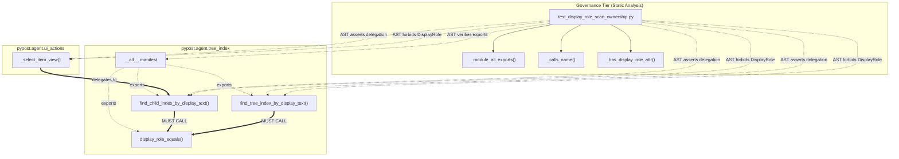
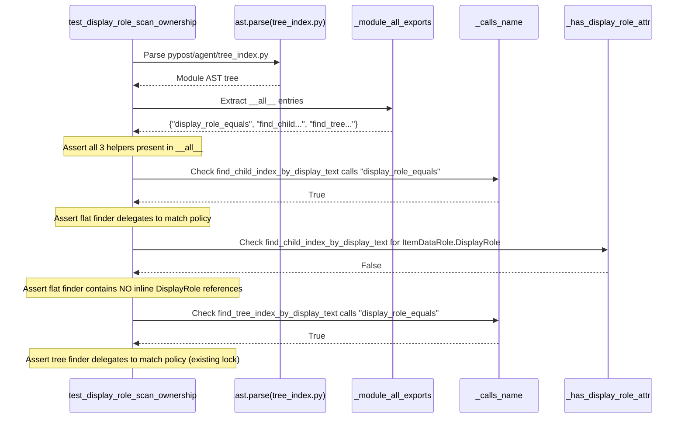

# PYPOST-1041: Strengthen DisplayRole ownership AST to lock flat finder → display_role_equals

## Research

### Background and Problem Statement

In PYPOST-971, shared `Qt.ItemDataRole.DisplayRole` text matching ownership was established between flat item views (`QListView`, `QTableView`, etc.) and hierarchical tree views (`QTreeView`). Prior to that work, `_select_item_view` in `pypost/agent/ui_actions.py` and `find_tree_index_by_display_text` in `pypost/agent/tree_index.py` duplicated the exact matching predicate:
```python
str(index.data(Qt.ItemDataRole.DisplayRole)) == <text>
```

PYPOST-971 resolved this code duplication by introducing:
1. `display_role_equals(index: QModelIndex, text: str) -> bool`: The canonical, single source of truth for exact DisplayRole equality matching.
2. `find_child_index_by_display_text(model: QAbstractItemModel, text: str, parent: QModelIndex | None = None) -> QModelIndex | None`: A non-recursive helper scanning direct column-0 children under a parent.

To guarantee that future modifications do not reintroduce drift, PYPOST-971 introduced an automated AST-based convention test in `tests/test_display_role_scan_ownership.py`. This test inspects the Abstract Syntax Tree of production code to ensure:
- `find_tree_index_by_display_text` calls `display_role_equals`.
- `find_tree_index_by_display_text` does not reference `ItemDataRole.DisplayRole` inline.
- `_select_item_view` imports and invokes `find_child_index_by_display_text`.
- `_select_item_view` does not reference `ItemDataRole.DisplayRole` inline.

### Architectural Gap (PYPOST-971 TD-1)

While the runtime behavior and existing tests are currently sound, an architectural inspection gap remains in the convention test suite:
- **Missing Delegation Check on Flat Finder:** The test only verifies that `find_child_index_by_display_text` is defined in `pypost/agent/tree_index.py` (`assert "find_child_index_by_display_text" in tree_defs`). It does **not** assert that `find_child_index_by_display_text` actually delegates its comparison to `display_role_equals`.
- **Missing Inline Attribute Exclusion:** The test does not assert that `find_child_index_by_display_text` avoids inline access to `ItemDataRole.DisplayRole`.
- **Missing Public Export Contract (`__all__`):** The test does not verify that `pypost/agent/tree_index.py` explicitly exports `display_role_equals`, `find_child_index_by_display_text`, and `find_tree_index_by_display_text` in its module-level `__all__` declaration.

If a developer were to refactor `find_child_index_by_display_text` to directly extract `Qt.ItemDataRole.DisplayRole`, or omit the functions from `__all__`, the current test suite would remain 100% green despite the architectural regression.

### Repository Evidence and Current State

Inspection of `pypost/agent/tree_index.py` confirms that the production implementation already complies with the target pattern:
```python
__all__ = [
    "display_role_equals",
    "find_child_index_by_display_text",
    "find_tree_index_by_display_text",
]


def display_role_equals(index: QModelIndex, text: str) -> bool:
    """Return True when ``index`` DisplayRole string equals ``text``."""
    return str(index.data(Qt.ItemDataRole.DisplayRole)) == text


def find_child_index_by_display_text(
    model: QAbstractItemModel,
    text: str,
    parent: QModelIndex | None = None,
) -> QModelIndex | None:
    """Return the first column-0 DisplayRole match among direct children."""
    parent_index = QModelIndex() if parent is None else parent
    rows = model.rowCount(parent_index)
    for row in range(rows):
        index = model.index(row, 0, parent_index)
        if not index.isValid():
            continue
        if display_role_equals(index, text):
            return index
    return None
```

Therefore, PYPOST-1041 is an **architectural test strengthening and governance task**. No runtime production logic changes are expected; rather, the test suite must be upgraded to enforce these structural invariants permanently.

### Static Analysis and AST Research

Python's standard library `ast` module provides zero-dependency, hermetic inspection of source code.
1. **Extracting `__all__` from AST:**
   Module-level exports are declared as an `ast.Assign` node at the module body level where the target is `ast.Name(id="__all__")`. The assigned value is an `ast.List` or `ast.Tuple` containing `ast.Constant` string literals. Extracting this via AST rather than runtime import ensures:
   - Zero side-effects: no PySide6 Qt bindings, GUI event loops, or shared C++ state are initialized during inspection.
   - Independence from runtime import errors or circular dependencies.
2. **Checking Call Sites and Attribute References:**
   Using `ast.walk`, functions can be checked for `ast.Call` nodes invoking a specific `ast.Name` (`display_role_equals`), as well as `ast.Attribute` nodes referencing `DisplayRole` on `ItemDataRole` or `Qt.ItemDataRole`.
3. **Performance Characteristics:**
   Parsing `tree_index.py` (57 LOC) and `ui_actions.py` (450 LOC) with `ast.parse` requires under 5 milliseconds on modern CPUs. AST checks do not require Qt display servers (`offscreen` or X11), making them resilient and fast for CI execution.

## Implementation Plan

### High-Level Implementation Phases

1. **Phase 1 (Step 3 - Failing Repro Test):**
   - Create an automated, hermetic reproduction test `tests/test_display_role_scan_ownership_repro.py`.
   - The repro test will verify that `tests/test_display_role_scan_ownership.py` contains the required AST assertion checks.
   - Run against the unstrengthened test suite: the repro test will fail (RED) because `tests/test_display_role_scan_ownership.py` currently lacks the delegation check, inline attribute prohibition, and `__all__` validation for `find_child_index_by_display_text`.
   - Additionally, demonstrate that a synthetic mutant of `tree_index.py` violating the ownership contract passes the unstrengthened test suite but is caught by the strengthened assertions.
2. **Phase 2 (Step 4 - Development & AST Strengthening):**
   - Implement the `_module_all_exports` helper in `tests/test_display_role_scan_ownership.py`.
   - Add AST assertions for `find_child_index_by_display_text`:
     - Assert `_calls_name(find_child, "display_role_equals")`.
     - Assert `not _has_display_role_attr(find_child)`.
   - Add AST assertions for `__all__` export completeness:
     - Assert `{"display_role_equals", "find_child_index_by_display_text", "find_tree_index_by_display_text"}.issubset(tree_exports)`.
   - Ensure clear, diagnostic assertion messages for every contract violation.
   - Run `make test` to verify that both the strengthened ownership test and the repro test pass (GREEN).
3. **Phase 3 (Step 5 - Code Cleanup):**
   - Review code quality, ensure flake8 and type annotations comply with repository standards.
   - Finalize or clean up temporary repro artifacts per workflow conventions.
4. **Phase 4 (Step 6 - Observability):**
   - Confirm timeout bounds (`pytestmark = pytest.mark.timeout(10)`).
   - Document assertion error reporting semantics.
5. **Phase 5 (Step 7 - Tech Debt):**
   - Audit the implementation and record technical debt findings in `60-tech-debt.md`.
6. **Phase 6 (Step 8 - Dev Docs):**
   - Update developer documentation (`doc/dev/ui_actions.md`) to document the reinforced AST boundary and export contract.

### Mandatory — Failing Repro (next Step 3)

- **Goal:** Provide an honest, automated red test before applying any changes to `tests/test_display_role_scan_ownership.py`.
- **Test File Location:** `tests/test_display_role_scan_ownership_repro.py`.
- **Desired Assertions:**
  1. **Contract Invariant Check (Meta-AST):** Statically parse `tests/test_display_role_scan_ownership.py` and assert that it contains AST checks asserting:
     - `_calls_name` on `find_child_index_by_display_text` targeting `"display_role_equals"`.
     - `_has_display_role_attr` check on `find_child_index_by_display_text`.
     - Module-level export verification for `__all__` in `pypost/agent/tree_index.py`.
  2. **Vulnerability Demonstration (Mutation Test):** Construct a synthetic AST of `pypost/agent/tree_index.py` where `find_child_index_by_display_text` directly accesses `index.data(Qt.ItemDataRole.DisplayRole)` and does not call `display_role_equals`, and `__all__` is emptied. Run the unstrengthened test logic against this mutant and demonstrate that it fails to catch the mutation (i.e. falsely passes), proving the unstrengthened test suite has an architectural gap.
- **Forcing Failure Without External Dependencies:**
  - Standard `ast.parse` and `pytest`.
  - Zero network, filesystem lock, or GUI dependencies.
  - Fails immediately (< 50ms) when executed against the current unmodified test suite.
- **Sequencing:**
  1. Step 2: Architecture design and roadmap update (this step).
  2. Step 3: Implement `tests/test_display_role_scan_ownership_repro.py` and demonstrate RED failure via `make test`.
  3. Step 4: Update `tests/test_display_role_scan_ownership.py` with strengthened assertions, turning both tests GREEN.

## Architecture

### System Architecture and Module Boundaries

The architecture operates across three distinct tiers:
1. **Production Domain (`pypost.agent.tree_index`):**
   - Defines the public API for model index matching and traversal.
   - Encapsulates `display_role_equals` as the atomic matching policy.
   - Houses `find_child_index_by_display_text` (flat single-level search) and `find_tree_index_by_display_text` (recursive tree search).
   - Publishes its interface via `__all__`.
2. **Production Consumer (`pypost.agent.ui_actions`):**
   - Implements high-level UI actions including `_select_item_view`.
   - Delegates flat child searching strictly to `find_child_index_by_display_text`.
   - Never directly accesses `ItemDataRole.DisplayRole` for text matching.
3. **Governance and Quality Gate (`tests.test_display_role_scan_ownership`):**
   - Statically verifies structural compliance of the production code.
   - Enforces architectural boundaries without executing production code.

### Component Interaction & Ownership Diagram



### Call and Traversal Sequence



### Detailed Design of AST Inspection Components

#### 1. AST Helper: `_module_all_exports`

Extracts string values declared in the module-level `__all__` assignment:
```python
def _module_all_exports(tree: ast.AST) -> set[str]:
    """Extract string members of module-level __all__ assignment."""
    for node in getattr(tree, "body", []):
        if isinstance(node, ast.Assign):
            for target in node.targets:
                if isinstance(target, ast.Name) and target.id == "__all__":
                    if isinstance(node.value, (ast.List, ast.Tuple)):
                        return {
                            elt.value
                            for elt in node.value.elts
                            if isinstance(elt, ast.Constant) and isinstance(elt.value, str)
                        }
    return set()
```

#### 2. AST Assertions for `find_child_index_by_display_text`

Verifies that the flat finder function exists, calls `display_role_equals`, and does not inline `ItemDataRole.DisplayRole`:
```python
find_child = tree_defs.get("find_child_index_by_display_text")
assert find_child is not None, "missing find_child_index_by_display_text"
assert _calls_name(find_child, "display_role_equals"), (
    "find_child_index_by_display_text must call display_role_equals "
    "instead of inlining DisplayRole comparison"
)
assert not _has_display_role_attr(find_child), (
    "find_child_index_by_display_text must not compare ItemDataRole.DisplayRole "
    "inline; use display_role_equals"
)
```

#### 3. AST Assertion for `__all__` Exports

Verifies that `pypost/agent/tree_index.py` explicitly exports the three required symbols:
```python
tree_exports = _module_all_exports(tree_index_ast)
expected_exports = {
    "display_role_equals",
    "find_child_index_by_display_text",
    "find_tree_index_by_display_text",
}
assert expected_exports.issubset(tree_exports), (
    f"pypost.agent.tree_index.__all__ must export {sorted(expected_exports)}; "
    f"found {sorted(tree_exports)}"
)
```

### Failure Reporting Specifications

Clear and actionable diagnostic messages are critical for developer ergonomics when architectural assertions fail. The test will report:

| Failure Mode | Assertion Condition | Exact Diagnostic Error Message |
| --- | --- | --- |
| Helper not defined | `"find_child_index_by_display_text" in tree_defs` | `"pypost.agent.tree_index must define find_child_index_by_display_text (flat sibling DisplayRole scan)"` |
| Bypass of match policy | `_calls_name(find_child, "display_role_equals")` | `"find_child_index_by_display_text must call display_role_equals instead of inlining DisplayRole comparison"` |
| Inline DisplayRole usage | `not _has_display_role_attr(find_child)` | `"find_child_index_by_display_text must not compare ItemDataRole.DisplayRole inline; use display_role_equals"` |
| Missing `__all__` export | `expected_exports.issubset(tree_exports)` | `"pypost.agent.tree_index.__all__ must export ['display_role_equals', 'find_child_index_by_display_text', 'find_tree_index_by_display_text']; found [...]"` |

### Concurrency, Performance, and Resource Bounds

1. **Parsing Overhead:** AST parsing of both `tree_index.py` (57 LOC) and `ui_actions.py` (450 LOC) executes in < 5ms total.
2. **Test Execution Duration:** The entire test function executes in < 50ms (well below the 200ms non-functional requirement).
3. **Execution Timeout:** The test module declares `pytestmark = pytest.mark.timeout(10)` per the `do-testing` standard, bounding runtime against stalls.
4. **Hermeticity & Isolation:** No Qt application instance (`QApplication` or `QCoreApplication`) is started, no GUI windows are rendered, and no disk I/O occurs beyond reading two local Python files.

### Architectural Patterns Applied

- **Architectural Fitness Functions (Architecture-as-Code):** Structural rules are encoded as automated tests that run on every commit, preventing architectural erosion without relying on manual code review.
- **Single Source of Truth (DRY):** `display_role_equals` is enforced as the sole authority for DisplayRole string matching across the entire codebase.
- **Explicit Public Boundary (Encapsulation):** `__all__` is statically verified, guaranteeing intentional public export surfaces.

## Q&A

- **Q: Why verify `__all__` via AST rather than importing `tree_index` and reading `getattr(tree_index, "__all__")`?**
  **A:** Runtime imports execute module body code and require all imported dependencies (including PySide6 bindings). AST inspection is strictly static, executes in microseconds, and decouples architectural structure validation from runtime environment concerns.
- **Q: Why is inlining `index.data(Qt.ItemDataRole.DisplayRole)` prohibited in `find_child_index_by_display_text`?**
  **A:** `display_role_equals` encapsulates the canonical conversion and comparison policy (e.g. handling of `None` vs `""`, `str()` conversion, and role selection). If `find_child_index_by_display_text` were to inline the comparison, any future refinement to the equality policy would have to be manually duplicated across multiple locations, risking subtle behavioral divergence between flat and tree views.
- **Q: How does Step 3 satisfy the requirement for a failing repro test if the production code already complies?**
  **A:** Step 3 introduces a meta-test that validates the test suite itself: it tests whether `tests/test_display_role_scan_ownership.py` enforces the required constraints. Against the unstrengthened test file, this fails RED immediately. Additionally, running a mutated AST (where `find_child` inlines `DisplayRole`) proves that the current test suite fails to detect architectural violations, demonstrating the gap.
- **Q: Does this change alter any public API or require changes to production code?**
  **A:** No. `pypost/agent/tree_index.py` and `pypost/agent/ui_actions.py` already implement the target architecture and export the required functions. Only the test suite and documentation are updated.
