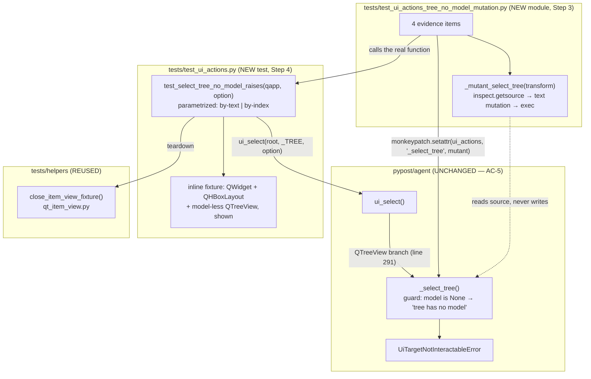

# PYPOST-1042: Dedicated contract test for a tree with no model

## Research

### 1. What production already does (re-confirmed, not re-litigated)

Step 1 established — and this step accepts without re-deriving — that the behaviour exists:

| Fact | Location |
| --- | --- |
| `_select_tree` raises `UiTargetNotInteractableError(widget_id, "tree has no model")` as its **first** statement, before `_pump()` and before the option kind is inspected | `pypost/agent/ui_actions.py:243-246` |
| `ui_select` dispatches `QTreeView` (line 291) **before** the generic `QAbstractItemView` branch (line 293), so a tree can never yield `item view has no model` | `pypost/agent/ui_actions.py:287-294` |
| `tree has no model` occurs in `tests/` exactly once — a **negative** assertion inside the flat-view test | `tests/test_ui_actions.py:328` |

Consequence for this design: **no production change, no classic red-then-green**. The deliverable is
a test plus recorded proof that the test is load-bearing.

### 2. The mirror to follow

`test_select_list_view_no_model_raises` (`tests/test_ui_actions.py:314-330`) is the template:

- Builds its widget **inline in the test body** (`QWidget` + `QHBoxLayout` + a model-less
  `QListView`), rather than through one of the module's `_make_*_fixture` helpers — deliberately,
  because the `_make_*` helpers all attach a model.
- `set_widget_id(view, _LIST_VIEW)`, `root.show()`, `qapp.processEvents()` — the `show()` matters:
  `ui_select` runs `_require_interactable` first (`ui_actions.py:89-93`), so an unshown fixture
  would refuse with `not visible` and prove nothing (requirements C-3).
- `try` / `finally` with `close_item_view_fixture(root, qapp, <id>, view_type=<ViewType>)`.
- Asserts the positive substring and the absence of the twin substring.

Teardown reuse is safe for a model-less view: `close_item_view_fixture` →
`detach_item_view_model` is guarded by `if view.model() is not None`
(`tests/helpers/qt_item_view.py`), so it is a no-op on our fixture and still performs
`root.close()` + `processEvents()`.

### 3. Isolated-tree harness — inspected and rejected

`build_isolated_tree_actions` / `isolated_tree_actions` / `close_isolated_tree_actions` live in
`tests/helpers/collections_tree.py` and are **not** usable here:

| Property of the harness | Why it blocks this task |
| --- | --- |
| `harness.view.setModel(harness.model)` is unconditional | The scenario requires `model()` to be `None`; a harness that always attaches a model cannot express it |
| Constructs a `CollectionTreeActions` presenter with a `FakeRequestManager`, metrics, and eight emit mocks | Presenter wiring is irrelevant to a `ui_select` dispatch contract and would add unrelated failure modes |
| The `QTreeView` is never `show()`n and has no `objectName` | `ui_select` would refuse with `not visible`, and `find_widget` could not resolve it at all |

It is the right harness for `CollectionTreeActions` presenter tests (rename/delete/context menu) and
the wrong one for an agent UI-primitive contract. **Decision: do not use it; mirror the flat-view
twin's inline fixture instead.** `close_item_view_fixture` — already shared, already used by every
tree/list-view test in the module — covers the teardown half.

### 4. Where the test can run (requirements C-4)

`tests/test_ui_actions.py` carries `pytestmark = [pytest.mark.timeout(60), pytest.mark.agent_e2e]`.
`pyproject.toml` `addopts` selects `-m "not slow"`, and `make test` runs the same selection, so an
`agent_e2e` item **is** in the fast routine gate. `make test-agent-e2e` picks it up as well. No new
marker is needed, and none may be added (`--strict-markers` is on; the registered set is
`timeout`, `slow`, `live_jira`, `agent_e2e`).

### 5. AC-7 mutation technique — what transfers from PYPOST-1041 and what does not

PYPOST-1041 (`tests/test_display_role_scan_ownership_repro.py:181-193`) proved a guard was real by
monkeypatching the suite's **parse hook** (`ownership_suite._parse`) so it read a synthetic mutant
*source string* instead of `pypost/agent/tree_index.py`, then calling the real suite function and
requiring it to raise. The transferable half of that pattern is the discipline:

> the mutation is applied to an **in-process copy**, never to a file under `pypost/`, and the
> **real** test function is invoked so what goes red is the actual assertion, not a transcription.

The non-transferable half is the mechanism. PYPOST-1041 guarded an **AST property**, so re-parsing
mutated text *was* the whole system under test. Here the guard is **runtime Qt behaviour**: nothing
parses `ui_actions.py`, so a mutated source string is inert unless it is executed. Re-importing a
full mutated copy of `ui_actions.py` is worse than useless — the copy defines its **own**
`UiTargetNotInteractableError` class, so the contract test's `pytest.raises(...)` would miss it and
the run would go red for class identity, not for the mutation.

**Chosen mechanism — runtime analogue, same discipline:** mutate only `_select_tree`, by
transforming *its own source* and executing it against `ui_actions`' own globals.

1. `textwrap.dedent(inspect.getsource(ui_actions._select_tree))` — the real production text.
2. Apply one textual mutation; assert the anchor was found, so a reformat fails loudly instead of
   silently producing a non-mutant.
3. `exec(compile(mutated, "<mutant _select_tree>", "exec"), dict(ui_actions.__dict__))` — a **copy**
   of the module dict, so the mutant sees the genuine `UiTargetNotInteractableError`,
   `find_tree_index_by_display_text`, and `_pump`, and the module dict itself is untouched.
4. `monkeypatch.setattr(ui_actions, "_select_tree", mutant)` — `ui_select` resolves `_select_tree`
   as a module global **at call time**, so the unmodified contract test body runs against mutated
   behaviour; `monkeypatch` reverts on teardown.

**Verified by a throwaway offscreen probe** (scratchpad only, no repo file written, `pypost/`
untouched):

| Mutant | Option form | Observed result |
| --- | --- | --- |
| none (baseline) | `"Alpha"` and `0` | `UiTargetNotInteractableError … reason=tree has no model` |
| guard lines deleted | `"Alpha"` | `UiTargetNotInteractableError … reason=option not found: 'Alpha'` |
| guard lines deleted | `0` | `AttributeError: 'NoneType' object has no attribute 'rowCount'` |
| reason reworded to `item view has no model` | `"Alpha"` and `0` | `UiTargetNotInteractableError … reason=item view has no model` |

Every mutant row breaks at least one assertion of the planned contract test, and the reworded row
breaks both (positive substring absent, negative substring present). The class identity is
preserved — visible in the reworded rows, which the contract test's `pytest.raises` still catches.

### 6. AC-8 doc target — resolving the Step 1 review's flag

The requirements say "the agent error-path coverage matrix" without naming a file. **No document
with that name exists.** A grep over `doc/dev/` finds one coverage matrix (`Context coverage
matrix`, `doc/dev/template_expression_functions.md:100`) — unrelated. The real locations are:

| Candidate | Verdict |
| --- | --- |
| `doc/dev/ui_actions.md` § Troubleshooting, `**tree has no model**` bullet (lines 361-365) | **Step 8 target.** The `item view has no model` bullet directly above already names its fixture proof; the tree bullet is the only entry with none |
| `doc/dev/ui_actions.md` § `ui_select` fixture-contract paragraph (lines 182-196) | **Step 8 target.** This is the prose enumeration of select negative-path proofs (PYPOST-942/972/974/975); the tree no-model twin belongs in the sentence that currently ends "distinct from `tree has no model`" |
| `ai-tasks/PYPOST-972/60-tech-debt.md` § Missing Tests, row "Tree missing model — **Not covered**" | **Not edited.** It is a historical, closed artifact whose TD-1 already links to PYPOST-1042. Closure is recorded forward in `ai-tasks/PYPOST-1042/60-tech-debt.md` at Step 7 |
| `doc/dev/testing.md` | Out of scope — no rule from `do-testing` changes |

So AC-8's "coverage matrix" resolves to **exactly two edits in `doc/dev/ui_actions.md`**, plus the
forward reference in this task's own Step 7 artifact. The PYPOST-1041 DisplayRole ownership section
(`doc/dev/ui_actions.md:209+`) is **not** touched: the no-model refusal short-circuits before any
display-text match, so no display-role reader moves (requirements FR-7).

## Implementation Plan

### Sequencing

| Step | Work | Expected outcome |
| --- | --- | --- |
| 3 | Add the mutation-evidence module `tests/test_ui_actions_tree_no_model_mutation.py` **only** | **RED** — every item fails with "`tests/test_ui_actions.py` must define `test_select_tree_no_model_raises`", because the contract test does not exist yet |
| 4 | Add the contract test `test_select_tree_no_model_raises` to `tests/test_ui_actions.py` | **GREEN** — the contract test passes on its first run (expected), and the Step 3 module flips green only because the new test is genuinely sensitive to both mutants |
| 5 | `make lint`; flake8/format review of the two test files | Lint gate green |
| 6 | Observability: confirm timeouts, confirm no new production logging is needed (test-only change) | `50-observability.md` |
| 7 | Tech-debt pass; record PYPOST-972 TD-1 closure by reference | `60-tech-debt.md` |
| 8 | The two `doc/dev/ui_actions.md` edits from Research §6 | AC-8 |

The Step 3 → Step 4 transition is a **real** red-to-green transition, and the red is not a
formality: after Step 4 the evidence module stays green only while the contract test keeps failing
under both mutants. Delete the contract test's positive assertion and the evidence module goes red
again.

### Mandatory — Failing Repro (next Step 3)

**Classic red repro: N/A — no behavioural change.** The production refusal already exists
(`ui_actions.py:243-246`), so a correct new contract test is green on its first run; PYPOST-972
recorded the same situation for the flat-view twin. AC-7 replaces it with mutation evidence.

**What Step 3 writes:** `tests/test_ui_actions_tree_no_model_mutation.py`.

- Module header: `pytestmark = [pytest.mark.timeout(60), pytest.mark.agent_e2e]` — mirrors the suite
  it drives (it runs real Qt widgets through `ui_select`), and keeps the item in the fast gate.
- Imports `tests.test_ui_actions` as a **module** (never `from … import test_…`), and resolves the
  contract function through a helper that raises a named `AssertionError` when it is missing. This
  is what makes Step 3 red as four clean assertion failures rather than one collection error.
- Builds the two mutants per Research §5 and injects them with `monkeypatch.setattr`.

**What Step 3 observes (the four items and their expected reds/greens):**

| Item | Mutant × option | Asserts | Step 3 (no contract test) | Step 4 (contract test present) |
| --- | --- | --- | --- | --- |
| `…guard_removed_text_option` | deleted × `"Alpha"` | contract test raises `AssertionError` matching `tree has no model` | RED — contract test missing | GREEN — refusal degrades to `option not found` |
| `…guard_removed_index_option` | deleted × `0` | contract test raises `AttributeError` matching `rowCount` | RED — contract test missing | GREEN — the guard is what prevents a `None`-model dereference |
| `…reason_reworded[by-text]` | reworded × `"Alpha"` | contract test raises `AssertionError` | RED — contract test missing | GREEN |
| `…reason_reworded[by-index]` | reworded × `0` | contract test raises `AssertionError` | RED — contract test missing | GREEN |

**What "red" means for a coverage-only task** — stated explicitly so the Step 3 review can judge it:
red here is *"the guard-of-the-guard cannot find the guard"*, not *"production is broken"*. The
substantive proof is the Step 4 column: each row shows the contract test failing against a mutated
`_select_tree`, which is exactly FR-6/AC-7. Both are recorded in
`ai-tasks/PYPOST-1042/25-failing-repro.md` with the actual pytest output.

**Commands** (never the full suite — it is known-red and segfaults Qt workers):

```bash
make test PYTEST_ARGS="tests/test_ui_actions_tree_no_model_mutation.py"   # Step 3: red
make test PYTEST_ARGS="tests/test_ui_actions.py tests/test_ui_actions_tree_no_model_mutation.py"
make test PYTEST_ARGS="tests/test_display_role_scan_ownership.py tests/test_display_role_scan_ownership_repro.py"  # NFR-3
make lint
```

**No external dependencies, no live product.** Offscreen Qt (`QT_QPA_PLATFORM=offscreen`, set in
`tests/conftest.py`), module-scoped `qapp`, no network, no `COLLECTION_TREE`, no session fixture.

## Architecture

### Module map



Dependency direction is one-way: evidence → contract → production. Nothing in `pypost/` learns about
either test, and the evidence module is the only place that knows `_select_tree` is a private name.

### Components

| # | Component | Responsibility |
| --- | --- | --- |
| C-1 | `test_select_tree_no_model_raises` (`tests/test_ui_actions.py`, appended immediately after `test_select_list_view_no_model_raises` so the twins read as a pair) | The contract: a shown, enabled, model-less `QTreeView` refuses with `tree has no model` and not with `item view has no model` |
| C-2 | Inline fixture inside C-1 | Mirrors the flat-view twin exactly: `QWidget` + `QHBoxLayout` + `QTreeView()` with **no** `setModel`, `set_widget_id(tree, _TREE)`, `root.show()`, `qapp.processEvents()` |
| C-3 | `close_item_view_fixture(root, qapp, _TREE, view_type=QTreeView)` in C-1's `finally` | Teardown; a no-op detach on a model-less view, then `close()` + `processEvents()` (NFR-2) |
| C-4 | `tests/test_ui_actions_tree_no_model_mutation.py` | AC-7 evidence: builds the two mutants, injects them, runs C-1, requires it to fail |
| C-5 | `doc/dev/ui_actions.md` edits (Step 8) | Points the published vocabulary at the new proof (AC-8) |

### Interfaces

```text
# C-1 — contract (tests/test_ui_actions.py)
@pytest.mark.parametrize("option", ["Alpha", 0], ids=["by-text", "by-index"])
def test_select_tree_no_model_raises(qapp: QApplication, option: str | int) -> None: ...

# C-4 — evidence (tests/test_ui_actions_tree_no_model_mutation.py)
_GUARD_SOURCE: str                       # the two guard lines, verbatim anchor
_contract_test() -> Callable             # getattr on tests.test_ui_actions, or a named AssertionError
_mutant_select_tree(mutate: Callable[[str], str]) -> Callable[..., None]
_install(monkeypatch, mutant) -> None    # monkeypatch.setattr(ui_actions, "_select_tree", mutant)
```

C-1 reuses the module's existing `_TREE = "fixture_tree"` id, module `pytestmark`, and imports
(`QTreeView`, `set_widget_id`, `ui_select`, `UiTargetNotInteractableError`,
`close_item_view_fixture` are already imported at `tests/test_ui_actions.py:1-41`). Expected new
imports: none for C-1; `inspect`, `textwrap`, `pypost.agent.ui_actions`, and
`tests.test_ui_actions` for C-4.

### Decisions and justification

- **D-1 — the contract test lives in `tests/test_ui_actions.py`, not a new module.** AC-1 asks for a
  *dedicated test*, not a dedicated file. The ticket, the requirements, and PYPOST-972 TD-1 all say
  "mirror `test_select_list_view_no_model_raises`", and a mirror that sits three lines below its
  twin, sharing the module `pytestmark`, fixture id constants, imports, and teardown helper, is the
  smallest and most reviewable form. A separate module would duplicate the header for one test and
  split a pair that is only meaningful as a pair.
- **D-2 — the fixture is built inline, not via a new `_make_*` helper.** Every `_make_*_fixture` in
  the module attaches a model; a `_make_tree_no_model_fixture` would be a one-caller helper whose
  only content is "the same thing, minus `setModel`". The twin already builds inline for exactly
  this reason. Parametrization re-runs the body, so each item gets a fresh window.
- **D-3 — AC-4 via `@pytest.mark.parametrize`, not two test functions and not a loop.** Parametrize
  is the module's own idiom for "same refusal, several inputs"
  (`tests/test_ui_actions.py:447, 473, 499, 525, 601`). It yields two independently reported items
  (`[by-text]`, `[by-index]`) from one body, so a regression names the failing form — which a
  two-form loop inside one test would hide — with zero duplication. `"Alpha"` is the same text the
  flat-view twin uses; `0` is the smallest in-range-looking index, which is the interesting case
  because with the guard removed it is the one that dereferences a `None` model.
- **D-4 — the evidence lives in its own module.** It follows the repo's own precedent
  (`tests/test_display_role_scan_ownership.py` + `…_repro.py`): the suite states the contract, a
  sibling module proves the contract is load-bearing. It also keeps `inspect`/`exec` mutation
  plumbing out of a 634-line behavioural module, and it is what makes the Step 3 red possible —
  a module that can be added *before* the test it guards.
- **D-5 — mutate `_select_tree` only, executed against a copy of the module dict.** Justified in
  Research §5 and probe-verified. The alternative — a hand-written stub `_select_tree` — would prove
  only that the test notices *some* substitution; deriving the mutant from
  `inspect.getsource(ui_actions._select_tree)` proves it notices *this guard's* removal and *this
  string's* rewording. The anchor assertion means a production reformat fails the evidence module
  loudly rather than degrading it into a vacuous pass.
- **D-6 — `pypost/` is never written.** Mutation happens in memory, on a copy, reverted by
  `monkeypatch` at teardown. No file under `pypost/` is opened for writing at any step, satisfying
  AC-5 and C-1; the working tree diff after Step 8 is two test files, `doc/dev/ui_actions.md`, and
  `ai-tasks/PYPOST-1042/*`.
- **D-7 — timeouts.** Both files declare `pytest.mark.timeout(60)` at module scope, the GUI tier of
  `do-testing` and the value already used by `tests/test_ui_actions.py`. No internal waiting of any
  kind: the scenario is a synchronous raise with a single `processEvents()` pump, so there is no
  polling loop to bound (NFR-1).

### Traceability

| AC | Satisfied by |
| --- | --- |
| AC-1 | C-1, named `test_select_tree_no_model_raises`, docstring citing PYPOST-1042 (D-1) |
| AC-2 | `pytest.raises(UiTargetNotInteractableError)` + `assert "tree has no model" in message` |
| AC-3 | `assert "item view has no model" not in message` |
| AC-4 | D-3 parametrization over `["Alpha", 0]` |
| AC-5 | D-6; production untouched, verified by `git status` / `git diff -- pypost/` at Step 5 |
| AC-6 | D-7 timeout, C-2 isolated fixture, C-3 teardown in `finally` |
| AC-7 | C-4 plus the recorded transcripts in `25-failing-repro.md` (Research §5 table) |
| AC-8 | C-5 — the two `doc/dev/ui_actions.md` edits pinned in Research §6, plus Step 7's forward closure of PYPOST-972 TD-1 |

### Risks

| Risk | Mitigation |
| --- | --- |
| Production `_select_tree` is reformatted, so the mutation anchor no longer matches | The mutant builder asserts the anchor was found; the evidence module goes red with a message naming the anchor, instead of silently mutating nothing |
| `_select_tree` is renamed or inlined into `ui_select` | Same: `getattr` on the module fails loudly. This is desirable — the evidence module is allowed to be coupled to the private name; the contract test is not |
| Someone deletes the contract test but keeps the evidence module | The evidence module is red immediately (its `_contract_test()` helper raises) |
| A leaked Qt window perturbs the module-scoped `qapp` | C-3 teardown runs in `finally`, including on the `AttributeError` mutant path where the exception escapes the `pytest.raises` block |

## Q&A

- **Q: Why not reuse `build_isolated_tree_actions` / `isolated_tree_actions`?**
  A: They always call `setModel`, never `show()` the view, never set an `objectName`, and drag a
  `CollectionTreeActions` presenter plus a `FakeRequestManager` into a test about `ui_select`
  dispatch. They cannot express "no model" at all. See Research §3.

- **Q: Does PYPOST-1041's mutation pattern fit here?**
  A: Its *discipline* does — mutate a copy in process, never `pypost/`, and invoke the real test so
  the real assertion is what goes red. Its *mechanism* does not: 1041 guarded an AST property, so
  swapping the parsed source was the entire experiment. This guard is runtime Qt behaviour; a
  mutated source string only matters if it is executed. Executing a whole mutated copy of
  `ui_actions.py` would break exception-class identity and make the red meaningless, so the design
  mutates `_select_tree` alone and executes it against a copy of `ui_actions.__dict__`, then
  monkeypatches the module attribute. Verified by probe (Research §5).

- **Q: Is monkeypatching a module attribute "modifying production code"?**
  A: No. Nothing under `pypost/` is written; `monkeypatch` rebinds one module attribute for the
  duration of one test item and restores it at teardown, and the mutant is compiled from a *copy*
  of the source string. AC-5 is about the repository diff, which stays empty under `pypost/`.

- **Q: If the contract test is green on first run, what exactly is red in Step 3?**
  A: The four evidence items, because the contract test they invoke does not exist yet. That is a
  genuine failing-first artifact and it mirrors PYPOST-1041's repro, whose first three tests were
  likewise "the suite must contain assertion X". The substantive AC-7 proof appears at Step 4, when
  the same four items go green *only because* the new test is sensitive to both mutants.

- **Q: Why is the "guard removed × by-index" evidence item allowed to expect `AttributeError`
  instead of a clean assertion failure?**
  A: Because that is what genuinely happens (probe row 3): with the guard gone, the index branch
  calls `model.rowCount()` on `None`. Expecting `AttributeError` states the real consequence — the
  guard is what stands between an agent and a `NoneType` crash — instead of laundering it into a
  vaguer "raises something" assertion.

- **Q: Which text option should the by-text case use?**
  A: `"Alpha"`, the same literal as `test_select_list_view_no_model_raises`, so the twins read
  identically. The value is irrelevant to the outcome — the refusal precedes any option handling
  (F-2) — and that irrelevance is precisely what AC-4 pins.

- **Q: Does anything here touch the DisplayRole ownership guard?**
  A: No. The refusal short-circuits before `find_tree_index_by_display_text` is reached, so no
  display-role reader is added or moved. `tests/test_display_role_scan_ownership.py` and its repro
  are re-run unchanged at Steps 3/4 as the NFR-3 regression check.

- **Q: Where is "the agent error-path coverage matrix" that AC-8 mentions?**
  A: It does not exist under that name; the Step 1 review was right to flag it. Resolved in Research
  §6 to two concrete edits in `doc/dev/ui_actions.md` (the Troubleshooting `tree has no model`
  bullet at lines 361-365, and the `ui_select` fixture-contract paragraph at lines 182-196), with
  PYPOST-972 TD-1's closure recorded forward in this task's `60-tech-debt.md` rather than by
  rewriting PYPOST-972's historical artifact.

## References

- Requirements: [`10-requirements.md`](10-requirements.md) (AC-1..AC-8, FR-1..FR-7)
- Production under test: `pypost/agent/ui_actions.py:211-296`
- Mirror: `tests/test_ui_actions.py:314-330` (`test_select_list_view_no_model_raises`)
- Shared teardown: `tests/helpers/qt_item_view.py`
- Rejected harness: `tests/helpers/collections_tree.py` (`build_isolated_tree_actions`)
- Mutation-pattern precedent: `tests/test_display_role_scan_ownership_repro.py:181-233`,
  [`../PYPOST-1041/25-failing-repro.md`](../PYPOST-1041/25-failing-repro.md)
- Origin: [`../PYPOST-972/60-tech-debt.md`](../PYPOST-972/60-tech-debt.md) TD-1
- Jira: [PYPOST-1042](https://pypost.atlassian.net/browse/PYPOST-1042)
