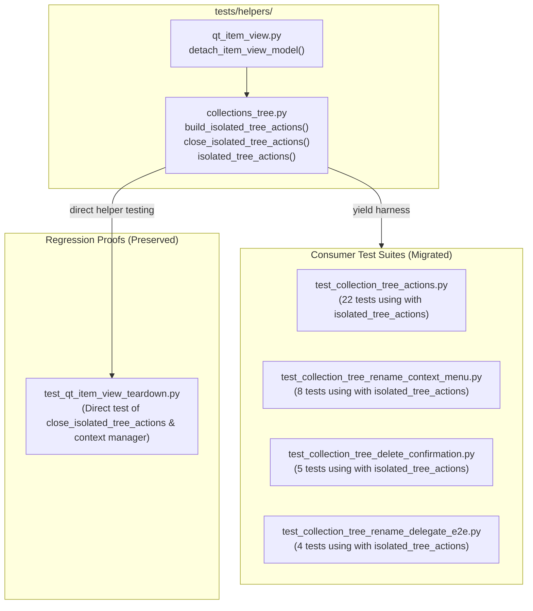

# PYPOST-1043: Migrate isolated tree harness callers to isolated_tree_actions context manager

## Research

### Context and Baseline Analysis

During PYPOST-940, model-backed item views (`QTreeView`, `QListView`) were shown to require model detachment (`setModel(None)`) prior to fixture closing/destruction to eliminate offscreen Qt teardown warnings and prevent cross-test state pollution in parallel runner runs. PYPOST-973 introduced `tests/helpers/collections_tree.py` helpers:
- `build_isolated_tree_actions(collections=None, *, with_rename_delegate=False)`: Creates an `IsolatedTreeActions` harness dataclass wrapping `CollectionTreeActions`, `QTreeView`, `QStandardItemModel`, `FakeRequestManager`, and mock signal spies.
- `close_isolated_tree_actions(harness: IsolatedTreeActions)`: Invokes `detach_item_view_model(harness.view)`, closes the view, and pumps Qt events (`QApplication.processEvents()`).
- `isolated_tree_actions(collections=None, *, with_rename_delegate=False)`: `@contextmanager` yielding `harness` within a `try ... finally: close_isolated_tree_actions(harness)` block.

In PYPOST-973, consumer tests in existing `unittest.TestCase` suites were quickly wrapped with:
```python
harness = build_isolated_tree_actions(...)
self.addCleanup(close_isolated_tree_actions, harness)
```
This was recorded as technical debt (PYPOST-973 TD-1) to be refactored into the more Pythonic and concise context manager syntax `with isolated_tree_actions(...) as harness:`.

### Inventory of Target Call Sites

A full scan of the codebase reveals 36 test method call sites across 4 test modules:

1. **`tests/test_collection_tree_actions.py`** (22 test methods):
   - `test_invalid_index_skips_context_menu`
   - `test_collection_menu_offers_export_collection`
   - `test_request_menu_offers_export_collection`
   - `test_websocket_menu_offers_export_collection`
   - `test_mcp_client_menu_offers_export_collection`
   - `test_export_collection_triggered_from_collection_menu`
   - `test_export_collection_triggered_from_request_menu`
   - `test_export_collection_triggered_from_websocket_menu`
   - `test_export_collection_triggered_from_mcp_client_menu`
   - `test_collection_rename_cancel_emits_no_signals`
   - `test_request_rename_cancel_emits_no_signals`
   - `test_websocket_rename_cancel_emits_no_signals`
   - `test_mcp_client_rename_cancel_emits_no_signals`
   - `test_collection_rename_empty_rejected`
   - `test_request_rename_empty_rejected`
   - `test_websocket_rename_empty_rejected`
   - `test_mcp_client_rename_empty_rejected`
   - `test_collection_rename_success`
   - `test_request_rename_success`
   - `test_websocket_rename_success`
   - `test_mcp_client_rename_success`
   - `test_request_menu_new_tab_action`

2. **`tests/test_collection_tree_rename_context_menu.py`** (8 test methods):
   - `test_collection_rename_selected_records_selected_metric`
   - `test_request_rename_selected_records_selected_metric`
   - `test_collection_rename_cancel_records_cancelled_metric`
   - `test_request_rename_cancel_records_cancelled_metric`
   - `test_collection_rename_empty_records_rejected_empty_metric`
   - `test_request_rename_empty_records_rejected_empty_metric`
   - `test_websocket_rename_selected_records_selected_metric`
   - `test_mcp_client_rename_selected_records_selected_metric`

3. **`tests/test_collection_tree_delete_confirmation.py`** (5 test methods):
   - `test_collection_delete_no_records_cancelled_metric`
   - `test_collection_delete_yes_records_succeeded_metric`
   - `test_request_delete_no_records_cancelled_metric`
   - `test_request_delete_yes_records_succeeded_metric`
   - `test_websocket_delete_no_records_cancelled_metric`

4. **`tests/test_collection_tree_rename_delegate_e2e.py`** (1 test helper method):
   - Helper `_prepare_harness(self, collections)` currently creates the harness with `with_rename_delegate=True` and calls `self.addCleanup(close_isolated_tree_actions, harness)`.
   - In delegate e2e tests, all 4 test methods (`test_request_rename_commit_via_delegate_records_succeeded_metric`, `test_collection_rename_commit_via_delegate_records_succeeded_metric`, `test_request_rename_cancel_via_delegate_records_cancelled_metric`, and `test_request_rename_empty_name_via_delegate_records_rejected_empty_metric`) invoke `_prepare_harness`. Migrating either `_prepare_harness` or individual test cases to `with isolated_tree_actions(collections, with_rename_delegate=True) as harness:` establishes consistent context management.

5. **`tests/test_qt_item_view_teardown.py`** (Non-migrated; dedicated regression proofs):
   - Contains explicit test `test_close_isolated_tree_actions_detaches_model` testing `build_isolated_tree_actions` + `close_isolated_tree_actions` directly.
   - Contains explicit test `test_isolated_tree_actions_context_manager_detaches_model` testing `isolated_tree_actions`.
   - These unit tests will remain intact without changes.

---

## Implementation Plan

### High-Level Flow

1. **Step 3 (Failing Repro):**
   - Note: **N/A — no behavioral change**.
   - This task is an internal test suite refactoring/cosmetic improvement. Teardown safety is already guaranteed via existing `addCleanup(close_isolated_tree_actions, harness)`. The existing comprehensive test suites across `tests/test_collection_tree_actions.py`, `tests/test_collection_tree_rename_context_menu.py`, `tests/test_collection_tree_delete_confirmation.py`, `tests/test_collection_tree_rename_delegate_e2e.py`, and `tests/test_qt_item_view_teardown.py` serve as the verification baseline.

2. **Step 4 (Development):**
   - **Phase A — Migrate `tests/test_collection_tree_actions.py`:**
     - Replace `from tests.helpers.collections_tree import (build_isolated_tree_actions, close_isolated_tree_actions, ...)` with `from tests.helpers.collections_tree import (isolated_tree_actions, ...)`.
     - Refactor all 22 test methods to wrap the test execution body in `with isolated_tree_actions(...) as harness:`.
     - Remove `self.addCleanup(close_isolated_tree_actions, harness)` from all 22 test methods.
   - **Phase B — Migrate `tests/test_collection_tree_rename_context_menu.py`:**
     - Update imports to include `isolated_tree_actions` and drop `build_isolated_tree_actions`, `close_isolated_tree_actions`.
     - Refactor all 8 test methods to use `with isolated_tree_actions(...) as harness:` and remove `self.addCleanup`.
   - **Phase C — Migrate `tests/test_collection_tree_delete_confirmation.py`:**
     - Update imports to include `isolated_tree_actions` and drop `build_isolated_tree_actions`, `close_isolated_tree_actions`.
     - Refactor all 5 test methods to use `with isolated_tree_actions(...) as harness:` and remove `self.addCleanup`.
   - **Phase D — Migrate `tests/test_collection_tree_rename_delegate_e2e.py`:**
     - Update imports to include `isolated_tree_actions` and drop `build_isolated_tree_actions`, `close_isolated_tree_actions`.
     - Refactor the test methods to use `with isolated_tree_actions(collections, with_rename_delegate=True) as harness:`, configuring `harness.view.resize(...)` and `show()` inside the block.
   - **Phase E — Update Developer Testing Documentation:**
     - Update `doc/dev/testing.md` (around lines 193-197) to document `with isolated_tree_actions(...) as harness:` as the standard idiomatic pattern for collections tree harness tests.

3. **Step 5 (Code Cleanup):**
   - Run `make lint` and `make typecheck` to verify no unused imports, lint errors, or typing mismatches remain.

4. **Step 6 (Observability):**
   - Validate that metrics calls (`metrics.track_gui_collection_delete_action`, `metrics.track_gui_collection_rename_action`) inside all migrated test cases remain verified and untouched.

5. **Step 7 (Technical Debt Analysis):**
   - Record completion and resolution of technical debt PYPOST-973 TD-1 in `ai-tasks/PYPOST-1043/60-tech-debt.md`.

6. **Step 8 (Dev Docs):**
   - Ensure dev documentation changes in `doc/dev/testing.md` are complete and verified.

---

## Architecture

### Module Map and Interaction



### Component Responsibilities

| Component / Module | Responsibility | Changes in PYPOST-1043 |
| --- | --- | --- |
| `tests/helpers/collections_tree.py` | Defines `IsolatedTreeActions`, `build_isolated_tree_actions`, `close_isolated_tree_actions`, and `isolated_tree_actions`. | **Unchanged**. Maintained as backward-compatible building blocks. |
| `tests/test_collection_tree_actions.py` | Tests context menu dispatch, actions triggering, and signal emissions. | Migrated to `isolated_tree_actions` context manager across 22 tests; remove unused imports. |
| `tests/test_collection_tree_rename_context_menu.py` | Tests telemetry metrics recording for rename context menu selections and cancellations. | Migrated to `isolated_tree_actions` context manager across 8 tests; remove unused imports. |
| `tests/test_collection_tree_delete_confirmation.py` | Tests delete confirmation dialog responses and telemetry metrics. | Migrated to `isolated_tree_actions` context manager across 5 tests; remove unused imports. |
| `tests/test_collection_tree_rename_delegate_e2e.py` | Tests end-to-end inline rename delegate editing in QTreeView. | Migrated to `isolated_tree_actions(..., with_rename_delegate=True)` context manager; remove unused imports. |
| `tests/test_qt_item_view_teardown.py` | Explicit unit tests validating item view model detachment on teardown. | **Unchanged**. Preserves direct assertions on `close_isolated_tree_actions` and `isolated_tree_actions`. |
| `doc/dev/testing.md` | Developer guide for test authoring and item view teardown patterns. | Updated to describe `isolated_tree_actions` context manager convention. |

### Architectural Pattern: Context Manager (`contextlib.contextmanager`)

The migration uses Python's standard `with` statement via `contextlib.contextmanager`:
```python
@contextmanager
def isolated_tree_actions(
    collections=None,
    *,
    with_rename_delegate: bool = False,
) -> Iterator[IsolatedTreeActions]:
    harness = build_isolated_tree_actions(
        collections,
        with_rename_delegate=with_rename_delegate,
    )
    try:
        yield harness
    finally:
        close_isolated_tree_actions(harness)
```

**Benefits:**
1. **Guaranteed Cleanup on Exception**: Even if an assertion in the test body fails, the `finally` block executes `close_isolated_tree_actions(harness)`, detaching `harness.model` and closing the view before subsequent tests run.
2. **Reduced Boilerplate**: Eliminates explicit `self.addCleanup(...)` registration across every test method.
3. **Explicit Scope**: The lifecycle of the Qt widgets and model is bounded by the lexical indentation block of the `with` statement.

---

## Traceability Matrix

| Acceptance Criteria | Description | Architectural Decision / Design Mapping | Target Components / Modules | Implementation Phase |
| --- | --- | --- | --- | --- |
| **AC-1** | Every test method in `tests/test_collection_tree_actions.py`, `tests/test_collection_tree_rename_context_menu.py`, `tests/test_collection_tree_delete_confirmation.py`, and `tests/test_collection_tree_rename_delegate_e2e.py` that previously called `build_isolated_tree_actions` uses `with isolated_tree_actions(...) as harness:`. | Standardize test harness lifecycle around `@contextmanager` pattern (`isolated_tree_actions`). Wrap test method bodies in `with` block to guarantee automatic teardown on block exit. | `tests/test_collection_tree_actions.py`<br/>`tests/test_collection_tree_rename_context_menu.py`<br/>`tests/test_collection_tree_delete_confirmation.py`<br/>`tests/test_collection_tree_rename_delegate_e2e.py` | Step 4: Phases A, B, C, D |
| **AC-2** | No consumer test file contains redundant `self.addCleanup(close_isolated_tree_actions, harness)` calls. | Remove manual `self.addCleanup` invocations across all consumer test suites as teardown is handled implicitly by `isolated_tree_actions` `finally` block. | `tests/test_collection_tree_actions.py`<br/>`tests/test_collection_tree_rename_context_menu.py`<br/>`tests/test_collection_tree_delete_confirmation.py`<br/>`tests/test_collection_tree_rename_delegate_e2e.py` | Step 4: Phases A, B, C, D |
| **AC-3** | Unused helper imports in consumer test files are cleaned up. | Clean imports to import only `isolated_tree_actions` and remove unneeded references to `build_isolated_tree_actions` and `close_isolated_tree_actions`. | `tests/test_collection_tree_actions.py`<br/>`tests/test_collection_tree_rename_context_menu.py`<br/>`tests/test_collection_tree_delete_confirmation.py`<br/>`tests/test_collection_tree_rename_delegate_e2e.py` | Step 4: Phases A, B, C, D; Step 5 (Code Cleanup) |
| **AC-4** | `tests/test_qt_item_view_teardown.py` continues to pass its unit tests verifying `close_isolated_tree_actions` and `isolated_tree_actions`. | Preserve `build_isolated_tree_actions` and `close_isolated_tree_actions` in `tests/helpers/collections_tree.py` and retain dedicated regression assertions in `tests/test_qt_item_view_teardown.py`. | `tests/helpers/collections_tree.py`<br/>`tests/test_qt_item_view_teardown.py` | Step 4 (Component Responsibilities); Step 5 (Verification) |
| **AC-5** | Full quality gate `make check` (including `make lint`, `make test`, and `make verify-ai-tasks`) passes with 100% success and no flake. | Maintain 100% behavioral equivalence and coverage; enforce quality gate via make targets. | Entire codebase / test suite | Step 4, Step 5, Step 8 |
| **AC-6** | Developer testing documentation (`doc/dev/testing.md`) accurately describes the context manager usage. | Update developer testing guide to document `with isolated_tree_actions(...) as harness:` as the standard idiomatic harness pattern. | `doc/dev/testing.md` | Step 4: Phase E; Step 8 (Dev Docs) |

---

## Q&A

- **Q: Why keep `build_isolated_tree_actions` and `close_isolated_tree_actions` in `tests/helpers/collections_tree.py` instead of removing them?**
  - **A:** `isolated_tree_actions` is implemented in terms of `build_isolated_tree_actions` and `close_isolated_tree_actions`. In addition, `tests/test_qt_item_view_teardown.py` explicitly tests `close_isolated_tree_actions` to assert that direct teardown semantics remain valid and complete. Maintaining these helpers ensures modularity and backward compatibility.

- **Q: Does wrapping the test body in `with isolated_tree_actions(...) as harness:` interact safely with other context managers like `patch` and `patch_view_context_menu`?**
  - **A:** Yes. Python context managers compose cleanly using nested `with` blocks or compound `with` statements. In tests requiring menu mocking, the outer block establishes the harness lifetime (`with isolated_tree_actions(...) as harness:`), and the inner block sets up temporary mocks (`with patch_view_context_menu(...):`), ensuring proper ordering during both setup and teardown.

- **Q: Is there any risk of changing test execution semantics?**
  - **A:** No. `addCleanup` executes after `tearDown()`, whereas the context manager `finally` executes immediately when exiting the `with` block. Since these test cases do not rely on post-test state in custom `tearDown()` methods (they are self-contained unit tests), teardown at block exit is strictly identical in effect while ensuring prompt cleanup before test completion.

