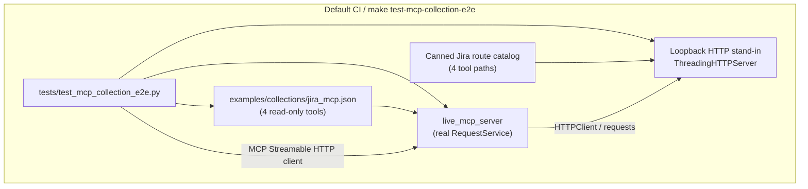
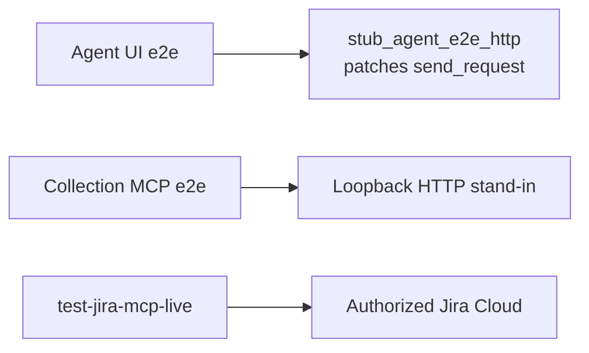

# PYPOST-1045: Controlled HTTP backend for MCP collection e2e

## Research

### Requirements baseline

- [PYPOST-1045](https://pypost.atlassian.net/browse/PYPOST-1045) — analysis
  only: decide whether/how to provide a controlled HTTP stand-in for curated
  collection MCP e2e. Full mock-server implementation is **out of scope**.
- `10-requirements.md` — **Yes** at business level: a controlled stand-in is
  needed for reliable, secret-free CI confidence. Step 2 must choose form,
  operator interface, packaging, and a follow-up ticket sketch.
- Language: Python for any later harness (`.cursor/lsr/do-python.md`);
  Markdown artifacts follow `.cursor/lsr/do-markdown.md`.
- Decision Lock is present for the Step 3 doc-lock test; harness build
  remains a follow-up (see Follow-up ticket sketch below).

### Inventory (what exists today)

**Agent UI e2e** (`make test-agent-e2e`, `doc/dev/agent_e2e.md`)

- Proves: offscreen UI flows.
- Limit: no curated collection MCP tool calls.

**Agent e2e HTTP stubs** (`pypost.fixtures.agent_e2e_http`)

- Proves: patches `HTTPClient.send_request` at RequestService; canned UI Send
  responses.
- Limit: different path/catalog; skips real `requests` transport.

**MCP probe collection** (`make generate-mcp-fixtures` / `check-mcp-fixtures`)

- Proves: fixture sync + live MCP list/call with mocked
  `RequestService.execute` (`tests/test_mcp_test_collection*.py`).
- Limit: probe collection; no real outbound HTTP.

**MCP server integration** (`tests/test_mcp_server_integration.py`)

- Proves: live MCP + ad-hoc `ThreadingHTTPServer` for some Jira path cases.
- Limit: scenario-local stubs; not a shared collection e2e pack.

**Example fixture contracts** (`tests/test_example_fixtures.py`)

- Proves: import, exposure, auth/env/MCP agreements.
- Limit: static only; no tool→HTTP runtime.

**Offline Jira smoke stub** (`test_current_user_smoke_tool_uses_read_only_path`)

- Proves: one tool (`jira_get_current_user`) via loopback HTTP + real
  RequestService.
- Limit: single path; not a reusable catalog or Makefile pack.

**Live Jira smoke** (`make test-jira-mcp-live`, `doc/dev/jira_mcp_live_smoke.md`)

- Proves: four read-only tools against real Jira (opt-in).
- Limit: secrets; not default CI.

### Execution path (product)

MCP tool calls already run the real request stack when `LiveMCPServer` is
started **without** `execute_result` (no `RequestService` mock):

```text
MCP client (Streamable HTTP)
  → MCPServerImpl.call_tool
    → RequestService.execute
      → HTTPClient.send_request (requests.Session)
        → external URL (or loopback stand-in)
```

Evidence: `pypost/core/mcp_server_impl.py` creates a real `RequestService` per
call; `tests/helpers/mcp_live_server.py` only mocks execute when
`execute_result=` is passed. Offline Jira smoke stub and several
`test_mcp_server_integration` cases already point `jira_base_url` at
`http://127.0.0.1:<port>` and hit stdlib `ThreadingHTTPServer`.

Agent e2e stubs patch the **same** `send_request` symbol, but at the UI Send
boundary with a UI-oriented canned catalog (`golden_ok`, `seed_*`). They do
not speak Jira REST shapes and intentionally never open a socket.

### Options compared

**A. Reuse `agent_e2e_http` patches** — **Reject as primary**

- Form: patch `send_request`; extend canned catalog.
- Pros: fast; zero sockets; existing helpers.
- Cons: skips real HTTPClient/`requests` path; couples collection e2e to UI
  fixture layer; docs already separate the concerns.

**B. In-process loopback HTTP stand-in** — **Recommend**

- Form: shared fixture wrapping proven `ThreadingHTTPServer` + Jira-shaped
  canned routes; real MCP + RequestService.
- Pros: matches existing MCP/Jira stub pattern; exercises full tool→HTTP path;
  secret-free; no new deps; CI-safe.
- Cons: must maintain canned response shapes; not a separate long-lived
  process.

**C. External / process mock server** — **Defer** (optional later)

- Form: WireMock, pytest-httpserver service, or dedicated daemon.
- Pros: high fidelity; process isolation.
- Cons: new deps or JVM/container overhead; heavier CI; overkill for four
  read-only routes already stubbed in-process.

**D. Live-only** — **Reject** (requirements)

- Form: keep only `test-jira-mcp-live`.
- Pros: already shipped.
- Cons: secrets; opt-in; narrow; cannot be primary CI confidence.

### Industry guidance (web research)

- Prefer intercepting at the network boundary over mocking internal helpers so
  client URL/header/body logic still runs. See School of Web “Testing the
  Outside World” and PTD “Mocking Network and HTTP Calls” (full URLs in
  References).
- Transport stubs (`responses` / `respx`) are the default sweet spot when you
  do not need socket fidelity; use a **real local HTTP server** when the
  product owns the transport or you need wire-level confidence (same PTD
  article; pytest-httpserver docs).
- PyPost uses `requests` in `HTTPClient`. Either `responses` **or** a
  loopback server would work. This repo **already** uses loopback
  `ThreadingHTTPServer` for MCP+Jira path proofs; that is the lowest-friction
  shared form.
- WireMock / Java standalone servers are powerful but heavier than needed for
  a four-tool CI slice (WireMock; local ThreadingHTTPServer notes — URLs in
  References).

### Minimum must-cover tool-id slice

Align with live smoke critical paths (`tests/test_jira_mcp_live_smoke.py`):

| Request id | MCP tool id | Category |
| ---------- | ----------- | -------- |
| `jira-get-current-user` | `jira_get_current_user` | smoke companion |
| `jira-search-issues-jql` | `jira_search_issues_jql` | list/search |
| `jira-get-issue` | `jira_get_issue` | get-by-id |
| `jira-list-boards` | `jira_list_boards` | list/search |

Path templates:

- `jira_get_current_user` — `GET …/rest/api/3/myself`
- `jira_search_issues_jql` — `POST …/rest/api/3/search/jql`
- `jira_get_issue` — `GET …/rest/api/3/issue/{{ issue_key }}`
- `jira_list_boards` — `GET …/rest/agile/1.0/board`

All four remain smoke-critical; include all in the CI-safe minimum slice (not
optional). Broader curated surface is out of scope for the first follow-up.

## Implementation Plan

This ticket delivers **architecture + workflow artifacts only**. Product
harness code belongs in a **follow-up** (sketch below).

### This analysis ticket (Steps 3–8 residual)

1. **Step 3 — Failing Repro (artifact lock):** Add a small offline pytest
   under `tests/` that asserts `ai-tasks/PYPOST-1045/20-architecture.md`
   exists and records: recommendation **yes**; approach **in-process
   loopback HTTP stand-in** (not agent_e2e patch primary; not live-only);
   the four tool ids above; and proposed Makefile target
   `test-mcp-collection-e2e`. No live network. Timeout via
   `@pytest.mark.timeout` per `.cursor/lsr/do-testing.md`.
2. **Step 4 — Development:** Ensure the architecture/docs artifacts satisfy
   that lock (already authored in Step 2); no harness implementation.
3. **Steps 5–8:** Cleanup, observability N/A or minimal, tech-debt note for
   follow-up, and any cross-links deferred to the implementation ticket’s
   Step 8 (or a short pointer in `doc/dev/testing.md` /
   `jira_mcp_live_smoke.md` that CI-safe collection e2e is **planned**, not
   shipped).

**Mandatory — Failing Repro (next Step 3):** Not `N/A`. Use the **doc/decision
lock** test above (desired behavior: recommendation artifact encodes the
yes/approach/tool-id/Makefile decisions). Force failure by renaming or
stripping those markers from `20-architecture.md` (or deleting the file)
without live deps. Sequencing: research (done) → red lock test → green when
artifact matches. Runtime harness red tests belong in the **follow-up**
ticket, not here.

### Follow-up ticket (harness delivery) — sketch

**Title (proposed):** CI-safe Jira MCP collection e2e via loopback HTTP
stand-in

**Scope:**

- Shared stand-in module (suggested location
  `pypost/fixtures/mcp_collection_http.py` or
  `tests/helpers/mcp_collection_http.py`) exposing a context manager that:
  - binds `ThreadingHTTPServer` on `127.0.0.1` ephemeral port;
  - serves deterministic JSON for the four routes above;
  - yields `base_url` for injection as `jira_base_url`.
- Canned bodies: minimal valid Jira-shaped JSON sufficient for 2xx +
  parseable search→issue_key chaining (mirror live smoke sequencing offline).
- Test module (suggested `tests/test_mcp_collection_e2e.py`) that:
  - loads committed `examples/collections/jira_mcp.json`;
  - registers only the four smoke request ids on `live_mcp_server` (**no**
    `execute_result` mock);
  - supplies variables (`jira_base_url` → loopback, dummy
    `jira_credentials`, `jira_project_key`) with hidden keys;
  - calls tools via Streamable HTTP MCP client in live-smoke order;
  - asserts non-error MCP results and expected stub paths (no secrets in
    assert messages).
- Marker: e.g. `mcp_collection_e2e` (fast enough for default CI; not
  `live_jira`).
- Makefile: `test-mcp-collection-e2e` → pytest selection for that pack;
  wire into default `make test` / PR CI via marker inclusion (not opt-in).
- Docs: new or extended `doc/dev/` page describing coverage vs live smoke;
  link from `testing.md`, `mcp_integration.md`, `jira_mcp_live_smoke.md`.
- Do **not** change product MCP runtime, curated write tools, or live smoke
  secrecy rules.

**Out of follow-up v1:** WireMock/JVM, separate long-lived mock process,
full curated surface coverage, agent UI e2e conversion.

**Estimate hint:** ~5 story points (fixture + four-tool e2e + Makefile/docs).

## Decision Lock

Machine-checkable recommendation markers for the Step 3 doc-lock test.
Do not rephrase these lines without updating
`tests/test_pypost_1045_recommendation_doc_lock.py`.

```text
controlled_backend_needed: yes
recommended_form: in-process loopback HTTP stand-in
agent_e2e_http_primary: no
live_only: no
makefile_target: test-mcp-collection-e2e
tool_ids: jira_get_current_user, jira_search_issues_jql, jira_get_issue, jira_list_boards
```

## Architecture

### Decision summary

| Question | Answer |
| -------- | ------ |
| Controlled backend needed? | **Yes** (requirements + inventory) |
| Reuse `agent_e2e_http` as primary? | **No** |
| Standalone external mock process? | **No for v1** |
| Live-only? | **No** |
| Recommended form | In-process loopback HTTP stand-in |
| Implementation in this ticket? | **No** — follow-up |

Recommended form detail: shared fixture + real MCP / `RequestService` /
`HTTPClient` against stdlib loopback server. Not an agent_e2e patch; not
WireMock/process mock for v1; not live-only.

### Module diagram (target follow-up; design only)



Agent e2e remains a **sibling** stack, not a dependency:



### Module responsibilities

| Module / artifact | Responsibility |
| ----------------- | -------------- |
| Loopback stand-in fixture | Ephemeral HTTP server; route→canned body; yield base URL |
| Canned catalog | Deterministic JSON for four Jira routes; search→issue key |
| `live_mcp_server` (existing) | Streamable HTTP MCP with real execute path |
| Collection loader (existing) | Import `jira_mcp.json`; select smoke request ids |
| E2E test module (follow-up) | Orchestrate stand-in + MCP + tool calls |
| `make test-mcp-collection-e2e` | Operator/CI entry for the pack |
| `make test-jira-mcp-live` | Unchanged complementary live proof |
| `make test-agent-e2e` | Unchanged UI Send stubs |
| `make generate-mcp-fixtures` | Unchanged probe-collection generators |

### Patterns

- **Test double at the HTTP wire (loopback fake server):** Prefer over
  patching `send_request` so template resolution, auth headers, and
  `requests` transport run. Aligns with existing MCP integration stubs.
- **Shared fixture / catalog (not copy-paste handlers):** Extract the
  repeated `ThreadingHTTPServer` + daemon thread pattern from
  `test_mcp_server_integration` / live-smoke offline stub into one helper.
- **Separation of concerns:** UI stubs stay UI; live SaaS stays opt-in;
  CI-safe collection e2e gets its own pack and docs.
- **No new production dependencies** for v1 (stdlib HTTP server only).

### Interfaces (design contracts for follow-up)

Suggested public test-facing API (names indicative):

```python
@contextmanager
def stub_jira_mcp_http(
    catalog: Mapping[str, object] | None = None,
) -> Iterator[JiraMcpHttpStub]:
    """Bind loopback server; yield base_url + captured requests."""
    ...


@dataclass(frozen=True)
class JiraMcpHttpStub:
    base_url: str  # e.g. http://127.0.0.1:54321
    # captured method+path list for assertions
```

Operator / Makefile interface (follow-up):

| Target | Role |
| ------ | ---- |
| `make test-mcp-collection-e2e` | Run CI-safe collection MCP e2e pack |
| `make test` | Include that pack via markers (secret-free) |
| `make test-jira-mcp-live` | Unchanged opt-in live smoke |
| `make test-agent-e2e` | Unchanged agent UI pack |
| `make generate-mcp-fixtures` | Unchanged probe fixtures |
| `make check-mcp-fixtures` | Unchanged probe fixture check |

Env injection for e2e (test-only, never committed secrets):

| Variable key | Value source |
| ------------ | ------------ |
| `jira_base_url` | Stand-in `base_url` |
| `jira_credentials` | Fixed offline dummy (hidden) |
| `jira_project_key` | Fixed offline key matching canned search |

### Coverage boundaries

**In default CI after follow-up:**

- MCP client → four curated tools → real RequestService/HTTPClient →
  loopback canned Jira responses.
- Deterministic, secret-free, no SaaS network.

**Still live / manual only:**

- Full curated write surface; tenant-specific behavior; auth against real
  Jira; response-shape drift vs Atlassian (live smoke remains the check).

**Explicit non-goals of this ticket:** implementing the stand-in, expanding
tools beyond the four-id slice, redesigning agent e2e.

## Q&A

**Q: Why not patch `HTTPClient.send_request` like agent e2e?**
**A:** That proves UI Send with a UI catalog. Collection MCP e2e must prove
URL templates, auth headers, and real `requests` dispatch against a
controlled backend — the gap requirements called out. Patching would leave
that gap open while falsely looking “covered.”

**Q: Why not pytest-httpserver or WireMock for v1?**
**A:** Stdlib `ThreadingHTTPServer` is already proven in-repo for MCP+Jira
paths, needs no new dependency, and is enough for four deterministic routes.
External servers remain a later option if catalog complexity grows.

**Q: Why include `jira_get_current_user` in the minimum slice?**
**A:** It is part of the live-smoke critical four-tool sequence and already
has an offline loopback proof; keeping it in the CI pack mirrors maintainer
smoke without secrets.

**Q: Does this replace live smoke?**
**A:** No. Live smoke stays opt-in and complementary. CI-safe e2e replaces
**reliance on live as the only** collection MCP confidence path.

**Q: Is implementation in PYPOST-1045?**
**A:** No. This artifact is the recommendation, interfaces, Makefile
expectations, and follow-up sketch. Harness build is a separate ticket.

**Q: What is Step 3 for this analysis ticket?**
**A:** A doc/decision lock test on `20-architecture.md` (tool ids + approach
+ Makefile name). Not a runtime e2e red test — that belongs to the
follow-up.

### References

- Requirements: `ai-tasks/PYPOST-1045/10-requirements.md`
- Agent e2e umbrella: `doc/dev/agent_e2e.md`
- Agent e2e HTTP stubs: `doc/dev/agent_e2e_http.md`,
  `pypost/fixtures/agent_e2e_http.py`
- Live Jira smoke: `doc/dev/jira_mcp_live_smoke.md`,
  `tests/test_jira_mcp_live_smoke.py`
- MCP live harness: `tests/helpers/mcp_live_server.py`
- Collection: `examples/collections/jira_mcp.json`
- School of Web HTTP testing:
  https://schoolofweb.net/en/posts/python-testing-5-files-http-db-frameworks/
- PTD mocking spectrum (search: “Mocking Network and HTTP Calls” PTD)
- pytest-httpserver: https://pytest-httpserver.readthedocs.io/en/latest/
- WireMock: https://wiremock.org/
- Local ThreadingHTTPServer notes:
  https://idle.nprescott.com/2023/integration-testing-in-python.html
