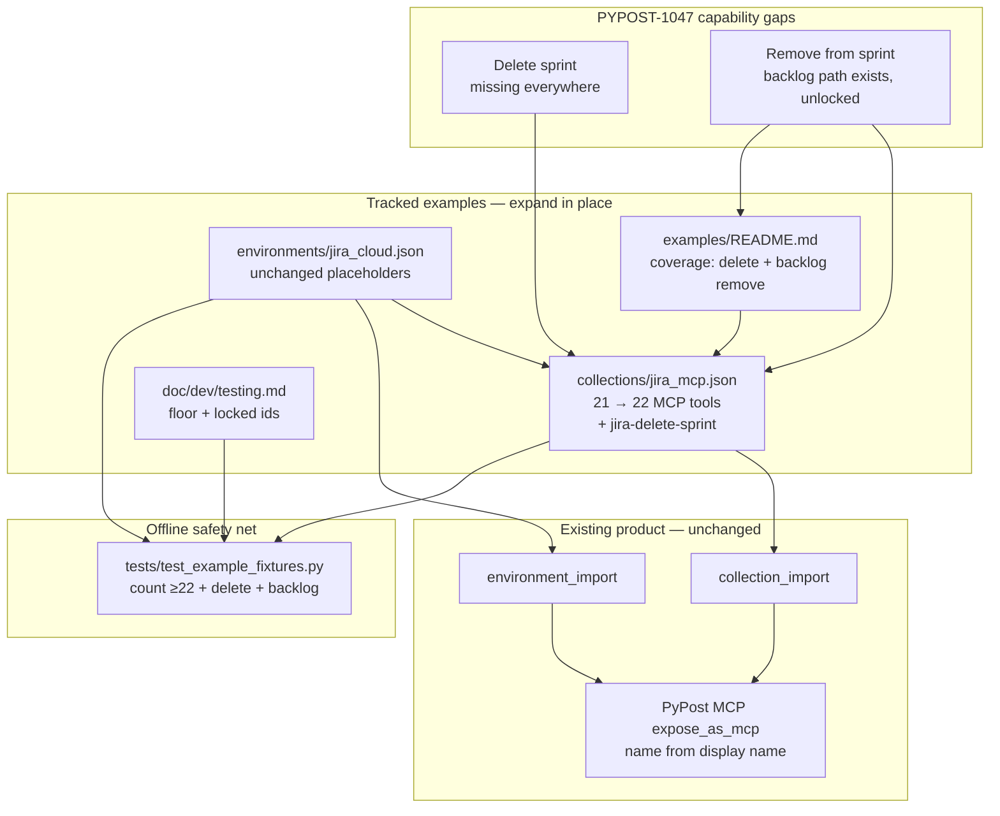

# PYPOST-1047: Expand jira_mcp — delete sprint and remove from sprint

## Research

### Requirements and baseline

- [PYPOST-1047](https://pypost.atlassian.net/browse/PYPOST-1047) — Extend the
  curated jira-mcp example collection so PyPost MCP agents can **delete a
  sprint** and have a **clear remove-from-sprint** path; update companion
  docs/contract tests. Collection/docs/tests only; **no** Atlassian MCP or
  product-feature work.
- `10-requirements.md` — business outcome is agent-usable delete + discoverable
  membership removal; prefer locking existing backlog-move if sufficient.
- `00-roadmap.md` — Step 1 complete (`[x]`); Step 2 in progress (`[/]`).
- Languages: JSON fixtures + English Markdown
  (`.cursor/lsr/do-markdown.md`); Python only in existing fixture contract
  tests (`.cursor/lsr/do-python.md`).

### Current curated surface (post PYPOST-1026)

| Artifact | State | Notes |
| -------- | ----- | ----- |
| `examples/collections/jira_mcp.json` | **21** MCP-exposed requests | Collection id `jira-cloud-mcp` |
| `examples/environments/jira_cloud.json` | Companion env | Placeholders, `hidden_keys`, `enable_mcp` |
| `examples/README.md` | Coverage vs gaps | Sprint write + membership listed |
| `doc/dev/testing.md` | Fixture contract section | Floor ≥ 18; locked must-have ids |
| `tests/test_example_fixtures.py` | Offline contracts | Import, count, required ids/paths |
| Live PyPost MCP (`project-0-pypost-pypost`) | Exposes collection tools | Has `jira_move_issues_to_backlog`; **no** delete sprint |

Sprint-related request ids today:

- Read: `jira-list-boards`, `jira-list-board-sprints`, `jira-get-sprint`,
  `jira-get-sprint-issues`
- Write: `jira-create-sprint`, `jira-update-sprint`
- Membership: `jira-add-issues-to-sprint`, `jira-move-issues-to-backlog`

Auth/env pattern (unchanged): `jira_base_url` +
`Authorization: Basic {{ base64(jira_credentials) }}` with placeholder
`you@example.com:your-api-token`. MCP tool names come from request **display
names** via `normalize_mcp_tool_name` (e.g. `"Jira Delete Sprint"` →
`jira_delete_sprint`).

Contract today (`tests/test_example_fixtures.py`):

- Floor: `JIRA_MCP_MIN_EXPOSED_REQUESTS = 18` (21 currently pass).
- Locked ids: create/add/get-sprint-issues, link-parent, comment, assign.
- Stretch (present but **not** id-locked): get-worklog, **move-to-backlog**,
  search-assignable-users.

### Atlassian Agile REST (web research)

Official Jira Software Cloud REST:

| Capability | Method / path | Behavior |
| ---------- | ------------- | -------- |
| Delete sprint | `DELETE /rest/agile/1.0/sprint/{sprintId}` | Deletes sprint; open issues move to backlog; success `204` |
| Move to backlog | `POST /rest/agile/1.0/backlog/issue` | Equivalent to removing future/active sprint membership; ≤50 issues/request |

Refs (full URLs in Q&A): Sprint API group; Backlog API group. Older Server/DC
docs sometimes restricted delete to **future** sprints; Cloud docs emphasize
irreversible delete + backlog move of open issues. Agent-facing description
should state irreversibility and backlog side-effect; callers should target
mistaken/unwanted sprints (ticket intent includes unclosed cleanup).

### Gap vs ticket

| Need | Today | Gap |
| ---- | ----- | --- |
| Delete sprint | Missing from collection and Atlassian MCP | **Must add** MCP-exposed DELETE request |
| Remove issues from sprint | `jira-move-issues-to-backlog` already implements the Agile API | Capability exists but is **stretch** (not contract-locked); docs understate it as the supported remove-from-sprint path |

Live PyPost MCP inventory confirms `jira_move_issues_to_backlog` and no
`jira_delete_sprint`. External Atlassian MCP remains out of scope.

### Architectural decision: delete + remove shapes

**A. Delete sprint — new request**

Add one MCP-exposed request mirroring `jira-get-sprint` shape:

| Field | Value |
| ----- | ----- |
| Proposed id | `jira-delete-sprint` |
| Display name | `Jira Delete Sprint` → MCP tool `jira_delete_sprint` |
| Method / URL | `DELETE {{ jira_base_url }}/rest/agile/1.0/sprint/{{ mcp.request.sprint_id }}` |
| Body | Empty (no payload) |
| Headers | `Accept` + Basic auth (same as get-sprint; no `Content-Type` needed) |
| `mcp_params` | `sprint_id` (integer, required) |
| `mcp_description` | Delete by numeric ID; irreversible; open issues move to backlog |

Place it next to other sprint write tools (after update/create) for readability.

**B. Remove from sprint — lock existing backlog move (no duplicate tool)**

| Option | Pros | Cons |
| ------ | ---- | ---- |
| **B1. Lock + document `jira-move-issues-to-backlog`** | Matches Agile API; parity with add-to-sprint; already shipped; ticket prefers this | Name says “backlog” not “remove from sprint” |
| B2. Add parallel `jira-remove-issues-from-sprint` | Clearer tool name | Duplicate REST; confuses agents; violates prefer-existing |
| B3. Rename request id/name | Clearer naming | Breaks existing imports/docs/MCP name stability |

**Decision: B1.** Reuse `POST /rest/agile/1.0/backlog/issue` via existing
`jira-move-issues-to-backlog`. Promote it from stretch to **contract-locked**
required id/path. Optionally sharpen `mcp_description` so agents discover it as
the remove-from-sprint action (keep method/URL/params unchanged). Do **not**
add a second membership-removal request.

**C. Expand-in-place**

Same as PYPOST-1026: grow `jira_mcp.json` in place; keep `jira_cloud.json`
unchanged (no new env keys). No import/MCP runtime changes.

### Target surface after this story

- Request count: **22** (21 + delete sprint).
- Contract floor: raise to **≥ 22** (or keep ≥ 19 and rely on locked ids; prefer
  **≥ 22** so dropping delete cannot hide behind stretch count).
- New / promoted locked ids:
  - `jira-delete-sprint` (new)
  - `jira-move-issues-to-backlog` (promote from stretch)

## Implementation Plan

Fixture + docs + contract-test expansion only (Step 4). No application package
feature work; no Atlassian MCP changes.

1. **Step 3 — failing repro** — Extend `tests/test_example_fixtures.py` per the
   Mandatory Failing Repro section below; confirm red on current fixtures.
2. **Add `jira-delete-sprint`** — Same boilerplate as `jira-get-sprint`, method
   `DELETE`, agent-facing description covering irreversibility and backlog
   side-effect.
3. **Lock remove-from-sprint** — Keep `jira-move-issues-to-backlog`; promote to
   required contract set; optionally tighten `mcp_description` for
   discoverability without changing REST shape.
4. **Docs** — Update `examples/README.md` inventory/coverage (sprint delete +
   membership = add + move-to-backlog as remove path). Update
   `doc/dev/testing.md` fixture section (count floor, locked ids, PYPOST-1047).
   Touch user MCP docs only if they list jira-mcp tools (today
   `doc/user/mcp-tools.md` does not; `doc/user/collections.md` points at the
   pair — update only if a tool inventory appears there).
5. **Out-of-scope guard** — Do not change `pypost/` MCP server code, Atlassian
   MCP config, import formats, or unrelated collections.

### Mandatory — Failing Repro (next Step 3)

Concrete red tests in `tests/test_example_fixtures.py` (extend existing module;
retain `pytestmark = pytest.mark.timeout(30)`). Offline only — load committed
JSON via native `load_collection_import_candidates`; **no live Jira**.

Sequencing: research (this doc) → write red assertions → confirm fail on
current 21-request fixtures → Step 4 expand fixtures/docs until green.

**Test A — count floor (primary red with delete missing):**

- Keep existing import / all-`expose_as_mcp` / template hygiene assertions.
- Raise `JIRA_MCP_MIN_EXPOSED_REQUESTS` from `18` to **`22`**.
- **Current fixtures fail** (`len(requests) == 21`).

**Test B — required capability coverage (primary red for delete):**

Extend `REQUIRED_JIRA_MCP_REQUEST_IDS` (or a PYPOST-1047 companion frozenset
merged into the same assertion) with:

- `jira-delete-sprint`
- `jira-move-issues-to-backlog`

Add path/method markers:

- Delete: `request_id="jira-delete-sprint"`, `method="DELETE"`,
  `url_contains=("/rest/agile/1.0/sprint/",)` (same path family as get/update;
  method distinguishes delete).
- Remove/backlog: `request_id="jira-move-issues-to-backlog"`, `method="POST"`,
  `url_contains=("/rest/agile/1.0/backlog/issue",)`.

**Current fixtures fail** on missing `jira-delete-sprint`. Backlog assertions
may pass immediately (locking existing stretch into must-have) — that is
intentional regression protection, not a reason to skip the lock.

**Test C — hygiene (likely stays green):**

- Env placeholders / `hidden_keys` / `enable_mcp`.
- Collection still uses `{{ jira_base_url }}` and `base64(jira_credentials)`;
  no real credential strings in collection JSON.

Step 3 lands A+B as red (delete absent). Step 4 turns them green by adding the
DELETE request (and any description/doc polish), not by weakening assertions.

## Architecture

### Module diagram



### Module responsibilities

| Module | Responsibility |
| ------ | -------------- |
| `examples/collections/jira_mcp.json` | Curated MCP-exposed Jira Cloud REST/Agile requests; add delete sprint; keep backlog move |
| `examples/environments/jira_cloud.json` | Companion placeholders; MCP enable; no new keys |
| `examples/README.md` | Reader inventory and coverage vs gaps |
| `doc/dev/testing.md` | Developer contract summary for fixture tests |
| `tests/test_example_fixtures.py` | Offline importability + expanded coverage contracts |
| Import / MCP runtime (`pypost/`) | Unchanged consumers |

### Interaction flow

```text
Agent needs sprint hygiene
  → discovers jira_delete_sprint (new) and jira_move_issues_to_backlog (locked)
  → same auth/templating as other jira-mcp tools
  → DELETE sprint OR POST backlog/issue
  → docs + contract tests prove exposure and placeholder hygiene
```

External Atlassian MCP stays unchanged and still lacks delete-sprint; PyPost
collection closes the gap for agents using PyPost MCP.

### Selected patterns and justification

| Pattern | Why |
| ------- | --- |
| Expand-in-place companion pair | Baseline fidelity (PYPOST-1017/1026); requirements forbid redesign |
| New DELETE request for sprint | No existing collection or Atlassian MCP path |
| Reuse backlog POST for remove | Official Agile semantics = clear sprint membership; ticket prefers it |
| Lock former stretch id | Prevents accidental drop; parity with add-to-sprint in contracts |
| Display-name MCP naming | Existing `normalize_mcp_tool_name` → `jira_delete_sprint` |
| Offline fixture contracts | No live Jira CI; count + id/path assertions force delivery |
| Docs in examples + testing.md | Discoverability where the surface is already documented |

### Main interfaces

- **Architecture → fixtures:** proposed id `jira-delete-sprint`, DELETE path,
  promote `jira-move-issues-to-backlog`.
- **Collection ↔ environment:** shared `jira_base_url` / `jira_credentials`
  only; MCP inputs via `{{ mcp.request.* }}`.
- **Fixtures → import parsers:** unchanged native JSON shapes.
- **Fixtures → MCP runtime:** `expose_as_mcp` + env `enable_mcp`; tool name
  from request `name`.
- **Fixtures → tests:** count ≥ 22; locked ids + method/path markers.
- **Docs → readers/agents:** delete listed; backlog move documented as the
  supported remove-from-sprint path.

### Out of scope (explicit non-modules)

No Atlassian MCP server/config changes; no new PyPost product features; no
duplicate remove-from-sprint request; no import-format redesign; no live Jira
CI; no Service Desk/ProForma or unrelated Agile APIs.

## Q&A

**Q:** Add a dedicated remove-from-sprint tool?

**A:** No. `POST /rest/agile/1.0/backlog/issue` already clears future/active
sprint membership. Lock and document `jira-move-issues-to-backlog`.

**Q:** Why not only document backlog without contract lock?

**A:** Requirements call for regression-safe fixture expectations. Stretch
tools can be dropped while the ≥18 floor still passes; locking the id prevents
that for the remove path.

**Q:** Change Atlassian MCP?

**A:** No — PyPost collection only.

**Q:** How does the agent see `jira_delete_sprint`?

**A:** Request display name `Jira Delete Sprint` normalizes to
`jira_delete_sprint` (same pattern as create/add/move tools).

**Q:** Can any sprint state be deleted?

**A:** Cloud DELETE moves open issues to backlog; historically some Server/DC
builds limited delete to future sprints. Description should warn irreversibility
and side-effects; runtime restrictions remain Jira’s.

**Q:** Step 3 red test?

**A:** Yes — raise floor to 22 and require `jira-delete-sprint` DELETE + lock
`jira-move-issues-to-backlog` POST; fails on current 21-request fixtures.

**Q:** Live Jira for Done?

**A:** No — offline fixture/contract checks only.

**Q:** Change application Python?

**A:** Only fixture contract tests (and docs as needed).

External refs:

- <https://pypost.atlassian.net/browse/PYPOST-1047>
- <https://pypost.atlassian.net/browse/PYPOST-1026>
- <https://developer.atlassian.com/cloud/jira/software/rest/api-group-sprint/>
- <https://developer.atlassian.com/cloud/jira/software/rest/api-group-backlog/>
- <https://developer.atlassian.com/cloud/jira/platform/basic-auth-for-rest-apis/>
