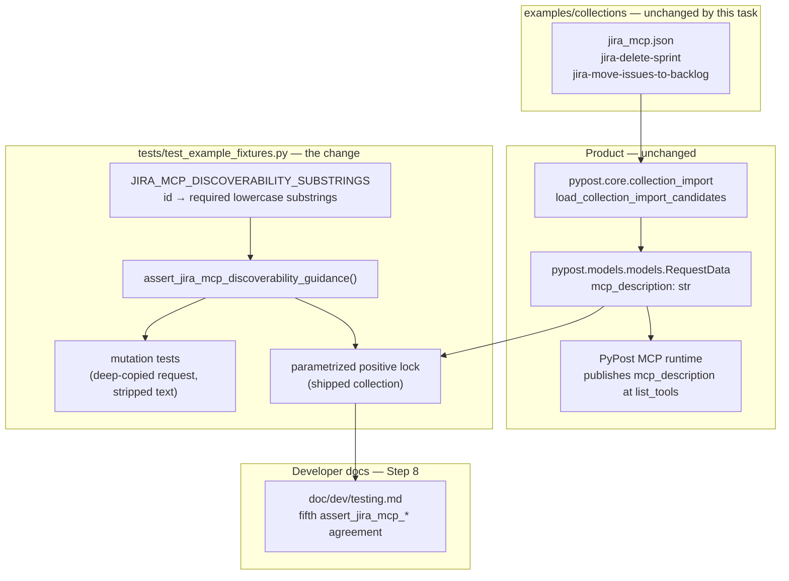

# PYPOST-1048: Lock jira_mcp discoverability guidance in fixture contracts

## Research

### Requirements baseline

- [`10-requirements.md`](10-requirements.md) asks for a durable, deterministic,
  credential-free safeguard that keeps two meanings readable by agents:
  sprint removal is **irreversible** and touches the **backlog**; backlog
  movement is the **remove-from-sprint** path that clears sprint
  **membership**.
- The requirements explicitly exclude adding, removing, or re-shaping
  sprint-management actions, and exclude any user-visible behavior change.
- Source ticket (PYPOST-1047 TD-1) names the implementation surface:
  `tests/test_example_fixtures.py`, asserting key `mcp_description`
  substrings for `jira-delete-sprint` and `jira-move-issues-to-backlog`.

### Current shipped guidance (evidence)

`examples/collections/jira_mcp.json` (23 MCP-exposed requests, collection id
`jira-cloud-mcp`) already carries the meanings that must be protected:

- **`jira-delete-sprint`** — meaning carried: *safety*.
  Shipped `mcp_description`, verbatim: "Permanently delete a Jira Software
  sprint by numeric ID. Irreversible; open issues in the sprint move to the
  backlog."
- **`jira-move-issues-to-backlog`** — meaning carried: *membership*.
  Shipped `mcp_description`, verbatim and shortened: "Remove issues from
  sprint membership by moving them to the backlog (clears active/future sprint
  assignment). Supported remove-from-sprint path; …"

Note the shipped delete-sprint text capitalizes "Irreversible"; every
comparison in this design is therefore case-insensitive (see *Main
interfaces*).

Both requests are `expose_as_mcp: true`, both are already locked by id, method
and URL fragment in `tests/test_example_fixtures.py`
(`REQUIRED_JIRA_MCP_REQUEST_IDS`, `test_jira_mcp_collection_covers_required_skill_capabilities`,
`PROTECTED_STRETCH_JIRA_MCP_OPERATIONS`). **Nothing today asserts the
description text**, so the meaning can be edited away while every existing
test stays green. That is the exact gap this task closes.

### Existing contract patterns in the target module

`tests/test_example_fixtures.py` (651 lines) already establishes the house
style this task must follow rather than invent around:

- **Module-level locked constant table** —
  `PROTECTED_STRETCH_JIRA_MCP_OPERATIONS`, `JIRA_NUMERIC_IDENTIFIER_MAPPINGS`,
  `PAGINATED_JIRA_MCP_LIST_REQUEST_IDS`.
- **Shared reusable checker named `assert_jira_mcp_*`** —
  `assert_jira_mcp_auth_convention`, `assert_jira_mcp_params_declared`,
  `assert_jira_mcp_list_pagination_params`.
- **Offline load via native parser** — `_load_jira_mcp_collection()` →
  `load_collection_import_candidates`.
- **Lookup helper** — `_request_by_id(collection, request_id)`.
- **`@pytest.mark.parametrize` over the constant table** —
  `test_jira_mcp_collection_covers_protected_stretch_operations`.
- **Mutation test shape** — `model_copy(deep=True)` → break one field →
  `pytest.raises(AssertionError, match=…)`, as in
  `test_jira_mcp_auth_convention_rejects_altered_authorization` and
  `test_jira_mcp_params_declared_rejects_dropped_issue_key`.
- **Case-insensitive substring assertions on agent-facing text** —
  `test_jira_project_default_is_wired_as_soft_guidance`
  (`guidance = … .lower()`) and
  `test_jira_mcp_numeric_identifier_paths_accept_decimal_strings_and_integers`
  (`description.lower()`).
- **Module timeout** — `pytestmark = pytest.mark.timeout(30)`.

`mcp_description` is a first-class field on `RequestData`
(`pypost/models/models.py:48`, default `""`) and survives the native import
path — `test_jira_project_default_is_wired_as_soft_guidance` already asserts
on `boards.mcp_description`. So no new loader plumbing is needed.

Two data-storage precedents exist for locked expectations:

1. **Test-module constants** (PYPOST-1027/1028/1029) — the default; the
   PYPOST-1028 block header records this as "Option A: test-module only".
2. **External JSON catalog** (PYPOST-1030,
   `examples/collections/jira_mcp_critical_rest_paths.json` + the
   `make check-jira-mcp-path-freshness` gate) — reserved for expectations that
   need a freshness gate against upstream Atlassian docs.

This task locks two short prose meanings, not a REST surface that drifts with
Atlassian releases, so pattern 1 applies and pattern 2 would be unjustified
machinery.

### External research

Atlassian's Jira Software Cloud REST documentation confirms the wording being
locked is factually load-bearing, not decorative:

- `DELETE /rest/agile/1.0/sprint/{sprintId}` — deleting a sprint moves all
  **open** issues in it to the **backlog**; the sprint itself is removed
  ([Sprint API group][sprint-api]).
- `POST /rest/agile/1.0/backlog/issue` — moving issues to the backlog is
  equivalent to **removing future and active sprint membership**
  ([Backlog API group][backlog-api]).

This matches the safety and membership meanings in `10-requirements.md`, and
matches the research already recorded in
[PYPOST-1047 architecture](../PYPOST-1047/20-architecture.md).

### Decision summary

- Extend `tests/test_example_fixtures.py` in place with one locked substring
  table, one shared `assert_jira_mcp_*` checker, parametrized positive tests,
  and per-request mutation tests.
- Lock **meaning-bearing lowercase substrings**, not whole sentences, so the
  requirement "wording may evolve" is honored while the meaning cannot be
  dropped.
- Change **no** fixture JSON, no `pypost/` production code, no environment,
  and no MCP runtime wiring.

## Implementation Plan

Test-module-only change plus a developer-doc note. No application package
work, no fixture edits, no Atlassian MCP changes.

1. **Step 3 — failing repro.** Land the red mutation coverage described in
   the mandatory section below; confirm it fails for the intended reason on
   current `dev`.
2. **Step 4 — implement the lock.** In `tests/test_example_fixtures.py`, add
   a PYPOST-1048 section after the existing PYPOST-1029 pagination block:
   - constant `JIRA_MCP_DISCOVERABILITY_SUBSTRINGS` (id → required lowercase
     substrings);
   - shared checker `assert_jira_mcp_discoverability_guidance(request,
     required_substrings)`;
   - parametrized positive test over the table, loading the shipped
     collection through `_load_jira_mcp_collection()`;
   - keep the Step 3 mutation tests green through the shared checker.
3. **Step 4 (same change) — no fixture edit expected.** The shipped
   descriptions already satisfy every locked substring, verified above. If a
   positive assertion is red, that is a real regression and Step 4 restores
   the missing meaning in `examples/collections/jira_mcp.json`
   (description text only — never method, URL, or `mcp_params`).
4. **Step 5–7** — formatting/lint via the standard gate; observability is
   N/A for a test-only lock; review records any residual debt.
5. **Step 8 — dev docs.** Add the fifth agreement to the
   "Env / auth / MCP params contracts" list in
   `doc/dev/testing.md` (§ *Example fixtures contract*), which today
   enumerates four `assert_jira_mcp_*` agreements, and mention PYPOST-1048 in
   that section's heading/overview the way PYPOST-1047/1028 are recorded.
6. **Out-of-scope guard.** Do not touch `pypost/` runtime, `examples/`
   collection or environment JSON (absent a proven regression), the critical
   REST path catalog, or any other collection.

### Mandatory — Failing Repro (next Step 3)

Not `N/A`: this task does change verifiable behavior of the offline contract
suite. However, the shipped `mcp_description` values already contain every
required substring (see Research), so a positive-only assertion would be
green on arrival and would prove nothing about the guard itself.

**Red artifact.** Step 3 adds only the *mutation half* of the contract to
`tests/test_example_fixtures.py` (module keeps `pytestmark =
pytest.mark.timeout(30)`; offline load only, no Jira tenant, no network, no
credentials):

1. `test_jira_mcp_discoverability_rejects_stripped_delete_sprint_warning`
   - `_request_by_id(collection, "jira-delete-sprint")`, `model_copy(deep=True)`;
   - **premise assertion, lowercased**: assert `irreversible` and `backlog`
     are in `request.mcp_description.lower()` — *not* in the raw text. The
     shipped sentence reads "… Irreversible; open issues …" with a capital I,
     so a case-sensitive premise assert would fail first with a misleading
     `AssertionError` and hide the intended red. Lowercasing here matches the
     checker's own case-insensitive contract (see *Main interfaces*);
   - then overwrite `mcp_description` on the copy with a neutral string such as
     `"Delete a Jira Software sprint by numeric ID."`;
   - `with pytest.raises(AssertionError, match=r"jira-delete-sprint")`, call
     `assert_jira_mcp_discoverability_guidance(mutated, ("irreversible",
     "backlog"))`.
2. `test_jira_mcp_discoverability_rejects_stripped_backlog_membership_guidance`
   - same shape for `jira-move-issues-to-backlog` with required substrings
     `("remove-from-sprint", "membership")` and a neutral replacement such as
     `"Move issues to the backlog."`;
   - its premise assertion lowercases `request.mcp_description` too, for the
     same reason and for uniformity across both tests.

**Rule for both tests.** Every comparison against `mcp_description` — premise
assertion, checker, and positive lock alike — runs on
`request.mcp_description.lower()`. The locked substrings are stored lowercase,
so no assertion in this task may compare against raw shipped text.

**Why it fails on current code.** `assert_jira_mcp_discoverability_guidance`
does not exist in the module, so both tests fail with
`NameError: name 'assert_jira_mcp_discoverability_guidance' is not defined`.
The failure is the intended missing acceptance behavior — the repository has
no guard that can detect stripped discoverability guidance — and it is the
same red mode accepted for
[PYPOST-1053](../PYPOST-1053/20-architecture.md) (red test referencing an
as-yet-absent helper). Step 4 turns them green by adding the checker and the
locked table, never by weakening an assertion.

**Sequencing.** research (this document) → red mutation tests → run
`make test PYTEST_ARGS='tests/test_example_fixtures.py -v'` and confirm the
`NameError` on both new tests only → Step 4 adds checker + table + positive
parametrized lock → same command green.

**Pre-committed fallback (decided here, not deferred).** The primary red is an
undefined-symbol `NameError`, which
[td-25-failing-repro](../../.claude/skills/td-25-failing-repro/SKILL.md)
discourages as a red mode. Step 2 therefore settles the alternative in advance
so no negotiation is needed later:

- **Decision.** If the Step 3 reviewer rejects the `NameError` red, Step 3
  switches directly to the *verification lock* framing of
  [PYPOST-1002](../PYPOST-1002/20-architecture.md) — checker, locked table, and
  positive tests landed together, recorded as passing on arrival, with the
  explicit rule that any red there is the real regression this task exists to
  catch and Step 4 restores the fixture description.
- **This switch is applied without re-opening Step 2.** It is an authorized
  alternative of this approved design, not a design change: the modules,
  interfaces, constant table, and scope are identical under either framing;
  only the landing order of the positive tests differs.
- **Invariant under both framings.** Step 3 changes nothing in `examples/` or
  `pypost/`, keeps `pytestmark = pytest.mark.timeout(30)`, stays offline and
  credential-free, and never weakens an assertion to reach green.

## Architecture

### Module diagram



### Modules and responsibilities

- **`examples/collections/jira_mcp.json`** *(no change — guarded)* — carries
  the agent-facing meanings under protection.
- **`pypost/models/models.py`** (`RequestData.mcp_description`) *(no change)* —
  field that transports the guidance from fixture to MCP runtime.
- **`pypost/core/collection_import.py`** *(no change)* — offline,
  credential-free load of the shipped fixture.
- **`JIRA_MCP_DISCOVERABILITY_SUBSTRINGS`** *(new constant)* — single source of
  truth for the locked lowercase meanings.
- **`assert_jira_mcp_discoverability_guidance`** *(new checker)* — reusable
  predicate; names the request id and the missing substrings.
- **Positive parametrized test** *(new test)* — proves the shipped collection
  still carries the meanings.
- **Mutation tests** *(new tests)* — prove the checker actually detects
  removal (anti-vacuous-lock).
- **`doc/dev/testing.md`** *(Step 8 note)* — developer-facing record of the
  fifth `assert_jira_mcp_*` agreement.

### Dependencies between modules

```text
JIRA_MCP_DISCOVERABILITY_SUBSTRINGS  (data)
        ↓ consumed by
assert_jira_mcp_discoverability_guidance  (pure predicate over RequestData)
        ↓ used by
positive lock test  ← _load_jira_mcp_collection() ← load_collection_import_candidates
mutation tests      ← _request_by_id() + RequestData.model_copy(deep=True)
```

The checker depends only on `RequestData` (duck-typed on `.id` and
`.mcp_description`) and a sequence of substrings. It has no dependency on the
loader, on the environment fixture, on the filesystem, or on the network —
which is what makes the safeguard deterministic and credential-free.

### Main interfaces

```python
# Locked agent-facing meanings, lowercase for case-insensitive matching.
JIRA_MCP_DISCOVERABILITY_SUBSTRINGS: tuple[tuple[str, tuple[str, ...]], ...] = (
    ("jira-delete-sprint", ("irreversible", "backlog")),
    ("jira-move-issues-to-backlog", ("remove-from-sprint", "membership")),
)


def assert_jira_mcp_discoverability_guidance(
    request: RequestData, required_substrings: Sequence[str]
) -> None:
    """Locked meaning substrings must survive in the agent-facing description.

    Args:
        request: Shipped (or deep-copied) curated Jira MCP request.
        required_substrings: Lowercase fragments that must remain present.

    Raises:
        AssertionError: When any locked fragment is absent; the message names
            the request id and every missing fragment.
    """
```

Interface contract details:

- **Matching is case-insensitive** — the checker lowercases
  `request.mcp_description` before comparison, because the shipped text says
  "Irreversible" with a capital I. This mirrors the existing lowercase
  comparisons in `test_jira_project_default_is_wired_as_soft_guidance`.
- **Matching is substring, not exact-sentence** — honoring the requirement
  that wording may evolve while meaning must not.
- **Failure messages name `request.id` and the sorted missing fragments**,
  matching the diagnostic style of the other `assert_jira_mcp_*` checkers, and
  contain no credential, header, or environment value.
- `Sequence` is already imported in the module
  (`from collections.abc import Sequence`); no new third-party dependency and
  no new import beyond what exists.

### Interaction scheme

```text
maintainer edits jira_mcp.json description
  → make test (offline, no credentials)
  → _load_jira_mcp_collection() parses the shipped JSON
  → parametrized positive lock feeds each (id, substrings) row to the checker
  → checker lowercases mcp_description and reports every missing fragment
  → red build names the exact request id and lost meaning
  → agent-facing safety/membership guidance cannot regress silently
```

### Selected patterns and justification

- **Shared `assert_jira_mcp_*` checker** — fifth member of an established
  family in this module; keeps the positive and mutation tests on one
  predicate.
- **Locked constant table + `parametrize`** — mirrors
  `PROTECTED_STRETCH_JIRA_MCP_OPERATIONS`; one row per protected request, one
  failure per row.
- **Substring (not equality) lock** — the requirement says wording may evolve
  but meaning may not; avoids brittle churn on harmless copy edits.
- **Case-insensitive comparison** — shipped text capitalizes "Irreversible";
  matches the existing lowercase-guidance assertions in the module.
- **Mutation test alongside the positive lock** — the shipped fixture already
  passes, so only mutation proves the guard is not vacuous; established at
  PYPOST-1028.
- **Test-module constants, not a JSON catalog** — PYPOST-1030's catalog exists
  for upstream-REST freshness gating; prose meanings have no freshness
  dimension.
- **Offline native-loader load** — deterministic, credential-free, no Jira
  tenant; a direct DoD requirement.

### Definition-of-Done traceability

The five Definition-of-Done items in [`10-requirements.md`](10-requirements.md)
map one-to-one onto elements of this design:

| DoD | Requirement (abridged) | Design element |
| --- | ---------------------- | -------------- |
| 1 | Sprint-removal safety meaning | `jira-delete-sprint` row: `irreversible`, `backlog` |
| 2 | Backlog-movement membership meaning | `jira-move-issues-to-backlog` row: 2 substrings |
| 3 | Both actions unchanged and available | Existing id/method/URL locks; no fixture edit |
| 4 | Durable, deterministic, credential-free | Offline `_load_jira_mcp_collection()`; no network |
| 5 | No user-visible or action-set change | Test-module-only change; *Out of scope* below |

Supporting notes:

- DoD 1 and 2 are enforced positively by the parametrized lock and
  non-vacuously by the mutation tests; substring choice is justified in *Q&A*.
- DoD 3 holds because the existing `REQUIRED_JIRA_MCP_REQUEST_IDS` and
  `PROTECTED_STRETCH_JIRA_MCP_OPERATIONS` locks stay untouched and this task
  adds no MCP tool.
- DoD 4 holds because the checker is a pure predicate over `RequestData`, and
  failure messages carry only a request id plus missing fragments — never a
  header, token, or environment value.
- DoD 5 holds because nothing outside `tests/test_example_fixtures.py` and
  `doc/dev/testing.md` changes, absent a proven fixture regression.

### Out of scope (explicit non-modules)

No change to sprint-management actions, their methods, URLs, `mcp_params`, or
count; no new MCP tool; no `examples/environments/jira_cloud.json` change; no
`pypost/` runtime change; no Atlassian MCP server change; no
`jira_mcp_critical_rest_paths.json` or `make check-jira-mcp-path-freshness`
change; no live-Jira dependency; no rewrite of unrelated `mcp_description`
text.

## Q&A

**Q:** Why lock text when id, method, and path are already locked?

**A:** Those locks prove the tool still *exists*. They pass unchanged if the
description is reduced to "Delete a sprint.", which strips the irreversibility
and backlog consequences an agent needs to act safely. Existence and meaning
are separate contracts.

**Q:** Why substrings instead of asserting the full sentence?

**A:** `10-requirements.md` permits wording to evolve provided the meaning
survives. Exact-match would fail on harmless copy edits and would pressure
maintainers to weaken the assertion — the opposite of durability.

**Q:** Which substrings, exactly, and why those?

**A:** `irreversible` + `backlog` for `jira-delete-sprint`; `remove-from-sprint`
+ `membership` for `jira-move-issues-to-backlog`. They are the ticket's own
terms, they map one-to-one to the two DoD meanings, and Atlassian's Sprint and
Backlog API docs confirm both consequences are real.

**Q:** Should the locked list live in a JSON catalog like the critical REST
paths?

**A:** No. That catalog exists so `make check-jira-mcp-path-freshness` can gate
drift against upstream Atlassian REST paths. Two prose meanings have no
upstream freshness dimension, and PYPOST-1028 already set "test-module only"
as the default for this family.

**Q:** Does anything in `examples/` or `pypost/` change?

**A:** Not expected. The shipped descriptions already satisfy every locked
substring. Fixture text would only change if a positive assertion goes red,
which would itself be the regression this task exists to catch.

**Q:** How can Step 3 be red when the fixture already passes?

**A:** The red is the absent guard, not absent guidance: Step 3's mutation
tests call a checker that does not exist yet. If the Step 3 reviewer rejects
that `NameError` red, the pre-committed fallback in the failing-repro section
applies the PYPOST-1002 verification-lock framing directly, without re-opening
Step 2.

**Q:** Any credential or secret exposure?

**A:** None. The suite loads committed JSON through the native import parser,
asserts on non-secret agent-facing prose, and failure messages carry only a
request id and missing fragments.

## References

- [PYPOST-1048 requirements](10-requirements.md)
- [PYPOST-1048 roadmap](00-roadmap.md)
- [PYPOST-1047 architecture](../PYPOST-1047/20-architecture.md)
- [PYPOST-1053 architecture](../PYPOST-1053/20-architecture.md)
- [PYPOST-1002 architecture](../PYPOST-1002/20-architecture.md)
- [td-25-failing-repro](../../.claude/skills/td-25-failing-repro/SKILL.md)
- [Testing via MCP and Prometheus](../../doc/dev/testing.md)
- [Jira Software Cloud REST — Sprint][sprint-api]
- [Jira Software Cloud REST — Backlog][backlog-api]

[sprint-api]: https://developer.atlassian.com/cloud/jira/software/rest/api-group-sprint/
[backlog-api]: https://developer.atlassian.com/cloud/jira/software/rest/api-group-backlog/
