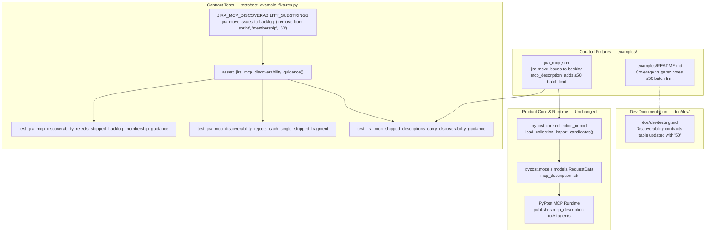

# PYPOST-1050: Document Agile ≤50 backlog batch limit on jira_move_issues_to_backlog

## Research

### Requirements baseline

- [`10-requirements.md`](10-requirements.md) establishes the goal: explicitly document the Jira Software Agile API batch limit (a maximum of 50 issues per operation) for the backlog movement action (`jira_move_issues_to_backlog` / `jira-move-issues-to-backlog`).
- **Context & Problem:** When AI planning agents perform bulk sprint replanning or mass sprint cleanup, they remove issues from active/future sprints by moving them to the backlog. The underlying Jira Agile endpoint enforces a strict maximum of 50 issues per request (`POST /rest/agile/1.0/backlog/issue`). If an agent is unaware of this operational boundary, it attempts to submit payloads with >50 issues, resulting in request rejection errors (HTTP 400), failed replans, and broken autonomous execution.
- **Scope (in):**
  1. Update `mcp_description` of `jira-move-issues-to-backlog` in `examples/collections/jira_mcp.json` to state the batch limit of ≤50 issues while preserving sprint membership removal and remove-from-sprint semantics.
  2. Update `examples/README.md` to document the 50-issue backlog movement batch constraint alongside sprint membership capabilities.
  3. Extend contract tests in `tests/test_example_fixtures.py` by locking the batch limit substring in `JIRA_MCP_DISCOVERABILITY_SUBSTRINGS` alongside existing locked meanings (`remove-from-sprint`, `membership`).
- **Scope (out):**
  - No client-side chunking/looping/pagination code in `pypost/` product packages.
  - No changes to HTTP method (`POST`), endpoint URL (`/rest/agile/1.0/backlog/issue`), headers, parameters, or body schema (`issues_payload`).
  - No changes to other Jira MCP tools or external Atlassian MCP configuration.

### Existing artifacts & contracts

1. **`examples/collections/jira_mcp.json`** (`jira-cloud-mcp`):
   - Request `jira-move-issues-to-backlog` (lines 619–643):
     ```json
     {
       "id": "jira-move-issues-to-backlog",
       "name": "Jira Move Issues To Backlog",
       "method": "POST",
       "url": "{{ jira_base_url }}/rest/agile/1.0/backlog/issue",
       "headers": {
         "Accept": "application/json",
         "Content-Type": "application/json",
         "Authorization": "Basic {{ base64(jira_credentials) }}"
       },
       "params": {},
       "body": "{{ mcp.request.issues_payload }}",
       "body_type": "json",
       "yaml_as_json": false,
       "post_script": "",
       "expose_as_mcp": true,
       "mcp_description": "Remove issues from sprint membership by moving them to the backlog (clears active/future sprint assignment). Supported remove-from-sprint path; issues_payload must be serialized JSON, for example {\"issues\":[\"DEMO-1\"]}.",
       "mcp_params": {
         "issues_payload": {
           "type": "string",
           "description": "Serialized JSON body for POST /rest/agile/1.0/backlog/issue.",
           "required": true
         }
       },
       "retry_policy": null
     }
     ```
   - Current `mcp_description` explicitly mentions removing issues from sprint membership and notes that it is the supported remove-from-sprint path, but **does not mention the ≤50 issues batch limit**.

2. **`examples/README.md`**:
   - Under `## Coverage vs gaps` -> `Included (MCP-exposed requests)`:
     - Lists `jira-move-issues-to-backlog` under `Sprint membership`.
     - States: `jira-move-issues-to-backlog is the supported remove-from-sprint path.`
     - Does not mention the 50-issue limit per batch operation.

3. **`tests/test_example_fixtures.py`**:
   - Contains discoverability contract locks introduced in PYPOST-1048:
     ```python
     JIRA_MCP_DISCOVERABILITY_SUBSTRINGS: tuple[tuple[str, tuple[str, ...]], ...] = (
         ("jira-delete-sprint", ("irreversible", "backlog")),
         ("jira-move-issues-to-backlog", ("remove-from-sprint", "membership")),
     )
     ```
   - The checker `assert_jira_mcp_discoverability_guidance(request, required_substrings)` enforces that every required lowercase substring is present in `request.mcp_description.lower()`.
   - Parametrized tests:
     - `test_jira_mcp_shipped_descriptions_carry_discoverability_guidance` checks shipped `jira_mcp.json`.
     - `test_jira_mcp_discoverability_rejects_each_single_stripped_fragment` dynamically iterates over each locked fragment.
     - `test_jira_mcp_discoverability_rejects_stripped_backlog_membership_guidance` tests full mutation on `jira-move-issues-to-backlog`.

4. **`doc/dev/testing.md`**:
   - Under `#### jira_move_issues_to_backlog (request id jira-move-issues-to-backlog)` (lines 567–575), dev docs already note:
     `Official Agile API caps batches at ≤50 issues.`
   - Under `### Jira MCP discoverability contracts (PYPOST-1048)`, the table lists `jira-move-issues-to-backlog` with fragments `remove-from-sprint` and `membership`.

### Atlassian Jira Software Cloud REST API research

- **Endpoint**: `POST /rest/agile/1.0/backlog/issue`
- **Official Specification**: "Move issues to the backlog. This operation is equivalent to remove future and active sprints from a given set of issues. At most 50 issues may be moved at once."
- **Payload Schema**:
  ```json
  {
    "issues": [
      "KEY-1",
      "KEY-2"
    ]
  }
  ```
- **Constraint**: The `issues` array length is bounded: $1 \le \text{len}(\text{issues}) \le 50$. Submissions exceeding 50 items produce HTTP 400 rejection.

### Origin and ticket traceability

- Source: `ai-tasks/PYPOST-1047/60-tech-debt.md` (TD-2: "Mention the Agile API batch limit (<=50 issues per POST /rest/agile/1.0/backlog/issue) in jira-move-issues-to-backlog mcp_description and optionally examples/README.md").
- Follows the discoverability pattern established in PYPOST-1048.

---

## Implementation Plan

### High-level progression

1. **Step 3 (Failing Repro)**:
   - Update `tests/test_example_fixtures.py` to add `"50"` to `JIRA_MCP_DISCOVERABILITY_SUBSTRINGS` for `jira-move-issues-to-backlog`:
     ```python
     JIRA_MCP_DISCOVERABILITY_SUBSTRINGS: tuple[tuple[str, tuple[str, ...]], ...] = (
         ("jira-delete-sprint", ("irreversible", "backlog")),
         ("jira-move-issues-to-backlog", ("remove-from-sprint", "membership", "50")),
     )
     ```
   - Update `test_jira_mcp_discoverability_rejects_stripped_backlog_membership_guidance` premise check and expected failure message to reflect all three locked substrings: `('50', 'membership', 'remove-from-sprint')`.
   - Run `pytest tests/test_example_fixtures.py`: `test_jira_mcp_shipped_descriptions_carry_discoverability_guidance[jira-move-issues-to-backlog-...]` **fails RED** against current `examples/collections/jira_mcp.json` because `"50"` is missing from the shipped description.
2. **Step 4 (Development)**:
   - Update `examples/collections/jira_mcp.json`:
     - Modify `mcp_description` for `jira-move-issues-to-backlog` to include batch limit guidance:
       `"Remove issues from sprint membership by moving them to the backlog (clears active/future sprint assignment). Supported remove-from-sprint path (max 50 issues per batch); issues_payload must be serialized JSON, for example {\"issues\":[\"DEMO-1\"]}."`
   - Update `examples/README.md`:
     - Add note clarifying the ≤50 issues batch limit under `## Coverage vs gaps` for `jira-move-issues-to-backlog`.
   - Run `pytest tests/test_example_fixtures.py` -> All tests pass **GREEN**.
3. **Step 5 (Code Cleanup)**:
   - Run formatting and linters (`ruff`, `flake8`, `mypy`).
   - Create `ai-tasks/PYPOST-1050/40-code-cleanup.md`.
4. **Step 6 (Observability)**:
   - Create `ai-tasks/PYPOST-1050/50-observability.md` noting N/A for runtime metrics (fixture & doc change only; existing MCP telemetry unchanged).
5. **Step 7 (Technical Debt Analysis)**:
   - Create `ai-tasks/PYPOST-1050/60-tech-debt.md`.
6. **Step 8 (Developer Documentation)**:
   - Update `doc/dev/testing.md` to reflect the updated `JIRA_MCP_DISCOVERABILITY_SUBSTRINGS` table (`remove-from-sprint`, `membership`, `50`).

### Mandatory — Failing Repro (next Step 3)

- **Artifact & Location:** `tests/test_example_fixtures.py`.
- **Target Test:** `test_jira_mcp_shipped_descriptions_carry_discoverability_guidance[jira-move-issues-to-backlog-required_substrings1]`.
- **Red Behavior:**
  - In Step 3, `JIRA_MCP_DISCOVERABILITY_SUBSTRINGS` is updated to include `"50"`.
  - The positive contract test loads the shipped `jira_mcp.json` using `_load_jira_mcp_collection()`.
  - Because `examples/collections/jira_mcp.json` has not yet been updated in Step 3, `assert_jira_mcp_discoverability_guidance` raises:
    ```text
    AssertionError: Request jira-move-issues-to-backlog mcp_description missing locked discoverability fragment(s): ['50']
    ```
- **Why this repro is deterministic & credential-free:**
  - Tests run strictly offline using local JSON fixtures and native collection loaders.
  - No Jira network calls, live tokens, or external environments are required.
- **Sequencing:**
  1. Step 3 updates `tests/test_example_fixtures.py` (adds `"50"` to locked substrings).
  2. Run `pytest tests/test_example_fixtures.py` -> Verified RED.
  3. Step 4 updates `examples/collections/jira_mcp.json` and `examples/README.md`.
  4. Run `pytest tests/test_example_fixtures.py` -> Verified GREEN.

---

## Architecture

### Module diagram



### Components and files touched

| Component / File | Purpose & Role | Nature of Change |
| --- | --- | --- |
| `examples/collections/jira_mcp.json` | Curated Jira MCP collection fixture | Update `jira-move-issues-to-backlog` `mcp_description` with batch limit |
| `examples/README.md` | User documentation for example collections | Add ≤50 issues batch limit note for backlog move |
| `tests/test_example_fixtures.py` | Contract test suite for example fixtures | Update `JIRA_MCP_DISCOVERABILITY_SUBSTRINGS` table & mutation tests |
| `doc/dev/testing.md` | Developer reference documentation | Update discoverability locked substring table (Step 8) |
| `pypost/*` (Product code) | Core engine, HTTP client, MCP handlers | **Unchanged** (zero product runtime modification) |

### Dependencies and interaction scheme

```text
1. Maintenance / Tool Update:
   examples/collections/jira_mcp.json
   └── contains mcp_description: "... (max 50 issues per batch) ..."

2. Offline Contract Verification:
   tests/test_example_fixtures.py
   ├── loads collection via native parser (load_collection_import_candidates)
   ├── extracts RequestData for "jira-move-issues-to-backlog"
   ├── asserts presence of ("remove-from-sprint", "membership", "50") in lowercased description
   └── verifies partial and full strip mutations fail with precise diagnostic messages

3. Agent Runtime Execution:
   PyPost MCP Server
   └── serves tool definition to AI planning agent
       └── agent inspects tool guidance, identifies 50-issue limit, and batches large moves safely
```

### Main interfaces and constant updates

#### 1. `tests/test_example_fixtures.py`

```python
# Updated locked discoverability substrings:
JIRA_MCP_DISCOVERABILITY_SUBSTRINGS: tuple[tuple[str, tuple[str, ...]], ...] = (
    ("jira-delete-sprint", ("irreversible", "backlog")),
    ("jira-move-issues-to-backlog", ("remove-from-sprint", "membership", "50")),
)
```

#### 2. `examples/collections/jira_mcp.json`

```json
{
  "id": "jira-move-issues-to-backlog",
  "name": "Jira Move Issues To Backlog",
  "method": "POST",
  "url": "{{ jira_base_url }}/rest/agile/1.0/backlog/issue",
  "headers": {
    "Accept": "application/json",
    "Content-Type": "application/json",
    "Authorization": "Basic {{ base64(jira_credentials) }}"
  },
  "params": {},
  "body": "{{ mcp.request.issues_payload }}",
  "body_type": "json",
  "yaml_as_json": false,
  "post_script": "",
  "expose_as_mcp": true,
  "mcp_description": "Remove issues from sprint membership by moving them to the backlog (clears active/future sprint assignment). Supported remove-from-sprint path (max 50 issues per batch); issues_payload must be serialized JSON, for example {\"issues\":[\"DEMO-1\"]}.",
  "mcp_params": {
    "issues_payload": {
      "type": "string",
      "description": "Serialized JSON body for POST /rest/agile/1.0/backlog/issue.",
      "required": true
    }
  },
  "retry_policy": null
}
```

### Selected architectural patterns and justification

- **Contract-Locked Discoverability Substrings**: Locking specific, meaning-bearing lowercase fragments (`"50"`, `"membership"`, `"remove-from-sprint"`) prevents accidental regressions while allowing non-breaking copy polish.
- **Negative Mutation Testing**: Re-verifying that dropping `"50"` causes test failures guarantees that the test suite actively defends the requirement and is not vacuous.
- **Zero Runtime Overhead**: Changes are purely declarative in documentation and JSON fixtures, introducing no compute, latency, or memory overhead to PyPost.
- **Scope Discipline**: Avoiding client-side request chunking keeps PyPost a lean, transparent API tool runner that respects explicit user/agent payloads without unexpected hidden side effects.

### Definition of Done traceability

| DoD Item | Description | Traceability / Verification |
| --- | --- | --- |
| **DoD 1** | Description for `jira_move_issues_to_backlog` explicitly communicates ≤50 batch limit | Verified by `test_jira_mcp_shipped_descriptions_carry_discoverability_guidance` asserting `"50"` in `mcp_description`. |
| **DoD 2** | Description preserves remove-from-sprint and membership semantics | Verified by `test_jira_mcp_shipped_descriptions_carry_discoverability_guidance` asserting `"remove-from-sprint"` and `"membership"`. |
| **DoD 3** | Companion `examples/README.md` documents 50-issue limit for backlog move | Updated under `## Coverage vs gaps` in `examples/README.md`. |
| **DoD 4** | No changes to REST method, URL, parameters, or data format | Fixture JSON keeps `POST`, `/rest/agile/1.0/backlog/issue`, and `issues_payload` unchanged. |
| **DoD 5** | Existing automated test suites and contract checks continue to pass | Verified by running `pytest tests/test_example_fixtures.py`. |

### Out of scope (explicit non-goals)

- No automated request splitting/batching loop in PyPost client code.
- No changes to other Jira MCP tools.
- No changes to environment variables or credentials.
- No live Jira API integration test requirement.

---

## Q&A

**Q: Why lock `"50"` instead of a longer phrase like `"at most 50 issues per batch"`?**  
**A:** Substring locks are designed to be resilient against cosmetic phrasing adjustments while strictly guarding essential semantic boundaries. Locking `"50"` ensures the specific numeric constraint cannot be dropped or changed without failing the contract test.

**Q: Why shouldn't PyPost automatically chunk requests with >50 issues into multiple HTTP calls?**  
**A:** PyPost is a transparent API client and MCP bridge. AI agents and workflow orchestrators are responsible for planning and executing their requests. Adding implicit multi-call batching inside the tool runner would obscure rate limits, error handling, and transaction boundaries.

**Q: Does adding `"50"` to `JIRA_MCP_DISCOVERABILITY_SUBSTRINGS` automatically test single-fragment mutations?**  
**A:** Yes. `_JIRA_MCP_DISCOVERABILITY_PARTIAL_STRIP_CASES` dynamically expands over all entries in `JIRA_MCP_DISCOVERABILITY_SUBSTRINGS`, so `test_jira_mcp_discoverability_rejects_each_single_stripped_fragment` will automatically generate a dedicated test case asserting that dropping `"50"` triggers an `AssertionError`.

**Q: Why does Step 3 produce a genuine red repro?**  
**A:** When Step 3 updates `tests/test_example_fixtures.py` with `"50"`, the existing `examples/collections/jira_mcp.json` file in the repo does not yet contain `"50"`. Running `pytest tests/test_example_fixtures.py` will fail with an `AssertionError` identifying `'50'` as the missing fragment, providing a clean red test prior to Step 4.

---

## References

- [PYPOST-1050 Requirements](10-requirements.md)
- [PYPOST-1050 Roadmap](00-roadmap.md)
- [PYPOST-1047 Technical Debt (TD-2)](../PYPOST-1047/60-tech-debt.md)
- [PYPOST-1048 Architecture](../PYPOST-1048/20-architecture.md)
- [Atlassian Jira Software Cloud REST API — Backlog](https://developer.atlassian.com/cloud/jira/software/rest/api-group-backlog/)
- [Testing via MCP and Prometheus (`doc/dev/testing.md`)](../../doc/dev/testing.md)
