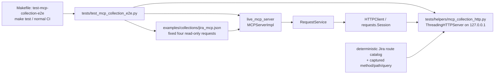

# PYPOST-1053: CI-safe Jira MCP collection e2e

## Research

### Requirements and repository evidence

- Step 1 requires deterministic, credential-free coverage of exactly four
  read-only tools from the shipped `examples/collections/jira_mcp.json`:
  `jira_get_current_user`, `jira_search_issues_jql`, `jira_get_issue`, and
  `jira_list_boards`.
- The search result must provide the issue key consumed by the detail call.
  This makes the pack one coherent user workflow instead of four isolated
  contracts.
- `tests/test_jira_mcp_live_smoke.py` already loads and validates these four
  collection requests, calls them in the required order, and has a one-route
  loopback proof. Its protected live test is intentionally opt-in and cannot
  be default CI.
- `tests/helpers/mcp_live_server.py` starts the Streamable HTTP MCP server.
  When its `execute_result` argument is omitted, it leaves
  `MCPServerImpl` to create a real `RequestService`; this is the necessary
  e2e execution path.
- `pypost/core/request_service.py` delegates HTTP requests to
  `HTTPClient.send_request`, and `pypost/core/http_client.py` dispatches
  with `requests.Session`. A loopback endpoint therefore proves template
  rendering and the actual outbound HTTP transport without a Jira tenant.
- `tests/test_mcp_server_integration.py` contains several local,
  scenario-specific `ThreadingHTTPServer` handlers. They prove the approach,
  but are not a reusable four-route catalog.
- `pypost/fixtures/agent_e2e_http.py` replaces
  `RequestService`'s `HTTPClient.send_request` lookup with a UI response
  catalog. It is deliberately unsuitable as the primary collection test,
  because no real socket or `requests` dispatch occurs.
- The `Makefile` fast `test` target runs `tests/ -m "not slow"`, so a normal,
  non-slow collection-e2e module is already part of the standard CI-safe
  path. A dedicated target remains necessary for discoverability and focused
  local/CI invocation.
- PYPOST-1045 selected this exact follow-up: a shared in-process loopback
  stand-in, real MCP/`RequestService`/`HTTPClient`, four routes, a dedicated
  Make target, and documentation. Its TD-1 records this as the high-priority
  implementation follow-up.

### External research

Python's official [`http.server` documentation](https://docs.python.org/3/library/http.server.html)
states that `ThreadingHTTPServer` is an `HTTPServer` variant using threads and
was added in Python 3.7. `BaseHTTPRequestHandler` parses a request and
dispatches it to a method-specific `do_*` handler. The same documentation says
the module is not recommended for production. Consequently, this design uses
it only in an in-process test fixture bound to `127.0.0.1`; it is not a product
server or a replacement for Jira.

### Decision

Use an in-process loopback HTTP stand-in as the primary default-CI test double.
Do not use the agent UI `send_request` patch as the primary test double, an
external mock-server process, or the protected live Jira smoke as the routine
CI signal.

## Implementation Plan

1. Add `tests/helpers/mcp_collection_http.py`, a test-only context-manager
   fixture. It binds `ThreadingHTTPServer` to `127.0.0.1` and port `0`, starts
   one daemon serving thread, yields its derived `base_url` and a safe request
   observation API, then always calls `shutdown()` and joins the thread with a
   bounded timeout.
2. Give the fixture an exact method-and-path route catalog with deterministic
   JSON bodies for the four Jira REST routes. The handler will send JSON with
   `Content-Length`, suppress default stderr logging, reject unexpected routes
   with a safe 404/405 response, and record method/path (and only the
   non-sensitive search body needed for a body-shape assertion).
3. Add `tests/test_mcp_collection_e2e.py`. It will load the committed Jira
   collection, select only the four approved request ids, start
   `live_mcp_server(tools)` without `execute_result`, set the variable supplier
   to the loopback URL plus fixed offline values, and mark all variables hidden.
4. In that test, call the MCP tools through the Streamable HTTP MCP client in
   live-smoke order: current user; bounded JQL search; `jira_get_issue` using
   the returned canned key; board listing with `maxResults=1` and `startAt=0`.
   Assert successful MCP envelopes, useful Jira-shaped response bodies, the
   exact method/path/query sequence, and the chained key. Do not put a
   credential, endpoint, request body, or response content into failure
   messages.
5. Add `make test-mcp-collection-e2e` to the Makefile with the same test
   environment/prerequisites as `test`, targeting this module. Keep the module
   unmarked as `slow`, so it stays in `make test` and existing normal PR CI.
   Add focused Makefile contract coverage as appropriate.
6. Replace the PYPOST-1045 "planned" wording in `doc/dev/testing.md`, add a
   developer page such as `doc/dev/jira_mcp_collection_e2e.md`, and cross-link
   it from `doc/dev/jira_mcp_live_smoke.md`. Explain that loopback e2e is the
   default credential-free signal, while the live smoke stays opt-in and
   validates authorized service integration.

### Mandatory — Failing Repro (next Step 3)

Before adding the shared stand-in or changing the Makefile/docs, create
`tests/test_mcp_collection_e2e.py` with `pytestmark = pytest.mark.timeout(30)`.
The initial red test imports the as-yet-absent
`tests.helpers.mcp_collection_http.stub_jira_mcp_collection_http`, loads only
the four committed request ids, and uses it with `live_mcp_server(tools)`
without `execute_result`.

It invokes the four exposed tools over Streamable HTTP in this order:

1. `jira_get_current_user` returns a successful Jira-shaped user payload.
2. `jira_search_issues_jql` accepts a bounded JSON JQL payload and returns one
   canned issue key.
3. `jira_get_issue` receives exactly that returned key and succeeds.
4. `jira_list_boards` is called with its required inputs, `maxResults=1` and
   `startAt=0`, and returns a successful Jira-shaped board-list payload.

The assertions require a successful MCP result for each call and the exact
captured backend sequence: `GET /rest/api/3/myself`, `POST /rest/api/3/search/jql`,
`GET /rest/api/3/issue/OFFLINE-1`, and `GET /rest/agile/1.0/board` with the
parsed query `maxResults=1`, `startAt=0`, and
`projectKeyOrId=OFFLINE`. The fixture records parsed path and query separately,
so the assertion is independent of URL query ordering. The test also asserts
the search response's key is the value used by the issue request. A companion
Makefile contract test asserts that `test-mcp-collection-e2e` selects this
module.

With no implementation, the missing helper import makes the runtime repro
fail before any external access. It will remain red until Step 4 adds the
loopback fixture and the Makefile target; then implementation proceeds only
until the same tests are green. This sequence exercises the real
MCP → `RequestService` → `HTTPClient` → `requests` → loopback route path,
rather than the agent UI HTTP stub.

## Architecture

### Module diagram



### Components and responsibilities

| Component | Responsibility | Boundary |
| --- | --- | --- |
| Collection | Tools, templates, and routes | Shipped contract |
| E2E tests | Resource lifecycle; tool calls and chaining | Test orchestration |
| `live_mcp_server` | Streamable MCP; selected tools | Omit execute mock |
| Request stack | Render and send real `requests` traffic | Existing production path |
| Loopback fixture | Lifecycle, routes, canned bodies, observations | Test-only; ephemeral |
| Route catalog | Minimum JSON and issue key | Four read-only routes |
| Makefile and docs | Focused command and confidence boundaries | Default includes pack |

### Interaction scheme

1. The test imports the committed collection and validates/selects its fixed
   four request ids.
2. The loopback fixture starts before the MCP server and yields its actual
   ephemeral `base_url`; no port pre-allocation race is needed.
3. The MCP implementation receives only test-provided, hidden variables:
   `jira_base_url`, a fixed dummy `jira_credentials`, and
   `jira_project_key`. No process Jira configuration is read.
4. The MCP client calls each exposed tool over Streamable HTTP. It calls
   `jira_list_boards` with `maxResults=1` and `startAt=0`; the MCP server
   creates the real request stack, which renders the collection URL/body and
   sends it to the loopback server.
5. The fixture routes by HTTP method plus parsed path, returns deterministic
   JSON, and records only safe request metadata, including the board route's
   parsed query.
6. The test parses the search response in memory, passes its issue key to the
   issue-detail call, then verifies the complete backend sequence and the
   board route's deterministic parsed query.
7. Context-manager cleanup stops both servers even on an assertion failure.

### Route and response contract

| Tool | Request to loopback stand-in | Minimum deterministic result |
| --- | --- | --- |
| `jira_get_current_user` | `GET /rest/api/3/myself` | JSON object with a non-empty `accountId` |
| `jira_search_issues_jql` | `POST /rest/api/3/search/jql` | `issues` contains `OFFLINE-1` |
| `jira_get_issue` | `GET /rest/api/3/issue/OFFLINE-1` | Same `key`, minimal `fields` |
| `jira_list_boards` | `GET /rest/agile/1.0/board` | JSON object with a non-empty `values` list |

For `jira_list_boards`, the test supplies required inputs `maxResults=1` and
`startAt=0`. The stand-in validates that the board route's parsed query is
`maxResults=1`, `startAt=0`, and `projectKeyOrId=OFFLINE`, then returns its
deterministic 2xx JSON. The stand-in is not required to validate Jira
authorization semantics, paginate every shape, serve write routes, reproduce
Jira failures, or accept unbounded collection input.

### Patterns and rationale

- **Wire-level fake server:** A loopback HTTP fixture replaces Jira at the
  external boundary. Unlike a `send_request` mock, it retains URL rendering,
  headers/body preparation, `requests.Session`, and socket dispatch.
- **Shared fixture plus declarative route catalog:** Centralizes lifecycle and
  response shapes already duplicated by local test handlers, so the e2e test
  remains workflow-focused.
- **Dependency injection through existing MCP variable suppliers:** Supplies
  test-only values without environment secrets or product configuration
  changes; hidden-key registration protects normal diagnostics.
- **Narrow, contract-derived scope:** Loading the shipped collection avoids a
  parallel test catalog while allowing only the four required read tools.
- **Separate confidence layers:** The new offline e2e pack is default CI;
  `test-jira-mcp-live` remains authorized external validation; agent UI e2e
  remains a sibling UI path with its own HTTP patch fixture.

### Public test-facing interfaces

The exact names may be refined during Step 4, but the fixture must provide
these capabilities without exposing sensitive values:

```python
@contextmanager
def stub_jira_mcp_collection_http() -> Iterator[JiraMcpCollectionHttpStub]:
    """Run deterministic Jira read routes on loopback for one test."""
    ...


@dataclass(frozen=True)
class JiraMcpCollectionHttpStub:
    base_url: str

    @property
    def requests(self) -> tuple[CapturedJiraRequest, ...]:
        """Return safe captured method, parsed path/query, and selected test body metadata."""
        ...
```

The test uses `stub.base_url` as `jira_base_url` and asserts captured methods
and parsed paths. Fixture construction binds port `0`, not a previously probed
port. The implementation must shut down and join its server thread in a
`finally` block, using bounded waits compatible with the existing MCP harness.

### Operator and CI interface

| Command or path | Role |
| --- | --- |
| `make test-mcp-collection-e2e` | Focused, credential-free four-tool e2e pack |
| `make test` | Standard CI-safe suite; includes the pack because it is not `slow` |
| Normal `push` / `pull_request` test job | Receives no Jira secrets and runs the default suite |
| `make test-jira-mcp-live` | Unchanged explicit, protected live smoke |
| `make test-agent-e2e` | Unchanged UI e2e pack; its HTTP stub is not this backend |

No custom pytest marker is required for the first version: the dedicated
Makefile target can select the module directly, and avoiding a marker keeps
the fast default inclusion explicit and compatible with strict marker rules.

## Q&A

**Q: Why not use `pypost.fixtures.agent_e2e_http`?**

**A:** It intentionally patches `HTTPClient.send_request` for UI Send flows.
That skips the real HTTP client and socket boundary which this collection e2e
must verify. It remains useful for agent UI e2e, but is not the primary
collection backend.

**Q: Why use `ThreadingHTTPServer` rather than a new mock-server dependency?**

**A:** It is Python stdlib, already used by relevant repository integration
tests, supports the required `do_GET`/`do_POST` routes, and keeps this
four-route test fast. It is test-only and loopback-bound; the official docs do
not recommend it for production.

**Q: Why retain the live Jira smoke?**

**A:** Loopback e2e proves deterministic behavior through the local request
stack. The opt-in smoke separately catches authorized Jira tenant, credential,
and upstream compatibility problems. Neither replaces the other.

**Q: Does the fixture emulate all of Jira?**

**A:** No. It returns only the smallest valid JSON needed by the four required
read workflows. Write endpoints, external auth semantics, and broad API
compatibility are deliberately out of scope.

**Q: Which files are expected in later steps?**

**A:** Step 3 adds the red runtime test. Step 4 adds the test helper, Makefile
target, focused Makefile contract coverage, and developer documentation. It
does not change production MCP runtime code.

### References

- [PYPOST-1053 requirements](10-requirements.md)
- [PYPOST-1045 architecture](../PYPOST-1045/20-architecture.md)
- [PYPOST-1045 technical debt](../PYPOST-1045/60-tech-debt.md)
- [Optional Live Jira MCP Smoke](../../doc/dev/jira_mcp_live_smoke.md)
- [Testing via MCP and Prometheus](../../doc/dev/testing.md)
- [Python `http.server` documentation](https://docs.python.org/3/library/http.server.html)
