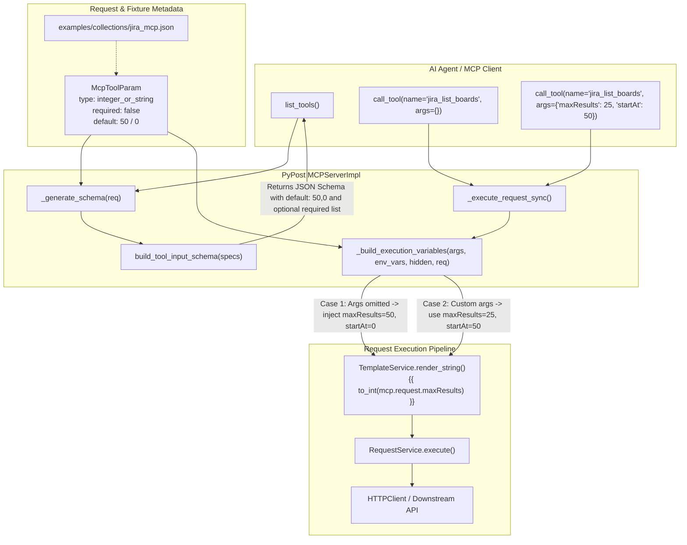

# PYPOST-1054: Add safe defaults for optional Jira MCP pagination query args

## Research

### Requirements and Baseline

- **Origin & Context:** Follow-up from [PYPOST-1029](https://pypost.atlassian.net/browse/PYPOST-1029) TD-1. In PYPOST-1029, pagination query parameters (`maxResults` and `startAt`) were exposed on curated Jira MCP list tools (`jira-list-boards`, `jira-list-board-sprints`, and `jira-get-sprint-issues`). However, because template rendering failed when parameters were omitted, both parameters were marked `required: true` with documentation instructing agents to pass `maxResults=50` and `startAt=0`.
- **Target Goal:** Enable optional pagination arguments with safe defaults (`maxResults=50` and `startAt=0`) so AI agents can query the first page of results without supplying repetitive boilerplate arguments, while retaining the ability to pass explicit custom page sizes or offsets.
- **Language & Frameworks:** Python 3.13, Pydantic v2 for data models, Starlette / MCP SDK for tool publishing and invocation, Jinja2 for template variable substitution, PySide6 for UI request editing, and Pytest for deterministic offline testing.

### Current Implementation Analysis

1. **Parameter Model (`pypost/models/models.py`):**
   ```python
   class McpToolParam(BaseModel):
       """Agent-visible metadata for one MCP tool parameter."""

       type: str = "string"
       description: str = ""
       required: bool = True
   ```
   *Analysis:* `McpToolParam` currently lacks a `default` field. Adding `default: Optional[Any] = None` allows tools to declare default values for optional arguments across all supported MCP parameter types.

2. **Schema Builder (`pypost/core/mcp_tool_contract.py`):**
   ```python
   def build_tool_input_schema(specs: dict[str, McpToolParam]) -> dict:
       """Build JSON Schema for MCP tool arguments from parameter metadata."""
       properties: dict[str, dict[str, Any]] = {}
       required: list[str] = []
       for name in sorted(specs):
           spec = specs[name]
           if spec.type == "integer_or_string":
               prop: dict[str, Any] = {
                   "anyOf": [
                       {"type": "integer"},
                       {"type": "string", "pattern": "^[+-]?[0-9]+$"},
                   ]
               }
           else:
               prop = {"type": spec.type}
           if spec.description:
               prop["description"] = spec.description
           properties[name] = prop
           if spec.required:
               required.append(name)
       schema: dict[str, Any] = {"type": "object", "properties": properties}
       if required:
           schema["required"] = required
       return schema
   ```
   *Analysis:*
   - `build_tool_input_schema` already excludes parameters from `required` when `spec.required` is `False`.
   - It currently does not populate `prop["default"]`.
   - When `spec.default is not None`, `prop["default"] = spec.default` should be added to advertise the default value in the published JSON Schema.

3. **Execution Variable Merging (`pypost/core/mcp_server_impl.py`):**
   ```python
   def _build_execution_variables(
       self,
       mcp_args: dict[str, Any],
       env_vars: dict[str, str],
       hidden_keys: set[str],
   ) -> dict[str, Any]:
       counts = McpSecretsPolicy.safe_execution_log_fields(
           len(env_vars),
           len(hidden_keys),
           len(mcp_args),
       )
       execution_env = McpSecretsPolicy.execution_environment_variables(env_vars)
       return _merge_execution_variables(execution_env, mcp_args)
   ```
   *Analysis:*
   - `_build_execution_variables` passes `mcp_args` directly without populating omitted defaults from `request_data.mcp_params`.
   - When `request_data` is passed to `_build_execution_variables`, any parameter defined in `request_data.mcp_params` that is omitted from `mcp_args` and has `spec.default is not None` should be populated in `merged_args`.
   - Calling `_merge_execution_variables(execution_env, merged_args)` ensures `mcp.request.maxResults` and `mcp.request.startAt` are available to Jinja templates even when the agent omits them.

4. **UI Table State (`pypost/ui/widgets/request_editor.py`):**
   - `McpParamsTable.get_data()` creates new `McpToolParam` instances from table rows.
   - To prevent losing `default` values during UI round-trips or tab synchronization, `McpParamsTable` will preserve original defaults stored per parameter key when rebuilding parameter metadata.

5. **Curated Fixtures (`examples/collections/jira_mcp.json`):**
   - The three list tools (`jira-list-boards`, `jira-list-board-sprints`, and `jira-get-sprint-issues`) have:
     - `maxResults`: `type: "integer_or_string"`, `required: true`, template `{{ to_int(mcp.request.maxResults) }}`
     - `startAt`: `type: "integer_or_string"`, `required: true`, template `{{ to_int(mcp.request.startAt) }}`
   - These will be updated to:
     - `maxResults`: `required: false`, `default: 50`, description updated to document optionality and default 50.
     - `startAt`: `required: false`, `default: 0`, description updated to document optionality and default 0.

6. **Contract Test Suite (`tests/test_example_fixtures.py`):**
   - `assert_jira_mcp_list_pagination_params` currently asserts `spec.required is True`.
   - This assertion will be updated to require `spec.required is False`, `spec.default == 50` for `maxResults`, and `spec.default == 0` for `startAt`.

---

## Implementation Plan

### Mandatory — Failing Repro (Step 3)

Before modifying any production models, runtime execution logic, or shipped fixtures, the following automated red tests will be written and added to the test suite:

1. **Schema & Model Red Tests (`tests/test_mcp_tool_contract.py`):**
   - Add `test_schema_includes_default_and_omits_optional_from_required`:
     - Construct `McpToolParam` with `required=False` and `default=50`.
     - Assert `build_tool_input_schema` produces `"default": 50` in the property dictionary.
     - Assert `schema.get("required", [])` does not contain the optional parameter.
   - Fails initially because `McpToolParam` does not accept `default` (or `build_tool_input_schema` does not emit it).

2. **Runtime Execution Red Tests (`tests/test_mcp_server_impl.py`):**
   - Add `test_call_tool_applies_mcp_param_defaults_when_args_omitted`:
     - Register a `RequestData` tool with `mcp_params` containing optional `maxResults` (`default=50`) and `startAt` (`default=0`), and URL `http://api.example/items?limit={{ to_int(mcp.request.maxResults) }}&offset={{ to_int(mcp.request.startAt) }}`.
     - Call `call_tool` with empty arguments `{}`.
     - Assert the executed request receives resolved variables `{"maxResults": 50, "startAt": 0}` and URL `http://api.example/items?limit=50&offset=0`.
   - Add `test_call_tool_honors_explicit_custom_pagination_args`:
     - Call the same tool with `{"maxResults": 25, "startAt": 100}`.
     - Assert the executed request uses `{"maxResults": 25, "startAt": 100}` and URL `http://api.example/items?limit=25&offset=100`.
   - Fails initially because `MCPServerImpl` does not inject defaults into execution variables, resulting in Jinja render errors or missing variables.

3. **Fixture Contract Red Tests (`tests/test_example_fixtures.py`):**
   - Update `assert_jira_mcp_list_pagination_params`:
     - Assert `spec.required is False`.
     - Assert `spec.default == 50` for `maxResults` and `spec.default == 0` for `startAt`.
   - Fails initially because `jira_mcp.json` contains `required: true` and lacks `default` values.

**Sequencing:**
1. Step 3: Implement red tests in `tests/test_mcp_tool_contract.py`, `tests/test_mcp_server_impl.py`, and `tests/test_example_fixtures.py` -> Run tests -> Verify failure (RED).
2. Step 4: Implement model and schema changes, runtime server defaulting, UI table default preservation, fixture updates, and mutation contract tests -> Run tests -> Verify all pass (GREEN).

### Step 4 Development Breakdown

1. **Core Model (`pypost/models/models.py`):**
   - Add `default: Optional[Any] = None` to `McpToolParam`.
2. **Schema Generation (`pypost/core/mcp_tool_contract.py`):**
   - Update `build_tool_input_schema`:
     - If `spec.default is not None`, set `prop["default"] = spec.default`.
     - Ensure `spec.required` controls inclusion in `required` array.
3. **Server Execution (`pypost/core/mcp_server_impl.py`):**
   - Update `_build_execution_variables` to accept `request_data: RequestData | None = None`.
   - If `request_data` has `mcp_params`, populate omitted arguments from `param_spec.default`.
   - Forward `request_data` from `_execute_request_sync` into `_build_execution_variables`.
4. **UI Table State (`pypost/ui/widgets/request_editor.py`):**
   - Store and preserve `spec.default` in `McpParamsTable` so UI editing does not strip defaults.
5. **Curated Fixtures (`examples/collections/jira_mcp.json`):**
   - Update `jira-list-boards`, `jira-list-board-sprints`, and `jira-get-sprint-issues` parameter specs to `required: false`, `default: 50` / `default: 0`, and update descriptions.
6. **Fixture & Contract Tests (`tests/test_example_fixtures.py`):**
   - Update positive contract assertions and add mutation tests ensuring dropped defaults or `required: true` regressions trigger failure.
7. **Developer Documentation (`doc/dev/mcp_integration.md` and related docs):**
   - Document optional parameter support, `default` field semantics, and Jira list defaults.

---

## Architecture

### System Architecture & Interaction Flow



### Components and Files Touched

| Component / File | Responsibility in PYPOST-1054 |
| ---------------- | ----------------------------- |
| `pypost/models/models.py` | Add `default: Optional[Any] = None` to `McpToolParam` dataclass model. |
| `pypost/core/mcp_tool_contract.py` | Update `build_tool_input_schema` to populate `prop["default"]` and exclude optional parameters from `schema["required"]`. |
| `pypost/core/mcp_server_impl.py` | Update `_build_execution_variables` and `_execute_request_sync` to inject safe defaults from `request_data.mcp_params` when arguments are omitted. |
| `pypost/ui/widgets/request_editor.py` | Preserve `McpToolParam.default` values across `McpParamsTable` get/set operations during UI editing. |
| `examples/collections/jira_mcp.json` | Set `required: false`, `default: 50` / `default: 0`, and updated descriptions on `jira-list-boards`, `jira-list-board-sprints`, and `jira-get-sprint-issues`. |
| `tests/test_mcp_tool_contract.py` | Unit tests for JSON Schema generation with `default` values and optional parameters. |
| `tests/test_mcp_server_impl.py` | Unit & integration tests for runtime default injection during `call_tool` invocations. |
| `tests/test_example_fixtures.py` | Contract verification tests and mutation coverage for optional pagination parameters and safe defaults. |
| `tests/test_request_editor_mcp_params.py` | Unit tests ensuring UI table operations preserve parameter defaults. |
| `doc/dev/mcp_integration.md` | Developer documentation on optional MCP tool parameters and default handling conventions. |

### Module Interfaces and Data Contracts

1. **`McpToolParam` Model Interface:**
   ```python
   class McpToolParam(BaseModel):
       """Agent-visible metadata for one MCP tool parameter."""

       type: str = "string"
       description: str = ""
       required: bool = True
       default: Optional[Any] = None
   ```

2. **`build_tool_input_schema` Schema Output Contract:**
   For an optional pagination parameter `maxResults`:
   ```json
   {
     "type": "object",
     "properties": {
       "maxResults": {
         "anyOf": [
           {"type": "integer"},
           {"type": "string", "pattern": "^[+-]?[0-9]+$"}
         ],
         "description": "Maximum boards per page (Agile maxResults). Optional; defaults to 50. Accepted as a native integer or decimal string.",
         "default": 50
       },
       "startAt": {
         "anyOf": [
           {"type": "integer"},
           {"type": "string", "pattern": "^[+-]?[0-9]+$"}
         ],
         "description": "0-based offset into the board list (Agile startAt). Optional; defaults to 0 for the first page. Accepted as a native integer or decimal string.",
         "default": 0
       }
     }
   }
   ```
   *(Note: `"required"` is omitted when no parameters are mandatory, or contains only non-pagination mandatory keys like `board_id` and `state`).*

3. **`_build_execution_variables` Signature & Behavior:**
   ```python
   def _build_execution_variables(
       self,
       mcp_args: dict[str, Any],
       env_vars: dict[str, str],
       hidden_keys: set[str],
       request_data: RequestData | None = None,
   ) -> dict[str, Any]:
   ```
   - Accepts optional `request_data`.
   - Merges caller-supplied `mcp_args` with `request_data.mcp_params` defaults.
   - Preserves backward compatibility when `request_data` is omitted (`None`).

### Architectural Patterns & Design Decisions

1. **Declarative Parameter Defaults:**
   - Parameter defaults are declared directly in metadata (`mcp_params`), separating interface definitions from execution logic.
   - Agents learn about default values via standard JSON Schema `default` properties returned by `list_tools`.

2. **Runtime Default Injection at Tool Execution Boundary:**
   - Default injection occurs in `MCPServerImpl` right before template variable rendering.
   - This ensures Jinja functions such as `{{ to_int(mcp.request.maxResults) }}` always receive valid concrete values without requiring custom filter extensions or complex fallback conditionals inside template strings.

3. **Full Backward Compatibility & Type Flexibility:**
   - Callers providing explicit custom values (either native integers or valid numeric strings) override defaults without interference.
   - Non-pagination parameters and required resource identifiers remain strictly enforced.

---

## Definition of Done (DoD) Traceability

| DoD Requirement | Architectural Component | Verification / Test Coverage |
| --------------- | ----------------------- | ---------------------------- |
| 1. Curated list tools advertise `maxResults` and `startAt` as optional with schemas | `pypost/core/mcp_tool_contract.py`, `examples/collections/jira_mcp.json` | `tests/test_mcp_tool_contract.py`, `tests/test_example_fixtures.py` |
| 2. Safe defaults (`maxResults=50`, `startAt=0`) applied when omitted | `pypost/core/mcp_server_impl.py` (`_build_execution_variables`) | `tests/test_mcp_server_impl.py` (`test_call_tool_applies_mcp_param_defaults_when_args_omitted`) |
| 3. Explicit custom values (int or numeric string) honored | `pypost/core/mcp_server_impl.py` | `tests/test_mcp_server_impl.py` (`test_call_tool_honors_explicit_custom_pagination_args`) |
| 4. Tool descriptions document optionality and defaults | `examples/collections/jira_mcp.json` | `tests/test_example_fixtures.py` (`assert_jira_mcp_list_pagination_params`) |
| 5. Mandatory scoping identifiers remain strictly required | `examples/collections/jira_mcp.json`, `pypost/core/mcp_tool_contract.py` | `tests/test_example_fixtures.py` |
| 6. Deterministic offline tests without network or credentials | Pytest test suite | Complete test suite passes offline via `pytest` |
| 7. Security boundaries and secret isolation preserved | `pypost/core/mcp_secrets_policy.py`, `MCPServerImpl` | `tests/test_mcp_secrets_policy.py`, `tests/test_mcp_server_impl.py` |
| 8. Developer documentation updated | `doc/dev/mcp_integration.md`, `doc/dev/testing.md` | Doc reviews in Step 8 |

---

## Q&A

**Q: Why not implement defaulting inside Jinja template expressions like `{{ mcp.request.maxResults | default(50) }}`?**  
**A:** PyPost uses a strictly whitelisted function registry (`urlencode`, `md5`, `base64`, `to_int`) to prevent arbitrary expression execution. Adding template filters would complicate template syntax and would not advertise default values in the agent-facing MCP JSON Schema. Defaulting at the parameter model and server boundary ensures defaults are visible in `list_tools` schemas and uniformly applied across all template bindings.

**Q: What happens if a caller passes `None` or `null` for an optional argument?**  
**A:** If an argument is present in `arguments` with a value of `None`, or omitted entirely from `arguments`, the defaulting logic ensures that safe defaults are applied, avoiding `to_int` conversion failures on `None`.

**Q: Does adding `default` to `McpToolParam` break existing persisted collections or JSON exports?**  
**A:** No. `McpToolParam.default` defaults to `None`, ensuring full backward compatibility with existing collection JSON files that do not declare `default`.

**Q: Are numeric strings like `"50"` and `"0"` accepted for custom pagination inputs?**  
**A:** Yes. `maxResults` and `startAt` retain `type: "integer_or_string"` and are evaluated by `to_int`, which accepts both native integers and decimal numeric strings.

**Q: How does this interact with `jira-list-boards` allowlist status?**  
**A:** `jira-list-boards` declared `mcp_params` in PYPOST-1029 and was removed from `FIXED_INPUT_JIRA_MCP_REQUEST_IDS`. The only fixed-input request with empty `mcp_params` remains `jira-get-current-user`. This story keeps that contract intact.
