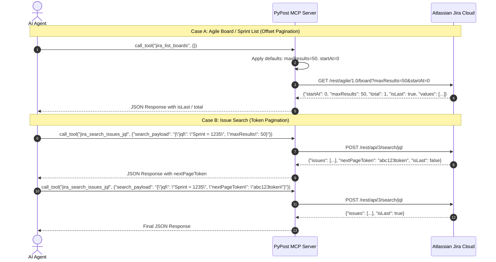

# PYPOST-1055: Architecture Design

## Architecture Overview

PyPost exposes curated MCP tools for Jira Cloud. Jira's API surface comprises two distinct REST subsystems with different pagination architectures:

1. **Jira Agile REST API (`/rest/agile/1.0/...`)**:
   - `GET /rest/agile/1.0/board` (`jira-list-boards`)
   - `GET /rest/agile/1.0/board/{boardId}/sprint` (`jira-list-board-sprints`)
   - `GET /rest/agile/1.0/sprint/{sprintId}/issue` (`jira-get-sprint-issues`)
   - **Pagination Model**: 0-based offset (`startAt`) and limit (`maxResults`).
   - **Schema & Defaults**: Declared optional with defaults `maxResults=50`, `startAt=0` (established in PYPOST-1054).

2. **Jira Platform REST API v3 (`/rest/api/3/...`)**:
   - `POST /rest/api/3/search/jql` (`jira-search-issues-jql`)
   - **Pagination Model**: Token-based cursor pagination (`nextPageToken` in JSON body `search_payload`).

## Component Interaction Flow

## Contracts and Validation

1. `tests/test_example_fixtures.py`:
   - Validates that `PAGINATED_JIRA_MCP_LIST_REQUEST_IDS` declare `maxResults` and `startAt` as optional parameters with default values `50` and `0`.
   - Validates that `jira-search-issues-jql` exposes `search_payload` accepting serialized JSON for enhanced JQL search.
2. `tests/test_pypost_1077_verification_artifacts.py`:
   - Validates AST contracts on `_SMOKE_READ_ONLY_CONTRACTS` and deterministic smoke invocation arguments `{"maxResults": 50, "startAt": 0}`.
