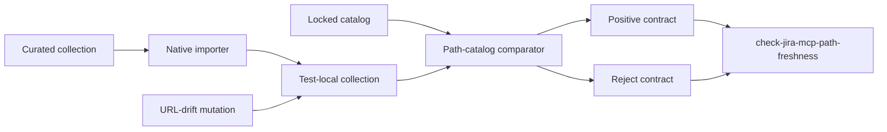

# PYPOST-1056: Clear diagnostics for Jira MCP path-catalog drift

## Research

The existing offline contract is in `tests/test_example_fixtures.py`.
`assert_jira_mcp_critical_rest_paths_match_catalog` indexes imported collection
requests by id, then checks each locked catalog entry's method, required URL
fragments, excluded fragments, and optional MCP parameter. Its missing-fragment
diagnostic already includes the request id, the locked fragment, and the
observed URL. The existing positive test proves the checked-in collection and
catalog currently align.

`examples/collections/jira_mcp_critical_rest_paths.json` intentionally locks
five critical relationships. `jira-search-issues-jql` is a suitable mutation
target: changing `/rest/api/3/search/jql` to `/rest/api/3/search` leaves the
request identifiable while removing exactly one locked fragment.

The test suite uses pytest and has a module-level 30-second timeout. Pytest's
[`monkeypatch` fixture](https://docs.pytest.org/en/stable/reference/reference.html)
automatically restores test mutations, but an in-memory copy is simpler here:
the collection is freshly imported and neither checked-in JSON file needs to be
written. Python's standard [`json` module](https://docs.python.org/3/library/json.html)
continues to load the checked-in catalog; no network, Jira credentials, or live
service is involved.

## Implementation Plan

1. Record Step 3 as `N/A — no behavioral change`: the existing comparator
   already provides the required drift diagnostic, so there is no known
   behavioral defect to reproduce with a red test before a production fix.
2. In Step 4, add the green test-only regression guard
   `test_jira_mcp_critical_rest_paths_rejects_url_drift` next to the current
   critical-path positive contract in `tests/test_example_fixtures.py`.
3. The guard will load the normal collection and catalog through the existing
   helpers, make a deep in-memory copy of the `jira-search-issues-jql` request,
   and replace it in the test collection with a URL missing
   `/rest/api/3/search/jql`.
4. Invoke the existing comparator and assert `AssertionError`. Inspect the
   captured text so the contract explicitly requires all of:
   `jira-search-issues-jql`, the missing locked fragment, and the mutated URL.
   This protects both the affected relationship and expected-versus-found
   context without freezing unrelated wording.
5. Keep the existing positive comparison unchanged, then update
   `check-jira-mcp-path-freshness` to execute both the positive and mutation
   contracts in its focused offline command. Run the focused pytest node(s) and
   Makefile target. Neither step may read credentials, call Jira, or modify the
   collection/catalog fixtures.

**Mandatory — Failing Repro (next Step 3):** `N/A — no behavioral change`.
The comparator already emits the required request id, locked fragment, and
observed URL diagnostic for the selected mutation, so no production fix is
planned and no red test can precede one. Step 4 instead adds the planned green
test-only regression guard: it mutates only the copied
`jira-search-issues-jql` URL in memory, calls
`assert_jira_mcp_critical_rest_paths_match_catalog` inside
`pytest.raises(AssertionError)`, and requires the request id,
`'/rest/api/3/search/jql'`, and the mutated `/rest/api/3/search` URL in the
message. It is deterministic and offline because it uses the native importer
plus checked-in JSON only.

**Acceptance sequence:** the green mutation-contract test is sufficient
acceptance for this no-production-change task. Step 4 adds only that test guard
(and its focused verification command coverage); production changes are a
contingency only if the new guard reveals an actual comparator diagnostic gap.
No catalog expansion or collection-surface change is permitted.

## Architecture

### Components and responsibilities

- **Curated collection:** defines actual Jira MCP requests and URLs. It remains
  a read-only input.
- **Locked catalog:** defines approved critical request/path markers. It
  remains a read-only input and is not broadened.
- **Native importer:** parses the collection into `Collection` and
  `RequestData` models. The existing helper is reused.
- **Comparator:** enforces id, method, required/excluded URL fragments, and
  MCP parameters. Its assertion interface is reused unless Step 3 proves it
  inadequate.
- **Mutation contract:** clones one imported request, introduces one path
  drift, and pins rejection diagnostics. This is added by the task.
- **Makefile focused gate:** provides one offline command for both
  path-catalog contracts. Its selected pytest nodes are expanded.

### Dependencies and interaction

The mutation contract depends only on the native importer, the checked-in
collection, the checked-in catalog, and pytest. It copies model data in memory;
there is no dependency on a Jira tenant, environment variables, credentials,
network access, or temporary fixture file. The comparator remains the sole
diagnostic authority, preventing a second hand-written validation path from
drifting away from the positive contract.

The normal contract passes original imported data to the comparator. The new
contract passes the same catalog and a collection containing one deliberately
altered request. This yields a pair of complementary interfaces: aligned data
must return normally; a missing locked URL fragment must raise
`AssertionError` with actionable text.

### Interfaces and diagnostic contract

- `_load_jira_mcp_collection()` accepts the checked-in collection path and
  returns one imported `Collection` without external I/O.
- `_load_jira_mcp_critical_rest_paths_catalog()` accepts the checked-in catalog
  path and returns `dict[str, Any]` containing `critical_paths`.
- `assert_jira_mcp_critical_rest_paths_match_catalog(collection, catalog)`
  accepts imported or test-mutated data. It returns normally for alignment and
  raises `AssertionError` for drift.
- The mutation test supplies an in-memory copied request missing one required
  fragment and must observe a message with the request id, expected fragment,
  and found URL.
- `make check-jira-mcp-path-freshness` accepts no arguments or credentials and
  runs both contracts offline.

### Selected patterns

- **Locked-contract validation:** a human-curated catalog is the single
  expected-value source, preserving the intentional five-path scope.
- **Mutation testing at the contract boundary:** alter one fixture-model value
  in memory to prove the comparator rejects real drift without duplicate
  validation logic or file mutation.
- **Diagnostic assertions by stable facts:** require identity, expected marker,
  and observed path rather than an entire assertion string, keeping messages
  actionable while allowing minor prose improvements.
- **Focused verification command:** retain the established Makefile entry point
  and make it cover both acceptance and rejection behavior.

## Q&A

**Why mutate the search JQL URL?**

It removes one unambiguous locked fragment while preserving the same critical
request id, yielding a precise expected-versus-found diagnostic.

**Why not write a temporary JSON collection?**

An in-memory model copy is smaller, avoids filesystem cleanup, and proves the
same comparator behavior through the production importer model.

**Will this contact Jira or use credentials?**

No. All inputs are checked-in fixtures and all validation occurs in pytest.

**Does this change the approved critical REST-path scope?**

No. The collection and catalog remain unchanged; only their rejection
diagnostic is protected.
