# PYPOST-1058: Durable-aligned collection import result recount after save failure

## Research

### Background & Current Behavior
During collection import in PyPost:
1. The user selects a collection file (`.json`).
2. `CollectionImportParseWorker` parses candidates off-thread on a `QThread` (PYPOST-1005).
3. On the GUI thread, `CollectionImportActions._finish_import` identifies conflicts with existing collections (`find_collection_conflicts`) and prompts the user for decisions (Overwrite, Skip, Keep Both).
4. `plan_collection_import` builds a `CollectionImportPlanResult` containing:
   - `collections`: The target list of all collections.
   - `persisted`: The subset of collections that must be written to disk (`StorageManager.save_collection`).
   - `added`: List of names of newly added collections.
   - `updated`: List of names of overwritten collections.
   - `skipped`: List of names of skipped collections.
   - `renamed`: List of `(original_name, new_name)` tuples for Keep Both or duplicate copies.
   - `request_count`: Total count of imported requests across all planned additions, updates, and copies.
   - `parse_errors`: File-level and entry-level parse warnings/errors.
5. `apply_imported_collections` swaps `collections` into `RequestManager` and loops over `persisted` to call `save_collection(col)`:
   - Under PYPOST-1004 (Approach C), if any `save_collection` call encounters an `OSError`, it catches the exception, logs `collection_import_save_failed`, records a user-facing failure message, and after the persist loop finishes, invokes `manager.reload_collections()`.
   - `reload_collections()` restores the in-memory collection list from disk, ensuring that the in-memory state and the sidebar tree match durable storage.
6. `CollectionImportActions` appends `save_errors` to `result.parse_errors` and presents the summary dialog via `show_collection_import_result(self._parent, format_collection_import_result(result), success=success)`.

### Problem
Under the current implementation, `format_collection_import_result(result)` formats the **initial plan counts** rather than the durable outcome:
- If an added collection fails to save to disk, `result.added` still contains its name (showing `Collections added: 1`) and `result.request_count` includes its requests, even though after `reload_collections()`, the collection does not exist in the app.
- If an updated collection fails to save to disk, `result.updated` still contains its name (showing `Collections updated: 1`) and `result.request_count` includes its incoming requests, even though after `reload_collections()`, the collection reverted to its pre-import state.
- If a renamed copy fails to save to disk, `result.renamed` still lists the copy in both count and the `"Original" -> "Copy"` mapping, even though the copy was not saved.

This creates a contradictory UI state where the dialog reports successful additions/updates that are absent from the sidebar.

### Required Behavior
When save failures occur:
- `apply_imported_collections` must identify which collections failed to save (`failed_ids: set[str]`).
- A pure function `recount_collection_import_plan(plan, failed_ids)` in `pypost/core/collection_import.py` adjusts `added`, `updated`, `renamed`, and `request_count` so that:
  - Any failed collection in `added` is removed from `added`.
  - Any failed collection in `updated` is removed from `updated`.
  - Any failed collection in `renamed` is removed from `renamed`.
  - `request_count` only sums the requests of collections in `persisted` that actually succeeded (`col.id not in failed_ids`).
  - `skipped` is preserved unchanged.
- `CollectionImportActions._finish_import` applies the recount before logging and presenting the summary dialog.
- The dialog status is `success=False` whenever save failures occur, and save errors remain clearly listed in the error section.
- On happy path (zero save failures), recount is a no-op and preserves identical behavior and zero-overhead performance.

---

## Implementation Plan

### Step 3: Failing Repro Plan (Mandatory)
Write automated red tests *before* production code changes to prove the defect and guard against regression:
1. **Apply Result & Failed Tracking Unit Test (`tests/test_collection_import_apply.py`):**
   - Assert that `apply_imported_collections` returns a structured result containing both the error messages and the set of `failed_ids` when `save_collection` raises `OSError`.
2. **Pure Recount Unit Tests (`tests/test_collection_import.py`):**
   - Test `recount_collection_import_plan` with partial addition failure: planned 2 added (5 requests total) -> 1 fails -> recounted has 1 added, 2 requests, 0 updated, 0 renamed.
   - Test `recount_collection_import_plan` with overwrite failure: planned 1 updated (3 requests) -> fails -> recounted has 0 updated, 0 requests.
   - Test `recount_collection_import_plan` with renamed copy failure: planned 1 renamed -> fails -> recounted has 0 renamed, empty rename list, 0 requests.
   - Test `recount_collection_import_plan` with total failure: all writes fail -> all counts become 0.
   - Test `recount_collection_import_plan` with zero failures (happy path) -> counts identical to plan.
3. **UI Integration Failing Repro Test (`tests/test_collections_import_ui.py`):**
   - Simulate an import of 2 collections where 1 save fails with `OSError("disk full")`.
   - Assert that `show_collection_import_result` is called with `success=False` and a message text containing `"Collections added: 1"` (instead of `"Collections added: 2"`) and excluding the failed collection's requests from the request count.
   - This test will fail on current code because the summary currently prints `"Collections added: 2"`.

### Step 4: Development Iterations
- **Iteration 1: Return failed collection IDs from `apply_imported_collections`**
  - Define `CollectionImportApplyResult` in `pypost/core/collection_import_apply.py` with `failures: list[str]` and `failed_ids: set[str]`.
  - Update `apply_imported_collections` to collect `failed_ids.add(col.id)` during exception handling and return `CollectionImportApplyResult`.
- **Iteration 2: Implement pure recount logic in `pypost/core/collection_import.py`**
  - Implement `recount_collection_import_plan(plan: CollectionImportPlanResult, failed_ids: set[str]) -> CollectionImportPlanResult`.
  - Filter `added`, `updated`, and `renamed` based on the failed collections in `plan.persisted`.
  - Recalculate `request_count = sum(len(col.requests) for col in plan.persisted if col.id not in failed_ids)`.
- **Iteration 3: Integrate recount into `CollectionImportActions`**
  - In `pypost/ui/presenters/collection_import_actions.py`, call `recount_collection_import_plan(result, apply_result.failed_ids)` when `apply_result.failed_ids` is non-empty.
  - Extend `result.parse_errors` with `apply_result.failures`.
  - Pass the recounted `result` to logging and `show_collection_import_result`.
- **Iteration 4: Test Suite Validation & Verification**
  - Run `pytest tests/test_collection_import.py tests/test_collection_import_apply.py tests/test_collections_import_ui.py`.
  - Run full quality checks (`make test` / `make analyze`).

---

## Architecture

### Component & Data Flow Diagram

```mermaid
flowchart TD
    subgraph UI_Layer ["UI Layer (Qt)"]
        CIA["CollectionImportActions\n(pypost/ui/presenters/collection_import_actions.py)"]
        CID["show_collection_import_result\n(pypost/ui/collection_item_dialogs.py)"]
    end

    subgraph Core_Logic ["Core Pure Logic (Qt-free)"]
        CIP["plan_collection_import\n(pypost/core/collection_import.py)"]
        CIR["recount_collection_import_plan\n(pypost/core/collection_import.py)"]
        FCR["format_collection_import_result\n(pypost/core/collection_import.py)"]
        Models["CollectionImportPlanResult\nCollectionImportApplyResult"]
    end

    subgraph Apply_Storage ["Persistence & Application State"]
        AIC["apply_imported_collections\n(pypost/core/collection_import_apply.py)"]
        RM["RequestManager\n(pypost/core/request_manager.py)"]
        SM["StorageManager\n(pypost/storage/storage_manager.py)"]
    end

    CIA -->|"1. Parse & resolve conflicts"| CIP
    CIP -->|"2. Return planned result"| CIA
    CIA -->|"3. Apply and persist"| AIC
    AIC -->|"4a. Swap in memory"| RM
    AIC -->|"4b. save_collection(col)"| SM
    SM -.->|"4c. OSError (save failure)"| AIC
    AIC -->|"4d. reload_collections() on failure"| RM
    AIC -->|"5. Return apply result (failures, failed_ids)"| CIA
    CIA -->|"6. Recount if failed_ids present"| CIR
    CIR -->|"7. Return durable-aligned plan result"| CIA
    CIA -->|"8. Format summary string"| FCR
    CIA -->|"9. Display dialog (success=False, durable counts)"| CID
```



### Module Responsibilities

| Module | Responsibility | Changes in PYPOST-1058 |
| --- | --- | --- |
| `pypost.core.collection_import` | Pure parsing, conflict analysis, planning, and summary formatting. | Add `recount_collection_import_plan` pure function. |
| `pypost.core.collection_import_apply` | Applying imported collections to `RequestManager` and saving changed subset to `StorageManager`. Reconciling memory on failure. | Introduce `CollectionImportApplyResult` dataclass; populate and return `failed_ids`. |
| `pypost.ui.presenters.collection_import_actions` | High-level import flow sequencing across GUI dialogs, async worker, and core logic. | Recount plan result when `apply_result.failed_ids` is non-empty before logging and formatting dialog. |
| `pypost.ui.collection_item_dialogs` | Result dialog presentation. | Unchanged — receives the durable-aligned summary string and `success` boolean. |

### Interfaces & Data Structures

```python
@dataclass(frozen=True)
class CollectionImportApplyResult:
    """Outcome of applying and saving imported collections."""
    failures: list[str]
    failed_ids: set[str] = field(default_factory=set)


def recount_collection_import_plan(
    plan: CollectionImportPlanResult,
    failed_ids: set[str],
) -> CollectionImportPlanResult:
    """Recount import plan counts to reflect only collections persisted to disk.

    Args:
        plan: The initial planned import result.
        failed_ids: Collection IDs that encountered OSError during save_collection.

    Returns:
        A new CollectionImportPlanResult with added, updated, renamed, and
        request_count adjusted to exclude failed collections.
    """
```

### Architectural Patterns & Design Decisions
1. **Pure Functional Core:**
   - `recount_collection_import_plan` is a pure function with no side effects and no I/O dependencies. It operates exclusively on immutable dataclasses and identifiers, making it easy to unit-test exhaustively across all combination matrices.
2. **Single Responsibility Principle (SRP):**
   - `apply_imported_collections` handles state swapping, disk persistence, and reconciliation. It does not know or care about UI formatting. It simply reports which collection IDs failed.
   - `recount_collection_import_plan` handles mathematical recounting of plan metrics based on durable outcome.
   - `CollectionImportActions` coordinates the steps and presents the outcome.
3. **Immutability & Safety:**
   - Dataclasses remain frozen where possible. Recount returns a new `CollectionImportPlanResult` rather than mutating existing objects in place.
4. **Zero Performance Overhead on Happy Path:**
   - When all saves succeed (`failed_ids` is empty), `recount_collection_import_plan` immediately returns `plan` without looping or allocations.

---

## Q&A

**Q: Why track `failed_ids` (collection IDs) rather than collection names?**
**A:** Collection IDs are unique UUIDs representing specific collection instances in `persisted`. Matching by `col.id` eliminates any possibility of ambiguity if duplicate names or renames occur. Once the failed `Collection` objects in `plan.persisted` are identified by ID, their associated names and rename pairs are cleanly filtered out.

**Q: How is `request_count` recalculated accurately?**
**A:** In `plan_collection_import`, every added, updated, or renamed collection placed into `persisted` holds the exact set of imported requests for that collection (`col.requests`). Unchanged or skipped collections are never added to `persisted`. Therefore, summing `len(col.requests)` for all `col in persisted if col.id not in failed_ids` precisely equals the total durable imported requests.

**Q: What happens if all collection saves fail (total failure)?**
**A:** `failed_ids` will match all items in `persisted`. `recount_collection_import_plan` will output `added = []`, `updated = []`, `renamed = []`, and `request_count = 0`. The dialog will show 0 for Added, Updated, Renamed, and Requests Imported, while listing all save error messages and setting `success=False`.

**Q: Does this affect skipped collections?**
**A:** No. Skipped collections were never attempted to be written (`persisted` does not contain them). They remain accurately counted under `skipped` in the result summary.

**Q: Does this change logging?**
**A:** `collection_import_completed` INFO log in `CollectionImportActions` will now log the durable outcome counts rather than the initial attempt counts, aligning logs with the actual state of the application after import.
