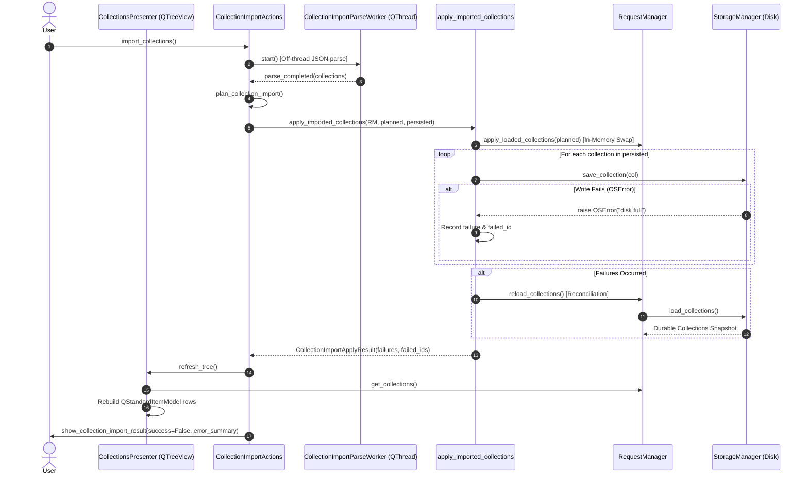
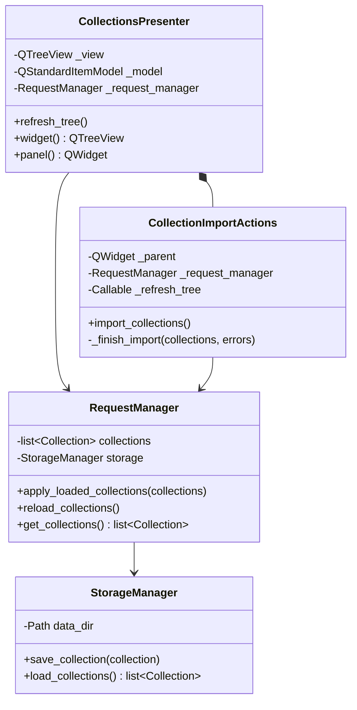

# PYPOST-1059: UI regression asserting collections tree matches durable storage after import save failure

## Research

### Current Architecture & Flow

In the PyPost application, collection management and import are structured across the presentation, application/core, and storage layers:

1. **Presenter & View Layer**:
   - `CollectionsPresenter` (`pypost/ui/presenters/collections_presenter.py`) owns the sidebar tree `_view` (`QTreeView`), `_model` (`QStandardItemModel`), and `_panel` (`QWidget` containing tree and action toolbar).
   - `CollectionImportActions` (`pypost/ui/presenters/collection_import_actions.py`) coordinates the import lifecycle:
     - `import_collections()`: Prompts the user for a file via `prompt_import_collection_file()`.
     - Runs parse off-thread via `CollectionImportParseWorker` (`QThread`).
     - On parse completion (`_on_parse_completed`), prompts user for conflict decisions if any (`_resolve_conflicts`).
     - Plans import operations via `plan_collection_import()`.
     - Calls `apply_imported_collections(self._request_manager, result.collections, result.persisted)`.
     - Rebuilds UI state via `self._refresh_tree()`, `self._restore_tree_state()`, and `self._emit_collections_changed()`.
     - Displays completion dialog via `show_collection_import_result(...)`.

2. **Core Apply & Reconcile Layer**:
   - `apply_imported_collections` (`pypost/core/collection_import_apply.py`) implements Approach C (introduced in PYPOST-1004):
     - First, swaps in-memory collection state: `manager.apply_loaded_collections(collections)`.
     - Persists each changed collection: `manager.storage.save_collection(col)`.
     - On `OSError` (e.g. disk full, permission denied), captures the failure, logs `collection_import_save_failed`, and continues attempting subsequent writes.
     - **Reconciliation**: If any writes failed (`failures` non-empty), executes `manager.reload_collections()`, reloading memory directly from `manager.storage.load_collections()`.
     - Returns `CollectionImportApplyResult(failures=..., failed_ids=...)`.

3. **Tree Model Synchronization**:
   - `CollectionsPresenter.refresh_tree()` reads `manager.get_collections()`.
   - It clears `_model` (or performs incremental updates) and appends top-level `QStandardItem` nodes for each collection (`item.text() = col.name`, `item.data(Qt.UserRole) = col.id`) and child `QStandardItem` nodes for each request (`item.text() = f"{req.method} {req.name}"`).
   - Because `_refresh_tree()` is called after `apply_imported_collections()` reconciles memory with durable storage, the sidebar tree should theoretically display exactly what was persisted.

### Gap Analysis in Current Test Suite

- **Unit vs UI Assertion Gap**:
  - `tests/test_collection_import_apply.py` (unit tests) verifies that `manager.get_collections()` matches durable storage after mid-write failures.
  - `tests/test_collections_import_ui.py` (UI tests):
    - `test_save_failure_is_surfaced_as_an_unsuccessful_result` only asserts `kwargs["success"] is False` and `"disk full" in _args[1]`. It does **not** assert `manager.get_collections()` or `presenter.widget.model().rowCount()` against durable storage.
    - `test_partial_save_failure_recounts_summary_to_durable_membership` asserts dialog text counts, but its mock storage setup does not simulate durable sibling persistence and does not assert that the tree widget reflects durable storage.
    - `TestImportCollectionsEndToEnd` only tests the happy path with real storage.
- **Source Tech Debt**:
  - Identified in `ai-tasks/PYPOST-1004/60-tech-debt.md` item #3: *"UI regression asserting that after a save failure the collections tree / get_collections() matches durable storage (complement the apply-layer mid-write unit test)"*.

---

## Implementation Plan

### 1. Failing Repro Plan (Step 3)

**Mandatory — Failing Repro (Step 3):**
Create automated red/regression tests in `tests/test_collections_import_ui.py` that specifically assert the UI sidebar tree widget and `manager.get_collections()` match durable storage after save failures:

1. **Test 1: Presenter-Level Partial Save Failure**:
   - **Target**: `TestImportCollections.test_partial_save_failure_tree_and_manager_match_durable_storage`
   - **Setup**: Initial durable store contains `[C0("Existing")]`. Import payload contains `[C1("Saved"), C2("Failed")]`.
   - **Failure Simulation**: `manager.storage.save_collection` writes `C1` to durable store, but raises `OSError("disk full")` on `C2`. `manager.storage.load_collections` returns the durable store snapshot.
   - **Assertions**:
     - `show_collection_import_result` called with `success=False`.
     - `[col.name for col in manager.get_collections()] == ["Existing", "Saved"]`.
     - `presenter.widget.model().rowCount() == 2`.
     - `[presenter.widget.model().item(r).text() for r in range(2)] == ["Existing", "Saved"]`.
     - Neither `manager.get_collections()` nor `presenter.widget.model()` contains `C2 ("Failed")`.

2. **Test 2: Presenter-Level Total Save Failure**:
   - **Target**: `TestImportCollections.test_total_save_failure_retains_only_preexisting_durable_collections`
   - **Setup**: Initial durable store contains `[C0("Existing")]`. Import payload contains `[C1("Failed")]`.
   - **Failure Simulation**: `manager.storage.save_collection` raises `OSError("permission denied")`. `manager.storage.load_collections` returns `[C0]`.
   - **Assertions**:
     - `show_collection_import_result` called with `success=False`.
     - `[col.name for col in manager.get_collections()] == ["Existing"]`.
     - `presenter.widget.model().rowCount() == 1`.
     - `presenter.widget.model().item(0).text() == "Existing"`.

3. **Test 3: End-to-End Real Storage Save Failure**:
   - **Target**: `TestImportCollectionsEndToEnd.test_real_storage_save_failure_reconciles_tree_and_disk`
   - **Setup**: Real `StorageManager` in `tmp_path`, real `RequestManager`, real `CollectionsPresenter`. Pre-populate `Existing API`.
   - **Import**: Multi-collection JSON file with `New API 1` and `New API 2`.
   - **Failure Simulation**: Monkeypatch `storage.save_collection` to raise `OSError` on `New API 2`.
   - **Assertions**:
     - On-disk durable storage `StorageManager(tmp_path).load_collections()` matches `manager.get_collections()`.
     - `presenter.widget.model()` row count and collection item labels match on-disk collections exactly.

### 2. Development Execution (Step 4)

- Implement the UI regression test suite in `tests/test_collections_import_ui.py`.
- Verify tests cleanly pass with `.venv/bin/pytest tests/test_collections_import_ui.py`.
- Run full quality checks (`pytest`, static analysis) to ensure zero regressions.

---

## Architecture

### Component Hierarchy & Interaction



### Component Structure & Responsibilities



### Tree Widget Model Structure

The sidebar tree widget (`QTreeView`) backed by `QStandardItemModel` maps directly to durable storage collections:

```
QStandardItemModel (presenter.widget.model())
 ├── QStandardItem (text: col.name, data[Qt.UserRole]: col.id)
 │    ├── QStandardItem (text: "GET Ping", data[Qt.UserRole]: RequestData)
 │    └── QStandardItem (text: "POST Create", data[Qt.UserRole]: RequestData)
 └── QStandardItem (text: sibling_col.name, data[Qt.UserRole]: sibling_col.id)
```

When `refresh_tree()` runs:
1. `_model.clear()` removes all existing rows.
2. For each collection in `_request_manager.get_collections()`, a top-level `QStandardItem` is appended.
3. For each request in `col.requests`, a child `QStandardItem` is appended under the collection item.
4. Hence, verifying `presenter.widget.model().rowCount()` and iterating child rows guarantees that the rendered UI structure matches durable storage.

---

## Q&A

- **Q: Why are dedicated UI assertions necessary when core unit tests already exist?**
  A: Core unit tests in `test_collection_import_apply.py` test `apply_imported_collections` in isolation. However, user trust relies on what is visually rendered in the sidebar tree. UI regression tests verify the full sequence: parse worker completion, conflict planning, apply execution, `reload_collections()` invocation, `presenter.refresh_tree()` model re-population, and result dialog presentation.

- **Q: How should durable storage be simulated in UI unit tests vs end-to-end tests?**
  A: In presenter-level unit tests (`TestImportCollections`), `FakeRequestManager.storage.save_collection` is mocked to mutate a durable list for successful writes and raise `OSError` for failed writes, while `load_collections` returns that durable list. In end-to-end tests (`TestImportCollectionsEndToEnd`), real `StorageManager` files on disk are written and verified alongside the `QTreeView` model.

- **Q: Does this change modify production application code?**
  A: The production reconciliation logic in `apply_imported_collections` and `CollectionsPresenter.refresh_tree` was established in PYPOST-1004 and PYPOST-1058. This task strengthens regression test coverage to assert UI sidebar consistency end-to-end. If any edge cases or mock synchronization discrepancies are uncovered during test development, targeted fixes will be applied.
