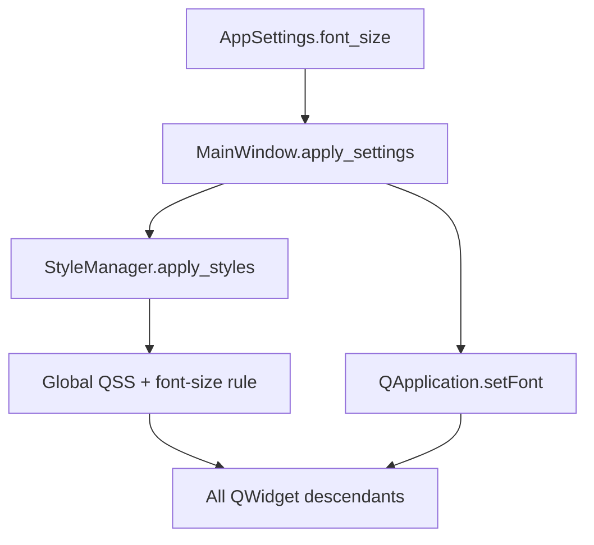

# PYPOST-106: Font propagation architecture

## Research

### Current state (before)

`MainWindow.apply_settings` called `style_manager.apply_styles(app)`, then `app.setFont`, then
explicit `setFont` on collections widget, env selector, tabs, buttons, labels, tab bar, and menu
bar. Any new top-level control required editing this list.

### Qt behaviour

- `QApplication.setStyleSheet()` triggers re-polish and can reset the application font (PYPOST-404).
- Global QSS on `QWidget { font-size: Npt; }` propagates to most standard widgets.
- `QApplication.setFont` after stylesheet application sets the application default for inheritance.

## Implementation Plan

1. Extend `StyleManager.apply_styles(app_or_widget, font_size=None)` to append a global
   `QWidget { font-size: Npt; }` rule when `font_size` is provided.
2. Update `MainWindow.apply_settings` to pass `settings.font_size` and remove the widget loop.
3. Keep call order: `apply_styles` → read `app.font()` → `setPointSize` → `app.setFont`.
4. Add tests for StyleManager QSS injection and `apply_styles` call arguments.

## Architecture

## Design decisions

| Decision | Rationale |
| --- | --- |
| QSS on `QWidget` not `*` | Targets standard widgets without over-styling pseudo-elements |
| Optional `font_size` parameter | Backward compatible if `apply_styles` called without size |
| Keep `app.setFont` | PYPOST-404 fix; complements QSS for default font metrics |
| No per-widget loop | Removes DRY violation from PYPOST-12 debt |

## Risks

- **Widgets with inline `font-size` in QSS** (e.g. validation labels): unchanged; local rules win.
- **Code editors**: indent/font handled separately in presenters; out of scope for this loop removal.
