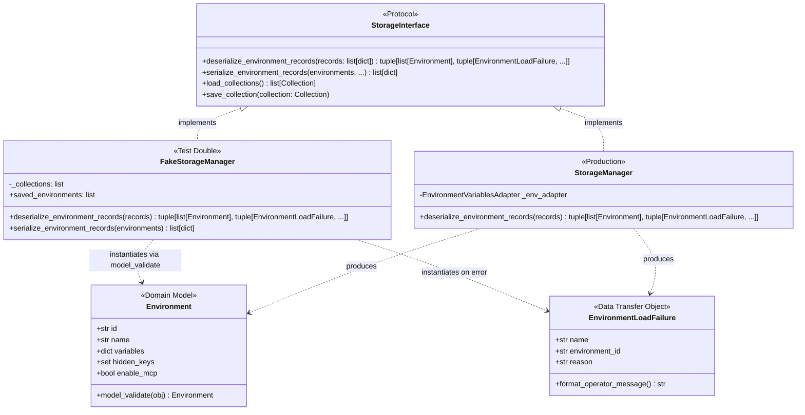
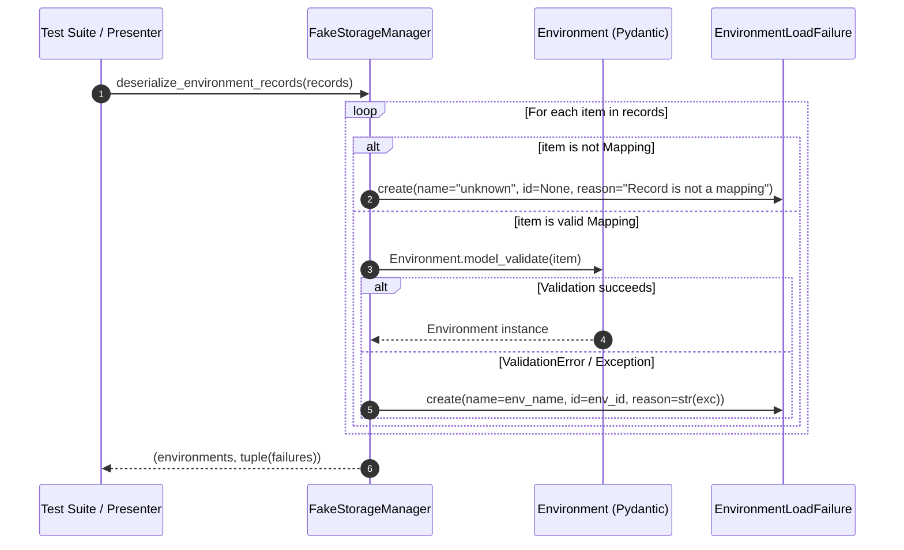

# PYPOST-1060: Plaintext FakeStorageManager.deserialize_environment_records helper

## Research

### Background & Problem Statement
In `ai-tasks/PYPOST-1000/60-tech-debt.md`, technical debt was documented regarding test doubles for environment storage. When tests exercise environment import workflows or presenter import wiring (such as `test_env_presenter.py`), they interact with storage implementations conforming to `StorageInterface`.

Currently:
1. `tests/helpers/__init__.py` defines `FakeStorageManager`, which implements `StorageInterface` for testing across multiple suites (`test_request_manager.py`, `test_collection_item_strategies.py`, `test_storage_interface.py`, `test_env_presenter.py`).
2. However, `FakeStorageManager.deserialize_environment_records` is a no-op stub:
   ```python
   def deserialize_environment_records(self, records):
       return [], ()
   ```
3. Because of this empty stub, `tests/test_env_presenter.py` had to construct a local subclass:
   ```python
   class ImportFakeStorage(FakeStorageManager):
       def deserialize_environment_records(self, records):
           environments = [
               Environment.model_validate(record) for record in records
           ]
           return environments, ()
   ```
4. This ad-hoc pattern creates duplicate scaffolding, increases maintenance friction across test files, and lacks robust error handling for negative test scenarios (malformed dictionaries, non-mapping records, invalid types).

### Comparison of Production vs Test Double Contracts

| Component | Location | Method Behavior |
| --- | --- | --- |
| `StorageInterface` | `pypost/core/storage_interface.py` | Declares `deserialize_environment_records(self, records: list[dict]) -> tuple[list[Environment], tuple[EnvironmentLoadFailure, ...]]` |
| `StorageManager` (Production) | `pypost/core/storage.py` | Deserializes via `EnvironmentVariablesAdapter`, handles encryption/decryption, tracks variable state, and catches `EnvironmentEncryptionError`, `ValidationError`, and generic `Exception`, returning `tuple[list[Environment], tuple[EnvironmentLoadFailure, ...]]` |
| `FakeStorageManager` (Current Test Double) | `tests/helpers/__init__.py` | Stub returning `([], ())`, forcing test suites to monkeypatch or subclass |
| `FakeStorageManager` (Proposed Test Double) | `tests/helpers/__init__.py` | In-memory plaintext deserialization using `Environment.model_validate`, capturing `ValidationError` and non-mapping payloads into `EnvironmentLoadFailure` objects, returning `tuple[list[Environment], tuple[EnvironmentLoadFailure, ...]]` |

### Key Requirements & Constraints
- **Zero Cryptography Ceremony**: `FakeStorageManager` must parse plaintext dictionary records directly into `Environment` models without requiring keyrings, master keys, or cipher configurations.
- **Fault-Isolated Batch Processing**: Consistent with production `StorageManager`, invalid records in a batch must not raise unhandled exceptions; instead, successfully parsed models are returned alongside a tuple of `EnvironmentLoadFailure` instances.
- **Backwards Compatibility**: Existing tests that pass empty records or rely on `FakeStorageManager` for collection management will continue to pass without side effects.
- **Hermetic & Fast**: In-memory execution with zero I/O or network dependencies, executing in sub-millisecond time.

---

## Implementation Plan

### Step 3: Failing Repro Test Design
Before implementing changes in `tests/helpers/__init__.py`, write an automated test suite in `tests/test_fake_storage_manager.py` that asserts the expected behavior of `FakeStorageManager.deserialize_environment_records`:

1. **Test Location**: `tests/test_fake_storage_manager.py`
2. **Test Cases to Assert (Desired Behavior)**:
   - `test_deserialize_valid_environment_records`: Given a list of valid environment dictionaries (with name, variables, hidden_keys, enable_mcp), returns `([Environment(...)], ())`.
   - `test_deserialize_empty_records`: Given `[]`, returns `([], ())`.
   - `test_deserialize_invalid_records_returns_failures`: Given malformed environment dictionaries (e.g. invalid types for fields violating `Environment` schema), returns `([], (EnvironmentLoadFailure(name=..., ...),))`.
   - `test_deserialize_mixed_valid_and_invalid_records`: Given a batch containing 1 valid record and 1 invalid record, returns 1 parsed `Environment` and 1 `EnvironmentLoadFailure`.
   - `test_deserialize_non_mapping_record_returns_failure`: Given a record that is not a dictionary/mapping (e.g. `None`, `123`, `"invalid"`), returns an `EnvironmentLoadFailure` without crashing.
   - `test_deserialize_preserves_custom_id_or_generates_default`: Validates ID preservation when provided and auto-generation when omitted.
3. **Sequencing**:
   - Step 3: Add `tests/test_fake_storage_manager.py`. Running against current `FakeStorageManager` results in RED failures because `deserialize_environment_records` returns `([], ())` for valid records.
   - Step 4: Implement plaintext deserialization in `tests/helpers/__init__.py`.
   - Step 4: Refactor `tests/test_env_presenter.py` to remove `ImportFakeStorage` and use standard `FakeStorageManager`.
   - Step 4: Verify full test suite passes GREEN.

---

## Architecture

### System Architecture Diagram



### Component Details & Interaction Scheme



### Module Responsibilities

1. **`tests.helpers.FakeStorageManager` (`tests/helpers/__init__.py`)**:
   - Provide a shared, protocol-compliant in-memory test double for `StorageInterface`.
   - Implement `deserialize_environment_records`:
     - Accept a sequence/list of dictionary records.
     - Validate and instantiate `Environment` models via `Environment.model_validate(item)`.
     - Extract `name` and `id` defensively for error reporting.
     - Capture `ValidationError` or malformed input into `EnvironmentLoadFailure` objects.
     - Return `(environments, tuple(failures))`.
2. **`pypost.models.models.Environment`**:
   - Standard domain model holding environment configuration (`id`, `name`, `variables`, `hidden_keys`, `enable_mcp`).
   - Handles Pydantic schema validation and field defaulting.
3. **`pypost.core.storage.EnvironmentLoadFailure`**:
   - Standard immutable dataclass representing an environment record failure with `name`, `environment_id`, and `reason`.
4. **`tests/test_env_presenter.py`**:
   - Refactored to eliminate the custom `ImportFakeStorage` subclass, relying entirely on `FakeStorageManager()`.
5. **`tests/test_fake_storage_manager.py`**:
   - Dedicated unit tests ensuring the fake helper adheres to contracts across happy and error paths.

### Detailed Method Design

```python
def deserialize_environment_records(
    self,
    records: Sequence[Mapping[str, Any]] | list[dict],
) -> tuple[list[Environment], tuple[EnvironmentLoadFailure, ...]]:
    """Deserialize in-memory environment JSON records in plaintext for tests (PYPOST-1060)."""
    environments: list[Environment] = []
    failures: list[EnvironmentLoadFailure] = []

    for item in records:
        if not isinstance(item, (dict, Mapping)):
            failures.append(
                EnvironmentLoadFailure(
                    name="unknown",
                    environment_id=None,
                    reason=f"Record is not a mapping: {type(item).__name__}",
                )
            )
            continue

        env_name = str(item.get("name", "unknown"))
        raw_id = item.get("id")
        environment_id = raw_id if isinstance(raw_id, str) else None

        try:
            env = Environment.model_validate(item)
            environments.append(env)
        except ValidationError as exc:
            failures.append(
                EnvironmentLoadFailure(
                    name=env_name,
                    environment_id=environment_id,
                    reason=str(exc),
                )
            )
        except Exception as exc:  # noqa: BLE001
            failures.append(
                EnvironmentLoadFailure(
                    name=env_name,
                    environment_id=environment_id,
                    reason=str(exc),
                )
            )

    return environments, tuple(failures)
```

---

## Q&A

| Question | Answer |
| --- | --- |
| **Q: Why should `FakeStorageManager` use `Environment.model_validate` instead of direct `Environment(**item)` constructor calls?** | `Environment.model_validate(item)` is the idiomatic Pydantic V2 parsing method that properly handles dict coercion, default generation (e.g. `uuid.uuid4()` for `id`), and raises structured `ValidationError` on mismatched types or malformed payloads. |
| **Q: Why return `EnvironmentLoadFailure` dataclasses on failure rather than raising exceptions?** | `StorageInterface.deserialize_environment_records` specifies fault-isolated batch deserialization returning `tuple[list[Environment], tuple[EnvironmentLoadFailure, ...]]`. Returning failures as data matches production semantics where one corrupted environment in an import payload does not block parsing valid sibling environments. |
| **Q: Will this affect existing tests in `test_request_manager.py` or `test_collection_item_strategies.py`?** | No. Existing tests only pass collections or do not invoke `deserialize_environment_records`. For empty inputs `[]`, the helper continues to return `([], ())`. |
| **Q: Does this introduce any new production runtime dependencies or modify `pypost/` production code?** | No. The change is isolated to test helper infrastructure (`tests/helpers/__init__.py`) and test suites (`tests/test_env_presenter.py`, `tests/test_fake_storage_manager.py`). |
