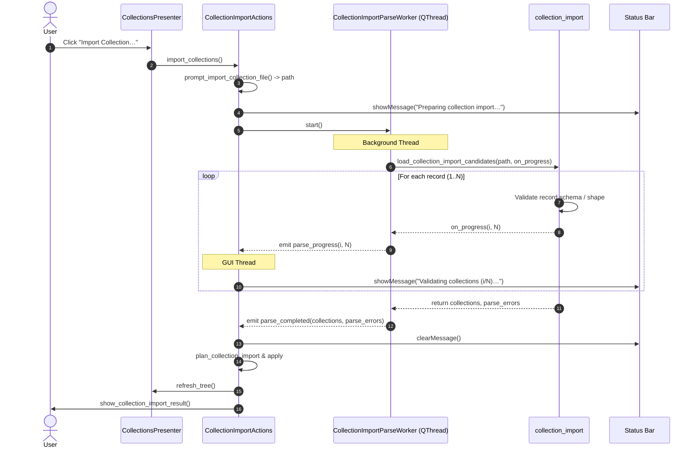

# PYPOST-1061: Optional determinate progress during collection import validation

## Research

### 1. Existing Collection Import Flow

PyPost supports importing collections from JSON files (either single collection objects or arrays of collections). The import workflow spans three layers:

1. **Pure Core Logic (`pypost.core.collection_import`)**:
   - `load_collection_import_candidates(path: Path) -> tuple[list[Collection], list[str]]`: Reads file contents via `_read_records(path)`, validates root shape, and validates each candidate record (name presence, requests type, and Pydantic model validation).
   - Currently, `load_collection_import_candidates` accepts only `path: Path` and iterates through `records` without providing feedback hooks.
   - Per-record validation failures are captured as formatted error strings in `parse_errors` rather than aborting the entire process.

2. **Async Qt Worker (`pypost.core.qt.collection_import_parse_worker`)**:
   - `CollectionImportParseWorker(QThread)`: Offloads file reading and validation from the GUI thread.
   - Takes `(path: Path, read_import_file: ReadImportFile)`.
   - Signals: `parse_completed = Signal(list, list)` and `parse_failed = Signal(object)`.
   - Currently, has no progress signal or mechanism to forward incremental progress from the reader function.

3. **Presenter & UI Orchestration (`pypost.ui.presenters.collection_import_actions`)**:
   - `CollectionImportActions(QObject)`: Manages the import sequence: user file picking -> `_start_parse()` -> conflict resolution -> apply / persistence -> tree refresh and result dialog.
   - In `_start_parse()`, connects worker signals and calls `self._set_preparing(True)` which sets the status bar message to `MSG_IMPORT_PREPARING` ("Preparing collection import…").
   - Once parse finishes, `_on_parse_completed()` clears preparing state and proceeds to conflict handling and persistence.

### 2. Backward Compatibility & Callable Signatures

Across the repository and existing test suites, custom reader callables or test stubs are frequently passed to `read_import_file` (e.g. in `test_collections_import_ui.py` and `test_collection_import_responsiveness.py`).
- Many test stubs use single-argument signatures: `def read(path): return ...`.
- The production signature will be updated to:
  `load_collection_import_candidates(path: Path, on_progress: Callable[[int, int], None] | None = None) -> tuple[list[Collection], list[str]]`.
- To prevent breaking existing test stubs or external callers that supply 1-argument `read_import_file` callables, `CollectionImportParseWorker` must inspect `read_import_file`'s signature or parameter support before invoking with `on_progress`.

### 3. UI Status Feedback

- `pypost/core/collection_messages.py` defines UI strings.
- We will add `MSG_IMPORT_VALIDATING = "Validating collections ({done}/{total})…"` and helper `format_collection_import_progress(done: int, total: int) -> str`.
- When `CollectionImportParseWorker` emits `parse_progress(done, total)`, `CollectionImportActions` updates the status bar with the formatted determinate message.

---

## Implementation Plan

### Phase 1: Core Progress Hook (`pypost.core.collection_import` & `collection_messages`)
1. Extend `load_collection_import_candidates` signature:
   ```python
   def load_collection_import_candidates(
       path: Path,
       on_progress: Callable[[int, int], None] | None = None,
   ) -> tuple[list[Collection], list[str]]:
   ```
2. In `load_collection_import_candidates`:
   - Calculate `total = len(records)`.
   - In the candidate loop over `enumerate(records, start=1)`, call `on_progress(index, total)` for each record evaluated (whether valid or invalid).
3. Add user-facing message constants in `pypost/core/collection_messages.py`:
   - `MSG_IMPORT_VALIDATING = "Validating collections ({done}/{total})…"`
   - `format_collection_import_progress(done: int, total: int) -> str`

### Phase 2: Worker Qt Signal Propagation (`pypost.core.qt.collection_import_parse_worker`)
1. Add `parse_progress = Signal(int, int)` (and alias `progress = parse_progress`) to `CollectionImportParseWorker`.
2. Implement signature inspection helper `_callable_accepts_progress(func: Callable) -> bool` using `inspect.signature` to check if `on_progress` keyword or 2+ positional arguments or `**kwargs` are accepted.
3. In `CollectionImportParseWorker.run()`:
   - Define local callback `def _emit_progress(done: int, total: int) -> None: self.parse_progress.emit(done, total)`.
   - If `_callable_accepts_progress(self._read_import_file)`: invoke `self._read_import_file(self._path, on_progress=_emit_progress)`.
   - Otherwise: invoke `self._read_import_file(self._path)`.

### Phase 3: Presenter Determinate Status Display (`pypost.ui.presenters.collection_import_actions`)
1. In `CollectionImportActions._start_parse(path: Path)`:
   - Connect `worker.parse_progress.connect(self._on_parse_progress)`.
2. Implement `_on_parse_progress(self, done: int, total: int) -> None`:
   - If `self._show_status is not None`: call `self._show_status(format_collection_import_progress(done, total))`.

### Phase 4: Verification and Automated Tests
1. Unit tests in `tests/test_collection_import.py`:
   - Test `on_progress` invoked with `(1, N)...(N, N)` for multiple valid collections.
   - Test `on_progress` invoked across mixed valid/invalid records.
   - Test `on_progress=None` maintains identical existing behavior.
2. Worker tests in `tests/test_collection_import_parse_worker.py` (or responsiveness / ui test suites):
   - Test worker emits `parse_progress` signal during execution when reader invokes callback.
   - Test worker transparently works with legacy 1-arg reader functions without raising `TypeError`.
3. UI presenter tests in `tests/test_collections_import_ui.py`:
   - Test status updates receive formatted determinate string when progress is reported.

---

## Mandatory — Failing Repro (next Step 3)

### Description
In Step 3, we will write automated red tests covering:
1. **Core Progress Callback (`tests/test_collection_import.py`)**:
   - `test_load_candidates_reports_progress_for_each_record`: Pass a mock `on_progress` callback to `load_collection_import_candidates` with a 3-record import file (2 valid, 1 invalid).
   - Assert `on_progress.call_args_list == [call(1, 3), call(2, 3), call(3, 3)]`.
   - Assert all valid collections and parse errors are still returned as expected.
2. **Worker Progress Signal Emission (`tests/test_collection_import_responsiveness.py` or new test)**:
   - Test `CollectionImportParseWorker` emits `parse_progress` signals with `(1, 2)` and `(2, 2)` during background execution.
   - Test `CollectionImportParseWorker` runs successfully when passed a legacy 1-arg `read_import_file` callable without emitting errors.
3. **Presenter Status Listener (`tests/test_collections_import_ui.py`)**:
   - Test `CollectionImportActions` forwards worker progress signals to `_show_status` with `Validating collections (1/2)…` and `Validating collections (2/2)…`.

### Execution Sequencing
- **Step 3**: Write tests in `tests/test_collection_import.py` and `tests/test_collections_import_ui.py` asserting `on_progress` and signal emission. Verify they fail (RED) because `load_collection_import_candidates` and worker do not yet accept/emit progress.
- **Step 4**: Implement the changes in `collection_import.py`, `collection_messages.py`, `collection_import_parse_worker.py`, and `collection_import_actions.py` until all tests pass (GREEN).

---

## Architecture

### System Module Diagram

```mermaid
flowchart TD
    subgraph UI ["pypost.ui.presenters"]
        Actions["CollectionImportActions"]
        Presenter["CollectionsPresenter"]
        StatusBar["QMainWindow.statusBar"]
    end

    subgraph Worker ["pypost.core.qt"]
        ParseWorker["CollectionImportParseWorker (QThread)"]
        Signals["Signal: parse_progress(int, int)<br/>Signal: parse_completed(list, list)<br/>Signal: parse_failed(object)"]
    end

    subgraph Core ["pypost.core"]
        ImportCore["collection_import.load_collection_import_candidates"]
        Messages["collection_messages.format_collection_import_progress"]
    end

    Presenter --> Actions
    Actions -->|Starts background parse| ParseWorker
    ParseWorker -->|Executes off-thread| ImportCore
    ImportCore -->|Calls on_progress(done, total)| ParseWorker
    ParseWorker -->|Emits parse_progress(done, total)| Signals
    Signals -->|Delivered to GUI thread| Actions
    Actions -->|Formats message via| Messages
    Actions -->|Updates| StatusBar
```

### Module Responsibilities

| Module | Component | Responsibility |
| --- | --- | --- |
| `pypost.core.collection_import` | `load_collection_import_candidates` | Pure business logic: reads file, iterates records, validates schema, invokes `on_progress(done, total)` after each candidate evaluation. |
| `pypost.core.collection_messages` | `format_collection_import_progress` | Formats determinate status string `Validating collections ({done}/{total})…`. |
| `pypost.core.qt.collection_import_parse_worker` | `CollectionImportParseWorker` | Background `QThread` executing reader off-thread. Introspects reader signature, passes progress callback to core, and emits `parse_progress(done, total)` Qt signal. |
| `pypost.ui.presenters.collection_import_actions` | `CollectionImportActions` | Presenter action handler. Connects worker `parse_progress` signal to `_on_parse_progress` and calls `_show_status`. |

### Interaction Sequence Diagram



### Architectural Patterns

1. **Observer Pattern / Callback Injection**:
   - `load_collection_import_candidates` uses an optional `on_progress: Callable[[int, int], None] | None = None` callback. The pure core module has no dependency on Qt or GUI classes.
2. **Signal-Slot Bridge**:
   - `CollectionImportParseWorker` bridges Python callback invocations in worker threads to Qt's queued event loop via `parse_progress = Signal(int, int)`.
3. **Duck Typing / Signature Introspection**:
   - `CollectionImportParseWorker` inspects `read_import_file` to support both 1-argument and 2-argument reader functions, guaranteeing backward compatibility with test fakes.

### Interface & API Definitions

```python
# pypost/core/collection_import.py
def load_collection_import_candidates(
    path: Path,
    on_progress: Callable[[int, int], None] | None = None,
) -> tuple[list[Collection], list[str]]: ...

# pypost/core/collection_messages.py
MSG_IMPORT_VALIDATING: str = "Validating collections ({done}/{total})…"

def format_collection_import_progress(done: int, total: int) -> str: ...

# pypost/core/qt/collection_import_parse_worker.py
ReadImportFile = Callable[..., tuple[list[Collection], list[str]]]

class CollectionImportParseWorker(QThread):
    parse_progress = Signal(int, int)  # (done, total)
    progress = parse_progress  # alias
    parse_completed = Signal(list, list)  # (collections, parse_errors)
    parse_failed = Signal(object)  # Exception
    ...

# pypost/ui/presenters/collection_import_actions.py
class CollectionImportActions(QObject):
    def _on_parse_progress(self, done: int, total: int) -> None: ...
```

---

## Q&A

**Q: How does `CollectionImportParseWorker` handle legacy or test reader callables that only accept `path`?**
**A:** Using `inspect.signature`, the worker inspects `self._read_import_file`. If it does not accept an `on_progress` keyword or 2+ positional arguments or `**kwargs`, the worker invokes `self._read_import_file(self._path)` without arguments, ensuring backward compatibility.

**Q: When is `on_progress` invoked?**
**A:** `on_progress(index, total)` is called once per record immediately after the record is validated (whether validation succeeded or failed). If the file contains 0 records or fails root JSON parsing before records are extracted, `on_progress` is not called and the file-level error is raised directly.

**Q: Does `on_progress` block the GUI thread?**
**A:** No. `load_collection_import_candidates` executes on the background `QThread`. When `on_progress` emits `parse_progress`, Qt's signal-slot mechanism queues the message safely to the GUI event loop where `_on_parse_progress` updates the status bar.

**Q: What happens if an error occurs during parsing?**
**A:** Individual record errors are appended to `parse_errors` and progress continues to increment until all candidate records are evaluated. File-level errors (`CollectionImportFileError`) abort the loop and are caught by `CollectionImportParseWorker` which emits `parse_failed`.
