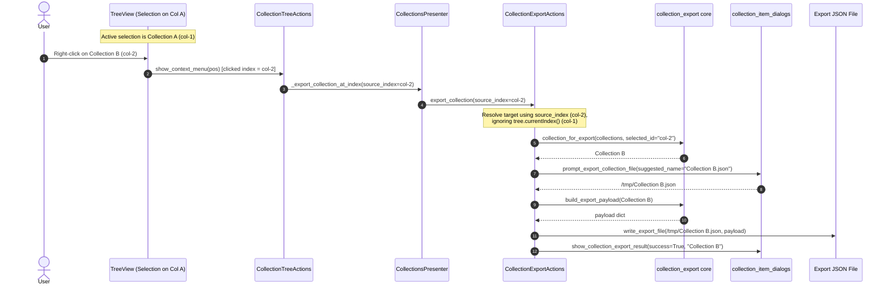

# PYPOST-1064: Test source_index overrides distant currentIndex on export

## Research

### Existing Collection Export Architecture

1. **Presenter & UI Orchestration ([`CollectionExportActions`](file:///home/src/pypost/ui/presenters/collection_export_actions.py#L46-L150)):**
   - Orchestrates single-collection and all-collections export.
   - Accepts an optional `source_index: QModelIndex | None` parameter in [`export_collection`](file:///home/src/pypost/ui/presenters/collection_export_actions.py#L64-L113).
   - Resolves target collection ID via helper [`_selected_collection_id(model, index)`](file:///home/src/pypost/ui/presenters/collection_export_actions.py#L152-L171):
     - If `source_index` is provided, it uses `source_index`; otherwise falls back to `self._tree.currentIndex()`.
     - Handles both collection items (retrieves collection ID string directly from `Qt.ItemDataRole.UserRole`) and request items (traverses to parent item to obtain the parent collection ID).
   - Resolves the [`Collection`](file:///home/src/pypost/models/models.py#L23-L27) model via [`collection_for_export`](file:///home/src/pypost/core/collection_export.py#L32-L41).
   - Generates suggested filename via [`suggested_export_filename`](file:///home/src/pypost/core/collection_export.py#L44-L52), prompts user file path via [`prompt_export_collection_file`](file:///home/src/pypost/ui/collection_item_dialogs.py#L76-L86), serializes via [`build_export_payload`](file:///home/src/pypost/core/collection_export.py#L55-L77), and writes via [`write_export_file`](file:///home/src/pypost/core/collection_export.py#L90-L98).

2. **Presenter Coordinator ([`CollectionsPresenter`](file:///home/src/pypost/ui/presenters/collections_presenter.py#L33-L367)):**
   - Owns the tree view ([`QTreeView`](file:///home/src/pypost/ui/presenters/collections_presenter.py#L77)) and model ([`QStandardItemModel`](file:///home/src/pypost/ui/presenters/collections_presenter.py#L81)).
   - Exposes [`export_collection()`](file:///home/src/pypost/ui/presenters/collections_presenter.py#L280-L282) (no-arg, for toolbar/button) delegating to `self._export_actions.export_collection()`.
   - Exposes [`_export_collection_at_index(source_index: QModelIndex)`](file:///home/src/pypost/ui/presenters/collections_presenter.py#L288-L290) delegating to `self._export_actions.export_collection(source_index=source_index)`.

3. **Tree Context Menu Actions ([`CollectionTreeActions`](file:///home/src/pypost/ui/presenters/collection_tree_actions.py#L29-L379)):**
   - Handles `customContextMenuRequested` on tree view nodes.
   - When the user selects "Export Collection…", it dispatches the clicked `QModelIndex` to `export_collection(index)` ([L106-L117](file:///home/src/pypost/ui/presenters/collection_tree_actions.py#L106-L117)).

4. **Existing Test Coverage & Coverage Gap Analysis:**
   - [`tests/test_collection_export_ui.py`](file:///home/src/tests/test_collection_export_ui.py): Contains tests for single collection export when that collection is selected in the tree, export-all collections, cancellation, and error handling.
   - [`tests/test_collection_tree_actions.py`](file:///home/src/tests/test_collection_tree_actions.py): Contains unit tests verifying that the context menu offers the export action and forwards the clicked `QModelIndex` to the callback mock.
   - **Soft Gap Identified in PYPOST-1013 Step 7 ([`ai-tasks/PYPOST-1013/60-tech-debt.md`](file:///home/src/ai-tasks/PYPOST-1013/60-tech-debt.md#L57-L59)):** There are no end-to-end unit/integration tests verifying that when `source_index` points to Collection B while the active tree `currentIndex()` is set to Collection A (a distant selection), the export operation strictly writes Collection B and ignores Collection A.

---

## Implementation Plan

### Implementation Steps

1. **Step 3: Red Repro Test:**
   - Add automated test methods to [`tests/test_collection_export_ui.py`](file:///home/src/tests/test_collection_export_ui.py) in a new or extended test class (e.g., `TestExportCollectionSourcePrecedence`).
   - Define test scenarios asserting that `source_index` strictly overrides distant `currentIndex` for both collection and request node targets.

2. **Step 4: Development & Test Realization:**
   - Implement test suite extensions exercising:
     - Scenario A: Tree with Collection A and Collection B; `currentIndex` set to Collection A; `export_collection(source_index=index_of_B)` invoked. Assert exported file contains Collection B, suggested filename is Collection B's name, and Collection A is untouched.
     - Scenario B: Tree with Collection A and Collection B (with request RB); `currentIndex` set to Collection A; `export_collection(source_index=index_of_RB)` invoked. Assert exported file contains Collection B.
     - Scenario C: Tree with Collection A and Collection B; `currentIndex` set to Collection A; `export_collection(source_index=None)` invoked. Assert fallback correctly targets Collection A.
     - Scenario D: Presenter-level integration test verifying `_export_collection_at_index` correctly overrides active selection.
   - Ensure all tests use standard fixtures from [`tests.helpers.collections_tree`](file:///home/src/tests/helpers/collections_tree.py) (`make_collection`, `make_request`, `FakeRequestManager`, `FakeStateManager`, `FakeMetrics`) and mock dialogs/filesystem safely.
   - Ensure `pytestmark = pytest.mark.timeout(60)` is preserved or declared per test standards.

3. **Step 5: Code Cleanup:**
   - Format and lint tests with `ruff` / `black` and run type checking with `mypy`.

4. **Step 6 & 7: Observability & Technical Debt Analysis:**
   - Verify log event consistency and document debt analysis.

5. **Step 8: Developer Documentation:**
   - Update developer documentation if test architecture patterns are extended.

---

### Mandatory — Failing Repro (next Step 3)

- **What it asserts (desired behavior):**
  1. When tree selection (`currentIndex`) is on Collection A, and `export_collection` is called with `source_index` pointing to Collection B, the exported JSON document contains Collection B's data (`name == "Collection B"` and Collection B's request list), the file dialog receives Collection B's suggested filename (`"Collection B.json"`), and the success notification displays Collection B's name.
  2. When tree selection (`currentIndex`) is on Collection A, and `export_collection` is called with `source_index` pointing to a request inside Collection B, the exported JSON document contains Collection B's data and suggested filename.
- **Where it lives:**
  - [`tests/test_collection_export_ui.py`](file:///home/src/tests/test_collection_export_ui.py)
- **How to force failure / red test state:**
  - If `source_index` is ignored and replaced with `self._tree.currentIndex()` (or if `source_index` fails to resolve parent collection for request nodes), the test fails because the export output contains Collection A instead of Collection B.
- **Sequencing:**
  - Step 2 (Architecture) -> Step 3 (Red repro test specification) -> Step 4 (Integration test realization & green run) -> Step 5-8.

---

## Architecture

### Module Interaction Diagram

### Module Responsibilities

| Module | Responsibility | Interaction in Scope |
| --- | --- | --- |
| [`CollectionExportActions`](file:///home/src/pypost/ui/presenters/collection_export_actions.py) | Coordinates single and all-collection export workflow. | Resolves `source_index` if present over `self._tree.currentIndex()`, obtains target collection model, triggers save dialog and file write. |
| [`CollectionsPresenter`](file:///home/src/pypost/ui/presenters/collections_presenter.py) | Manages collections sidebar UI, tree model, and presenter delegates. | Connects tree context menu export callback to `_export_collection_at_index`, which forwards `source_index` to `CollectionExportActions`. |
| [`CollectionTreeActions`](file:///home/src/pypost/ui/presenters/collection_tree_actions.py) | Builds and manages context menus for collections and requests in the tree. | Dispatches the clicked node's `QModelIndex` to the export callback. |
| [`collection_export`](file:///home/src/pypost/core/collection_export.py) | Pure Python core logic for collection serialization and filename formatting. | Provides `collection_for_export`, `suggested_export_filename`, `build_export_payload`, `write_export_file`. |
| [`test_collection_export_ui.py`](file:///home/src/tests/test_collection_export_ui.py) | Test suite for UI export presenters and actions. | Houses test cases asserting `source_index` precedence over distant `currentIndex`. |

### Architectural Patterns & Design Decisions

1. **Explicit Source Parameter Over Fallback Selection (Precedence Pattern):**
   - The method signature `export_collection(source_index: QModelIndex | None = None)` ensures backward compatibility with toolbar button triggers (`source_index=None`) while allowing context-menu triggers to specify the exact target index (`source_index=clicked_index`).
   - Resolution order is strictly: `index = self._tree.currentIndex() if source_index is None else source_index`.

2. **Recursive Parent Resolution for Child Nodes:**
   - In [`_selected_collection_id`](file:///home/src/pypost/ui/presenters/collection_export_actions.py#L152-L171), if `item.data(Qt.UserRole)` is a `RequestData` instance, `item.parent().data(Qt.UserRole)` is inspected to resolve the parent collection ID.
   - This ensures right-clicking a request inside Collection B while Collection A is selected correctly exports Collection B.

3. **Isolated Test Harnessing Pattern:**
   - Reuse `_make_presenter` and `FakeRequestManager` in [`tests/test_collection_export_ui.py`](file:///home/src/tests/test_collection_export_ui.py) to construct realistic multi-collection tree hierarchies without requiring disk I/O or live backend dependencies.
   - Patch `prompt_export_collection_file` and `show_collection_export_result` to verify passed parameters without popping GUI dialogs.

---

## Q&A

**Q:** Why test this at the UI/Presenter layer rather than pure unit testing of `_selected_collection_id`?  
**A:** Pure unit testing of `_selected_collection_id` would only test index-to-id mapping. Testing through [`CollectionExportActions.export_collection`](file:///home/src/pypost/ui/presenters/collection_export_actions.py#L64-L113) and [`CollectionsPresenter`](file:///home/src/pypost/ui/presenters/collections_presenter.py#L33-L367) verifies the complete flow: target resolution, filename suggestion generation, payload serialization, file write, and result feedback.

**Q:** What happens if `source_index` points to an invalid or unresolvable index?  
**A:** `_selected_collection_id` returns `None`, and `export_collection` logs a warning `collection_export_no_selection` and displays `show_collection_export_no_selection_error`, exactly as when no item is selected.

**Q:** How do we avoid flaky tests with PySide6 widgets?  
**A:** Use the existing `qapp` fixture, ensure proper cleanup with `presenter.panel.close()`, and declare `pytestmark = pytest.mark.timeout(60)`.
