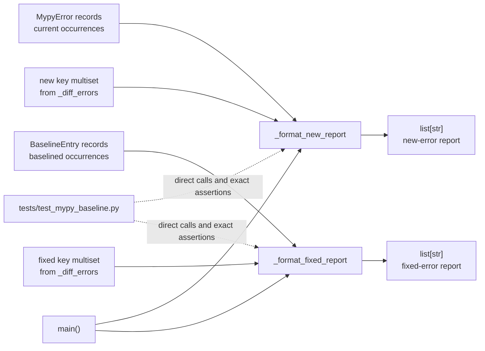

# PYPOST-1065: Verify mypy baseline report formatting

## Research

### Repository evidence

- `scripts/check_mypy_baseline.py` already separates comparison from display.
  `_diff_errors()` produces duplicate-preserving new and fixed keys, while
  `_format_new_report()` and `_format_fixed_report()` render those keys.
- `_format_new_report()` derives current totals with `Counter`, groups all current
  source lines by `(path, code, message)`, sorts those line numbers numerically,
  and adds `N new of M total` only when `N != M`.
- `_format_fixed_report()` derives baseline totals with `Counter` and adds
  `N of M baselined` only when the fixed count differs from the baseline total.
- `main()` is a thin CLI orchestrator for these formatters: it prints returned
  lines to standard error when `_diff_errors()` finds changes. No subprocess,
  filesystem, baseline-schema, or CLI integration is needed to verify the two
  pure formatting contracts.
- `tests/test_mypy_baseline.py` already imports the script's types and private
  helpers directly and applies `pytestmark = pytest.mark.timeout(30)` to every
  test in the module. Extending this file preserves the established test seam
  and the repository's mandatory timeout contract.
- `ai-tasks/PYPOST-1007/60-tech-debt.md` identifies the precise missing coverage:
  partial and whole-key qualifier branches plus ascending new-error line order.
  It explicitly recommends direct unit tests for the two extracted formatters.

### External references

- Python's official [`collections.Counter` documentation](https://docs.python.org/3/library/collections.html#collections.Counter)
  defines counters as mappings from elements to occurrence counts and documents
  multiset subtraction. This supports constructing duplicate records directly
  in tests and passing the resulting repeated keys to the formatters.
- Pytest's official [assertion documentation](https://docs.pytest.org/en/stable/how-to/assert.html)
  explains that plain `assert` statements receive detailed assertion
  introspection. Exact-list assertions therefore give readable diffs while
  protecting headers, indentation, wording, counts, qualifier omission, and
  ordering as one report contract.
- Pytest's official [test discovery documentation](https://docs.pytest.org/en/stable/explanation/goodpractices.html#conventions-for-python-test-discovery)
  confirms that `test_*.py` modules and `test_*` methods are collected by the
  normal suite, so adding focused classes to the existing test module requires
  no suite or Makefile wiring.

## Implementation Plan

1. Extend `tests/test_mypy_baseline.py` with a focused formatter test class (or
   two small classes) using only `MypyError`, `BaselineEntry`, and direct calls
   to `_format_new_report()` / `_format_fixed_report()`.
2. Build a partially new key with one baselined-equivalent occurrence and
   multiple new occurrences. Supply current records in deliberately scrambled
   line order and assert the complete report contains sorted line numbers and
   the accurate `N new of M total` qualifier.
3. Build an entirely new key and assert the complete report omits `new of` while
   retaining its normal header, error line, and sorted location line.
4. Build a partially fixed duplicate key and assert the complete report contains
   the accurate `N of M baselined` qualifier.
5. Build an entirely fixed key and assert the complete report omits `of M
   baselined` while retaining the normal resolved-error line.
6. Run the focused test module through the repository's existing Makefile test
   workflow, followed by the normal task validation in later workflow steps.
7. Change `scripts/check_mypy_baseline.py` only if a contract assertion exposes
   a genuine mismatch. Keep any correction local to the relevant formatter;
   do not alter parsing, key identity, multiset comparison, baseline persistence,
   mypy invocation, or CLI policy.

**Mandatory — Failing Repro (next Step 3):** N/A — no behavioral change is
currently specified. Repository inspection shows that both formatters already
implement every required branch and the line sort; this is a verification-debt
task whose intended deliverable is missing regression coverage. Step 3 should
record this N/A in the roadmap rather than manufacture a false red test. The
contract tests above are added in Step 4 and should pass immediately. If a test
nevertheless exposes a mismatch, stop before changing production code, retain
that exact failing test as the genuine Step 3 red repro, obtain its independent
review, and only then make the smallest formatter correction in Step 4.

## Architecture

### Scope and pattern

The design uses the existing **functional core / imperative shell** boundary.
The two pure formatters are the functional core under test; `main()` remains the
imperative shell that performs subprocess, file, argument, and stream I/O. Tests
inject in-memory records and compare returned `list[str]` values. No new module,
abstraction, dependency, or public API is introduced.



### Module responsibilities

| Module/component | Responsibility | Change in scope |
| --- | --- | --- |
| `scripts/check_mypy_baseline.py::_format_new_report` | Count current/new occurrences, sort current line numbers, and render new-error text | None expected; production correction only after a real failing contract test |
| `scripts/check_mypy_baseline.py::_format_fixed_report` | Count baseline/fixed occurrences and render resolved-error text | None expected; production correction only after a real failing contract test |
| `scripts/check_mypy_baseline.py::_diff_errors` | Supply duplicate-preserving changed-key lists | No change; used only to understand formatter input semantics |
| `scripts/check_mypy_baseline.py::main` | Route formatted lines to stderr and determine exit status | No change; direct helper tests avoid unrelated CLI/I/O concerns |
| `tests/test_mypy_baseline.py` | Hold hermetic regression tests for the mypy baseline gate | Add focused formatter examples under the existing module timeout |

### Dependencies and interaction

The tests depend inward on the formatter functions and their existing record
types. The formatters depend only on `collections.Counter`, sorting, and their
sequence inputs. They do not read the baseline, run mypy, inspect environment
state, or emit output. This boundary keeps each test deterministic and fast.

Each fixture represents occurrence multiplicity explicitly:

- repeated `MypyError` records establish the current total and source lines;
- repeated new-key tuples establish the number of new occurrences;
- repeated `BaselineEntry` records establish the historical total;
- repeated fixed-key tuples establish the number of fixed occurrences.

Exact expected `list[str]` values are the principal interface assertion. This
simultaneously protects the heading, prefixes, indentation, message/code
placement, line ordering, and optional suffix. A partial-only substring check
would leave unrelated report regressions invisible.

### Main interfaces

```python
def _format_new_report(
    new_keys: list[tuple[str, str, str]],
    current: Sequence[MypyError],
) -> list[str]: ...

def _format_fixed_report(
    fixed_keys: list[tuple[str, str, str]],
    baseline: Sequence[BaselineEntry],
) -> list[str]: ...
```

The contract is:

| Interface case | Required result |
| --- | --- |
| Partial new (`new_count < current total`) | Sorted current line list and `  (N new of M total)` |
| Entirely new (`new_count == current total`) | Sorted current line list with no partial qualifier |
| Partial fixed (`fixed_count < baseline total`) | `  (N of M baselined)` |
| Entirely fixed (`fixed_count == baseline total`) | No partial qualifier |

The two spaces before each optional parenthetical are part of the established
string contract. Tests should use one stable synthetic key and small counts so
that failures diagnose formatting rather than fixture complexity.

### Boundaries and risks

- Do not test through `main()` for this scope: doing so would add argument,
  stream, filesystem, and mypy-subprocess setup without increasing confidence
  in these already-extracted pure functions.
- Do not consolidate the two qualifier tests into parametrization if that makes
  the distinct business rules less legible. Four explicit cases plus scrambled
  line input are small and maintainable.
- Do not assert implementation details such as internal `Counter` instances.
  Assert only returned report lines.
- Production changes are conditional. If all characterization tests pass, the
  correct architecture outcome is test-only.

## Q&A

### Why test private helper functions directly?

They are the repository's intentionally extracted formatting seam, already
called by `main()` and isolated from I/O. The task targets their returned report
contract, so direct tests are narrower and more diagnostic than a CLI test.

### Why include all current line numbers for a partially new key?

That is the established behavior of `_format_new_report()`: the qualifier says
how many occurrences are new, while the sorted line list locates the full
current group. This task verifies that behavior rather than redesigning it.

### Why is Step 3 N/A instead of forcing a failing test?

The requirements explicitly preserve current behavior, and source inspection
shows the contract is already implemented. An intentionally incorrect
expectation would not reproduce a defect. The workflow should reserve a red
repro for an actual mismatch and otherwise add the missing green
characterization coverage during development.
